(1) Data Science Centre, RCSI University of Medicine and Health Sciences, Dublin, Ireland
(2) National Centre for Pharmacoeconomics, St James Hospital, Dublin 8, Ireland

**Co-authors:**

Authors (final list TBD): Jonathan Briody,  Ian Miller, Rodrigo Dienstmann, Lesley Tilson, Matthias Ebert, Jochen Prehn, Bauke Ylstra, Annette Byrne,  Kathleen Bennett. 
\

[*Possible Journal Homes:*]{.underline}

The Oncologist (<https://academic.oup.com/oncolo/pages/general-instructions>): Published a study on this in 2017:

Goldstein, D. A., Chen, Q., Ayer, T., Chan, K. K., Virik, K., Hammerman, A., \...
& Hall, P. S.
(2017).
Bevacizumab for Metastatic Colorectal Cancer: A Global Cost‐Effectiveness Analysis.
*The Oncologist*, *22*(6), 694-699.

Journal of Medical Economics <https://www.tandfonline.com/doi/pdf/10.1080/13696998.2021.1888743>

Clinical Colorectal Cancer <https://www-sciencedirect-com.proxy.library.rcsi.ie/science/article/pii/S1533002814000978>

Value in Health: FOCUSED ON CEA, ETC.,

Studies in Health Technology and Informatics

"New Journal: Oxford Open Economics" I have an email on this in my gmail, it's a new Journal and thus may be interested in this work.

We can increase our publication numbers by publishing a short summary of our study in: PharmacoEconomics & Outcomes News - per the description "Stay up to date with the exciting world of health economics. Solve the problem of reading and monitoring the vast volumes of literature necessary to stay informed on the latest issues in pharmacoeconomics and outcomes research by reading our concise news summaries, compiled in an easy-to-read format." <https://www.springer.com/journal/40274>

<https://www.clinical-colorectal-cancer.com/>

**Correspondence:**

Jonathan Briody, PhD, RCSI University of Medicine and Health Sciences, Beaux Lane House, Lower Mercer St, Dublin 2, Ireland.
Email: [jonathanbriody\@rcsi.ie](mailto:jonathanbriody@rcsi.ie){.email}

**Funding Information:**

This project has received funding from the European Union's Horizon 2020 research and innovation programme under grant agreement No 754923.
The material presented and views expressed here are the responsibility of the author(s) only.
The EU Commission takes no responsibility for any use made of the information set out.

\newpage

# Introduction

# Materials and Methods

#### Model Structure

#### Patients and Treatment Regimens

#### Transition Probabilities

# Parametric Survival Analysis:

# 


```r
#rm(list = ls())  
# clear memory (removes all the variables from the work space) - I turn this off on the understanding that the markdown doc that calls this file will clear memory.
#options(scipen=999) 
# turns scientific notation off
# options(scipen=0) turns it back on, per: https://stackoverflow.com/questions/5352099/how-can-i-disable-scientific-notation
```


```r
#01 Load all packages

# Joshua's Package Manager:

# Package names

packages <- c("pacman", "flexsurv", "MASS", "dplyr", "devtools", "scales", "ellipse", "ggplot2", "lazyeval", "igraph", "ggraph", "reshape2", "knitr", "stringr", "diagram", "survival", "lubridate", "ggsurvfit", "gtsummary", "tidycmprsk", "magrittr", "dplyr", "diffr", "gdata", "gridGraphics", "sjPlot", "stargazer", "tibble", "here", "collapse")

# Install packages not yet installed

installed_packages <- packages %in% rownames(installed.packages())

if (any(installed_packages == FALSE)) {

  install.packages(packages[!installed_packages])

}

# Packages loading

invisible(lapply(packages, library, character.only = TRUE))

p_load_gh("DARTH-git/dampack", "DARTH-git/darthtools")
```


```r
# Previous code to check whether the required packages are installed and, if not, install the missing packages
# # - the 'pacman' package is used to conveniently install other packages
# if (!require("pacman")) install.packages("pacman"); library(pacman)
# p_load("flexsurv", "MASS", "dplyr", "devtools", "scales", "ellipse", "ggplot2", "lazyeval", "igraph", "ggraph", "reshape2", "knitr", "stringr", "diagram")   
# p_load_gh("DARTH-git/dampack", "DARTH-git/darthtools")


# {r} # if (!require('pacman')) install.packages('pacman'); library(pacman)  # # use this package to conveniently install other packages # # load (install if required) packages from CRAN # p_load("diagram", "dampack", "reshape2") # # library(devtools) # devtools is necessary to install from github. # # install_github("DARTH-git/darthtools", force = TRUE) # Uncomment if there is a newer version # p_load_gh("DARTH-git/darthtools")
```


```r
#01.5 Load functions

# all functions are in the darthtools package

# There is a functions RMD for the PSA stuff below, instead of loading it lower down, I could just place it here, and place all the necessary packages above and then I would only ever need 1 R Markdown document for the entire study. Will think about doing this.
```


```r
# Country-specific cost data:


# Basically, what I have is 1 Rmarkdown document with appropriate CEA code, but 3 countries I want to separately apply this code to, because costs (and willingness to pay thresholds) are different in each of these 3 countries.

# To do this, I feed in the cost data from each country for parameters that differ across countries, just uncomment the country you want to run this code for:


# Ireland:

#country_name <- "Ireland"


# 1. Cost of treatment in this country
#c_PFS_Folfox <- 307.81 
#c_PFS_Bevacizumab <- 2580.38  
#c_OS_Folfiri <- 326.02  
#administration_cost <- 365.00 

# 2. Cost of treating the AE conditional on it occurring
#c_AE1 <- 2835.89
#c_AE2 <- 1458.80
#c_AE3 <- 409.03 

# 3. Willingness to pay threshold
#n_wtp = 45000


# Germany:

#country_name <- "Germany"

# 1. Cost of treatment in this country
#c_PFS_Folfox <- 1276.66
#c_PFS_Bevacizumab <- 2952.24
#c_OS_Folfiri <- 1309.64
#administration_cost <- 1794.40

# 2. Cost of treating the AE conditional on it occurring
#c_AE1 <- 3837
#c_AE2 <- 1816.37
#c_AE3 <- 526.70

# 3. Willingness to pay threshold
#n_wtp = 78871


# Spain:

country_name <- "Spain"


# 1. Cost of treatment in this country
c_PFS_Folfox <- 285.54
c_PFS_Bevacizumab <- 1325.87
c_OS_Folfiri <- 139.58
administration_cost <- 314.94

# 2. Cost of treating the AE conditional on it occurring
c_AE1 <- 4885.95
c_AE2 <- 507.36
c_AE3 <- 95.03

# 3. Willingness to pay threshold
n_wtp = 30000
```


```r
#02 Individual Data for Parametric Code

# Load the individual patient data for the time-to-progression (TTP) that you recovered by digitising published survival curves (actually, Ian Miller gave us the Angiopredict data directly).

# df_TTP <- read.csv(file='PFS.csv', header=TRUE)
# save.image("C:/Users/Jonathan/OneDrive - Royal College of Surgeons in Ireland/COLOSSUS/R Code/GitHub/COLOSSUS_Model/df_TTP.RData")
# df_TTD <- read.csv(file='OS.csv', header=TRUE)
# save.image("C:/Users/Jonathan/OneDrive - Royal College of Surgeons in Ireland/COLOSSUS/R Code/GitHub/COLOSSUS_Model/df_TTD.RData")

load("C:/Users/Jonathan/OneDrive - Royal College of Surgeons in Ireland/COLOSSUS/R Code/GitHub/COLOSSUS_Model_Data/df_TTP.RData")
# Load the individual patient data for the time-to-progression (TTP) that you recovered by digitising published survival curves (actually, Ian Miller gave us the Angiopredict data directly).

# Previously I loaded this simply as the below:
#load(file = "df_TTP.RData")
#However, now that the repository will be public I have changed the loading of the data so that it loads the data locally from my computer in a folder that is not part of the public repository, when I can add these data into the public repository I will go back to this simple approach.


load("C:/Users/Jonathan/OneDrive - Royal College of Surgeons in Ireland/COLOSSUS/R Code/GitHub/COLOSSUS_Model_Data/df_TTD.RData")
# I have time-to-death (TTD) data, I'll load it in here.


# Previously I loaded this simply as the below:
#load(file = "df_TTD.RData")
#However, now that the repository will be public I have changed the loading of the data so that it loads the data locally from my computer in a folder that is not part of the public repository, when I can add these data into the public repository I will go back to this simple approach.


# Here's how to remove the BVZ rows from the excel files we have: https://techcommunity.microsoft.com/t5/excel/deleting-rows-that-contain-specific-content/m-p/2084473

# The data needs to be set up to include a column for the time (in the example this is time in years) and a status indicator whether the time corresponds to an event, i.e. progression (status = 1), or to the last time of follow up, i.e. censoring (status = 0),

# "What is Censoring? Censoring in a study is when there is incomplete information about a study participant, observation or value of a measurement. In clinical trials, it's when the event doesn't happen while the subject is being monitored or because they drop out of the trial." - https://www.statisticshowto.com/censoring/#:~:text=What%20is%20Censoring%3F,drop%20out%20of%20the%20trial.

# https://en.wikipedia.org/wiki/Survival_analysis#:~:text=or%20q%20%3D%200.99.-,Censoring,is%20common%20in%20survival%20analysis.

# At the bottom of the parametric survival code I think about how time from individual patient data may be changed to match the time of our cycles.

# I think the digitiser will give me the time in the context of the survival curves I am digitising, i.e., time in weeks, or time in months or time in years.

# Then I will have to set-up my time accordingly in the R code so that my cycle length is at the same level as the individual patient data.

# That is, in Koen's example:

# C:\Users\Jonathan\OneDrive - Royal College of Surgeons in Ireland\COLOSSUS\R Code\Parametric Survival Analysis\ISPOR WEBINAR Health Economic Modelling in R\ISPOR_webinar_R-master

# the data includes a column for the time (in years)
# t_cycle <- 1/4      # cycle length of 3 months (in years)                                # n_cycle <- 60       # number of cycles (total runtime 15 years)
  

# So I would have my colum for time, in the [TIME] the graph I was digitising used.
# Then I would create my cycle length of X weeks (in [TIME] the graph I was digitising used)
# Then I would have my number of cycles that would add up to give me a total runtime of how long I want to run the model for.
# So, above Koen wanted to run the model for 15 years, but his cycles were in 3 months, or each cycle was a quarter of a year, so 60 quarters, or 60 3 month cycles, is 15 years.
```

# 


```r
#03 Parametric Survival Analysis Model Plan

# We will implement a Markov model with time-dependent transition probabilities, via a parametric survival model fitted to some individual patient data for the time-to-progression (TTP) and time-to-death (TTD) for standard of care.

# A hazard ratio for the new intervention therapy vs. the standard of care will then be applied to obtain transition probabilities for the new experimental strategy.

# Let's first review the survival curves and see if they match the study:

# My understanding of survival curves is supported by: https://www.emilyzabor.com/tutorials/survival_analysis_in_r_tutorial.html

# A really good intro to survival curves is here: https://shariq-mohammed.github.io/files/cbsa2019/1-intro-to-survival.html

# Some early and simple survival curves:

# km_fit_PFS <- survfit(Surv(time, status) ~ 1, data=df_TTP)
# plot(km_fit_PFS)
# 
# km_fit_OS <- survfit(Surv(time, status) ~ 1, data=df_TTD)
# plot(km_fit_OS)

# Before I used Joshua's awesome package management code above, I installed packages as below:

#install.packages(c("survival", "lubridate", "ggsurvfit", "gtsummary", "tidycmprsk"))
#remotes::install_github("zabore/condsurv")
#remotes::install_github("zabore/ezfun")
# library(survival)
# library(lubridate)
# library(ggsurvfit)
# library(gtsummary)
# library(tidycmprsk)
# #library(condsurv)
# #install.packages("magrittr") # package installations are only needed the first time you use it
# #install.packages("dplyr")    # alternative installation of the %>%
# library(magrittr) # needs to be run every time you start R and want to use %>%
# library(dplyr)    # alternatively, this also loads %>%


# We want to make sure the data we're feeding in matches the data from the publication in Table 4d and Supplementary Table 10d
#png(paste("Baseline_PFS_Curves", ".png"))
survfit2(Surv(time, status) ~ 1, data = df_TTP) %>% ggsurvfit() +
  labs(
    x = "Days",
    y = "Progression Free survival probability"
  ) + 
  add_risktable()
```

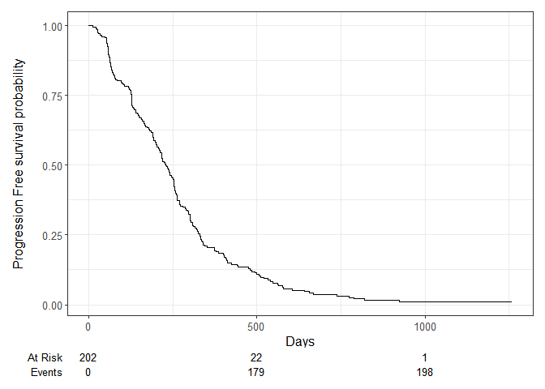<!-- -->

```r
#print(plot)
ggsave("Baseline_PFS_Curves.png", width = 8, height = 4, dpi=300)
#dev.off()
while (!is.null(dev.list()))  dev.off()

# I was getting the following error: "Error in dev.off() : cannot shut down device 1 (the null device)" which I addressed by adding this following each ggsave: while (!is.null(dev.list()))  dev.off() per the following link: https://stackoverflow.com/questions/44336215/error-in-dev-off-cannot-shut-down-device-1-the-null-device


km_fit_PFS <- survfit(Surv(time, status) ~ 1, data=df_TTP)
summary(km_fit_PFS, times = c(0,150,300,450, 600, 750, 900, 1050, 1200, 1350)) # This will stop just before the last patient is censored in the data, also, n.event means number of events that happened at this time.
```

```
## Call: survfit(formula = Surv(time, status) ~ 1, data = df_TTP)
## 
##  time n.risk n.event survival std.err lower 95% CI upper 95% CI
##     0    202       0   1.0000 0.00000      1.00000       1.0000
##   150    136      67   0.6683 0.03313      0.60644       0.7365
##   300     65      69   0.3242 0.03303      0.26551       0.3958
##   450     27      38   0.1347 0.02410      0.09482       0.1912
##   600     11      15   0.0570 0.01656      0.03223       0.1007
##   750      6       5   0.0311 0.01244      0.01418       0.0681
##   900      3       3   0.0155 0.00888      0.00507       0.0477
##  1050      1       1   0.0104 0.00728      0.00261       0.0410
##  1200      1       0   0.0104 0.00728      0.00261       0.0410
```

```r
survfit2(Surv(time, status) ~ 1, data = df_TTD) %>% ggsurvfit() +
  labs(
    x = "Days",
    y = "Overall survival probability"
  ) + 
  add_risktable()
ggsave("Baseline_OS_Curves.png", width = 4, height = 4, dpi=300)
#png(paste("Baseline_OS_Curves", ".png"))
#dev.off()
while (!is.null(dev.list()))  dev.off()

km_fit_OS <- survfit(Surv(time, status) ~ 1, data=df_TTD)
summary(km_fit_OS, times = c(0,300,600,900,1200,1500,1800,1810,1820,1830,1840,1850,1860,1870,1880,1890,1891,1892,1893,1894,1895,1896,1897,1898,1899,1900,1901,2000,2010))
```

```
## Call: survfit(formula = Surv(time, status) ~ 1, data = df_TTD)
## 
##  time n.risk n.event survival std.err lower 95% CI upper 95% CI
##     0    202       0   1.0000  0.0000      1.00000        1.000
##   300    154      47   0.7667  0.0298      0.71047        0.827
##   600     95      57   0.4809  0.0354      0.41638        0.555
##   900     49      43   0.2581  0.0313      0.20340        0.327
##  1200     15      24   0.1068  0.0242      0.06847        0.166
##  1500      5       4   0.0725  0.0218      0.04023        0.131
##  1800      1       1   0.0362  0.0278      0.00804        0.163
##  1810      1       0   0.0362  0.0278      0.00804        0.163
##  1820      1       0   0.0362  0.0278      0.00804        0.163
##  1830      1       0   0.0362  0.0278      0.00804        0.163
##  1840      1       0   0.0362  0.0278      0.00804        0.163
##  1850      1       0   0.0362  0.0278      0.00804        0.163
##  1860      1       0   0.0362  0.0278      0.00804        0.163
##  1870      1       0   0.0362  0.0278      0.00804        0.163
##  1880      1       0   0.0362  0.0278      0.00804        0.163
##  1890      1       0   0.0362  0.0278      0.00804        0.163
##  1891      1       0   0.0362  0.0278      0.00804        0.163
##  1892      1       0   0.0362  0.0278      0.00804        0.163
##  1893      1       0   0.0362  0.0278      0.00804        0.163
##  1894      1       0   0.0362  0.0278      0.00804        0.163
##  1895      1       0   0.0362  0.0278      0.00804        0.163
##  1896      1       0   0.0362  0.0278      0.00804        0.163
##  1897      1       0   0.0362  0.0278      0.00804        0.163
##  1898      1       0   0.0362  0.0278      0.00804        0.163
##  1899      1       0   0.0362  0.0278      0.00804        0.163
```

```r
# The PFS and OS curves I create, match those from the publication, so we know the data we are feeding in is correct.


# Now lets aks ourselves, do the Weibull probabilities we create match the probabilities created directly by the Kaplan-Meier (probably best to read this with the PDF of the Angiopredict study open on the survival curves (PFS and OS) for Figure 4d in the paper, and Figure 10d in the supplement (which represents the patient time to event data that is used in this study)):

# Seeing that the PFS and OS curves I create, match those from the publication, the problem I was having in matching these must be in how I am generating probabilities in my model.

# I calculate the probability of not progressing at the different time periods in the data from the publication, to contrast this to the probabilities I create of not progressing at different time periods once I've created probabilities in the R code, the probability of survival at each time period will be reported under the "survival" heading, per: https://www.emilyzabor.com/tutorials/survival_analysis_in_r_tutorial.html 

summary(survfit(Surv(time, status) ~ 1, data = df_TTP), times = 0)
```

```
## Call: survfit(formula = Surv(time, status) ~ 1, data = df_TTP)
## 
##  time n.risk n.event survival std.err lower 95% CI upper 95% CI
##     0    202       0        1       0            1            1
```

```r
summary(survfit(Surv(time, status) ~ 1, data = df_TTP), times = 150)
```

```
## Call: survfit(formula = Surv(time, status) ~ 1, data = df_TTP)
## 
##  time n.risk n.event survival std.err lower 95% CI upper 95% CI
##   150    136      67    0.668  0.0331        0.606        0.737
```

```r
summary(survfit(Surv(time, status) ~ 1, data = df_TTP), times = 300)
```

```
## Call: survfit(formula = Surv(time, status) ~ 1, data = df_TTP)
## 
##  time n.risk n.event survival std.err lower 95% CI upper 95% CI
##   300     65     136    0.324   0.033        0.266        0.396
```

```r
summary(survfit(Surv(time, status) ~ 1, data = df_TTP), times = 450)
```

```
## Call: survfit(formula = Surv(time, status) ~ 1, data = df_TTP)
## 
##  time n.risk n.event survival std.err lower 95% CI upper 95% CI
##   450     27     174    0.135  0.0241       0.0948        0.191
```

```r
summary(survfit(Surv(time, status) ~ 1, data = df_TTP), times = 600)
```

```
## Call: survfit(formula = Surv(time, status) ~ 1, data = df_TTP)
## 
##  time n.risk n.event survival std.err lower 95% CI upper 95% CI
##   600     11     189    0.057  0.0166       0.0322        0.101
```

```r
summary(survfit(Surv(time, status) ~ 1, data = df_TTP), times = 750)
```

```
## Call: survfit(formula = Surv(time, status) ~ 1, data = df_TTP)
## 
##  time n.risk n.event survival std.err lower 95% CI upper 95% CI
##   750      6     194   0.0311  0.0124       0.0142       0.0681
```

```r
summary(survfit(Surv(time, status) ~ 1, data = df_TTP), times = 900)
```

```
## Call: survfit(formula = Surv(time, status) ~ 1, data = df_TTP)
## 
##  time n.risk n.event survival std.err lower 95% CI upper 95% CI
##   900      3     197   0.0155 0.00888      0.00507       0.0477
```

```r
summary(survfit(Surv(time, status) ~ 1, data = df_TTP), times = 1050)
```

```
## Call: survfit(formula = Surv(time, status) ~ 1, data = df_TTP)
## 
##  time n.risk n.event survival std.err lower 95% CI upper 95% CI
##  1050      1     198   0.0104 0.00728      0.00261        0.041
```

```r
summary(survfit(Surv(time, status) ~ 1, data = df_TTP), times = 1200)
```

```
## Call: survfit(formula = Surv(time, status) ~ 1, data = df_TTP)
## 
##  time n.risk n.event survival std.err lower 95% CI upper 95% CI
##  1200      1     198   0.0104 0.00728      0.00261        0.041
```

```r
# I can repeat this for TTD:


summary(survfit(Surv(time, status) ~ 1, data = df_TTD), times = 0)
```

```
## Call: survfit(formula = Surv(time, status) ~ 1, data = df_TTD)
## 
##  time n.risk n.event survival std.err lower 95% CI upper 95% CI
##     0    202       0        1       0            1            1
```

```r
summary(survfit(Surv(time, status) ~ 1, data = df_TTD), times = 150)
```

```
## Call: survfit(formula = Surv(time, status) ~ 1, data = df_TTD)
## 
##  time n.risk n.event survival std.err lower 95% CI upper 95% CI
##   150    178      24    0.881  0.0228        0.838        0.927
```

```r
summary(survfit(Surv(time, status) ~ 1, data = df_TTD), times = 300)
```

```
## Call: survfit(formula = Surv(time, status) ~ 1, data = df_TTD)
## 
##  time n.risk n.event survival std.err lower 95% CI upper 95% CI
##   300    154      47    0.767  0.0298         0.71        0.827
```

```r
summary(survfit(Surv(time, status) ~ 1, data = df_TTD), times = 450)
```

```
## Call: survfit(formula = Surv(time, status) ~ 1, data = df_TTD)
## 
##  time n.risk n.event survival std.err lower 95% CI upper 95% CI
##   450    127      75    0.627  0.0341        0.564        0.698
```

```r
summary(survfit(Surv(time, status) ~ 1, data = df_TTD), times = 600)
```

```
## Call: survfit(formula = Surv(time, status) ~ 1, data = df_TTD)
## 
##  time n.risk n.event survival std.err lower 95% CI upper 95% CI
##   600     95     104    0.481  0.0354        0.416        0.555
```

```r
summary(survfit(Surv(time, status) ~ 1, data = df_TTD), times = 750)
```

```
## Call: survfit(formula = Surv(time, status) ~ 1, data = df_TTD)
## 
##  time n.risk n.event survival std.err lower 95% CI upper 95% CI
##   750     64     133    0.332  0.0335        0.272        0.404
```

```r
summary(survfit(Surv(time, status) ~ 1, data = df_TTD), times = 900)
```

```
## Call: survfit(formula = Surv(time, status) ~ 1, data = df_TTD)
## 
##  time n.risk n.event survival std.err lower 95% CI upper 95% CI
##   900     49     147    0.258  0.0313        0.203        0.327
```

```r
summary(survfit(Surv(time, status) ~ 1, data = df_TTD), times = 1050)
```

```
## Call: survfit(formula = Surv(time, status) ~ 1, data = df_TTD)
## 
##  time n.risk n.event survival std.err lower 95% CI upper 95% CI
##  1050     34     156    0.208  0.0294        0.157        0.274
```

```r
summary(survfit(Surv(time, status) ~ 1, data = df_TTD), times = 1200)
```

```
## Call: survfit(formula = Surv(time, status) ~ 1, data = df_TTD)
## 
##  time n.risk n.event survival std.err lower 95% CI upper 95% CI
##  1200     15     171    0.107  0.0242       0.0685        0.166
```

```r
summary(survfit(Surv(time, status) ~ 1, data = df_TTD), times = 1350)
```

```
## Call: survfit(formula = Surv(time, status) ~ 1, data = df_TTD)
## 
##  time n.risk n.event survival std.err lower 95% CI upper 95% CI
##  1350     10     173   0.0906  0.0231       0.0549        0.149
```

```r
summary(survfit(Surv(time, status) ~ 1, data = df_TTD), times = 1500)
```

```
## Call: survfit(formula = Surv(time, status) ~ 1, data = df_TTD)
## 
##  time n.risk n.event survival std.err lower 95% CI upper 95% CI
##  1500      5     175   0.0725  0.0218       0.0402        0.131
```

```r
# Do the Weibull probabilities match the probabilities created directly by the Kaplan-Meier:

# Here's how I checked if the Weibull probabilities match the probabilities created directly by the Kaplan-Meier, basically, I take the Kaplan-Meier probabilities at a few different cycles directly from the data as below, the probability of survival at each time period will be reported under the "survival" heading:

# I do this first for TTP:

# summary(survfit(Surv(time, status) ~ 1, data = df_TTP), times = 0)
# 
# summary(survfit(Surv(time, status) ~ 1, data = df_TTP), times = 14)
# 
# summary(survfit(Surv(time, status) ~ 1, data = df_TTP), times = 28)
# 
# summary(survfit(Surv(time, status) ~ 1, data = df_TTP), times = 42)
# 
# summary(survfit(Surv(time, status) ~ 1, data = df_TTP), times = 56)
# 
# summary(survfit(Surv(time, status) ~ 1, data = df_TTP), times = 70)
# 
# summary(survfit(Surv(time, status) ~ 1, data = df_TTP), times = 84)
# 
# summary(survfit(Surv(time, status) ~ 1, data = df_TTP), times = 98)
# 
# summary(survfit(Surv(time, status) ~ 1, data = df_TTP), times = 112)


# Then, I calculate the probability of staying in the PFS state, which is what the above gives me. To do this, I create all the other probabilities as zero because I just want to look at whats going on with my Weibull probabilities for the PFS curve, I also put it in the first slot, as the way it works is that it needs to be multiplied by 1, and m_M_SoC has a cohort trace with 1 in in the first slot, ready to be matrix multiplied by m_P_SoC with it's probabilities. It's 1- because the probabilities created above from the PFS curve are probabilities of staying in PFS, not the probabilities of moving from PFS to OS.

# m_P_SoC["PFS", "PFS",]<- (1 -p_PFSOS_SoC)
# m_P_SoC["PFS", "OS",]<- 0
# m_P_SoC["PFS", "Dead",]<-0
# 
# # Setting the transition probabilities from OS
# m_P_SoC["OS", "OS", ] <- 0
# m_P_SoC["OS", "Dead", ]        <- 0
# 
# 
# # Setting the transition probabilities from Dead
# m_P_SoC["Dead", "Dead", ] <- 0

# So here I once again create the Markov cohort trace by looping over all cycles
# - note that the trace can easily be obtained using matrix multiplications
# - note that now the right probabilities for the cycle need to be selected, like I explained above. (this is all just the comments written from where I actually do the analysis).
# for(i_cycle in 1:(n_cycle-1)) {
#   m_M_SoC[i_cycle + 1, ] <- m_M_SoC[i_cycle, ] %*% m_P_SoC[ , , i_cycle]
#   m_M_Exp[i_cycle + 1, ] <- m_M_Exp[i_cycle, ] %*% m_P_Exp[ , , i_cycle]
# }

# head(m_M_SoC)  # print the first few lines of the matrix for standard of care (m_M_SoC)
# head(m_M_Exp)  # print the first few lines of the matrix for experimental treatment(m_M_Exp)

# looking at the cohort trace -> m_M_SoC, you see that the proportions in the PFS state from 100 are basically identical to the probabilities of being in those states created from the Kaplan Meier, again starting from 100% of people under study, thus, the Weibull probabilities created match the Kaplan-Meier.

# They can be a few % off but that's OK, as it's fitting a Weibull to the Kaplan Meier curves, so they're not going to be identical.

# m_M_SoC


# I can repeat this for TTD:
# 
# summary(survfit(Surv(time, status) ~ 1, data = df_TTD), times = 0)
# 
# summary(survfit(Surv(time, status) ~ 1, data = df_TTD), times = 14)
# 
# summary(survfit(Surv(time, status) ~ 1, data = df_TTD), times = 28)
# 
# summary(survfit(Surv(time, status) ~ 1, data = df_TTD), times = 42)
# 
# summary(survfit(Surv(time, status) ~ 1, data = df_TTD), times = 56)
# 
# summary(survfit(Surv(time, status) ~ 1, data = df_TTD), times = 70)
# 
# summary(survfit(Surv(time, status) ~ 1, data = df_TTD), times = 84)
# 
# summary(survfit(Surv(time, status) ~ 1, data = df_TTD), times = 98)
# 
# summary(survfit(Surv(time, status) ~ 1, data = df_TTD), times = 112)
# 
# summary(survfit(Surv(time, status) ~ 1, data = df_TTD), times = 126)
# 
# summary(survfit(Surv(time, status) ~ 1, data = df_TTD), times = 158)
# 
# summary(survfit(Surv(time, status) ~ 1, data = df_TTD), times = 172)
# 
# summary(survfit(Surv(time, status) ~ 1, data = df_TTD), times = 184)
# 
# summary(survfit(Surv(time, status) ~ 1, data = df_TTD), times = 198)
# 
# summary(survfit(Surv(time, status) ~ 1, data = df_TTD), times = 212)
# 
# summary(survfit(Surv(time, status) ~ 1, data = df_TTD), times = 224)
# 
# summary(survfit(Surv(time, status) ~ 1, data = df_TTD), times = 238)
# 
# summary(survfit(Surv(time, status) ~ 1, data = df_TTD), times = 252)
# 
# summary(survfit(Surv(time, status) ~ 1, data = df_TTD), times = 266)
# 
# summary(survfit(Surv(time, status) ~ 1, data = df_TTD), times = 280)
# 
# summary(survfit(Surv(time, status) ~ 1, data = df_TTD), times = 294)
# 
# summary(survfit(Surv(time, status) ~ 1, data = df_TTD), times = 308)

# Here, like above, I put the p_PFSD_SoC bit into the first part of the probability matrix, even though it concerns people going from first line treatment or PFS to dead, because it needs to be multiplied by the 1 that exists in the cohort:

# 
# m_P_SoC["PFS", "PFS",]<- 1- p_PFSD_SoC
# m_P_SoC["PFS", "OS",]<- 0
# m_P_SoC["PFS", "Dead",]<-0
# 
# # Setting the transition probabilities from OS
# m_P_SoC["OS", "OS", ] <- 0
# m_P_SoC["OS", "Dead", ]        <- 0
# 
# 
# # Setting the transition probabilities from Dead
# m_P_SoC["Dead", "Dead", ] <- 0

# So here I once again create the Markov cohort trace by looping over all cycles
# - note that the trace can easily be obtained using matrix multiplications
# - note that now the right probabilities for the cycle need to be selected, like I explained above.
# for(i_cycle in 1:(n_cycle-1)) {
#   m_M_SoC[i_cycle + 1, ] <- m_M_SoC[i_cycle, ] %*% m_P_SoC[ , , i_cycle]
#   m_M_Exp[i_cycle + 1, ] <- m_M_Exp[i_cycle, ] %*% m_P_Exp[ , , i_cycle]
# }
# 
# 
# head(m_M_SoC)  # print the first few lines of the matrix for standard of care (m_M_SoC)
# head(m_M_Exp)  # print the first few lines of the matrix for experimental treatment(m_M_Exp)
# 
# #m_M_SoC
# m_M_SoC

# This also answers the question of how exactly probabilities are created in my code, the m_P_SoC is something that, when multiplied by 1, (when at the start 100% of our cohort are in the PFS state) gives us the first probability from that 100%, and the next part or row of that m_P_SoC probability is then multiplied by the proportion who are in the different states in the next row for the cohort (given their movements last time having been multiplied by m_P_SoC) which gives us the second probability multiplied by the proportion of that 1 (or 100%) in each state, and so on, and so forth, for each wave.


# Median Survival Time:

# An explanation of how best to estimate median survival time can be found here under "Estimating median survival time" https://www.emilyzabor.com/tutorials/survival_analysis_in_r_tutorial.html also saved here: C:\Users\Jonathan\OneDrive - Royal College of Surgeons in Ireland\COLOSSUS\R Code\GitHub\COLOSSUS_Model\Survival Analysis in R.pdf

# We want to calculate the median survival time WITH bevacizumab, i.e., the median PFS and OS with bev to compare it to the median PFS and OS in other studies with bevacizumab but without our chromosomal instability subtypes, so that we can make comparisons.

# So, we make 2 new excel files of data and store them in the same folder from the Angiopredict data Ian gave us and which we used to make our TTP and TTD data.

library(foreign, lib.loc = "C:/Program Files/R/R-4.2.2/library")
library(readxl)
OS_WITHBEV <- read_excel("C:/Users/Jonathan/OneDrive - Royal College of Surgeons in Ireland/COLOSSUS/AngioPredict/Model Data/OS_WITHBEV.xlsx")

PFS_WITHBEV <- read_excel("C:/Users/Jonathan/OneDrive - Royal College of Surgeons in Ireland/COLOSSUS/AngioPredict/Model Data/PFS_WITHBEV.xlsx")

# Then we calculate the median survival time as explained by this tutorial:

survfit(formula = Surv(time, status) ~ 1, data = PFS_WITHBEV)
```

```
## Call: survfit(formula = Surv(time, status) ~ 1, data = PFS_WITHBEV)
## 
##        n events median 0.95LCL 0.95UCL
## [1,] 165    140    325     291     391
```

```r
survfit(formula = Surv(time, status) ~ 1, data = OS_WITHBEV)
```

```
## Call: survfit(formula = Surv(time, status) ~ 1, data = OS_WITHBEV)
## 
##        n events median 0.95LCL 0.95UCL
## [1,] 165    121    701     617     864
```

```r
# > survfit(formula = Surv(time, status) ~ 1, data = PFS_WITHBEV)
# Call: survfit(formula = Surv(time, status) ~ 1, data = PFS_WITHBEV)

#        n events median 0.95LCL 0.95UCL
# [1,] 165    140    325     291     391

# > survfit(formula = Surv(time, status) ~ 1, data = OS_WITHBEV)
# Call: survfit(formula = Surv(time, status) ~ 1, data = OS_WITHBEV)

#        n events median 0.95LCL 0.95UCL
# [1,] 165    121    701     617     864

# So, the median survival time for PFS is 325 days and for OS is 701 days, in months this is:

# PFS: 10.6849 months
# OS: 23.0466 months

# Divide the time value by 30.417 per Google: https://www.google.ie/search?q=701+days+in+months&hl=en&dcr=0&sxsrf=AJOqlzXLCpvJk_MG8EdJn_6CogwX8LL7Ew%3A1678014589926&ei=fXgEZK-eOLCKhbIP2aCkuAI&oq=701+days&gs_lcp=Cgxnd3Mtd2l6LXNlcnAQAxgCMgUIABCABDIFCAAQgAQyBggAEBYQHjIGCAAQFhAeMgYIABAWEB4yBggAEBYQHjIGCAAQFhAeMgYIABAWEB4yCAgAEBYQHhAPMggIABAWEB4QDzoECCMQJzoLCC4QgAQQxwEQrwE6BAgAEEM6CQgAEBYQHhDxBEoECEEYAFCPBFicIGDuLWgBcAF4AIABUogB_wOSAQE4mAEAoAECoAEBwAEB&sclient=gws-wiz-serp
```


```r
# Time-to-Progression (TTP):
#04 Parametric Survival Analysis itself:

# We use the 'flexsurv' package to fit several commonly used parametric survival distributions.

# The data needs to be set up to include a column for the time (in days, weeks, years, etc.,) and a status indicator whether the time corresponds to an event, i.e. progression (status = 1), or to the last time of follow up, i.e. censoring (status = 0).


# It looks like in the example, Koen is applying the flexsurvreg formula to individuals who experience progression (i.e. ~1):

head(df_TTP)
```

```
##   time status
## 1  739      1
## 2  211      1
## 3  311      1
## 4  412      1
## 5   25      1
## 6  302      1
```

```r
l_TTP_SoC_exp      <- flexsurvreg(formula = Surv(time, status) ~ 1, data = df_TTP, dist = "exp")
l_TTP_SoC_gamma    <- flexsurvreg(formula = Surv(time, status) ~ 1, data = df_TTP, dist = "gamma")
l_TTP_SoC_gompertz <- flexsurvreg(formula = Surv(time, status) ~ 1, data = df_TTP, dist = "gompertz")
l_TTP_SoC_llogis   <- flexsurvreg(formula = Surv(time, status) ~ 1, data = df_TTP, dist = "llogis")
l_TTP_SoC_lnorm    <- flexsurvreg(formula = Surv(time, status) ~ 1, data = df_TTP, dist = "lnorm")
l_TTP_SoC_weibull  <- flexsurvreg(formula = Surv(time, status) ~ 1, data = df_TTP, dist = "weibull")
```


```r
#05 Inspecting the fits:

# And this would make sense per the below diagram - which looks at the proportion of individuals who have the event, i.e. progression.

# Inspect fit based on visual fit
colors <- rainbow(6)
plot(l_TTP_SoC_exp,       col = colors[1], ci = FALSE, ylab = "Event-free proportion", xlab = "Time in days", las = 1)
lines(l_TTP_SoC_gamma,    col = colors[2], ci = FALSE)
lines(l_TTP_SoC_gompertz, col = colors[3], ci = FALSE)
lines(l_TTP_SoC_llogis,   col = colors[4], ci = FALSE)
lines(l_TTP_SoC_lnorm,    col = colors[5], ci = FALSE)
lines(l_TTP_SoC_weibull,  col = colors[6], ci = FALSE)
legend("right",
       legend = c("exp", "gamma", "gompertz", "llogis", "lnorm", "Weibull"),
       col    = colors,
       lty    = 1,
       bty    = "n")
```

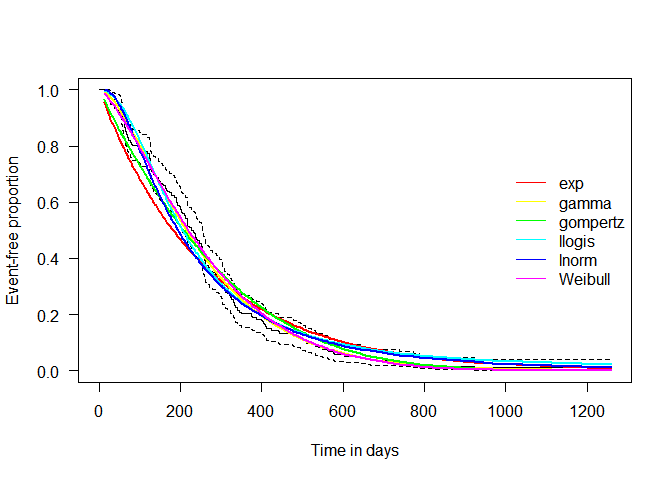<!-- -->

```r
#ggsave("Inspecting_Fits_PFS.png", width = 4, height = 4, dpi=300)
#while (!is.null(dev.list()))  dev.off()
#png(paste("Inspecting_Fits_PFS", ".png"))
#dev.off()

# Saving plots is as described here: https://stackoverflow.com/questions/70879324/storing-plots-as-variables-in-r

# By simply adding "; plot1 <- recordPlot()" to the end of the plot, I have the plot saved in the environment to enter into the console or as a piece of code in the Rmarkdown document whenever I like (using the name plot1) whenever I like. 

# I just need to remember to keep it when deleting items in the Rmarkdown file that calls this document.

# I run into trouble with this approach when I call this rmarkdown file from another rmarkdown file, so I can put the png("mtcars.png") above the plot and the following print(plot) dev.off() below the plot and save in that way, as per: https://ggplot2.tidyverse.org/reference/ggsave.html and here: https://stackoverflow.com/questions/58989775/how-to-using-code-to-save-plots-in-rstudio

# Koen says "# Weibull has the best visual and numerical fit" but I don't see what it's visually being compared to in this graph, I will have to learn about this in the C:\Users\Jonathan\OneDrive - Royal College of Surgeons in Ireland\COLOSSUS\R Code\Parametric Survival Analysis\flexsurv folder.

# For Koen the time is in years which makes sense, the data he is drawing from is in years so that's what you want to make comparisons to.
```


```r
# Compare the fit numerically based on the AIC
(v_AIC_TTP <- c(
  exp      = l_TTP_SoC_exp$AIC,
  gamma    = l_TTP_SoC_gamma$AIC,
  gompertz = l_TTP_SoC_gompertz$AIC,
  llogis   = l_TTP_SoC_llogis$AIC,
  lnorm    = l_TTP_SoC_lnorm$AIC,
  weibull  = l_TTP_SoC_weibull$AIC
))
```

```
##      exp    gamma gompertz   llogis    lnorm  weibull 
## 2604.383 2570.365 2594.880 2579.625 2580.161 2574.970
```

```r
#v_AIC_TTP <- tibble::enframe(v_AIC_TTP)


# Weibull has the best visual and numerical fit


# tab_df(,
# title = "AIC Values", #always give
# #your tables
# #titles
# file = "v_AIC_TTP.doc")
```


```r
#06 Saving the survival parameters for use in the model:

# Saving the survival parameters ----

# The 'flexsurv' package return the coefficients, which need to be transformed for use in the base R functions, but that will be done when the coefficients actually are used, for the time being we will just save the survival parameters from the distribution we decide to use. 

# NB, if we are not going with Weibull then we may have to save something specific to the distribution that is not shape or scale - we can look into this if we don't use Weibull.

l_TTP_SoC_weibull
```

```
## Call:
## flexsurvreg(formula = Surv(time, status) ~ 1, data = df_TTP, 
##     dist = "weibull")
## 
## Estimates: 
##        est       L95%      U95%      se      
## shape    1.3917    1.2520    1.5470    0.0751
## scale  286.7776  258.1993  318.5191   15.3598
## 
## N = 202,  Events: 198,  Censored: 4
## Total time at risk: 52049
## Log-likelihood = -1285.485, df = 2
## AIC = 2574.97
```

```r
# Calling a flexsurvreg parameter like this allows you to see here that Weibull is the shape and the scale, so if we do go with another distribution we can see what it's version of shape and scale are and use these instead.

l_TTP_SoC_weibull$coefficients
```

```
##     shape     scale 
## 0.3305319 5.6587072
```

```r
coef_weibull_shape_SoC <- l_TTP_SoC_weibull$coefficients["shape"]
coef_weibull_scale_SoC <- l_TTP_SoC_weibull$coefficients["scale"]
```


```r
#Time-to-Dead (TTD):

#07 Parametric Survival Analysis itself:

# I repeat the things I said for TTP here:

# We use the 'flexsurv' package to fit several commonly used parametric survival distributions.

# The data needs to be set up to include a column for the time (in days, weeks, years, etc.,) and a status indicator whether the time corresponds to an event, i.e. progression (status = 1), or to the last time of follow up, i.e. censoring (status = 0).

# It looks like in his example, Koen is applying the flexsurvreg formula to individuals who experience progression (i.e. ~1):

head(df_TTD)
```

```
##   time status
## 1 1899      0
## 2  211      1
## 3  610      1
## 4  673      1
## 5   25      1
## 6 1187      1
```

```r
l_TTD_SoC_exp      <- flexsurvreg(formula = Surv(time, status) ~ 1, data = df_TTD, dist = "exp")
l_TTD_SoC_gamma    <- flexsurvreg(formula = Surv(time, status) ~ 1, data = df_TTD, dist = "gamma")
l_TTD_SoC_gompertz <- flexsurvreg(formula = Surv(time, status) ~ 1, data = df_TTD, dist = "gompertz")
l_TTD_SoC_llogis   <- flexsurvreg(formula = Surv(time, status) ~ 1, data = df_TTD, dist = "llogis")
l_TTD_SoC_lnorm    <- flexsurvreg(formula = Surv(time, status) ~ 1, data = df_TTD, dist = "lnorm")
l_TTD_SoC_weibull  <- flexsurvreg(formula = Surv(time, status) ~ 1, data = df_TTD, dist = "weibull")
```


```r
#08 Inspecting the fits:

# And this would make sense per the below diagram - which looks at the proportion of individuals who have the event, i.e. going to dead.

# Inspect fit based on visual fit
colors <- rainbow(6)
plot(l_TTD_SoC_exp,       col = colors[1], ci = FALSE, ylab = "Event-free proportion", xlab = "Time in days", las = 1)
lines(l_TTD_SoC_gamma,    col = colors[2], ci = FALSE)
lines(l_TTD_SoC_gompertz, col = colors[3], ci = FALSE)
lines(l_TTD_SoC_llogis,   col = colors[4], ci = FALSE)
lines(l_TTD_SoC_lnorm,    col = colors[5], ci = FALSE)
lines(l_TTD_SoC_weibull,  col = colors[6], ci = FALSE)
legend("right",
       legend = c("exp", "gamma", "gompertz", "llogis", "lnorm", "Weibull"),
       col    = colors,
       lty    = 1,
       bty    = "n")
```

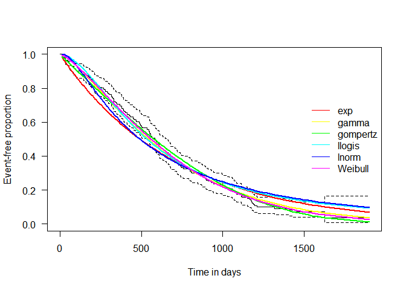<!-- -->

```r
#ggsave("Inspecting_Fits_OS.png", width = 4, height = 4, dpi=300)
#while (!is.null(dev.list()))  dev.off()
#png(paste("Inspecting_Fits_OS", ".png"))
#dev.off()


# Koen says "# Weibull has the best visual and numerical fit" but I don't see what it's visually being compared to in this graph, I will have to learn about this in the C:\Users\Jonathan\OneDrive - Royal College of Surgeons in Ireland\COLOSSUS\R Code\Parametric Survival Analysis\flexsurv folder.

# For Koen the time is in years which makes sense, the data he is drawing from is in years so that's what you want to make comparisons to.
```


```r
# Compare the fit numerically based on the AIC
(v_AIC_TTD <- c(
  exp      = l_TTD_SoC_exp$AIC,
  gamma    = l_TTD_SoC_gamma$AIC,
  gompertz = l_TTD_SoC_gompertz$AIC,
  llogis   = l_TTD_SoC_llogis$AIC,
  lnorm    = l_TTD_SoC_lnorm$AIC,
  weibull  = l_TTD_SoC_weibull$AIC
))
```

```
##      exp    gamma gompertz   llogis    lnorm  weibull 
## 2664.472 2648.915 2648.350 2665.054 2680.234 2646.087
```

```r
# Weibull has the best visual and numerical fit
```


```r
#09 Saving the survival parameters for use in the model:

# Saving the survival parameters ----

# The 'flexsurv' package return the coefficients, which need to be transformed for use in the base R functions, but that will be done when the coefficients actually are used, for the time being we will just save the survival parameters from the distribution we decide to use. 

# NB, if we are not going with Weibull then we may have to save something specific to the distribution that is not shape or scale - we can look into this if we don't use Weibull.

l_TTD_SoC_weibull
```

```
## Call:
## flexsurvreg(formula = Surv(time, status) ~ 1, data = df_TTD, 
##     dist = "weibull")
## 
## Estimates: 
##        est       L95%      U95%      se      
## shape    1.3530    1.1967    1.5297    0.0847
## scale  733.3499  656.5785  819.0978   41.3754
## 
## N = 202,  Events: 176,  Censored: 26
## Total time at risk: 124782
## Log-likelihood = -1321.043, df = 2
## AIC = 2646.087
```

```r
# Calling a flexsurvreg parameter like this allows you to see here that Weibull is the shape and the scale, so if we do go with another distribution we can see what it's version of shape and scale are and use these instead.

l_TTD_SoC_weibull$coefficients
```

```
##    shape    scale 
## 0.302343 6.597623
```

```r
coef_TTD_weibull_shape_SoC <- l_TTD_SoC_weibull$coefficients["shape"]
coef_TTD_weibull_scale_SoC <- l_TTD_SoC_weibull$coefficients["scale"]
```


```r
#03 Input model parameters
#  This is just a block of text reminding myself why ordering, V_names_states v_tc_SoC, v_tc_Exp,  v_tu_SoC and v_tu_Exp matters, feel free to skip over this:

# The ordering of V_names_states has an influence on the tornado diagram and the reported cost-effectiveness results.

# So, I need to ensure I correctly order V_names_states all the way through from the start.

# m_P_Exp and m_P_SoC both use v_names_states to set up the names of the rows and columns of their matrices. 

# As does m_M_SoC and m_M_Exp.

# Then m_M_SoC and  m_M_Exp use the row column names to fill in the 100% of the cohort (or 1) in PFS and the 0% of the cohort in OS and DEAD in wave 1. m_P_Exp and m_P_SoC also both use the row and column names to fill in the transition probabilities between PFS and OS, etc.,

# Then m_M_SoC and m_M_Exp are matrix multiplied by m_P_Exp and m_P_SoC:

# for(i_cycle in 1:(n_cycle-1)) {
#  m_M_SoC[i_cycle + 1, ] <- m_M_SoC[i_cycle, ] %*% m_P_SoC[ , , i_cycle]
#  m_M_Exp[i_cycle + 1, ] <- m_M_Exp[i_cycle, ] %*% m_P_Exp[ , , i_cycle]
# }

# The way this matrix multiplication works is that the value in box 1 for m_M_SoC is multiplied by the value in box 1 for m_P_SoC and so on. If box 1 for m_M_SoC and m_P_SoC is the 1 (i.e. 100% of people in the PFS state when this all starts), multiplied by the PFS state probabilities, i.e., the probability of going from the PFS state into other states like so:

#          PFS       AE1       AE2       AE3          OS        Dead

# PFS  0.974925 0.0194985 0.0194985 0.0194985 0.005074995 0.020000000

# (Ignore the AE health states, this layout is a holdover from when AE's were going to have their own health states in the Markov model).

# Then things will multiply correctly and we're multiplying PFS transition probabilities by the 100% of the cohort in the PFS state. 

# Even, if ordering v_names_states  <- c("PFS", "AE1", "AE2", "AE3", "OS", "Dead")   is not in the order as above, i.e., v_names_states  <- c("OS", "AE1", "AE2", "AE3", "PFS", "Dead") , then the m_M_SoC will have 0, 0, 0, 0, 1, 0, because everyone still starts in the PFS state, and m_P_SoC will have  "OS", "AE1", "AE2", "AE3", "PFS", "Dead", with the right probabilities put in the right spots, so when you matrix multiply it things will multiply out fine.

# However, this is not the case for ordering costs and utilities:

# v_tc_SoC <- m_M_SoC %*% c(c_F_SoC, c_AE1, c_AE2, c_AE3, c_P, c_D)
# v_tc_Exp <- m_M_Exp %*% c(c_F_Exp, c_AE1, c_AE2, c_AE3, c_P, c_D)
# v_tu_SoC <- m_M_SoC %*% c(u_F, u_AE1, u_AE2, u_AE3, u_P, u_D)
# v_tu_Exp <- m_M_Exp %*% c(u_F, u_AE1, u_AE2, u_AE3, u_P, u_D)

# As you can see, in both cases the ordering is set manually by how we enter things in the concatenated brackets, so in the case above where ordering v_names_states  <- c("PFS", "AE1", "AE2", "AE3", "OS", "Dead") is ordered differently, i.e., v_names_states  <- c("OS", "AE1", "AE2", "AE3", "PFS", "Dead") when we matrix multiply costs and utilities by m_M_SoC  and m_M_Exp above we will be multiplying the utility of being in the progression free state u_F by the matrix of individuals in the OS state, which will clearly be a smaller number of individuals in the first few waves, and multiplying the utility of the OS state (u_P) by the larger number of individuals actually in the PFS state <- c("OS", "AE1", "AE2", "AE3", "PFS", "Dead"). We'll be doing the same thing with costs. What this will mean is more people getting the OS costs and OS utility and fewer people getting the PFS costs and the PFS utility, which will in turn have consequences for the cost-effectiveness analysis results with more OS costs and more OS utility being considered in the equation that compares costs and utilities.

# I've confirmed all of the things I say about by changing the ordering first of v_names_states, and then of the cost and utility concatenations. Changing the ordering of v_names_states did nothing to the CEA results or Tornado diagram provided I changed the ordering of utilities and costs to match this, changing the ordering of utilities and costs changed both unless I changed them to be in an order that matched the changed ordering of v_names_states.
```


```r
## General setup

# Here, I think about how time from individual patient data may be changed to match the time of our cycles.

# I think the digitiser (if I am using one) will give me the time in the context of the survival curves I am digitising, i.e., time in weeks, or time in months or time in years. Otherwise if I get the data directly from Ian it will also have time in the context of the existing survival curves.

# Then I will have to set-up my time accordingly in the R code so that my cycle length is at the same level as the individual patient data.

# That is, in Koen's example:

# C:\Users\Jonathan\OneDrive - Royal College of Surgeons in Ireland\COLOSSUS\R Code\Parametric Survival Analysis\ISPOR WEBINAR Health Economic Modelling in R\ISPOR_webinar_R-master

# the data includes a column for the time (in years)
# t_cycle <- 1/4      # cycle length of 3 months (in years)                                # n_cycle <- 60       # number of cycles (total runtime 15 years)
  

# So I would have my colum for time, in the [TIME] the graph I was digitising/getting data from used.
# Then I would create my cycle length of X weeks (in [TIME] the graph I was digitising used)
# Then I would have my number of cycles that would add up to give me a total runtime of how long I want to run the model for.
# So, above Koen wanted to run the model for 15 years, but his cycles were in 3 months, or each cycle was a quarter of a year, so 60 quarters, or 60 3 month cycles, is 15 years.

# REALISE HERE THEAT P_PD ISNT THE PROBABILITY OF PROGRESSION TO DEAD, BUT OF PFS TO DEAD, OF FIRST LINE TO DEAD, BECAUSE OUR ANGIOPREDICT CURVES ONLY EVER DESCRIBE FIRST LINE TREATMENT, BE THAT FIRST LINE SOC TREATMENT OR FIRST LINE EXP TREATMENT.

# Here we define all our model parameters, so that we can call on these parameters later during our model:

t_cycle <- 14      # cycle length of 2 weeks (in [[days]] - this is assuming the survival curves I am digitising will be in [[days]] if they are in another period I will have to represent my cycle length in that period instead).                                  
n_cycle        <- 143                            
# We set the number of cycles to 143 to reflect 2,000 days from the Angiopredict study (5 Years, 5 Months, 3 Weeks, 1 Day) broken down into fortnightly cycles
v_names_cycles  <- paste("cycle", 0:n_cycle)    
# So here, we just name each cycle by the cycle its on, going from 0 up to the number of cycles there are, here 143
v_names_states  <- c("PFS", "OS", "Dead")  
# These are the health states in our model, PFS, OS, Death.
n_states        <- length(v_names_states)        
# We're just taking the number of health states from the number of names we came up with, i.e. the number of names to reflect the number of health states 

# Strategy names
v_names_strats     <- c("Standard of Care",         
                     "Experimental Treatment")
               # store the strategy names
n_str           <- length(v_names_strats)           
# number of strategies


# TRANSITION PROBABILITIES: Time-To-Transition - TTP:


# Time-dependent transition probabilities are obtained in four steps
# 1) Defining the cycle times
# 2) Obtaining the event-free (i.e. survival) probabilities for the cycle times for SoC
# 3) Obtaining the event-free (i.e. survival) probabilities for the cycle times for Exp based on a hazard ratio
# 4) Obtaining the time-dependent transition probabilities from the event-free (i.e. survival) probabilities

# 1) Defining the cycle times
(t <- seq(from = 0, by = t_cycle, length.out = n_cycle + 1))
```

```
##   [1]    0   14   28   42   56   70   84   98  112  126  140  154  168  182  196
##  [16]  210  224  238  252  266  280  294  308  322  336  350  364  378  392  406
##  [31]  420  434  448  462  476  490  504  518  532  546  560  574  588  602  616
##  [46]  630  644  658  672  686  700  714  728  742  756  770  784  798  812  826
##  [61]  840  854  868  882  896  910  924  938  952  966  980  994 1008 1022 1036
##  [76] 1050 1064 1078 1092 1106 1120 1134 1148 1162 1176 1190 1204 1218 1232 1246
##  [91] 1260 1274 1288 1302 1316 1330 1344 1358 1372 1386 1400 1414 1428 1442 1456
## [106] 1470 1484 1498 1512 1526 1540 1554 1568 1582 1596 1610 1624 1638 1652 1666
## [121] 1680 1694 1708 1722 1736 1750 1764 1778 1792 1806 1820 1834 1848 1862 1876
## [136] 1890 1904 1918 1932 1946 1960 1974 1988 2002
```

```r
# Here we're saying, at each cycle how many of the time periods our individual patient data is measured at have passed? Here our individual patient data is in days, so we have 0 in cycle 0, 14 (or two weeks) in cycle 1, and so on.

# Having established that allows us to obtain the transition probabilities for the time we are interested in for our cycles from this different period individual patient data, so where the individual patient data is in days and our cycles are in fortnight or half months, this allows us to obtain transition probabilities for these fortnights.

# 2) Obtaining the event-free (i.e. survival) probabilities for the cycle times for SoC
# S_FP_SoC - survival of progression free to progression, i.e. not going to progression, i.e. staying in progression free.
# Note that the coefficients [that we took from flexsurvreg earlier] need to be transformed to obtain the parameters that the base R function uses


S_FP_SoC <- pweibull(
  q     = t, 
  shape = exp(coef_weibull_shape_SoC), 
  scale = exp(coef_weibull_scale_SoC), 
  lower.tail = FALSE
)

head(cbind(t, S_FP_SoC))
```

```
##       t  S_FP_SoC
## [1,]  0 1.0000000
## [2,] 14 0.9851528
## [3,] 28 0.9615106
## [4,] 42 0.9333186
## [5,] 56 0.9021389
## [6,] 70 0.8689305
```

```r
#        t  S_FP_SoC
# [1,] 0.0 1.0000000
# [2,] 0.5 0.9948214
# [3,] 1.0 0.9770661
# [4,] 1.5 0.9458256
# [5,] 2.0 0.9015175
# [6,] 2.5 0.8454597


# Having the above header shows that this is probability for surviving in the F->P state, i.e., staying in this state, because you can see in time 0 100% of people are in this state, meaning 100% of people hadnt progressed and were in PFS, if this was instead about the progressed state (i.e. OS), there should be no-one in this state when the model starts, as everyone starts in the PFS state, and it takes a while for people to reach the OS state.


# 3) Obtaining the event-free (i.e. survival) probabilities for the cycle times for Experimental treatment (aka the novel therapy) based on a hazard ratio.
# So here we basically have a hazard ratio for the novel therapy that says you do X much better under the novel therapy than under standard of care, and we want to apply it to standard of care from our individual patient data to see how much improved things would be under the novel therapy.
# (NB - if we ultimately decide not to use a hazard ratio, I could probably just create my transition probabilities for the experimental therapy from individual patient data that I have digitised from patients under this novel therapy).
# Here our hazard ratio is 0.68, I can change that hazard ratio if I need to in the future.
# - note that S(t) = exp(-H(t)) and, hence, H(t) = -ln(S(t))
# that is, the survival function is the expoential of the negative hazard function, per:
# https://faculty.washington.edu/yenchic/18W_425/Lec5_survival.pdf
# and: 
# https://web.stanford.edu/~lutian/coursepdf/unit1.pdf
# Also saved here: C:\Users\Jonathan\OneDrive - Royal College of Surgeons in Ireland\COLOSSUS\R Code\Parametric Survival Analysis\flexsurv
# And to multiply by the hazard ratio it's necessary to convert the survivor function into the hazard function, multiply by the hazard ratio, and then convert back to the survivor function, and then these survivor functions are used for the probabilities.
HR_FP_Exp <- 0.68
H_FP_SoC  <- -log(S_FP_SoC)
H_FP_Exp  <- H_FP_SoC * HR_FP_Exp
S_FP_Exp  <- exp(-H_FP_Exp)

head(cbind(t, S_FP_SoC, H_FP_SoC, H_FP_Exp, S_FP_Exp))
```

```
##       t  S_FP_SoC   H_FP_SoC   H_FP_Exp  S_FP_Exp
## [1,]  0 1.0000000 0.00000000 0.00000000 1.0000000
## [2,] 14 0.9851528 0.01495856 0.01017182 0.9898797
## [3,] 28 0.9615106 0.03924965 0.02668976 0.9736633
## [4,] 42 0.9333186 0.06900863 0.04692587 0.9541581
## [5,] 56 0.9021389 0.10298683 0.07003104 0.9323649
## [6,] 70 0.8689305 0.14049218 0.09553468 0.9088868
```

```r
head(cbind(t, S_FP_SoC, H_FP_SoC))
```

```
##       t  S_FP_SoC   H_FP_SoC
## [1,]  0 1.0000000 0.00000000
## [2,] 14 0.9851528 0.01495856
## [3,] 28 0.9615106 0.03924965
## [4,] 42 0.9333186 0.06900863
## [5,] 56 0.9021389 0.10298683
## [6,] 70 0.8689305 0.14049218
```

```r
    # I want to vary my probabilities for the one-way sensitivity analysis, particularly for the tornado       plot of the deterministic sensitivity analysis. 
    
    # The problem here is that df_params_OWSA doesnt like the fact that a different probability for each       cycle (from the time-dependent transition probabilities) gives a large number of rows (say if there were 60 cycles,      two treatment strategies and a probability for each cycle we would see 122 rows). It wants the same number of       rows as      there are probabilities, i.e., it would prefer a probability of say 0.50 and then a max and a      min     around that.
    
    # To address this, I think I can apply this mean, max and min to the hazard ratios instead, knowing        that when run_owsa_det is run in the sensitivity analysis it calls the "oncologySemiMarkov_function" function to run and in this        function the hazard ratios generate the survivor function, and then these survivor functions are used      to generate the probabilities (which will be cycle dependent).
    
    # This is fine for the hazard ratio for the experimental strategy, I can just take:
    
    # HR_FP_Exp as my mean, and:
    
    # Minimum_HR_FP_Exp <- HR_FP_Exp - 0.20*HR_FP_Exp
    # Maximum_HR_FP_Exp <- HR_FP_Exp + 0.20*HR_FP_Exp
    
    # For min and max.
    
# For standard of care there was no hazard ratio, because we took these values from the survival curves     directly, and didnt vary them by a hazard ratio, like we do above.
    
# To address this, I create a hazard ratio that is exactly one.
    
    # hazard ratio

    # A measure of how often a particular event happens in one group compared to how often it happens in       another group, over time. In cancer research, hazard ratios are often used in clinical trials to           measure survival at any point in time in a group of patients who have been given a specific treatment      compared to a control group given another treatment or a placebo. A hazard ratio of one means that         there is no difference in survival between the two groups. A hazard ratio of greater than one or less      than one means that survival was better in one of the groups. https://www.cancer.gov/publications/dictionaries/cancer-terms/def/hazard-ratio

    # Thus, I can have a hazard ratio where the baseline value of it gives you the survival curves, and        thus the probabilities, from the actual survival curves we are drawing from, and where the min and max     will be 1 +/- 0.20, which will give us probabilities that are 20% higher or lower than the probabilities from the actual survival curves that we are drawing from in the parametric survival analysis to get transitions under standard of care.
    
    # To do this, I just have to add a hazard ratio to the code that creates the transition probabilities      under standard of care as below, then I can add that hazard ratio, and it's max and min, to the            deterministic sensitivity analysis and vary all the probabilities by 20%.
        

    # So here we basically have a hazard ratio that is equal to 1, so it leaves things unchanged for           patients, and we want to apply it to standard of care from our individual patient data to leave things     unchanged in this function, but allow things to change in the sensitivity analysis lower down.
      
    # Here our hazard ratio is 1, things are unchanged.

# So, first we create our hazard ratio == 1
HR_FP_SoC <- 1

# (I'm creating the below as new parameters, i.e. putting "nu" infront of them, in case keeping the name the same causes a problem for when I want to use them in the deterministic sensivity analysis, i.e., if I generate a parameter from itself - say var_name = var_name exactly, then there may be some way in which R handles code that won't let this work, or will take one parameter before the other, or something and stop the model from executing correctly).

# Then, we create our hazard function for SoC:
NU_S_FP_SoC <- S_FP_SoC
NU_H_FP_SoC  <- -log(NU_S_FP_SoC)
# Then, we multiply this hazard function by our hazard ratio, which is just 1, but which gives us the      opportunity to apply a hazard ratio to standard of care in our code and thus to have a hazard ratio for     standard of care for our one way deterministic sensitivity analysis and tornado diagram lower down in our code:
NUnu_H_FP_SoC  <- NU_H_FP_SoC * HR_FP_SoC
# Again, I was worried that with overlap when creating parameters I would have a problem with the deterministic sensivity analysis so I call it NU again to make it a "new" parameter again.
NU_S_FP_SoC  <- exp(-NUnu_H_FP_SoC)

head(cbind(t, NU_S_FP_SoC, NUnu_H_FP_SoC))
```

```
##       t NU_S_FP_SoC NUnu_H_FP_SoC
## [1,]  0   1.0000000    0.00000000
## [2,] 14   0.9851528    0.01495856
## [3,] 28   0.9615106    0.03924965
## [4,] 42   0.9333186    0.06900863
## [5,] 56   0.9021389    0.10298683
## [6,] 70   0.8689305    0.14049218
```

```r
# NU_H_FP_SoC  <- -log(NU_S_FP_SoC)
# # Then, we multiply this hazard function by our hazard ratio, which is just 1, but which gives us the      opportunity to apply a hazard ratio to standard of care in our code and thus to have a hazard ratio for     standard of care for our one way deterministic sensitivity analysis and tornado diagram.
# NU_H_FP_SoC  <- NU_H_FP_SoC * HR_FP_SoC
# # 
# NU_S_FP_SoC  <- exp(-NU_H_FP_SoC)
# 
# head(cbind(t, NU_S_FP_SoC, NU_H_FP_SoC))


# 4) Obtaining the time-dependent transition probabilities from the event-free (i.e. survival) probabilities

# Now we can take the probability of being in the PFS state at each of our cycles, as created above, from 100% (i.e. from 1) in order to get the probability of NOT being in the PFS state, i.e. in order to get the probability of moving into the progressed state, i.e. the OS state.
 
p_PFSOS_SoC <- p_PFSOS_Exp <- rep(NA, n_cycle)

# First we make the probability of going from progression-free (F) to progression (P) blank (i.e. NA) for all the cycles in standard of care and all the cycles under the experimental strategy.

for(i in 1:n_cycle) {
  p_PFSOS_SoC[i] <- 1 - NU_S_FP_SoC[i+1] /  NU_S_FP_SoC[i]
  p_PFSOS_Exp[i] <- 1 - S_FP_Exp[i+1] / S_FP_Exp[i]
}


# If I ever wanted to round my probabilities to 2 decimal places, I can do this as below, but this code actually makes probabilities that sum perfectly to 1, so there's no need to do this.

# round(p_PFSOS_SoC, digits=2)
# round(p_PFSOS_Exp, digits=2)


# Then we generate our transition probability under standard of care and under the experimental treatement using survival functions that havent and have had the hazard ratio from above applied to them, respectively.


# The way this works is the below, you take next cycles probability of staying in this state, divide it by this cycles probability of staying in this state, and take it from 1 to get the probability of leaving this state. 

# > head(cbind(t, S_FP_SoC))
#        t  S_FP_SoC
# [1,] 0.0 1.0000000
# [2,] 0.5 0.9948214
# [3,] 1.0 0.9770661
# [4,] 1.5 0.9458256
# [5,] 2.0 0.9015175
# [6,] 2.5 0.8454597
# > 1-0.9948214/1.0000000
# [1] 0.0051786
# > 0.9770661/0.9948214
# [1] 0.9821523
# > 1-0.9821523
# [1] 0.0178477

# p_FP_SoC
p_PFSOS_SoC
```

```
##   [1] 0.01484724 0.02399843 0.02932054 0.03340742 0.03681073 0.03976670
##   [7] 0.04240199 0.04479366 0.04699259 0.04903438 0.05094508 0.05274438
##  [13] 0.05444758 0.05606686 0.05761207 0.05909131 0.06051136 0.06187791
##  [19] 0.06319584 0.06446934 0.06570203 0.06689710 0.06805734 0.06918523
##  [25] 0.07028297 0.07135252 0.07239566 0.07341399 0.07440894 0.07538184
##  [31] 0.07633389 0.07726618 0.07817972 0.07907543 0.07995417 0.08081674
##  [37] 0.08166385 0.08249621 0.08331443 0.08411910 0.08491079 0.08569001
##  [43] 0.08645723 0.08721292 0.08795750 0.08869138 0.08941493 0.09012851
##  [49] 0.09083246 0.09152710 0.09221274 0.09288966 0.09355813 0.09421841
##  [55] 0.09487076 0.09551541 0.09615257 0.09678247 0.09740531 0.09802128
##  [61] 0.09863057 0.09923336 0.09982982 0.10042011 0.10100440 0.10158282
##  [67] 0.10215553 0.10272267 0.10328436 0.10384074 0.10439193 0.10493805
##  [73] 0.10547921 0.10601553 0.10654711 0.10707406 0.10759647 0.10811444
##  [79] 0.10862806 0.10913743 0.10964263 0.11014374 0.11064084 0.11113402
##  [85] 0.11162334 0.11210889 0.11259074 0.11306895 0.11354359 0.11401473
##  [91] 0.11448243 0.11494675 0.11540776 0.11586550 0.11632004 0.11677144
##  [97] 0.11721974 0.11766499 0.11810726 0.11854658 0.11898301 0.11941659
## [103] 0.11984737 0.12027539 0.12070069 0.12112332 0.12154333 0.12196074
## [109] 0.12237559 0.12278794 0.12319781 0.12360524 0.12401026 0.12441291
## [115] 0.12481323 0.12521125 0.12560699 0.12600050 0.12639180 0.12678092
## [121] 0.12716789 0.12755275 0.12793551 0.12831621 0.12869488 0.12907153
## [127] 0.12944621 0.12981893 0.13018971 0.13055859 0.13092558 0.13129071
## [133] 0.13165400 0.13201548 0.13237517 0.13273309 0.13308925 0.13344369
## [139] 0.13379642 0.13414746 0.13449683 0.13484455 0.13519064
```

```r
#> p_FP_SoC
#  [1] 0.005178566 0.017847796 0.031973721 0.046845943 0.062181645
#p_FP_Exp
p_PFSOS_Exp
```

```
##   [1] 0.01012026 0.01638227 0.02003273 0.02284029 0.02518117 0.02721649
##   [7] 0.02903271 0.03068241 0.03220033 0.03361079 0.03493156 0.03617610
##  [13] 0.03735488 0.03847620 0.03954680 0.04057223 0.04155710 0.04250533
##  [19] 0.04342023 0.04430468 0.04516116 0.04599185 0.04679865 0.04758326
##  [25] 0.04834719 0.04909178 0.04981825 0.05052769 0.05122109 0.05189935
##  [31] 0.05256329 0.05321367 0.05385117 0.05447643 0.05509003 0.05569251
##  [37] 0.05628438 0.05686611 0.05743812 0.05800083 0.05855461 0.05909981
##  [43] 0.05963677 0.06016579 0.06068718 0.06120120 0.06170812 0.06220818
##  [49] 0.06270162 0.06318865 0.06366949 0.06414432 0.06461334 0.06507673
##  [55] 0.06553465 0.06598726 0.06643473 0.06687719 0.06731480 0.06774767
##  [61] 0.06817594 0.06859973 0.06901916 0.06943434 0.06984538 0.07025239
##  [67] 0.07065545 0.07105467 0.07145014 0.07184195 0.07223018 0.07261492
##  [73] 0.07299624 0.07337421 0.07374892 0.07412043 0.07448882 0.07485414
##  [79] 0.07521646 0.07557585 0.07593235 0.07628604 0.07663697 0.07698518
##  [85] 0.07733073 0.07767368 0.07801408 0.07835196 0.07868738 0.07902038
##  [91] 0.07935100 0.07967930 0.08000530 0.08032905 0.08065059 0.08096995
##  [97] 0.08128718 0.08160230 0.08191536 0.08222638 0.08253541 0.08284246
## [103] 0.08314758 0.08345079 0.08375213 0.08405162 0.08434929 0.08464517
## [109] 0.08493929 0.08523166 0.08552233 0.08581130 0.08609862 0.08638429
## [115] 0.08666835 0.08695082 0.08723172 0.08751107 0.08778889 0.08806520
## [121] 0.08834003 0.08861339 0.08888531 0.08915580 0.08942488 0.08969256
## [127] 0.08995888 0.09022384 0.09048747 0.09074977 0.09101077 0.09127048
## [133] 0.09152892 0.09178610 0.09204204 0.09229675 0.09255025 0.09280256
## [139] 0.09305368 0.09330363 0.09355242 0.09380008 0.09404660
```

```r
# TRANSITION PROBABILITIES: Time-To-Dead TTD

# [[I basically re-tread what I did for TTP so feel free just to skim this]]

# REALISE HERE THEAT P_PD ISNT THE PROBABILITY OF PROGRESSION TO DEAD, BUT OF PFS TO DEAD, OF FIRST LINE TO DEAD, BECAUSE OUR ANGIOPREDICT CURVES ONLY EVER DESCRIBE FIRST LINE TREATMENT, BE THAT FIRST LINE SOC TREATMENT OR FIRST LINE EXP TREATMENT.


# To make sure that my PFS probabilities only reflect going from PFS to progression, I create the probability of going from PFS to DEAD under standard of care and the experimental, and decrease my PFS to progression probability created above by the probability of going into the dead state, such that I am only capturing people going into progression, and not people going into death as well.

# So, first I create the transition probabilities of progression free into dead for SoC and Exp, then I convert all the probabilities (i.e. those for PFS and those for OS) into rates, minus them from eachother, turn them back into probabilities, and make sure none are negative (and where they are replace these with 0).

# Actually, I don't do the rates thing, I just I take all the probabilities (i.e. those for PFS and those for OS), minus them from eachother.

# (ACTUALLY, I'm leaving this here for now, but ultimately I decided against doing any of the above, given a comment made by Joshua in email).


# Time-dependent transition probabilities are obtained in four steps
# 1) Defining the cycle times [we already did this above]
# 2) Obtaining the event-free (i.e. overall survival) probabilities for the cycle times for SoC
# 3) Obtaining the event-free (i.e. overall survival) probabilities for the cycle times for Exp based on a hazard ratio
# 4) Obtaining the time-dependent transition probabilities from the event-free (i.e. overall survival) probabilities

# 1) Defining the cycle times
(t <- seq(from = 0, by = t_cycle, length.out = n_cycle + 1))
```

```
##   [1]    0   14   28   42   56   70   84   98  112  126  140  154  168  182  196
##  [16]  210  224  238  252  266  280  294  308  322  336  350  364  378  392  406
##  [31]  420  434  448  462  476  490  504  518  532  546  560  574  588  602  616
##  [46]  630  644  658  672  686  700  714  728  742  756  770  784  798  812  826
##  [61]  840  854  868  882  896  910  924  938  952  966  980  994 1008 1022 1036
##  [76] 1050 1064 1078 1092 1106 1120 1134 1148 1162 1176 1190 1204 1218 1232 1246
##  [91] 1260 1274 1288 1302 1316 1330 1344 1358 1372 1386 1400 1414 1428 1442 1456
## [106] 1470 1484 1498 1512 1526 1540 1554 1568 1582 1596 1610 1624 1638 1652 1666
## [121] 1680 1694 1708 1722 1736 1750 1764 1778 1792 1806 1820 1834 1848 1862 1876
## [136] 1890 1904 1918 1932 1946 1960 1974 1988 2002
```

```r
# 2) Obtaining the event-free (i.e. overall survival) probabilities for the cycle times for SoC
# S_PD_SoC - survival of progression free to dead, i.e. not going to dead, i.e. staying in that first progression free state.
# Note that the coefficients [that we took from flexsurvreg earlier] need to be transformed to obtain the parameters that the base R function uses


S_PD_SoC <- pweibull(
  q     = t, 
  shape = exp(coef_TTD_weibull_shape_SoC), 
  scale = exp(coef_TTD_weibull_scale_SoC), 
  lower.tail = FALSE
)

head(cbind(t, S_PD_SoC))
```

```
##       t  S_PD_SoC
## [1,]  0 1.0000000
## [2,] 14 0.9952916
## [3,] 28 0.9880164
## [4,] 42 0.9793493
## [5,] 56 0.9696727
## [6,] 70 0.9592044
```

```r
# Having the above header shows that this is probability for surviving in the PFS->D state, i.e., staying in this state, because you should see in time 0 0% of people are in this state, meaning 100% of people hadnt gone into the dead state and were in PFS, which make sense in this model, the model starts with everyone in PFS, no-one starts the model in dead, and it takes a while for people to reach the dead state.


# 3) Obtaining the event-free (i.e. overall survival) probabilities for the cycle times for Experimental treatment (aka the novel therapy) based on a hazard ratio.
# So here we basically have a hazard ratio for the novel therapy that says you do X much better under the novel therapy than under standard of care, and we want to apply it to standard of care from our individual patient data to see how much improved things would be under the novel therapy.

# Here our hazard ratio is 0.65, I can change that hazard ratio if necessary.
# - note that S(t) = exp(-H(t)) and, hence, H(t) = -ln(S(t))
# that is, the survival function is the expoential of the negative hazard function, per:
# https://faculty.washington.edu/yenchic/18W_425/Lec5_survival.pdf
# and: 
# https://web.stanford.edu/~lutian/coursepdf/unit1.pdf
# Also saved here: C:\Users\Jonathan\OneDrive - Royal College of Surgeons in Ireland\COLOSSUS\R Code\Parametric Survival Analysis\flexsurv
# And to multiply by the hazard ratio it's necessary to convert the survivor function into the hazard function, multiply by the hazard ratio, and then convert back to the survivor function, and then these survivor functions are used for the probabilities.
HR_PD_Exp <- 0.65
H_PD_SoC  <- -log(S_PD_SoC)
H_PD_Exp  <- H_PD_SoC * HR_PD_Exp
S_PD_Exp  <- exp(-H_PD_Exp)

head(cbind(t, S_PD_SoC, H_PD_SoC, H_PD_Exp, S_PD_Exp))
```

```
##       t  S_PD_SoC    H_PD_SoC    H_PD_Exp  S_PD_Exp
## [1,]  0 1.0000000 0.000000000 0.000000000 1.0000000
## [2,] 14 0.9952916 0.004719564 0.003067716 0.9969370
## [3,] 28 0.9880164 0.012055994 0.007836396 0.9921942
## [4,] 42 0.9793493 0.020866948 0.013563516 0.9865281
## [5,] 56 0.9696727 0.030796701 0.020017856 0.9801812
## [6,] 70 0.9592044 0.041651043 0.027073178 0.9732900
```

```r
# I want to vary my probabilities for the one-way sensitivity analysis, particularly for the tornado       plot of the deterministic sensitivity analysis. 

# The problem here is that df_params_OWSA doesnt like the fact that a different probability for each       cycle (from the time-dependent transition probabilities) gives many rows (say there are 60 cycles,      two treatment strategies and a probability for each cycle would give 122 rows). It wants the same number of       rows as      there are probabilities, i.e., it would prefer a probability of say 0.50 and then a max and a      min     around that.

# To address this, I think I can apply this mean, max and min to the hazard ratios instead, knowing        that when run_owsa_det is run in the sensitivity analysis it calls this function to run and in this        function the hazard ratios generate the survivor function, and then these survivor functions are used      to generate the probabilities (which will be cycle dependent).

# This is fine for the hazard ratio for the experimental strategy, I can just take:

# HR_PD_Exp as my mean, and:

# Minimum_HR_PD_Exp <- HR_PD_Exp - 0.20*HR_PD_Exp
# Maximum_HR_PD_Exp <- HR_PD_Exp + 0.20*HR_PD_Exp

# For min and max.

# For standard of care there was no hazard ratio, because we took these values from the survival curves     directly, and didnt vary them by a hazard ratio, like we do above.

# To address this, I create a hazard ratio that is exactly one.

# hazard ratio

# A measure of how often a particular event happens in one group compared to how often it happens in       another group, over time. In cancer research, hazard ratios are often used in clinical trials to           measure survival at any point in time in a group of patients who have been given a specific treatment      compared to a control group given another treatment or a placebo. A hazard ratio of one means that         there is no difference in survival between the two groups. A hazard ratio of greater than one or less      than one means that survival was better in one of the groups. https://www.cancer.gov/publications/dictionaries/cancer-terms/def/hazard-ratio

# Thus, I can have a hazard ratio where the baseline value of it gives you the survival curves, and        thus the probabilities, from the actual survival curves we are drawing from, and where the min and max     will be 1 +/- 0.20, which will give us probabilities that are 20% higher or lower than the probabilities from the actual survival curves that we are drawing from in the parametric survival analysis to get transitions under standard of care.

# To do this, I just have to add a hazard ratio to the code that creates the transition probabilities      under standard of care as below, then I can add that hazard ratio, and it's max and min, to the            deterministic sensitivity analysis and vary all the probabilities by 20%.


# So here we basically have a hazard ratio that is equal to 1, so it leaves things unchanged for           patients, and we want to apply it to standard of care from our individual patient data to leave things     unchanged in this function, but allow things to change in the sensitivity analysis.

# Here our hazard ratio is 1, things are unchanged.

# So, first we create our hazard ratio == 1
HR_PD_SoC <- 1

# (I'm creating the below as new parameters, i.e. putting "nu" infront of them, in case keeping the name the same causes a problem for when I want to use them in the deterministic sensivity analysis, i.e., if I generate a parameter from itself - say var_name = var_name exactly, then there may be some way in which R handles code that won't let this work, or will take one parameter before the other, or something and stop the model from executing correctly).

# Then, we create our hazard function for SoC:
NU_S_PD_SoC <- S_PD_SoC
NU_H_PD_SoC  <- -log(NU_S_PD_SoC)
# Then, we multiply this hazard function by our hazard ratio, which is just 1, but which gives us the      opportunity to apply a hazard ratio to standard of care in our code and thus to have a hazard ratio for     standard of care for our one way deterministic sensitivity analysis and tornado diagram.
NUnu_H_PD_SoC  <- NU_H_PD_SoC * HR_PD_SoC
# Again, I was worried that with overlap when creating parameters I would have a problem with the deterministic sensivity analysis so I call it NU again to make it a "new" parameter again.
NU_S_PD_SoC  <- exp(-NUnu_H_PD_SoC)

head(cbind(t, NU_S_PD_SoC, NUnu_H_PD_SoC))
```

```
##       t NU_S_PD_SoC NUnu_H_PD_SoC
## [1,]  0   1.0000000   0.000000000
## [2,] 14   0.9952916   0.004719564
## [3,] 28   0.9880164   0.012055994
## [4,] 42   0.9793493   0.020866948
## [5,] 56   0.9696727   0.030796701
## [6,] 70   0.9592044   0.041651043
```

```r
# NU_H_PD_SoC  <- -log(NU_S_PD_SoC)
# # Then, we multiply this hazard function by our hazard ratio, which is just 1, but which gives us the      opportunity to apply a hazard ratio to standard of care in our code and thus to have a hazard ratio for     standard of care for our one way deterministic sensitivity analysis and tornado diagram.
# NU_H_PD_SoC  <- NU_H_PD_SoC * HR_PD_SoC
# # 
# NU_S_PD_SoC  <- exp(-NU_H_PD_SoC)
# 
# head(cbind(t, NU_S_PD_SoC, NU_H_PD_SoC))


# 4) Obtaining the time-dependent transition probabilities from the event-free (i.e. survival) probabilities

# Now we can take the probability of being in the PFS state at each of our cycles, as created above, from 100% (i.e. from 1) in order to get the probability of NOT being in the PFS state, i.e. in order to get the probability of moving into the progressed state, or the OS state.


p_PFSD_SoC <- p_PFSD_Exp <- rep(NA, n_cycle)

# First we make the probability of going from progression-free (F) to progressed to dead (D) blank (i.e. NA) for all the cycles in standard of care and all the cycles under the experimental strategy.

for(i in 1:n_cycle) {
  p_PFSD_SoC[i] <- 1 - NU_S_PD_SoC[i+1] / NU_S_PD_SoC[i]
  p_PFSD_Exp[i] <- 1 - S_PD_Exp[i+1] / S_PD_Exp[i]
}

# round(p_PFSD_SoC, digits=2)
# round(p_PFSD_Exp, digits=2)
# If I wanted to round I could apply the above, but my code already rounds my numbers.

# Then we generate our transition probability under standard of care and under the experimental treatement using survival functions that havent and have had the hazard ratio from above applied to them, respectively. [If we decide not to apply a hazard ratio for the experimental strategy going from progression to dead then neither may have a hazard ratio applied to them].


# The way this works is, you take next cycles probability of staying in this state, divide it by this cycles probability of staying in this state, and take it from 1 to get the probability of leaving this state. 

p_PFSD_SoC
```

```
##   [1] 0.004708444 0.007309584 0.008772251 0.009880615 0.010795647 0.011585361
##   [7] 0.012285903 0.012919101 0.013499287 0.014036442 0.014537832 0.015008933
##  [13] 0.015453987 0.015876356 0.016278753 0.016663408 0.017032173 0.017386609
##  [19] 0.017728046 0.018057624 0.018376331 0.018685030 0.018984478 0.019275345
##  [25] 0.019558225 0.019833651 0.020102098 0.020363996 0.020619734 0.020869666
##  [31] 0.021114111 0.021353365 0.021587697 0.021817354 0.022042564 0.022263539
##  [37] 0.022480473 0.022693548 0.022902933 0.023108783 0.023311247 0.023510460
##  [43] 0.023706551 0.023899640 0.024089841 0.024277261 0.024461998 0.024644148
##  [49] 0.024823800 0.025001039 0.025175944 0.025348592 0.025519054 0.025687399
##  [55] 0.025853692 0.026017994 0.026180364 0.026340859 0.026499532 0.026656434
##  [61] 0.026811615 0.026965120 0.027116995 0.027267282 0.027416023 0.027563257
##  [67] 0.027709021 0.027853353 0.027996286 0.028137856 0.028278093 0.028417029
##  [73] 0.028554693 0.028691116 0.028826324 0.028960344 0.029093202 0.029224923
##  [79] 0.029355532 0.029485051 0.029613503 0.029740910 0.029867293 0.029992673
##  [85] 0.030117069 0.030240500 0.030362985 0.030484542 0.030605189 0.030724942
##  [91] 0.030843817 0.030961832 0.031079000 0.031195338 0.031310860 0.031425580
##  [97] 0.031539512 0.031652669 0.031765065 0.031876712 0.031987623 0.032097809
## [103] 0.032207283 0.032316056 0.032424139 0.032531543 0.032638278 0.032744355
## [109] 0.032849784 0.032954575 0.033058737 0.033162280 0.033265213 0.033367545
## [115] 0.033469284 0.033570440 0.033671020 0.033771033 0.033870486 0.033969387
## [121] 0.034067745 0.034165565 0.034262857 0.034359626 0.034455880 0.034551625
## [127] 0.034646869 0.034741618 0.034835878 0.034929655 0.035022956 0.035115786
## [133] 0.035208152 0.035300059 0.035391514 0.035482521 0.035573085 0.035663213
## [139] 0.035752910 0.035842180 0.035931029 0.036019462 0.036107483
```

```r
p_PFSD_Exp
```

```
##   [1] 0.003063016 0.004757328 0.005710751 0.006433555 0.007030492 0.007545832
##   [7] 0.008003102 0.008416512 0.008795392 0.009146241 0.009473790 0.009781605
##  [13] 0.010072449 0.010348510 0.010611556 0.010863039 0.011104166 0.011335954
##  [19] 0.011559268 0.011774851 0.011983348 0.012185320 0.012381261 0.012571607
##  [25] 0.012756746 0.012937023 0.013112750 0.013284206 0.013451645 0.013615297
##  [31] 0.013775371 0.013932058 0.014085535 0.014235963 0.014383490 0.014528255
##  [37] 0.014670383 0.014809994 0.014947197 0.015082094 0.015214781 0.015345348
##  [43] 0.015473877 0.015600448 0.015725134 0.015848005 0.015969126 0.016088558
##  [49] 0.016206360 0.016322587 0.016437291 0.016550521 0.016662325 0.016772748
##  [55] 0.016881830 0.016989613 0.017096135 0.017201433 0.017305542 0.017408494
##  [61] 0.017510323 0.017611057 0.017710728 0.017809362 0.017906986 0.018003626
##  [67] 0.018099307 0.018194052 0.018287885 0.018380826 0.018472898 0.018564119
##  [73] 0.018654511 0.018744092 0.018832879 0.018920890 0.019008143 0.019094654
##  [79] 0.019180437 0.019265509 0.019349884 0.019433577 0.019516600 0.019598968
##  [85] 0.019680694 0.019761789 0.019842267 0.019922138 0.020001414 0.020080107
##  [91] 0.020158226 0.020235783 0.020312787 0.020389249 0.020465177 0.020540581
##  [97] 0.020615471 0.020689854 0.020763740 0.020837137 0.020910052 0.020982495
## [103] 0.021054471 0.021125990 0.021197057 0.021267681 0.021337868 0.021407625
## [109] 0.021476958 0.021545875 0.021614380 0.021682481 0.021750183 0.021817493
## [115] 0.021884415 0.021950955 0.022017119 0.022082913 0.022148340 0.022213407
## [121] 0.022278119 0.022342480 0.022406494 0.022470168 0.022533504 0.022596508
## [127] 0.022659184 0.022721537 0.022783570 0.022845287 0.022906693 0.022967792
## [133] 0.023028586 0.023089081 0.023149280 0.023209186 0.023268803 0.023328135
## [139] 0.023387185 0.023445955 0.023504451 0.023562674 0.023620628
```

```r
# Finally, now that I create transition probabilities from first-line treatment to death under SoC and the Exp treatment I can take them from the transition probabilities from first-line treatment to progression for SoC and Exp treatment, because the OS here from Angiopredict is transitioning from the first line treatment to dead, not from second line treatment to death, and once we get rid of the people who were leaving first line treatment to die in PFS, all we have left is people leaving first line treatment to progress. And then we can keep the first line treatment to death probabilities we've created from the OS curves to capture people who have left first line treatment to transition into death rather than second line treatment.

# p_PFSOS_SoC
# p_PFSD_SoC
# p_PFSOS_SoC <- p_PFSOS_SoC - p_PFSD_SoC
# p_PFSOS_SoC
# 
# p_PFSOS_Exp
# p_PFSD_Exp
# p_PFSOS_Exp <- p_PFSOS_Exp - p_PFSD_Exp
# p_PFSOS_Exp

# Actually, I decided not to do this, as then the curves I created wouldnt match the curves reported in the ANGIOPREDICT publication so exactly:


# Time-constant transition probabilities [ADVERSE EVENTS]:


# To create transition probabilities from exisiting probabilities in the literatre, etc., that come from longer time periods than my cycle lengths I can use the information in this email to Daniel:

# Inquiry re: Cost effectiveness analysis of pharmacokinetically-guided 5-fluorouracil in FOLFOX chemotherapy for metastatic colorectal cancer
# - https://outlook.office.com/mail/id/AAQkAGI5OWU0NTJkLTEzMjgtNGVhOS04ZGZiLWZkOGU1MDg3ZmE5MAAQAHQCBS2m%2B%2FVAjAc%2FWSCjQEQ%3D


# There may also be some relevant information in the below:


## Transition probabilities and hazard ratios


# "Note: To calculate the probability of dying from S1 and S2, use the hazard ratios provided. To do so, first convert the probability of dying from healthy, p_HD , to a rate; then multiply this rate by the appropriate hazard ratio; finally, convert this rate back to a probability. Recall that you can convert between rates and probabilities using the following formulas: r = − log(1 − p) and p = 1 − e ( − rt ) . The package darthtools also has the functions prob_to_rate and rate_to_prob that might be of use to you." per: C:\Users\Jonathan\OneDrive - Royal College of Surgeons in Ireland\COLOSSUS\Training Resources\Cost-Effectiveness and Decision Modeling using R Workshop _ DARTH\August_25\3_cSTM - history dependence_material\Download exercise handout 

# ?rate_to_prob will tell you more about this function.
# ?prob_to_rate will tell you more about this function.

# You can see conversions from probabilities to rates here: C:\Users\Jonathan\OneDrive - Royal College of Surgeons in Ireland\COLOSSUS\Training Resources\Model Calibration in R\UNZIP to Working Directory_Calibration Participant Materials\ISPOR Calibration Participant Materials\SickSicker_MarkovModel_Function.R

# As will: Cost-Effectiveness and Decision Modeling using R Workshop _ DARTH - Live Session August 25th WITH CHAT

# The above also describes how to convert probabilities for different time scales, i.e., convert a probability for 5 years to 1 year, etc., and how to convert data that exists as a rate to a probability for use in a Markov model.


 # The below reflects the probability of going to death in the second line treatment, and I make the assumption that everyone gets the same second line treatment and give them the same probability after being under exp and under SoC to go from the second line therapy into dead.

P_OSD_SoC   <- 0.17 # Probability of dying when in OS.
P_OSD_Exp   <- 0.17 # Probability of dying when in OS.

# Base-Case: 0.17 Min: 0.12 Max:0.22 According to: Wen, F., Zheng, H., Wu, Y., Wheeler, J., Zeng, X., Fu, P., & Li, Q. (2016). Cost-effectiveness Analysis of Fluorouracil, Leucovorin, and Irinotecan versus Epirubicin, Cisplatin, and Capecitabine in Patients with Advanced Gastric Adenocarcinoma. Scientific reports, 6(1), 1-8. 


## Health State Values (AKA State rewards)
# Costs and utilities  
# Basically the outcomes we are interested in coming out of this model, so we'll look at the cohorts costs over the time horizon and the quality adjusted life years in our cohort over this time horizon.

# Costs

# The costs are a particularly important part of the model, because these are the only things that differ between countries. We make the assumption, per the literature and pragmatically (because we are examining 3 different countries at once in this model), that utilities and incidence of adverse events are generalisable across countries.

# So, the best way to deal with needing 3 different sets of costs, one for each country, is likely to create a concatanated vector, where the first set of entries refers to Ireland, the second set refers to Germany and the third set refers to Spain, then when we are building a diagram or doing some analysis in the model we can have c_F_SoC[1], c_F_Exp[1] and c_P[1], referring to Ireland, and so on for Spain[3] and Germany[2].

# Ireland[1]
# Germany[2]
#Spain[3]


# I pursued this avenue and it was too complicated, so instead I just define the parameters that vary in the Rmarkdown file that calls this file.

# Basically, what I do is set these parameters equal to the costs for the country I am interested in, in the Markdown file that calls this file, and then run this current file with the parameter names from the Rmarkdown file subbed in for costs and other country-specific values. Then I repeat this for each country I am interested in. 

c_PFS_Folfox <- c_PFS_Folfox 
c_PFS_Bevacizumab <- c_PFS_Bevacizumab  
c_OS_Folfiri <- c_OS_Folfiri  
administration_cost <- administration_cost  


c_F_SoC       <- administration_cost + c_PFS_Folfox  # cost of one cycle in PFS state under standard of care
c_F_Exp       <- administration_cost + c_PFS_Folfox + c_PFS_Bevacizumab # cost of one cycle in PFS state under the experimental treatment 
c_P       <- c_OS_Folfiri  + administration_cost# cost of one cycle in progression state (I assume in OS everyone gets the same treatment so it costs everyone the same to be treated).
c_D       <- 0     # cost of one cycle in dead state


# Above is the cost for each state, PFS, OS and dead,

# Then we define the utilities per health states.


u_F       <- 0.850     # utility when PFS 
u_P       <- 0.650   # utility when OS
u_D       <- 0     # utility when dead

# Discounting factors
d_c             <- 0.04                          
# discount rate for costs (per year)
d_e             <- 0.04                          
# discount rate for QALYs (per year)

# Discount weight (equal discounting is assumed for costs and effects):

# v_dwc <- 1 / (1 + d_c) ^ (0:n_cycle) 
# v_dwe <- 1 / (1 + d_e) ^ (0:n_cycle) 

# This was my initial discount weight vector, but, I've updated this and do this later on now 

p_PFSD_SoC
```

```
##   [1] 0.004708444 0.007309584 0.008772251 0.009880615 0.010795647 0.011585361
##   [7] 0.012285903 0.012919101 0.013499287 0.014036442 0.014537832 0.015008933
##  [13] 0.015453987 0.015876356 0.016278753 0.016663408 0.017032173 0.017386609
##  [19] 0.017728046 0.018057624 0.018376331 0.018685030 0.018984478 0.019275345
##  [25] 0.019558225 0.019833651 0.020102098 0.020363996 0.020619734 0.020869666
##  [31] 0.021114111 0.021353365 0.021587697 0.021817354 0.022042564 0.022263539
##  [37] 0.022480473 0.022693548 0.022902933 0.023108783 0.023311247 0.023510460
##  [43] 0.023706551 0.023899640 0.024089841 0.024277261 0.024461998 0.024644148
##  [49] 0.024823800 0.025001039 0.025175944 0.025348592 0.025519054 0.025687399
##  [55] 0.025853692 0.026017994 0.026180364 0.026340859 0.026499532 0.026656434
##  [61] 0.026811615 0.026965120 0.027116995 0.027267282 0.027416023 0.027563257
##  [67] 0.027709021 0.027853353 0.027996286 0.028137856 0.028278093 0.028417029
##  [73] 0.028554693 0.028691116 0.028826324 0.028960344 0.029093202 0.029224923
##  [79] 0.029355532 0.029485051 0.029613503 0.029740910 0.029867293 0.029992673
##  [85] 0.030117069 0.030240500 0.030362985 0.030484542 0.030605189 0.030724942
##  [91] 0.030843817 0.030961832 0.031079000 0.031195338 0.031310860 0.031425580
##  [97] 0.031539512 0.031652669 0.031765065 0.031876712 0.031987623 0.032097809
## [103] 0.032207283 0.032316056 0.032424139 0.032531543 0.032638278 0.032744355
## [109] 0.032849784 0.032954575 0.033058737 0.033162280 0.033265213 0.033367545
## [115] 0.033469284 0.033570440 0.033671020 0.033771033 0.033870486 0.033969387
## [121] 0.034067745 0.034165565 0.034262857 0.034359626 0.034455880 0.034551625
## [127] 0.034646869 0.034741618 0.034835878 0.034929655 0.035022956 0.035115786
## [133] 0.035208152 0.035300059 0.035391514 0.035482521 0.035573085 0.035663213
## [139] 0.035752910 0.035842180 0.035931029 0.036019462 0.036107483
```

```r
p_PFSD_Exp
```

```
##   [1] 0.003063016 0.004757328 0.005710751 0.006433555 0.007030492 0.007545832
##   [7] 0.008003102 0.008416512 0.008795392 0.009146241 0.009473790 0.009781605
##  [13] 0.010072449 0.010348510 0.010611556 0.010863039 0.011104166 0.011335954
##  [19] 0.011559268 0.011774851 0.011983348 0.012185320 0.012381261 0.012571607
##  [25] 0.012756746 0.012937023 0.013112750 0.013284206 0.013451645 0.013615297
##  [31] 0.013775371 0.013932058 0.014085535 0.014235963 0.014383490 0.014528255
##  [37] 0.014670383 0.014809994 0.014947197 0.015082094 0.015214781 0.015345348
##  [43] 0.015473877 0.015600448 0.015725134 0.015848005 0.015969126 0.016088558
##  [49] 0.016206360 0.016322587 0.016437291 0.016550521 0.016662325 0.016772748
##  [55] 0.016881830 0.016989613 0.017096135 0.017201433 0.017305542 0.017408494
##  [61] 0.017510323 0.017611057 0.017710728 0.017809362 0.017906986 0.018003626
##  [67] 0.018099307 0.018194052 0.018287885 0.018380826 0.018472898 0.018564119
##  [73] 0.018654511 0.018744092 0.018832879 0.018920890 0.019008143 0.019094654
##  [79] 0.019180437 0.019265509 0.019349884 0.019433577 0.019516600 0.019598968
##  [85] 0.019680694 0.019761789 0.019842267 0.019922138 0.020001414 0.020080107
##  [91] 0.020158226 0.020235783 0.020312787 0.020389249 0.020465177 0.020540581
##  [97] 0.020615471 0.020689854 0.020763740 0.020837137 0.020910052 0.020982495
## [103] 0.021054471 0.021125990 0.021197057 0.021267681 0.021337868 0.021407625
## [109] 0.021476958 0.021545875 0.021614380 0.021682481 0.021750183 0.021817493
## [115] 0.021884415 0.021950955 0.022017119 0.022082913 0.022148340 0.022213407
## [121] 0.022278119 0.022342480 0.022406494 0.022470168 0.022533504 0.022596508
## [127] 0.022659184 0.022721537 0.022783570 0.022845287 0.022906693 0.022967792
## [133] 0.023028586 0.023089081 0.023149280 0.023209186 0.023268803 0.023328135
## [139] 0.023387185 0.023445955 0.023504451 0.023562674 0.023620628
```

```r
p_PFSOS_SoC
```

```
##   [1] 0.01484724 0.02399843 0.02932054 0.03340742 0.03681073 0.03976670
##   [7] 0.04240199 0.04479366 0.04699259 0.04903438 0.05094508 0.05274438
##  [13] 0.05444758 0.05606686 0.05761207 0.05909131 0.06051136 0.06187791
##  [19] 0.06319584 0.06446934 0.06570203 0.06689710 0.06805734 0.06918523
##  [25] 0.07028297 0.07135252 0.07239566 0.07341399 0.07440894 0.07538184
##  [31] 0.07633389 0.07726618 0.07817972 0.07907543 0.07995417 0.08081674
##  [37] 0.08166385 0.08249621 0.08331443 0.08411910 0.08491079 0.08569001
##  [43] 0.08645723 0.08721292 0.08795750 0.08869138 0.08941493 0.09012851
##  [49] 0.09083246 0.09152710 0.09221274 0.09288966 0.09355813 0.09421841
##  [55] 0.09487076 0.09551541 0.09615257 0.09678247 0.09740531 0.09802128
##  [61] 0.09863057 0.09923336 0.09982982 0.10042011 0.10100440 0.10158282
##  [67] 0.10215553 0.10272267 0.10328436 0.10384074 0.10439193 0.10493805
##  [73] 0.10547921 0.10601553 0.10654711 0.10707406 0.10759647 0.10811444
##  [79] 0.10862806 0.10913743 0.10964263 0.11014374 0.11064084 0.11113402
##  [85] 0.11162334 0.11210889 0.11259074 0.11306895 0.11354359 0.11401473
##  [91] 0.11448243 0.11494675 0.11540776 0.11586550 0.11632004 0.11677144
##  [97] 0.11721974 0.11766499 0.11810726 0.11854658 0.11898301 0.11941659
## [103] 0.11984737 0.12027539 0.12070069 0.12112332 0.12154333 0.12196074
## [109] 0.12237559 0.12278794 0.12319781 0.12360524 0.12401026 0.12441291
## [115] 0.12481323 0.12521125 0.12560699 0.12600050 0.12639180 0.12678092
## [121] 0.12716789 0.12755275 0.12793551 0.12831621 0.12869488 0.12907153
## [127] 0.12944621 0.12981893 0.13018971 0.13055859 0.13092558 0.13129071
## [133] 0.13165400 0.13201548 0.13237517 0.13273309 0.13308925 0.13344369
## [139] 0.13379642 0.13414746 0.13449683 0.13484455 0.13519064
```

```r
p_PFSOS_Exp
```

```
##   [1] 0.01012026 0.01638227 0.02003273 0.02284029 0.02518117 0.02721649
##   [7] 0.02903271 0.03068241 0.03220033 0.03361079 0.03493156 0.03617610
##  [13] 0.03735488 0.03847620 0.03954680 0.04057223 0.04155710 0.04250533
##  [19] 0.04342023 0.04430468 0.04516116 0.04599185 0.04679865 0.04758326
##  [25] 0.04834719 0.04909178 0.04981825 0.05052769 0.05122109 0.05189935
##  [31] 0.05256329 0.05321367 0.05385117 0.05447643 0.05509003 0.05569251
##  [37] 0.05628438 0.05686611 0.05743812 0.05800083 0.05855461 0.05909981
##  [43] 0.05963677 0.06016579 0.06068718 0.06120120 0.06170812 0.06220818
##  [49] 0.06270162 0.06318865 0.06366949 0.06414432 0.06461334 0.06507673
##  [55] 0.06553465 0.06598726 0.06643473 0.06687719 0.06731480 0.06774767
##  [61] 0.06817594 0.06859973 0.06901916 0.06943434 0.06984538 0.07025239
##  [67] 0.07065545 0.07105467 0.07145014 0.07184195 0.07223018 0.07261492
##  [73] 0.07299624 0.07337421 0.07374892 0.07412043 0.07448882 0.07485414
##  [79] 0.07521646 0.07557585 0.07593235 0.07628604 0.07663697 0.07698518
##  [85] 0.07733073 0.07767368 0.07801408 0.07835196 0.07868738 0.07902038
##  [91] 0.07935100 0.07967930 0.08000530 0.08032905 0.08065059 0.08096995
##  [97] 0.08128718 0.08160230 0.08191536 0.08222638 0.08253541 0.08284246
## [103] 0.08314758 0.08345079 0.08375213 0.08405162 0.08434929 0.08464517
## [109] 0.08493929 0.08523166 0.08552233 0.08581130 0.08609862 0.08638429
## [115] 0.08666835 0.08695082 0.08723172 0.08751107 0.08778889 0.08806520
## [121] 0.08834003 0.08861339 0.08888531 0.08915580 0.08942488 0.08969256
## [127] 0.08995888 0.09022384 0.09048747 0.09074977 0.09101077 0.09127048
## [133] 0.09152892 0.09178610 0.09204204 0.09229675 0.09255025 0.09280256
## [139] 0.09305368 0.09330363 0.09355242 0.09380008 0.09404660
```


```r
#Draw the state-transition cohort model

diag_names_states  <- c("First Line\nTreatment", "Second Line\nTreatment", "Death")

m_P_diag <- matrix(0, nrow = n_states, ncol = n_states, dimnames = list(diag_names_states, diag_names_states))

m_P_diag["First Line\nTreatment", "First Line\nTreatment" ]  = ""
m_P_diag["First Line\nTreatment", "Second Line\nTreatment" ]     = ""
m_P_diag["First Line\nTreatment", "Death" ]     = ""
m_P_diag["Second Line\nTreatment", "Second Line\nTreatment" ]     = ""
m_P_diag["Second Line\nTreatment", "Death" ]     = ""
m_P_diag["Death", "Death" ]     = ""
layout.fig <- c(2, 1) # <- changing the numbers here changes the diagram layout, so mess with these until I'm happy. It basically decides how many bubbles will be on each level, so here 1 bubble, followed by 3 bubbles, followed by 2 bubbles, per the diagram for 1, 3, 2.
plotmat(t(m_P_diag), t(layout.fig), self.cex = 0.5, curve = 0, arr.pos = 0.76,
        latex = T, arr.type = "curved", relsize = 0.85, box.prop = 0.9,
        cex = 0.8, box.cex = 0.7, lwd = 0.6)


title("Figure 1", line= -160, cex.main = 1.5, font.main = 1) # I make this line number really high to hide the title.
```

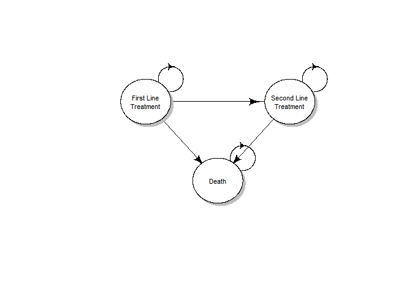<!-- -->


```r
#Draw the state-transition cohort model

diag_names_states  <- c("First Line\nTreatment", "Second Line\nTreatment", "Death")

m_P_diag <- matrix(0, nrow = n_states, ncol = n_states, dimnames = list(diag_names_states, diag_names_states))

m_P_diag["First Line\nTreatment", "First Line\nTreatment" ]  = ""
m_P_diag["First Line\nTreatment", "Second Line\nTreatment" ]     = ""
m_P_diag["First Line\nTreatment", "Death" ]     = ""
m_P_diag["Second Line\nTreatment", "Second Line\nTreatment" ]     = ""
m_P_diag["Second Line\nTreatment", "Death" ]     = ""
m_P_diag["Death", "Death" ]     = ""
layout.fig <- c(2, 1) # <- changing the numbers here changes the diagram layout, so mess with these until I'm happy. It basically decides how many bubbles will be on each level, so here 1 bubble, followed by 3 bubbles, followed by 2 bubbles, per the diagram for 1, 3, 2.
plotmat(t(m_P_diag), t(layout.fig), self.cex = 0.5, curve = 0, arr.pos = 0.76,
        latex = T, arr.type = "curved", relsize = 0.85, box.prop = 0.9,
        cex = 0.8, box.cex = 0.7, lwd = 0.6)
#ggsave("Markov_Model_Diagram.png", width = 4, height = 4, dpi=300)
#while (!is.null(dev.list()))  dev.off()
#png(paste("Markov_Model_Diagram", ".png"))
#dev.off()

title("Figure 1", line= -16, cex.main = 1.5, font.main = 1)
```

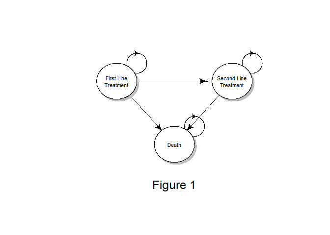<!-- -->

```r
# The last line of the code is adding a title to the plot created in the previous line. It sets the text of the main title to "Figure 1" using the title() function. The line argument specifies the position of the title in the y-axis, where negative values place it further away from the plot and positive values closer to it. The cex.main argument sets the size of the main title text, and font.main sets the font of the main title text.

# In R, the font.main argument is used to set the font style for the main title of a plot. Here are all the possible values and their meanings:
# 
# 1 - Normal (default value). The font appears in the regular font style.
# 2 - Bold. The font appears in the bold font style.
# 3 - Italic. The font appears in the italic font style.
# 4 - Bold and italic. The font appears in the bold and italic font style.
```


```r
#04 Define and initialize matrices and vectors

#04.1 Cohort trace


# After setting up our parameters above, we initialise our structure below.

# This is where we will store all of the model output, and all the things that we need to track over time as we are simulating the progression of this cohort through this disease process.

# WHEN COMING BACK TO COMPARE: C:\Users\Jonathan\OneDrive - Royal College of Surgeons in Ireland\COLOSSUS\R Code\Parametric Survival Analysis\ISPOR WEBINAR Health Economic Modelling in R\ISPOR_webinar_R-master\ISPOR_webinar_R-master\oncologySemiMarkov_illustration to the DARTH Rmarkdown document, a big difference is that DARTH creates a cycle 0 - whereas the comparison from the ISPOR_webinar_R uses -1 to get into cycle 0 where necessary. I have decided to follow the ISPOR way, because I am interested in learning from their parametric analysis, so I need to bear this difference in mind as I go through this document.

# Markov cohort trace matrix ----

# Initialize matrices to store the Markov cohort traces for each strategy

# - note that the number of rows is n_cycle + 1, because R doesn't use index 0 (i.e. cycle 0)  --> What we mean here, is that when we do our calculations later they need to be for cycle-1 to reflect cycle 0.
m_M_SoC <- m_M_Exp  <-  matrix(
  data = NA, 
  nrow = n_cycle,  
  ncol = n_states, 
  dimnames = list(paste('Cycle', 1:n_cycle), v_names_states)
)

## Initial state vector
# We create an inital vector where people start, with everyone (1 = 100% of people) starting in PFS below:
# v_s_init <- c("PFS" = 1, "OS" = 0, "Dead" = 0)
# v_s_init

# There are cases where you can have an initial illness prevalence, so you would start some people in the sick state and some people in the healthy state, but above we're looking at people with mCRC, so we'll start everyone in PFS.


## Initialize cohort trace for cSTM (cohort state transition model) for all strategies (the strategies are the treatment strategies SOC and Exp).
# So, basically we are creating a matrix to trace how the cohort is distributed across the health states, over time. 

# A matrix is necessary because there are basically two dimensions to this, the number of time cycles, which will be our rows, and then the number of states - to know which proportion of our cohort is in each state at each time:

# m_M_SoC <- matrix(0, 
#                   nrow = (n_cycles + 1), ncol = n_states, 
#                   dimnames = list(v_names_cycles, v_names_states))
# In the above code from DARTH instead of having to bother with -1 throughout the analysis they create a cycle 0.
# Then they store the initial state vector in the first row of the cohort trace
# m_M_SoC[1, ] <- v_s_init
## Initialize cohort traces
## So, above they make the cohort trace for standard of care
# This gives them a matrix to can fill in with the simulations of how patients transitions between health states under treatment.


# Back to my code, in the first row of the markov matrix [1, ] put the value at the far end, i.e. "<-1" and "<-0" under the colum "PFS" [ , "PFS"], repeating this for "OS", and "Dead":


# Specifying the initial state for the cohorts (all patients start in PFS)
m_M_SoC[1, "PFS"] <- m_M_Exp[1, "PFS"] <- 1
m_M_SoC[1, "OS"]  <- m_M_Exp[1, "OS"]  <- 0
m_M_SoC[1, "Dead"]<- m_M_Exp[1, "Dead"]  <- 0

# Inspect whether properly defined
head(m_M_SoC)
```

```
##         PFS OS Dead
## Cycle 1   1  0    0
## Cycle 2  NA NA   NA
## Cycle 3  NA NA   NA
## Cycle 4  NA NA   NA
## Cycle 5  NA NA   NA
## Cycle 6  NA NA   NA
```

```r
head(m_M_Exp)
```

```
##         PFS OS Dead
## Cycle 1   1  0    0
## Cycle 2  NA NA   NA
## Cycle 3  NA NA   NA
## Cycle 4  NA NA   NA
## Cycle 5  NA NA   NA
## Cycle 6  NA NA   NA
```


```r
# 04.2 Transition probability matrix

## If there were time varying transition probabilities, i.e. the longer you are in the model there are changes in your transition probability into death as you get older, etc., you would build a transition probability array, rather than a transition probability matrix, per: 

# 04.2 of:

# "C:\Users\Jonathan\OneDrive - Royal College of Surgeons in Ireland\COLOSSUS\Training Resources\Decision Modeling for Public Health_DARTH\5_Nov_29\4_Cohort state-transition models (cSTM) - time-dependent models_material\Markov_3state_time"

# with: C:\Users\Jonathan\OneDrive - Royal College of Surgeons in Ireland\COLOSSUS\Training Resources\Cost-Effectiveness and Decision Modeling using R Workshop _ DARTH\August_24\Live Session


## Initialize transition probability matrix, [i.e. build the framework or empty scaffolding of the transition probability matrix]
# all transitions to a non-death state are assumed to be conditional on survival
# - starting with standard of care
# - note that these are now 3-dimensional matrices because we are including time.
 
# The DARTH approach would be something like:
# m_P_SoC  <- matrix(0,
#                    nrow = n_states, ncol = n_states,
#                    dimnames = list(v_names_states, v_names_states)) # define row and column names
# m_P_SoC


# Our approach to initialize matrices for the transition probabilities
# - note that these are now 3-dimensional matrices (so, above we originally included dim = nrow and ncol, but now we also include n_cycle - i.e. the number of cycles).
# - starting with standard of care
m_P_SoC <- array(
  data = 0,
  dim = c(n_states, n_states, n_cycle),
  dimnames = list(v_names_states, v_names_states, paste0("Cycle", 1:n_cycle))
  # define row and column names - then name each array after which cycle it's for, i.e. cycle 1 all the way through to cycle 143. So Cycle 1 will have all of our patients in PFS, while cycle 143 will have most people in the dead state.
)

head(m_P_SoC)
```

```
## , , Cycle1
## 
##      PFS OS Dead
## PFS    0  0    0
## OS     0  0    0
## Dead   0  0    0
## 
## , , Cycle2
## 
##      PFS OS Dead
## PFS    0  0    0
## OS     0  0    0
## Dead   0  0    0
## 
## , , Cycle3
## 
##      PFS OS Dead
## PFS    0  0    0
## OS     0  0    0
## Dead   0  0    0
## 
## , , Cycle4
## 
##      PFS OS Dead
## PFS    0  0    0
## OS     0  0    0
## Dead   0  0    0
## 
## , , Cycle5
## 
##      PFS OS Dead
## PFS    0  0    0
## OS     0  0    0
## Dead   0  0    0
## 
## , , Cycle6
## 
##      PFS OS Dead
## PFS    0  0    0
## OS     0  0    0
## Dead   0  0    0
## 
## , , Cycle7
## 
##      PFS OS Dead
## PFS    0  0    0
## OS     0  0    0
## Dead   0  0    0
## 
## , , Cycle8
## 
##      PFS OS Dead
## PFS    0  0    0
## OS     0  0    0
## Dead   0  0    0
## 
## , , Cycle9
## 
##      PFS OS Dead
## PFS    0  0    0
## OS     0  0    0
## Dead   0  0    0
## 
## , , Cycle10
## 
##      PFS OS Dead
## PFS    0  0    0
## OS     0  0    0
## Dead   0  0    0
## 
## , , Cycle11
## 
##      PFS OS Dead
## PFS    0  0    0
## OS     0  0    0
## Dead   0  0    0
## 
## , , Cycle12
## 
##      PFS OS Dead
## PFS    0  0    0
## OS     0  0    0
## Dead   0  0    0
## 
## , , Cycle13
## 
##      PFS OS Dead
## PFS    0  0    0
## OS     0  0    0
## Dead   0  0    0
## 
## , , Cycle14
## 
##      PFS OS Dead
## PFS    0  0    0
## OS     0  0    0
## Dead   0  0    0
## 
## , , Cycle15
## 
##      PFS OS Dead
## PFS    0  0    0
## OS     0  0    0
## Dead   0  0    0
## 
## , , Cycle16
## 
##      PFS OS Dead
## PFS    0  0    0
## OS     0  0    0
## Dead   0  0    0
## 
## , , Cycle17
## 
##      PFS OS Dead
## PFS    0  0    0
## OS     0  0    0
## Dead   0  0    0
## 
## , , Cycle18
## 
##      PFS OS Dead
## PFS    0  0    0
## OS     0  0    0
## Dead   0  0    0
## 
## , , Cycle19
## 
##      PFS OS Dead
## PFS    0  0    0
## OS     0  0    0
## Dead   0  0    0
## 
## , , Cycle20
## 
##      PFS OS Dead
## PFS    0  0    0
## OS     0  0    0
## Dead   0  0    0
## 
## , , Cycle21
## 
##      PFS OS Dead
## PFS    0  0    0
## OS     0  0    0
## Dead   0  0    0
## 
## , , Cycle22
## 
##      PFS OS Dead
## PFS    0  0    0
## OS     0  0    0
## Dead   0  0    0
## 
## , , Cycle23
## 
##      PFS OS Dead
## PFS    0  0    0
## OS     0  0    0
## Dead   0  0    0
## 
## , , Cycle24
## 
##      PFS OS Dead
## PFS    0  0    0
## OS     0  0    0
## Dead   0  0    0
## 
## , , Cycle25
## 
##      PFS OS Dead
## PFS    0  0    0
## OS     0  0    0
## Dead   0  0    0
## 
## , , Cycle26
## 
##      PFS OS Dead
## PFS    0  0    0
## OS     0  0    0
## Dead   0  0    0
## 
## , , Cycle27
## 
##      PFS OS Dead
## PFS    0  0    0
## OS     0  0    0
## Dead   0  0    0
## 
## , , Cycle28
## 
##      PFS OS Dead
## PFS    0  0    0
## OS     0  0    0
## Dead   0  0    0
## 
## , , Cycle29
## 
##      PFS OS Dead
## PFS    0  0    0
## OS     0  0    0
## Dead   0  0    0
## 
## , , Cycle30
## 
##      PFS OS Dead
## PFS    0  0    0
## OS     0  0    0
## Dead   0  0    0
## 
## , , Cycle31
## 
##      PFS OS Dead
## PFS    0  0    0
## OS     0  0    0
## Dead   0  0    0
## 
## , , Cycle32
## 
##      PFS OS Dead
## PFS    0  0    0
## OS     0  0    0
## Dead   0  0    0
## 
## , , Cycle33
## 
##      PFS OS Dead
## PFS    0  0    0
## OS     0  0    0
## Dead   0  0    0
## 
## , , Cycle34
## 
##      PFS OS Dead
## PFS    0  0    0
## OS     0  0    0
## Dead   0  0    0
## 
## , , Cycle35
## 
##      PFS OS Dead
## PFS    0  0    0
## OS     0  0    0
## Dead   0  0    0
## 
## , , Cycle36
## 
##      PFS OS Dead
## PFS    0  0    0
## OS     0  0    0
## Dead   0  0    0
## 
## , , Cycle37
## 
##      PFS OS Dead
## PFS    0  0    0
## OS     0  0    0
## Dead   0  0    0
## 
## , , Cycle38
## 
##      PFS OS Dead
## PFS    0  0    0
## OS     0  0    0
## Dead   0  0    0
## 
## , , Cycle39
## 
##      PFS OS Dead
## PFS    0  0    0
## OS     0  0    0
## Dead   0  0    0
## 
## , , Cycle40
## 
##      PFS OS Dead
## PFS    0  0    0
## OS     0  0    0
## Dead   0  0    0
## 
## , , Cycle41
## 
##      PFS OS Dead
## PFS    0  0    0
## OS     0  0    0
## Dead   0  0    0
## 
## , , Cycle42
## 
##      PFS OS Dead
## PFS    0  0    0
## OS     0  0    0
## Dead   0  0    0
## 
## , , Cycle43
## 
##      PFS OS Dead
## PFS    0  0    0
## OS     0  0    0
## Dead   0  0    0
## 
## , , Cycle44
## 
##      PFS OS Dead
## PFS    0  0    0
## OS     0  0    0
## Dead   0  0    0
## 
## , , Cycle45
## 
##      PFS OS Dead
## PFS    0  0    0
## OS     0  0    0
## Dead   0  0    0
## 
## , , Cycle46
## 
##      PFS OS Dead
## PFS    0  0    0
## OS     0  0    0
## Dead   0  0    0
## 
## , , Cycle47
## 
##      PFS OS Dead
## PFS    0  0    0
## OS     0  0    0
## Dead   0  0    0
## 
## , , Cycle48
## 
##      PFS OS Dead
## PFS    0  0    0
## OS     0  0    0
## Dead   0  0    0
## 
## , , Cycle49
## 
##      PFS OS Dead
## PFS    0  0    0
## OS     0  0    0
## Dead   0  0    0
## 
## , , Cycle50
## 
##      PFS OS Dead
## PFS    0  0    0
## OS     0  0    0
## Dead   0  0    0
## 
## , , Cycle51
## 
##      PFS OS Dead
## PFS    0  0    0
## OS     0  0    0
## Dead   0  0    0
## 
## , , Cycle52
## 
##      PFS OS Dead
## PFS    0  0    0
## OS     0  0    0
## Dead   0  0    0
## 
## , , Cycle53
## 
##      PFS OS Dead
## PFS    0  0    0
## OS     0  0    0
## Dead   0  0    0
## 
## , , Cycle54
## 
##      PFS OS Dead
## PFS    0  0    0
## OS     0  0    0
## Dead   0  0    0
## 
## , , Cycle55
## 
##      PFS OS Dead
## PFS    0  0    0
## OS     0  0    0
## Dead   0  0    0
## 
## , , Cycle56
## 
##      PFS OS Dead
## PFS    0  0    0
## OS     0  0    0
## Dead   0  0    0
## 
## , , Cycle57
## 
##      PFS OS Dead
## PFS    0  0    0
## OS     0  0    0
## Dead   0  0    0
## 
## , , Cycle58
## 
##      PFS OS Dead
## PFS    0  0    0
## OS     0  0    0
## Dead   0  0    0
## 
## , , Cycle59
## 
##      PFS OS Dead
## PFS    0  0    0
## OS     0  0    0
## Dead   0  0    0
## 
## , , Cycle60
## 
##      PFS OS Dead
## PFS    0  0    0
## OS     0  0    0
## Dead   0  0    0
## 
## , , Cycle61
## 
##      PFS OS Dead
## PFS    0  0    0
## OS     0  0    0
## Dead   0  0    0
## 
## , , Cycle62
## 
##      PFS OS Dead
## PFS    0  0    0
## OS     0  0    0
## Dead   0  0    0
## 
## , , Cycle63
## 
##      PFS OS Dead
## PFS    0  0    0
## OS     0  0    0
## Dead   0  0    0
## 
## , , Cycle64
## 
##      PFS OS Dead
## PFS    0  0    0
## OS     0  0    0
## Dead   0  0    0
## 
## , , Cycle65
## 
##      PFS OS Dead
## PFS    0  0    0
## OS     0  0    0
## Dead   0  0    0
## 
## , , Cycle66
## 
##      PFS OS Dead
## PFS    0  0    0
## OS     0  0    0
## Dead   0  0    0
## 
## , , Cycle67
## 
##      PFS OS Dead
## PFS    0  0    0
## OS     0  0    0
## Dead   0  0    0
## 
## , , Cycle68
## 
##      PFS OS Dead
## PFS    0  0    0
## OS     0  0    0
## Dead   0  0    0
## 
## , , Cycle69
## 
##      PFS OS Dead
## PFS    0  0    0
## OS     0  0    0
## Dead   0  0    0
## 
## , , Cycle70
## 
##      PFS OS Dead
## PFS    0  0    0
## OS     0  0    0
## Dead   0  0    0
## 
## , , Cycle71
## 
##      PFS OS Dead
## PFS    0  0    0
## OS     0  0    0
## Dead   0  0    0
## 
## , , Cycle72
## 
##      PFS OS Dead
## PFS    0  0    0
## OS     0  0    0
## Dead   0  0    0
## 
## , , Cycle73
## 
##      PFS OS Dead
## PFS    0  0    0
## OS     0  0    0
## Dead   0  0    0
## 
## , , Cycle74
## 
##      PFS OS Dead
## PFS    0  0    0
## OS     0  0    0
## Dead   0  0    0
## 
## , , Cycle75
## 
##      PFS OS Dead
## PFS    0  0    0
## OS     0  0    0
## Dead   0  0    0
## 
## , , Cycle76
## 
##      PFS OS Dead
## PFS    0  0    0
## OS     0  0    0
## Dead   0  0    0
## 
## , , Cycle77
## 
##      PFS OS Dead
## PFS    0  0    0
## OS     0  0    0
## Dead   0  0    0
## 
## , , Cycle78
## 
##      PFS OS Dead
## PFS    0  0    0
## OS     0  0    0
## Dead   0  0    0
## 
## , , Cycle79
## 
##      PFS OS Dead
## PFS    0  0    0
## OS     0  0    0
## Dead   0  0    0
## 
## , , Cycle80
## 
##      PFS OS Dead
## PFS    0  0    0
## OS     0  0    0
## Dead   0  0    0
## 
## , , Cycle81
## 
##      PFS OS Dead
## PFS    0  0    0
## OS     0  0    0
## Dead   0  0    0
## 
## , , Cycle82
## 
##      PFS OS Dead
## PFS    0  0    0
## OS     0  0    0
## Dead   0  0    0
## 
## , , Cycle83
## 
##      PFS OS Dead
## PFS    0  0    0
## OS     0  0    0
## Dead   0  0    0
## 
## , , Cycle84
## 
##      PFS OS Dead
## PFS    0  0    0
## OS     0  0    0
## Dead   0  0    0
## 
## , , Cycle85
## 
##      PFS OS Dead
## PFS    0  0    0
## OS     0  0    0
## Dead   0  0    0
## 
## , , Cycle86
## 
##      PFS OS Dead
## PFS    0  0    0
## OS     0  0    0
## Dead   0  0    0
## 
## , , Cycle87
## 
##      PFS OS Dead
## PFS    0  0    0
## OS     0  0    0
## Dead   0  0    0
## 
## , , Cycle88
## 
##      PFS OS Dead
## PFS    0  0    0
## OS     0  0    0
## Dead   0  0    0
## 
## , , Cycle89
## 
##      PFS OS Dead
## PFS    0  0    0
## OS     0  0    0
## Dead   0  0    0
## 
## , , Cycle90
## 
##      PFS OS Dead
## PFS    0  0    0
## OS     0  0    0
## Dead   0  0    0
## 
## , , Cycle91
## 
##      PFS OS Dead
## PFS    0  0    0
## OS     0  0    0
## Dead   0  0    0
## 
## , , Cycle92
## 
##      PFS OS Dead
## PFS    0  0    0
## OS     0  0    0
## Dead   0  0    0
## 
## , , Cycle93
## 
##      PFS OS Dead
## PFS    0  0    0
## OS     0  0    0
## Dead   0  0    0
## 
## , , Cycle94
## 
##      PFS OS Dead
## PFS    0  0    0
## OS     0  0    0
## Dead   0  0    0
## 
## , , Cycle95
## 
##      PFS OS Dead
## PFS    0  0    0
## OS     0  0    0
## Dead   0  0    0
## 
## , , Cycle96
## 
##      PFS OS Dead
## PFS    0  0    0
## OS     0  0    0
## Dead   0  0    0
## 
## , , Cycle97
## 
##      PFS OS Dead
## PFS    0  0    0
## OS     0  0    0
## Dead   0  0    0
## 
## , , Cycle98
## 
##      PFS OS Dead
## PFS    0  0    0
## OS     0  0    0
## Dead   0  0    0
## 
## , , Cycle99
## 
##      PFS OS Dead
## PFS    0  0    0
## OS     0  0    0
## Dead   0  0    0
## 
## , , Cycle100
## 
##      PFS OS Dead
## PFS    0  0    0
## OS     0  0    0
## Dead   0  0    0
## 
## , , Cycle101
## 
##      PFS OS Dead
## PFS    0  0    0
## OS     0  0    0
## Dead   0  0    0
## 
## , , Cycle102
## 
##      PFS OS Dead
## PFS    0  0    0
## OS     0  0    0
## Dead   0  0    0
## 
## , , Cycle103
## 
##      PFS OS Dead
## PFS    0  0    0
## OS     0  0    0
## Dead   0  0    0
## 
## , , Cycle104
## 
##      PFS OS Dead
## PFS    0  0    0
## OS     0  0    0
## Dead   0  0    0
## 
## , , Cycle105
## 
##      PFS OS Dead
## PFS    0  0    0
## OS     0  0    0
## Dead   0  0    0
## 
## , , Cycle106
## 
##      PFS OS Dead
## PFS    0  0    0
## OS     0  0    0
## Dead   0  0    0
## 
## , , Cycle107
## 
##      PFS OS Dead
## PFS    0  0    0
## OS     0  0    0
## Dead   0  0    0
## 
## , , Cycle108
## 
##      PFS OS Dead
## PFS    0  0    0
## OS     0  0    0
## Dead   0  0    0
## 
## , , Cycle109
## 
##      PFS OS Dead
## PFS    0  0    0
## OS     0  0    0
## Dead   0  0    0
## 
## , , Cycle110
## 
##      PFS OS Dead
## PFS    0  0    0
## OS     0  0    0
## Dead   0  0    0
## 
## , , Cycle111
## 
##      PFS OS Dead
## PFS    0  0    0
## OS     0  0    0
## Dead   0  0    0
## 
## , , Cycle112
## 
##      PFS OS Dead
## PFS    0  0    0
## OS     0  0    0
## Dead   0  0    0
## 
## , , Cycle113
## 
##      PFS OS Dead
## PFS    0  0    0
## OS     0  0    0
## Dead   0  0    0
## 
## , , Cycle114
## 
##      PFS OS Dead
## PFS    0  0    0
## OS     0  0    0
## Dead   0  0    0
## 
## , , Cycle115
## 
##      PFS OS Dead
## PFS    0  0    0
## OS     0  0    0
## Dead   0  0    0
## 
## , , Cycle116
## 
##      PFS OS Dead
## PFS    0  0    0
## OS     0  0    0
## Dead   0  0    0
## 
## , , Cycle117
## 
##      PFS OS Dead
## PFS    0  0    0
## OS     0  0    0
## Dead   0  0    0
## 
## , , Cycle118
## 
##      PFS OS Dead
## PFS    0  0    0
## OS     0  0    0
## Dead   0  0    0
## 
## , , Cycle119
## 
##      PFS OS Dead
## PFS    0  0    0
## OS     0  0    0
## Dead   0  0    0
## 
## , , Cycle120
## 
##      PFS OS Dead
## PFS    0  0    0
## OS     0  0    0
## Dead   0  0    0
## 
## , , Cycle121
## 
##      PFS OS Dead
## PFS    0  0    0
## OS     0  0    0
## Dead   0  0    0
## 
## , , Cycle122
## 
##      PFS OS Dead
## PFS    0  0    0
## OS     0  0    0
## Dead   0  0    0
## 
## , , Cycle123
## 
##      PFS OS Dead
## PFS    0  0    0
## OS     0  0    0
## Dead   0  0    0
## 
## , , Cycle124
## 
##      PFS OS Dead
## PFS    0  0    0
## OS     0  0    0
## Dead   0  0    0
## 
## , , Cycle125
## 
##      PFS OS Dead
## PFS    0  0    0
## OS     0  0    0
## Dead   0  0    0
## 
## , , Cycle126
## 
##      PFS OS Dead
## PFS    0  0    0
## OS     0  0    0
## Dead   0  0    0
## 
## , , Cycle127
## 
##      PFS OS Dead
## PFS    0  0    0
## OS     0  0    0
## Dead   0  0    0
## 
## , , Cycle128
## 
##      PFS OS Dead
## PFS    0  0    0
## OS     0  0    0
## Dead   0  0    0
## 
## , , Cycle129
## 
##      PFS OS Dead
## PFS    0  0    0
## OS     0  0    0
## Dead   0  0    0
## 
## , , Cycle130
## 
##      PFS OS Dead
## PFS    0  0    0
## OS     0  0    0
## Dead   0  0    0
## 
## , , Cycle131
## 
##      PFS OS Dead
## PFS    0  0    0
## OS     0  0    0
## Dead   0  0    0
## 
## , , Cycle132
## 
##      PFS OS Dead
## PFS    0  0    0
## OS     0  0    0
## Dead   0  0    0
## 
## , , Cycle133
## 
##      PFS OS Dead
## PFS    0  0    0
## OS     0  0    0
## Dead   0  0    0
## 
## , , Cycle134
## 
##      PFS OS Dead
## PFS    0  0    0
## OS     0  0    0
## Dead   0  0    0
## 
## , , Cycle135
## 
##      PFS OS Dead
## PFS    0  0    0
## OS     0  0    0
## Dead   0  0    0
## 
## , , Cycle136
## 
##      PFS OS Dead
## PFS    0  0    0
## OS     0  0    0
## Dead   0  0    0
## 
## , , Cycle137
## 
##      PFS OS Dead
## PFS    0  0    0
## OS     0  0    0
## Dead   0  0    0
## 
## , , Cycle138
## 
##      PFS OS Dead
## PFS    0  0    0
## OS     0  0    0
## Dead   0  0    0
## 
## , , Cycle139
## 
##      PFS OS Dead
## PFS    0  0    0
## OS     0  0    0
## Dead   0  0    0
## 
## , , Cycle140
## 
##      PFS OS Dead
## PFS    0  0    0
## OS     0  0    0
## Dead   0  0    0
## 
## , , Cycle141
## 
##      PFS OS Dead
## PFS    0  0    0
## OS     0  0    0
## Dead   0  0    0
## 
## , , Cycle142
## 
##      PFS OS Dead
## PFS    0  0    0
## OS     0  0    0
## Dead   0  0    0
## 
## , , Cycle143
## 
##      PFS OS Dead
## PFS    0  0    0
## OS     0  0    0
## Dead   0  0    0
```

```r
m_P_Exp <- array(
  data = 0,
  dim = c(n_states, n_states, n_cycle),
  dimnames = list(v_names_states, v_names_states, paste0("Cycle", 1:n_cycle))
  # define row and column names - then name each array after which cycle it's for, i.e. cycle 1 all the way through to cycle 143. So Cycle 1 will have all of our patients in PFS, while cycle 143 will have most people in the dead state.
)

head(m_P_Exp)
```

```
## , , Cycle1
## 
##      PFS OS Dead
## PFS    0  0    0
## OS     0  0    0
## Dead   0  0    0
## 
## , , Cycle2
## 
##      PFS OS Dead
## PFS    0  0    0
## OS     0  0    0
## Dead   0  0    0
## 
## , , Cycle3
## 
##      PFS OS Dead
## PFS    0  0    0
## OS     0  0    0
## Dead   0  0    0
## 
## , , Cycle4
## 
##      PFS OS Dead
## PFS    0  0    0
## OS     0  0    0
## Dead   0  0    0
## 
## , , Cycle5
## 
##      PFS OS Dead
## PFS    0  0    0
## OS     0  0    0
## Dead   0  0    0
## 
## , , Cycle6
## 
##      PFS OS Dead
## PFS    0  0    0
## OS     0  0    0
## Dead   0  0    0
## 
## , , Cycle7
## 
##      PFS OS Dead
## PFS    0  0    0
## OS     0  0    0
## Dead   0  0    0
## 
## , , Cycle8
## 
##      PFS OS Dead
## PFS    0  0    0
## OS     0  0    0
## Dead   0  0    0
## 
## , , Cycle9
## 
##      PFS OS Dead
## PFS    0  0    0
## OS     0  0    0
## Dead   0  0    0
## 
## , , Cycle10
## 
##      PFS OS Dead
## PFS    0  0    0
## OS     0  0    0
## Dead   0  0    0
## 
## , , Cycle11
## 
##      PFS OS Dead
## PFS    0  0    0
## OS     0  0    0
## Dead   0  0    0
## 
## , , Cycle12
## 
##      PFS OS Dead
## PFS    0  0    0
## OS     0  0    0
## Dead   0  0    0
## 
## , , Cycle13
## 
##      PFS OS Dead
## PFS    0  0    0
## OS     0  0    0
## Dead   0  0    0
## 
## , , Cycle14
## 
##      PFS OS Dead
## PFS    0  0    0
## OS     0  0    0
## Dead   0  0    0
## 
## , , Cycle15
## 
##      PFS OS Dead
## PFS    0  0    0
## OS     0  0    0
## Dead   0  0    0
## 
## , , Cycle16
## 
##      PFS OS Dead
## PFS    0  0    0
## OS     0  0    0
## Dead   0  0    0
## 
## , , Cycle17
## 
##      PFS OS Dead
## PFS    0  0    0
## OS     0  0    0
## Dead   0  0    0
## 
## , , Cycle18
## 
##      PFS OS Dead
## PFS    0  0    0
## OS     0  0    0
## Dead   0  0    0
## 
## , , Cycle19
## 
##      PFS OS Dead
## PFS    0  0    0
## OS     0  0    0
## Dead   0  0    0
## 
## , , Cycle20
## 
##      PFS OS Dead
## PFS    0  0    0
## OS     0  0    0
## Dead   0  0    0
## 
## , , Cycle21
## 
##      PFS OS Dead
## PFS    0  0    0
## OS     0  0    0
## Dead   0  0    0
## 
## , , Cycle22
## 
##      PFS OS Dead
## PFS    0  0    0
## OS     0  0    0
## Dead   0  0    0
## 
## , , Cycle23
## 
##      PFS OS Dead
## PFS    0  0    0
## OS     0  0    0
## Dead   0  0    0
## 
## , , Cycle24
## 
##      PFS OS Dead
## PFS    0  0    0
## OS     0  0    0
## Dead   0  0    0
## 
## , , Cycle25
## 
##      PFS OS Dead
## PFS    0  0    0
## OS     0  0    0
## Dead   0  0    0
## 
## , , Cycle26
## 
##      PFS OS Dead
## PFS    0  0    0
## OS     0  0    0
## Dead   0  0    0
## 
## , , Cycle27
## 
##      PFS OS Dead
## PFS    0  0    0
## OS     0  0    0
## Dead   0  0    0
## 
## , , Cycle28
## 
##      PFS OS Dead
## PFS    0  0    0
## OS     0  0    0
## Dead   0  0    0
## 
## , , Cycle29
## 
##      PFS OS Dead
## PFS    0  0    0
## OS     0  0    0
## Dead   0  0    0
## 
## , , Cycle30
## 
##      PFS OS Dead
## PFS    0  0    0
## OS     0  0    0
## Dead   0  0    0
## 
## , , Cycle31
## 
##      PFS OS Dead
## PFS    0  0    0
## OS     0  0    0
## Dead   0  0    0
## 
## , , Cycle32
## 
##      PFS OS Dead
## PFS    0  0    0
## OS     0  0    0
## Dead   0  0    0
## 
## , , Cycle33
## 
##      PFS OS Dead
## PFS    0  0    0
## OS     0  0    0
## Dead   0  0    0
## 
## , , Cycle34
## 
##      PFS OS Dead
## PFS    0  0    0
## OS     0  0    0
## Dead   0  0    0
## 
## , , Cycle35
## 
##      PFS OS Dead
## PFS    0  0    0
## OS     0  0    0
## Dead   0  0    0
## 
## , , Cycle36
## 
##      PFS OS Dead
## PFS    0  0    0
## OS     0  0    0
## Dead   0  0    0
## 
## , , Cycle37
## 
##      PFS OS Dead
## PFS    0  0    0
## OS     0  0    0
## Dead   0  0    0
## 
## , , Cycle38
## 
##      PFS OS Dead
## PFS    0  0    0
## OS     0  0    0
## Dead   0  0    0
## 
## , , Cycle39
## 
##      PFS OS Dead
## PFS    0  0    0
## OS     0  0    0
## Dead   0  0    0
## 
## , , Cycle40
## 
##      PFS OS Dead
## PFS    0  0    0
## OS     0  0    0
## Dead   0  0    0
## 
## , , Cycle41
## 
##      PFS OS Dead
## PFS    0  0    0
## OS     0  0    0
## Dead   0  0    0
## 
## , , Cycle42
## 
##      PFS OS Dead
## PFS    0  0    0
## OS     0  0    0
## Dead   0  0    0
## 
## , , Cycle43
## 
##      PFS OS Dead
## PFS    0  0    0
## OS     0  0    0
## Dead   0  0    0
## 
## , , Cycle44
## 
##      PFS OS Dead
## PFS    0  0    0
## OS     0  0    0
## Dead   0  0    0
## 
## , , Cycle45
## 
##      PFS OS Dead
## PFS    0  0    0
## OS     0  0    0
## Dead   0  0    0
## 
## , , Cycle46
## 
##      PFS OS Dead
## PFS    0  0    0
## OS     0  0    0
## Dead   0  0    0
## 
## , , Cycle47
## 
##      PFS OS Dead
## PFS    0  0    0
## OS     0  0    0
## Dead   0  0    0
## 
## , , Cycle48
## 
##      PFS OS Dead
## PFS    0  0    0
## OS     0  0    0
## Dead   0  0    0
## 
## , , Cycle49
## 
##      PFS OS Dead
## PFS    0  0    0
## OS     0  0    0
## Dead   0  0    0
## 
## , , Cycle50
## 
##      PFS OS Dead
## PFS    0  0    0
## OS     0  0    0
## Dead   0  0    0
## 
## , , Cycle51
## 
##      PFS OS Dead
## PFS    0  0    0
## OS     0  0    0
## Dead   0  0    0
## 
## , , Cycle52
## 
##      PFS OS Dead
## PFS    0  0    0
## OS     0  0    0
## Dead   0  0    0
## 
## , , Cycle53
## 
##      PFS OS Dead
## PFS    0  0    0
## OS     0  0    0
## Dead   0  0    0
## 
## , , Cycle54
## 
##      PFS OS Dead
## PFS    0  0    0
## OS     0  0    0
## Dead   0  0    0
## 
## , , Cycle55
## 
##      PFS OS Dead
## PFS    0  0    0
## OS     0  0    0
## Dead   0  0    0
## 
## , , Cycle56
## 
##      PFS OS Dead
## PFS    0  0    0
## OS     0  0    0
## Dead   0  0    0
## 
## , , Cycle57
## 
##      PFS OS Dead
## PFS    0  0    0
## OS     0  0    0
## Dead   0  0    0
## 
## , , Cycle58
## 
##      PFS OS Dead
## PFS    0  0    0
## OS     0  0    0
## Dead   0  0    0
## 
## , , Cycle59
## 
##      PFS OS Dead
## PFS    0  0    0
## OS     0  0    0
## Dead   0  0    0
## 
## , , Cycle60
## 
##      PFS OS Dead
## PFS    0  0    0
## OS     0  0    0
## Dead   0  0    0
## 
## , , Cycle61
## 
##      PFS OS Dead
## PFS    0  0    0
## OS     0  0    0
## Dead   0  0    0
## 
## , , Cycle62
## 
##      PFS OS Dead
## PFS    0  0    0
## OS     0  0    0
## Dead   0  0    0
## 
## , , Cycle63
## 
##      PFS OS Dead
## PFS    0  0    0
## OS     0  0    0
## Dead   0  0    0
## 
## , , Cycle64
## 
##      PFS OS Dead
## PFS    0  0    0
## OS     0  0    0
## Dead   0  0    0
## 
## , , Cycle65
## 
##      PFS OS Dead
## PFS    0  0    0
## OS     0  0    0
## Dead   0  0    0
## 
## , , Cycle66
## 
##      PFS OS Dead
## PFS    0  0    0
## OS     0  0    0
## Dead   0  0    0
## 
## , , Cycle67
## 
##      PFS OS Dead
## PFS    0  0    0
## OS     0  0    0
## Dead   0  0    0
## 
## , , Cycle68
## 
##      PFS OS Dead
## PFS    0  0    0
## OS     0  0    0
## Dead   0  0    0
## 
## , , Cycle69
## 
##      PFS OS Dead
## PFS    0  0    0
## OS     0  0    0
## Dead   0  0    0
## 
## , , Cycle70
## 
##      PFS OS Dead
## PFS    0  0    0
## OS     0  0    0
## Dead   0  0    0
## 
## , , Cycle71
## 
##      PFS OS Dead
## PFS    0  0    0
## OS     0  0    0
## Dead   0  0    0
## 
## , , Cycle72
## 
##      PFS OS Dead
## PFS    0  0    0
## OS     0  0    0
## Dead   0  0    0
## 
## , , Cycle73
## 
##      PFS OS Dead
## PFS    0  0    0
## OS     0  0    0
## Dead   0  0    0
## 
## , , Cycle74
## 
##      PFS OS Dead
## PFS    0  0    0
## OS     0  0    0
## Dead   0  0    0
## 
## , , Cycle75
## 
##      PFS OS Dead
## PFS    0  0    0
## OS     0  0    0
## Dead   0  0    0
## 
## , , Cycle76
## 
##      PFS OS Dead
## PFS    0  0    0
## OS     0  0    0
## Dead   0  0    0
## 
## , , Cycle77
## 
##      PFS OS Dead
## PFS    0  0    0
## OS     0  0    0
## Dead   0  0    0
## 
## , , Cycle78
## 
##      PFS OS Dead
## PFS    0  0    0
## OS     0  0    0
## Dead   0  0    0
## 
## , , Cycle79
## 
##      PFS OS Dead
## PFS    0  0    0
## OS     0  0    0
## Dead   0  0    0
## 
## , , Cycle80
## 
##      PFS OS Dead
## PFS    0  0    0
## OS     0  0    0
## Dead   0  0    0
## 
## , , Cycle81
## 
##      PFS OS Dead
## PFS    0  0    0
## OS     0  0    0
## Dead   0  0    0
## 
## , , Cycle82
## 
##      PFS OS Dead
## PFS    0  0    0
## OS     0  0    0
## Dead   0  0    0
## 
## , , Cycle83
## 
##      PFS OS Dead
## PFS    0  0    0
## OS     0  0    0
## Dead   0  0    0
## 
## , , Cycle84
## 
##      PFS OS Dead
## PFS    0  0    0
## OS     0  0    0
## Dead   0  0    0
## 
## , , Cycle85
## 
##      PFS OS Dead
## PFS    0  0    0
## OS     0  0    0
## Dead   0  0    0
## 
## , , Cycle86
## 
##      PFS OS Dead
## PFS    0  0    0
## OS     0  0    0
## Dead   0  0    0
## 
## , , Cycle87
## 
##      PFS OS Dead
## PFS    0  0    0
## OS     0  0    0
## Dead   0  0    0
## 
## , , Cycle88
## 
##      PFS OS Dead
## PFS    0  0    0
## OS     0  0    0
## Dead   0  0    0
## 
## , , Cycle89
## 
##      PFS OS Dead
## PFS    0  0    0
## OS     0  0    0
## Dead   0  0    0
## 
## , , Cycle90
## 
##      PFS OS Dead
## PFS    0  0    0
## OS     0  0    0
## Dead   0  0    0
## 
## , , Cycle91
## 
##      PFS OS Dead
## PFS    0  0    0
## OS     0  0    0
## Dead   0  0    0
## 
## , , Cycle92
## 
##      PFS OS Dead
## PFS    0  0    0
## OS     0  0    0
## Dead   0  0    0
## 
## , , Cycle93
## 
##      PFS OS Dead
## PFS    0  0    0
## OS     0  0    0
## Dead   0  0    0
## 
## , , Cycle94
## 
##      PFS OS Dead
## PFS    0  0    0
## OS     0  0    0
## Dead   0  0    0
## 
## , , Cycle95
## 
##      PFS OS Dead
## PFS    0  0    0
## OS     0  0    0
## Dead   0  0    0
## 
## , , Cycle96
## 
##      PFS OS Dead
## PFS    0  0    0
## OS     0  0    0
## Dead   0  0    0
## 
## , , Cycle97
## 
##      PFS OS Dead
## PFS    0  0    0
## OS     0  0    0
## Dead   0  0    0
## 
## , , Cycle98
## 
##      PFS OS Dead
## PFS    0  0    0
## OS     0  0    0
## Dead   0  0    0
## 
## , , Cycle99
## 
##      PFS OS Dead
## PFS    0  0    0
## OS     0  0    0
## Dead   0  0    0
## 
## , , Cycle100
## 
##      PFS OS Dead
## PFS    0  0    0
## OS     0  0    0
## Dead   0  0    0
## 
## , , Cycle101
## 
##      PFS OS Dead
## PFS    0  0    0
## OS     0  0    0
## Dead   0  0    0
## 
## , , Cycle102
## 
##      PFS OS Dead
## PFS    0  0    0
## OS     0  0    0
## Dead   0  0    0
## 
## , , Cycle103
## 
##      PFS OS Dead
## PFS    0  0    0
## OS     0  0    0
## Dead   0  0    0
## 
## , , Cycle104
## 
##      PFS OS Dead
## PFS    0  0    0
## OS     0  0    0
## Dead   0  0    0
## 
## , , Cycle105
## 
##      PFS OS Dead
## PFS    0  0    0
## OS     0  0    0
## Dead   0  0    0
## 
## , , Cycle106
## 
##      PFS OS Dead
## PFS    0  0    0
## OS     0  0    0
## Dead   0  0    0
## 
## , , Cycle107
## 
##      PFS OS Dead
## PFS    0  0    0
## OS     0  0    0
## Dead   0  0    0
## 
## , , Cycle108
## 
##      PFS OS Dead
## PFS    0  0    0
## OS     0  0    0
## Dead   0  0    0
## 
## , , Cycle109
## 
##      PFS OS Dead
## PFS    0  0    0
## OS     0  0    0
## Dead   0  0    0
## 
## , , Cycle110
## 
##      PFS OS Dead
## PFS    0  0    0
## OS     0  0    0
## Dead   0  0    0
## 
## , , Cycle111
## 
##      PFS OS Dead
## PFS    0  0    0
## OS     0  0    0
## Dead   0  0    0
## 
## , , Cycle112
## 
##      PFS OS Dead
## PFS    0  0    0
## OS     0  0    0
## Dead   0  0    0
## 
## , , Cycle113
## 
##      PFS OS Dead
## PFS    0  0    0
## OS     0  0    0
## Dead   0  0    0
## 
## , , Cycle114
## 
##      PFS OS Dead
## PFS    0  0    0
## OS     0  0    0
## Dead   0  0    0
## 
## , , Cycle115
## 
##      PFS OS Dead
## PFS    0  0    0
## OS     0  0    0
## Dead   0  0    0
## 
## , , Cycle116
## 
##      PFS OS Dead
## PFS    0  0    0
## OS     0  0    0
## Dead   0  0    0
## 
## , , Cycle117
## 
##      PFS OS Dead
## PFS    0  0    0
## OS     0  0    0
## Dead   0  0    0
## 
## , , Cycle118
## 
##      PFS OS Dead
## PFS    0  0    0
## OS     0  0    0
## Dead   0  0    0
## 
## , , Cycle119
## 
##      PFS OS Dead
## PFS    0  0    0
## OS     0  0    0
## Dead   0  0    0
## 
## , , Cycle120
## 
##      PFS OS Dead
## PFS    0  0    0
## OS     0  0    0
## Dead   0  0    0
## 
## , , Cycle121
## 
##      PFS OS Dead
## PFS    0  0    0
## OS     0  0    0
## Dead   0  0    0
## 
## , , Cycle122
## 
##      PFS OS Dead
## PFS    0  0    0
## OS     0  0    0
## Dead   0  0    0
## 
## , , Cycle123
## 
##      PFS OS Dead
## PFS    0  0    0
## OS     0  0    0
## Dead   0  0    0
## 
## , , Cycle124
## 
##      PFS OS Dead
## PFS    0  0    0
## OS     0  0    0
## Dead   0  0    0
## 
## , , Cycle125
## 
##      PFS OS Dead
## PFS    0  0    0
## OS     0  0    0
## Dead   0  0    0
## 
## , , Cycle126
## 
##      PFS OS Dead
## PFS    0  0    0
## OS     0  0    0
## Dead   0  0    0
## 
## , , Cycle127
## 
##      PFS OS Dead
## PFS    0  0    0
## OS     0  0    0
## Dead   0  0    0
## 
## , , Cycle128
## 
##      PFS OS Dead
## PFS    0  0    0
## OS     0  0    0
## Dead   0  0    0
## 
## , , Cycle129
## 
##      PFS OS Dead
## PFS    0  0    0
## OS     0  0    0
## Dead   0  0    0
## 
## , , Cycle130
## 
##      PFS OS Dead
## PFS    0  0    0
## OS     0  0    0
## Dead   0  0    0
## 
## , , Cycle131
## 
##      PFS OS Dead
## PFS    0  0    0
## OS     0  0    0
## Dead   0  0    0
## 
## , , Cycle132
## 
##      PFS OS Dead
## PFS    0  0    0
## OS     0  0    0
## Dead   0  0    0
## 
## , , Cycle133
## 
##      PFS OS Dead
## PFS    0  0    0
## OS     0  0    0
## Dead   0  0    0
## 
## , , Cycle134
## 
##      PFS OS Dead
## PFS    0  0    0
## OS     0  0    0
## Dead   0  0    0
## 
## , , Cycle135
## 
##      PFS OS Dead
## PFS    0  0    0
## OS     0  0    0
## Dead   0  0    0
## 
## , , Cycle136
## 
##      PFS OS Dead
## PFS    0  0    0
## OS     0  0    0
## Dead   0  0    0
## 
## , , Cycle137
## 
##      PFS OS Dead
## PFS    0  0    0
## OS     0  0    0
## Dead   0  0    0
## 
## , , Cycle138
## 
##      PFS OS Dead
## PFS    0  0    0
## OS     0  0    0
## Dead   0  0    0
## 
## , , Cycle139
## 
##      PFS OS Dead
## PFS    0  0    0
## OS     0  0    0
## Dead   0  0    0
## 
## , , Cycle140
## 
##      PFS OS Dead
## PFS    0  0    0
## OS     0  0    0
## Dead   0  0    0
## 
## , , Cycle141
## 
##      PFS OS Dead
## PFS    0  0    0
## OS     0  0    0
## Dead   0  0    0
## 
## , , Cycle142
## 
##      PFS OS Dead
## PFS    0  0    0
## OS     0  0    0
## Dead   0  0    0
## 
## , , Cycle143
## 
##      PFS OS Dead
## PFS    0  0    0
## OS     0  0    0
## Dead   0  0    0
```


```r
# 04.3 Fill in the transition probability matrix:

# Setting the transition probabilities from PFS based on the model parameters
  # So, when individuals are in PFS what are their probabilities of going into the other states that they can enter from PFS?

m_P_SoC["PFS", "PFS",]<- (1 -p_PFSOS_SoC) * (1 - p_PFSD_SoC)
m_P_SoC["PFS", "OS",]<- p_PFSOS_SoC*(1 - p_PFSD_SoC)
m_P_SoC["PFS", "Dead",]<-p_PFSD_SoC

# Setting the transition probabilities from OS
m_P_SoC["OS", "OS", ] <- 1 - P_OSD_SoC
m_P_SoC["OS", "Dead", ]        <- P_OSD_SoC


# Setting the transition probabilities from Dead
m_P_SoC["Dead", "Dead", ] <- 1


m_P_SoC
```

```
## , , Cycle1
## 
##            PFS         OS        Dead
## PFS  0.9805142 0.01477733 0.004708444
## OS   0.0000000 0.83000000 0.170000000
## Dead 0.0000000 0.00000000 1.000000000
## 
## , , Cycle2
## 
##            PFS         OS        Dead
## PFS  0.9688674 0.02382301 0.007309584
## OS   0.0000000 0.83000000 0.170000000
## Dead 0.0000000 0.00000000 1.000000000
## 
## , , Cycle3
## 
##            PFS         OS        Dead
## PFS  0.9621644 0.02906334 0.008772251
## OS   0.0000000 0.83000000 0.170000000
## Dead 0.0000000 0.00000000 1.000000000
## 
## , , Cycle4
## 
##            PFS         OS        Dead
## PFS  0.9570421 0.03307733 0.009880615
## OS   0.0000000 0.83000000 0.170000000
## Dead 0.0000000 0.00000000 1.000000000
## 
## , , Cycle5
## 
##           PFS         OS       Dead
## PFS  0.952791 0.03641334 0.01079565
## OS   0.000000 0.83000000 0.17000000
## Dead 0.000000 0.00000000 1.00000000
## 
## , , Cycle6
## 
##            PFS         OS       Dead
## PFS  0.9491087 0.03930599 0.01158536
## OS   0.0000000 0.83000000 0.17000000
## Dead 0.0000000 0.00000000 1.00000000
## 
## , , Cycle7
## 
##            PFS         OS      Dead
## PFS  0.9458331 0.04188104 0.0122859
## OS   0.0000000 0.83000000 0.1700000
## Dead 0.0000000 0.00000000 1.0000000
## 
## , , Cycle8
## 
##            PFS         OS      Dead
## PFS  0.9428659 0.04421497 0.0129191
## OS   0.0000000 0.83000000 0.1700000
## Dead 0.0000000 0.00000000 1.0000000
## 
## , , Cycle9
## 
##            PFS         OS       Dead
## PFS  0.9401425 0.04635822 0.01349929
## OS   0.0000000 0.83000000 0.17000000
## Dead 0.0000000 0.00000000 1.00000000
## 
## , , Cycle10
## 
##            PFS         OS       Dead
## PFS  0.9376174 0.04834612 0.01403644
## OS   0.0000000 0.83000000 0.17000000
## Dead 0.0000000 0.00000000 1.00000000
## 
## , , Cycle11
## 
##            PFS         OS       Dead
## PFS  0.9352577 0.05020445 0.01453783
## OS   0.0000000 0.83000000 0.17000000
## Dead 0.0000000 0.00000000 1.00000000
## 
## , , Cycle12
## 
##            PFS         OS       Dead
## PFS  0.9330383 0.05195274 0.01500893
## OS   0.0000000 0.83000000 0.17000000
## Dead 0.0000000 0.00000000 1.00000000
## 
## , , Cycle13
## 
##            PFS         OS       Dead
## PFS  0.9309399 0.05360615 0.01545399
## OS   0.0000000 0.83000000 0.17000000
## Dead 0.0000000 0.00000000 1.00000000
## 
## , , Cycle14
## 
##            PFS         OS       Dead
## PFS  0.9289469 0.05517672 0.01587636
## OS   0.0000000 0.83000000 0.17000000
## Dead 0.0000000 0.00000000 1.00000000
## 
## , , Cycle15
## 
##           PFS         OS       Dead
## PFS  0.927047 0.05667421 0.01627875
## OS   0.000000 0.83000000 0.17000000
## Dead 0.000000 0.00000000 1.00000000
## 
## , , Cycle16
## 
##            PFS         OS       Dead
## PFS  0.9252299 0.05810665 0.01666341
## OS   0.0000000 0.83000000 0.17000000
## Dead 0.0000000 0.00000000 1.00000000
## 
## , , Cycle17
## 
##            PFS         OS       Dead
## PFS  0.9234871 0.05948072 0.01703217
## OS   0.0000000 0.83000000 0.17000000
## Dead 0.0000000 0.00000000 1.00000000
## 
## , , Cycle18
## 
##            PFS         OS       Dead
## PFS  0.9218113 0.06080206 0.01738661
## OS   0.0000000 0.83000000 0.17000000
## Dead 0.0000000 0.00000000 1.00000000
## 
## , , Cycle19
## 
##            PFS        OS       Dead
## PFS  0.9201965 0.0620755 0.01772805
## OS   0.0000000 0.8300000 0.17000000
## Dead 0.0000000 0.0000000 1.00000000
## 
## , , Cycle20
## 
##            PFS         OS       Dead
## PFS  0.9186372 0.06330517 0.01805762
## OS   0.0000000 0.83000000 0.17000000
## Dead 0.0000000 0.00000000 1.00000000
## 
## , , Cycle21
## 
##           PFS         OS       Dead
## PFS  0.917129 0.06449467 0.01837633
## OS   0.000000 0.83000000 0.17000000
## Dead 0.000000 0.00000000 1.00000000
## 
## , , Cycle22
## 
##            PFS         OS       Dead
## PFS  0.9156678 0.06564712 0.01868503
## OS   0.0000000 0.83000000 0.17000000
## Dead 0.0000000 0.00000000 1.00000000
## 
## , , Cycle23
## 
##            PFS         OS       Dead
## PFS  0.9142502 0.06676531 0.01898448
## OS   0.0000000 0.83000000 0.17000000
## Dead 0.0000000 0.00000000 1.00000000
## 
## , , Cycle24
## 
##           PFS         OS       Dead
## PFS  0.912873 0.06785166 0.01927534
## OS   0.000000 0.83000000 0.17000000
## Dead 0.000000 0.00000000 1.00000000
## 
## , , Cycle25
## 
##            PFS         OS       Dead
## PFS  0.9115334 0.06890836 0.01955823
## OS   0.0000000 0.83000000 0.17000000
## Dead 0.0000000 0.00000000 1.00000000
## 
## , , Cycle26
## 
##           PFS         OS       Dead
## PFS  0.910229 0.06993734 0.01983365
## OS   0.000000 0.83000000 0.17000000
## Dead 0.000000 0.00000000 1.00000000
## 
## , , Cycle27
## 
##            PFS         OS      Dead
## PFS  0.9089575 0.07094036 0.0201021
## OS   0.0000000 0.83000000 0.1700000
## Dead 0.0000000 0.00000000 1.0000000
## 
## , , Cycle28
## 
##           PFS         OS     Dead
## PFS  0.907717 0.07191898 0.020364
## OS   0.000000 0.83000000 0.170000
## Dead 0.000000 0.00000000 1.000000
## 
## , , Cycle29
## 
##            PFS         OS       Dead
## PFS  0.9065056 0.07287465 0.02061973
## OS   0.0000000 0.83000000 0.17000000
## Dead 0.0000000 0.00000000 1.00000000
## 
## , , Cycle30
## 
##            PFS         OS       Dead
## PFS  0.9053217 0.07380865 0.02086967
## OS   0.0000000 0.83000000 0.17000000
## Dead 0.0000000 0.00000000 1.00000000
## 
## , , Cycle31
## 
##            PFS         OS       Dead
## PFS  0.9041637 0.07472217 0.02111411
## OS   0.0000000 0.83000000 0.17000000
## Dead 0.0000000 0.00000000 1.00000000
## 
## , , Cycle32
## 
##            PFS         OS       Dead
## PFS  0.9030303 0.07561629 0.02135337
## OS   0.0000000 0.83000000 0.17000000
## Dead 0.0000000 0.00000000 1.00000000
## 
## , , Cycle33
## 
##            PFS       OS      Dead
## PFS  0.9019203 0.076492 0.0215877
## OS   0.0000000 0.830000 0.1700000
## Dead 0.0000000 0.000000 1.0000000
## 
## , , Cycle34
## 
##            PFS         OS       Dead
## PFS  0.9008324 0.07735021 0.02181735
## OS   0.0000000 0.83000000 0.17000000
## Dead 0.0000000 0.00000000 1.00000000
## 
## , , Cycle35
## 
##            PFS         OS       Dead
## PFS  0.8997657 0.07819178 0.02204256
## OS   0.0000000 0.83000000 0.17000000
## Dead 0.0000000 0.00000000 1.00000000
## 
## , , Cycle36
## 
##           PFS         OS       Dead
## PFS  0.898719 0.07901747 0.02226354
## OS   0.000000 0.83000000 0.17000000
## Dead 0.000000 0.00000000 1.00000000
## 
## , , Cycle37
## 
##            PFS         OS       Dead
## PFS  0.8976915 0.07982801 0.02248047
## OS   0.0000000 0.83000000 0.17000000
## Dead 0.0000000 0.00000000 1.00000000
## 
## , , Cycle38
## 
##            PFS         OS       Dead
## PFS  0.8966824 0.08062407 0.02269355
## OS   0.0000000 0.83000000 0.17000000
## Dead 0.0000000 0.00000000 1.00000000
## 
## , , Cycle39
## 
##            PFS         OS       Dead
## PFS  0.8956908 0.08140628 0.02290293
## OS   0.0000000 0.83000000 0.17000000
## Dead 0.0000000 0.00000000 1.00000000
## 
## , , Cycle40
## 
##           PFS         OS       Dead
## PFS  0.894716 0.08217521 0.02310878
## OS   0.000000 0.83000000 0.17000000
## Dead 0.000000 0.00000000 1.00000000
## 
## , , Cycle41
## 
##            PFS         OS       Dead
## PFS  0.8937573 0.08293142 0.02331125
## OS   0.0000000 0.83000000 0.17000000
## Dead 0.0000000 0.00000000 1.00000000
## 
## , , Cycle42
## 
##            PFS        OS       Dead
## PFS  0.8928141 0.0836754 0.02351046
## OS   0.0000000 0.8300000 0.17000000
## Dead 0.0000000 0.0000000 1.00000000
## 
## , , Cycle43
## 
##            PFS         OS       Dead
## PFS  0.8918858 0.08440763 0.02370655
## OS   0.0000000 0.83000000 0.17000000
## Dead 0.0000000 0.00000000 1.00000000
## 
## , , Cycle44
## 
##            PFS         OS       Dead
## PFS  0.8909718 0.08512856 0.02389964
## OS   0.0000000 0.83000000 0.17000000
## Dead 0.0000000 0.00000000 1.00000000
## 
## , , Cycle45
## 
##            PFS         OS       Dead
## PFS  0.8900715 0.08583862 0.02408984
## OS   0.0000000 0.83000000 0.17000000
## Dead 0.0000000 0.00000000 1.00000000
## 
## , , Cycle46
## 
##            PFS        OS       Dead
## PFS  0.8891845 0.0865382 0.02427726
## OS   0.0000000 0.8300000 0.17000000
## Dead 0.0000000 0.0000000 1.00000000
## 
## , , Cycle47
## 
##            PFS         OS     Dead
## PFS  0.8883103 0.08722766 0.024462
## OS   0.0000000 0.83000000 0.170000
## Dead 0.0000000 0.00000000 1.000000
## 
## , , Cycle48
## 
##            PFS         OS       Dead
## PFS  0.8874485 0.08790737 0.02464415
## OS   0.0000000 0.83000000 0.17000000
## Dead 0.0000000 0.00000000 1.00000000
## 
## , , Cycle49
## 
##            PFS         OS      Dead
## PFS  0.8865985 0.08857766 0.0248238
## OS   0.0000000 0.83000000 0.1700000
## Dead 0.0000000 0.00000000 1.0000000
## 
## , , Cycle50
## 
##            PFS         OS       Dead
## PFS  0.8857601 0.08923883 0.02500104
## OS   0.0000000 0.83000000 0.17000000
## Dead 0.0000000 0.00000000 1.00000000
## 
## , , Cycle51
## 
##            PFS        OS       Dead
## PFS  0.8849329 0.0898912 0.02517594
## OS   0.0000000 0.8300000 0.17000000
## Dead 0.0000000 0.0000000 1.00000000
## 
## , , Cycle52
## 
##            PFS         OS       Dead
## PFS  0.8841164 0.09053503 0.02534859
## OS   0.0000000 0.83000000 0.17000000
## Dead 0.0000000 0.00000000 1.00000000
## 
## , , Cycle53
## 
##            PFS         OS       Dead
## PFS  0.8833103 0.09117061 0.02551905
## OS   0.0000000 0.83000000 0.17000000
## Dead 0.0000000 0.00000000 1.00000000
## 
## , , Cycle54
## 
##            PFS         OS      Dead
## PFS  0.8825144 0.09179819 0.0256874
## OS   0.0000000 0.83000000 0.1700000
## Dead 0.0000000 0.00000000 1.0000000
## 
## , , Cycle55
## 
##            PFS       OS       Dead
## PFS  0.8817283 0.092418 0.02585369
## OS   0.0000000 0.830000 0.17000000
## Dead 0.0000000 0.000000 1.00000000
## 
## , , Cycle56
## 
##            PFS         OS       Dead
## PFS  0.8809517 0.09303029 0.02601799
## OS   0.0000000 0.83000000 0.17000000
## Dead 0.0000000 0.00000000 1.00000000
## 
## , , Cycle57
## 
##            PFS         OS       Dead
## PFS  0.8801844 0.09363526 0.02618036
## OS   0.0000000 0.83000000 0.17000000
## Dead 0.0000000 0.00000000 1.00000000
## 
## , , Cycle58
## 
##           PFS         OS       Dead
## PFS  0.879426 0.09423314 0.02634086
## OS   0.000000 0.83000000 0.17000000
## Dead 0.000000 0.00000000 1.00000000
## 
## , , Cycle59
## 
##            PFS         OS       Dead
## PFS  0.8786764 0.09482411 0.02649953
## OS   0.0000000 0.83000000 0.17000000
## Dead 0.0000000 0.00000000 1.00000000
## 
## , , Cycle60
## 
##            PFS         OS       Dead
## PFS  0.8779352 0.09540838 0.02665643
## OS   0.0000000 0.83000000 0.17000000
## Dead 0.0000000 0.00000000 1.00000000
## 
## , , Cycle61
## 
##            PFS         OS       Dead
## PFS  0.8772023 0.09598613 0.02681161
## OS   0.0000000 0.83000000 0.17000000
## Dead 0.0000000 0.00000000 1.00000000
## 
## , , Cycle62
## 
##            PFS         OS       Dead
## PFS  0.8764774 0.09655752 0.02696512
## OS   0.0000000 0.83000000 0.17000000
## Dead 0.0000000 0.00000000 1.00000000
## 
## , , Cycle63
## 
##            PFS         OS       Dead
## PFS  0.8757603 0.09712274 0.02711699
## OS   0.0000000 0.83000000 0.17000000
## Dead 0.0000000 0.00000000 1.00000000
## 
## , , Cycle64
## 
##            PFS         OS       Dead
## PFS  0.8750508 0.09768193 0.02726728
## OS   0.0000000 0.83000000 0.17000000
## Dead 0.0000000 0.00000000 1.00000000
## 
## , , Cycle65
## 
##            PFS         OS       Dead
## PFS  0.8743487 0.09823526 0.02741602
## OS   0.0000000 0.83000000 0.17000000
## Dead 0.0000000 0.00000000 1.00000000
## 
## , , Cycle66
## 
##            PFS         OS       Dead
## PFS  0.8736539 0.09878287 0.02756326
## OS   0.0000000 0.83000000 0.17000000
## Dead 0.0000000 0.00000000 1.00000000
## 
## , , Cycle67
## 
##            PFS        OS       Dead
## PFS  0.8729661 0.0993249 0.02770902
## OS   0.0000000 0.8300000 0.17000000
## Dead 0.0000000 0.0000000 1.00000000
## 
## , , Cycle68
## 
##            PFS        OS       Dead
## PFS  0.8722852 0.0998615 0.02785335
## OS   0.0000000 0.8300000 0.17000000
## Dead 0.0000000 0.0000000 1.00000000
## 
## , , Cycle69
## 
##            PFS        OS       Dead
## PFS  0.8716109 0.1003928 0.02799629
## OS   0.0000000 0.8300000 0.17000000
## Dead 0.0000000 0.0000000 1.00000000
## 
## , , Cycle70
## 
##            PFS        OS       Dead
## PFS  0.8709433 0.1009189 0.02813786
## OS   0.0000000 0.8300000 0.17000000
## Dead 0.0000000 0.0000000 1.00000000
## 
## , , Cycle71
## 
##           PFS        OS       Dead
## PFS  0.870282 0.1014399 0.02827809
## OS   0.000000 0.8300000 0.17000000
## Dead 0.000000 0.0000000 1.00000000
## 
## , , Cycle72
## 
##           PFS       OS       Dead
## PFS  0.869627 0.101956 0.02841703
## OS   0.000000 0.830000 0.17000000
## Dead 0.000000 0.000000 1.00000000
## 
## , , Cycle73
## 
##           PFS        OS       Dead
## PFS  0.868978 0.1024673 0.02855469
## OS   0.000000 0.8300000 0.17000000
## Dead 0.000000 0.0000000 1.00000000
## 
## , , Cycle74
## 
##            PFS        OS       Dead
## PFS  0.8683351 0.1029738 0.02869112
## OS   0.0000000 0.8300000 0.17000000
## Dead 0.0000000 0.0000000 1.00000000
## 
## , , Cycle75
## 
##            PFS        OS       Dead
## PFS  0.8676979 0.1034758 0.02882632
## OS   0.0000000 0.8300000 0.17000000
## Dead 0.0000000 0.0000000 1.00000000
## 
## , , Cycle76
## 
##            PFS        OS       Dead
## PFS  0.8670665 0.1039732 0.02896034
## OS   0.0000000 0.8300000 0.17000000
## Dead 0.0000000 0.0000000 1.00000000
## 
## , , Cycle77
## 
##            PFS        OS      Dead
## PFS  0.8664407 0.1044661 0.0290932
## OS   0.0000000 0.8300000 0.1700000
## Dead 0.0000000 0.0000000 1.0000000
## 
## , , Cycle78
## 
##            PFS        OS       Dead
## PFS  0.8658203 0.1049548 0.02922492
## OS   0.0000000 0.8300000 0.17000000
## Dead 0.0000000 0.0000000 1.00000000
## 
## , , Cycle79
## 
##            PFS        OS       Dead
## PFS  0.8652052 0.1054392 0.02935553
## OS   0.0000000 0.8300000 0.17000000
## Dead 0.0000000 0.0000000 1.00000000
## 
## , , Cycle80
## 
##            PFS        OS       Dead
## PFS  0.8645954 0.1059195 0.02948505
## OS   0.0000000 0.8300000 0.17000000
## Dead 0.0000000 0.0000000 1.00000000
## 
## , , Cycle81
## 
##            PFS        OS      Dead
## PFS  0.8639908 0.1063957 0.0296135
## OS   0.0000000 0.8300000 0.1700000
## Dead 0.0000000 0.0000000 1.0000000
## 
## , , Cycle82
## 
##            PFS       OS       Dead
## PFS  0.8633911 0.106868 0.02974091
## OS   0.0000000 0.830000 0.17000000
## Dead 0.0000000 0.000000 1.00000000
## 
## , , Cycle83
## 
##            PFS        OS       Dead
## PFS  0.8627964 0.1073363 0.02986729
## OS   0.0000000 0.8300000 0.17000000
## Dead 0.0000000 0.0000000 1.00000000
## 
## , , Cycle84
## 
##            PFS        OS       Dead
## PFS  0.8622065 0.1078008 0.02999267
## OS   0.0000000 0.8300000 0.17000000
## Dead 0.0000000 0.0000000 1.00000000
## 
## , , Cycle85
## 
##            PFS        OS       Dead
## PFS  0.8616214 0.1082616 0.03011707
## OS   0.0000000 0.8300000 0.17000000
## Dead 0.0000000 0.0000000 1.00000000
## 
## , , Cycle86
## 
##            PFS        OS      Dead
## PFS  0.8610408 0.1087187 0.0302405
## OS   0.0000000 0.8300000 0.1700000
## Dead 0.0000000 0.0000000 1.0000000
## 
## , , Cycle87
## 
##            PFS        OS       Dead
## PFS  0.8604649 0.1091721 0.03036299
## OS   0.0000000 0.8300000 0.17000000
## Dead 0.0000000 0.0000000 1.00000000
## 
## , , Cycle88
## 
##            PFS        OS       Dead
## PFS  0.8598934 0.1096221 0.03048454
## OS   0.0000000 0.8300000 0.17000000
## Dead 0.0000000 0.0000000 1.00000000
## 
## , , Cycle89
## 
##            PFS        OS       Dead
## PFS  0.8593262 0.1100686 0.03060519
## OS   0.0000000 0.8300000 0.17000000
## Dead 0.0000000 0.0000000 1.00000000
## 
## , , Cycle90
## 
##            PFS        OS       Dead
## PFS  0.8587634 0.1105116 0.03072494
## OS   0.0000000 0.8300000 0.17000000
## Dead 0.0000000 0.0000000 1.00000000
## 
## , , Cycle91
## 
##            PFS        OS       Dead
## PFS  0.8582048 0.1109514 0.03084382
## OS   0.0000000 0.8300000 0.17000000
## Dead 0.0000000 0.0000000 1.00000000
## 
## , , Cycle92
## 
##            PFS        OS       Dead
## PFS  0.8576504 0.1113878 0.03096183
## OS   0.0000000 0.8300000 0.17000000
## Dead 0.0000000 0.0000000 1.00000000
## 
## , , Cycle93
## 
##         PFS       OS     Dead
## PFS  0.8571 0.111821 0.031079
## OS   0.0000 0.830000 0.170000
## Dead 0.0000 0.000000 1.000000
## 
## , , Cycle94
## 
##            PFS       OS       Dead
## PFS  0.8565536 0.112251 0.03119534
## OS   0.0000000 0.830000 0.17000000
## Dead 0.0000000 0.000000 1.00000000
## 
## , , Cycle95
## 
##            PFS       OS       Dead
## PFS  0.8560112 0.112678 0.03131086
## OS   0.0000000 0.830000 0.17000000
## Dead 0.0000000 0.000000 1.00000000
## 
## , , Cycle96
## 
##            PFS        OS       Dead
## PFS  0.8554726 0.1131018 0.03142558
## OS   0.0000000 0.8300000 0.17000000
## Dead 0.0000000 0.0000000 1.00000000
## 
## , , Cycle97
## 
##            PFS        OS       Dead
## PFS  0.8549378 0.1135227 0.03153951
## OS   0.0000000 0.8300000 0.17000000
## Dead 0.0000000 0.0000000 1.00000000
## 
## , , Cycle98
## 
##            PFS        OS       Dead
## PFS  0.8544067 0.1139406 0.03165267
## OS   0.0000000 0.8300000 0.17000000
## Dead 0.0000000 0.0000000 1.00000000
## 
## , , Cycle99
## 
##            PFS        OS       Dead
## PFS  0.8538794 0.1143556 0.03176507
## OS   0.0000000 0.8300000 0.17000000
## Dead 0.0000000 0.0000000 1.00000000
## 
## , , Cycle100
## 
##            PFS        OS       Dead
## PFS  0.8533556 0.1147677 0.03187671
## OS   0.0000000 0.8300000 0.17000000
## Dead 0.0000000 0.0000000 1.00000000
## 
## , , Cycle101
## 
##            PFS       OS       Dead
## PFS  0.8528354 0.115177 0.03198762
## OS   0.0000000 0.830000 0.17000000
## Dead 0.0000000 0.000000 1.00000000
## 
## , , Cycle102
## 
##            PFS        OS       Dead
## PFS  0.8523186 0.1155836 0.03209781
## OS   0.0000000 0.8300000 0.17000000
## Dead 0.0000000 0.0000000 1.00000000
## 
## , , Cycle103
## 
##            PFS        OS       Dead
## PFS  0.8518053 0.1159874 0.03220728
## OS   0.0000000 0.8300000 0.17000000
## Dead 0.0000000 0.0000000 1.00000000
## 
## , , Cycle104
## 
##            PFS        OS       Dead
## PFS  0.8512954 0.1163886 0.03231606
## OS   0.0000000 0.8300000 0.17000000
## Dead 0.0000000 0.0000000 1.00000000
## 
## , , Cycle105
## 
##            PFS        OS       Dead
## PFS  0.8507888 0.1167871 0.03242414
## OS   0.0000000 0.8300000 0.17000000
## Dead 0.0000000 0.0000000 1.00000000
## 
## , , Cycle106
## 
##            PFS       OS       Dead
## PFS  0.8502855 0.117183 0.03253154
## OS   0.0000000 0.830000 0.17000000
## Dead 0.0000000 0.000000 1.00000000
## 
## , , Cycle107
## 
##            PFS        OS       Dead
## PFS  0.8497854 0.1175764 0.03263828
## OS   0.0000000 0.8300000 0.17000000
## Dead 0.0000000 0.0000000 1.00000000
## 
## , , Cycle108
## 
##            PFS        OS       Dead
## PFS  0.8492884 0.1179672 0.03274435
## OS   0.0000000 0.8300000 0.17000000
## Dead 0.0000000 0.0000000 1.00000000
## 
## , , Cycle109
## 
##            PFS        OS       Dead
## PFS  0.8487946 0.1183556 0.03284978
## OS   0.0000000 0.8300000 0.17000000
## Dead 0.0000000 0.0000000 1.00000000
## 
## , , Cycle110
## 
##            PFS        OS       Dead
## PFS  0.8483039 0.1187415 0.03295457
## OS   0.0000000 0.8300000 0.17000000
## Dead 0.0000000 0.0000000 1.00000000
## 
## , , Cycle111
## 
##            PFS       OS       Dead
## PFS  0.8478162 0.119125 0.03305874
## OS   0.0000000 0.830000 0.17000000
## Dead 0.0000000 0.000000 1.00000000
## 
## , , Cycle112
## 
##            PFS        OS       Dead
## PFS  0.8473315 0.1195062 0.03316228
## OS   0.0000000 0.8300000 0.17000000
## Dead 0.0000000 0.0000000 1.00000000
## 
## , , Cycle113
## 
##            PFS       OS       Dead
## PFS  0.8468498 0.119885 0.03326521
## OS   0.0000000 0.830000 0.17000000
## Dead 0.0000000 0.000000 1.00000000
## 
## , , Cycle114
## 
##            PFS        OS       Dead
## PFS  0.8463709 0.1202616 0.03336755
## OS   0.0000000 0.8300000 0.17000000
## Dead 0.0000000 0.0000000 1.00000000
## 
## , , Cycle115
## 
##            PFS        OS       Dead
## PFS  0.8458949 0.1206358 0.03346928
## OS   0.0000000 0.8300000 0.17000000
## Dead 0.0000000 0.0000000 1.00000000
## 
## , , Cycle116
## 
##            PFS        OS       Dead
## PFS  0.8454217 0.1210078 0.03357044
## OS   0.0000000 0.8300000 0.17000000
## Dead 0.0000000 0.0000000 1.00000000
## 
## , , Cycle117
## 
##            PFS        OS       Dead
## PFS  0.8449513 0.1213777 0.03367102
## OS   0.0000000 0.8300000 0.17000000
## Dead 0.0000000 0.0000000 1.00000000
## 
## , , Cycle118
## 
##            PFS        OS       Dead
## PFS  0.8444836 0.1217453 0.03377103
## OS   0.0000000 0.8300000 0.17000000
## Dead 0.0000000 0.0000000 1.00000000
## 
## , , Cycle119
## 
##            PFS        OS       Dead
## PFS  0.8440187 0.1221108 0.03387049
## OS   0.0000000 0.8300000 0.17000000
## Dead 0.0000000 0.0000000 1.00000000
## 
## , , Cycle120
## 
##            PFS        OS       Dead
## PFS  0.8435564 0.1224742 0.03396939
## OS   0.0000000 0.8300000 0.17000000
## Dead 0.0000000 0.0000000 1.00000000
## 
## , , Cycle121
## 
##            PFS        OS       Dead
## PFS  0.8430967 0.1228356 0.03406774
## OS   0.0000000 0.8300000 0.17000000
## Dead 0.0000000 0.0000000 1.00000000
## 
## , , Cycle122
## 
##            PFS        OS       Dead
## PFS  0.8426396 0.1231948 0.03416557
## OS   0.0000000 0.8300000 0.17000000
## Dead 0.0000000 0.0000000 1.00000000
## 
## , , Cycle123
## 
##            PFS        OS       Dead
## PFS  0.8421851 0.1235521 0.03426286
## OS   0.0000000 0.8300000 0.17000000
## Dead 0.0000000 0.0000000 1.00000000
## 
## , , Cycle124
## 
##            PFS        OS       Dead
## PFS  0.8417331 0.1239073 0.03435963
## OS   0.0000000 0.8300000 0.17000000
## Dead 0.0000000 0.0000000 1.00000000
## 
## , , Cycle125
## 
##            PFS        OS       Dead
## PFS  0.8412835 0.1242606 0.03445588
## OS   0.0000000 0.8300000 0.17000000
## Dead 0.0000000 0.0000000 1.00000000
## 
## , , Cycle126
## 
##            PFS        OS       Dead
## PFS  0.8408365 0.1246119 0.03455163
## OS   0.0000000 0.8300000 0.17000000
## Dead 0.0000000 0.0000000 1.00000000
## 
## , , Cycle127
## 
##            PFS        OS       Dead
## PFS  0.8403918 0.1249613 0.03464687
## OS   0.0000000 0.8300000 0.17000000
## Dead 0.0000000 0.0000000 1.00000000
## 
## , , Cycle128
## 
##            PFS        OS       Dead
## PFS  0.8399496 0.1253088 0.03474162
## OS   0.0000000 0.8300000 0.17000000
## Dead 0.0000000 0.0000000 1.00000000
## 
## , , Cycle129
## 
##            PFS        OS       Dead
## PFS  0.8395097 0.1256544 0.03483588
## OS   0.0000000 0.8300000 0.17000000
## Dead 0.0000000 0.0000000 1.00000000
## 
## , , Cycle130
## 
##            PFS        OS       Dead
## PFS  0.8390721 0.1259982 0.03492965
## OS   0.0000000 0.8300000 0.17000000
## Dead 0.0000000 0.0000000 1.00000000
## 
## , , Cycle131
## 
##            PFS        OS       Dead
## PFS  0.8386369 0.1263402 0.03502296
## OS   0.0000000 0.8300000 0.17000000
## Dead 0.0000000 0.0000000 1.00000000
## 
## , , Cycle132
## 
##            PFS        OS       Dead
## PFS  0.8382039 0.1266803 0.03511579
## OS   0.0000000 0.8300000 0.17000000
## Dead 0.0000000 0.0000000 1.00000000
## 
## , , Cycle133
## 
##            PFS        OS       Dead
## PFS  0.8377731 0.1270187 0.03520815
## OS   0.0000000 0.8300000 0.17000000
## Dead 0.0000000 0.0000000 1.00000000
## 
## , , Cycle134
## 
##            PFS        OS       Dead
## PFS  0.8373446 0.1273553 0.03530006
## OS   0.0000000 0.8300000 0.17000000
## Dead 0.0000000 0.0000000 1.00000000
## 
## , , Cycle135
## 
##            PFS        OS       Dead
## PFS  0.8369183 0.1276902 0.03539151
## OS   0.0000000 0.8300000 0.17000000
## Dead 0.0000000 0.0000000 1.00000000
## 
## , , Cycle136
## 
##            PFS        OS       Dead
## PFS  0.8364941 0.1280234 0.03548252
## OS   0.0000000 0.8300000 0.17000000
## Dead 0.0000000 0.0000000 1.00000000
## 
## , , Cycle137
## 
##            PFS        OS       Dead
## PFS  0.8360721 0.1283549 0.03557309
## OS   0.0000000 0.8300000 0.17000000
## Dead 0.0000000 0.0000000 1.00000000
## 
## , , Cycle138
## 
##            PFS        OS       Dead
## PFS  0.8356521 0.1286847 0.03566321
## OS   0.0000000 0.8300000 0.17000000
## Dead 0.0000000 0.0000000 1.00000000
## 
## , , Cycle139
## 
##            PFS        OS       Dead
## PFS  0.8352343 0.1290128 0.03575291
## OS   0.0000000 0.8300000 0.17000000
## Dead 0.0000000 0.0000000 1.00000000
## 
## , , Cycle140
## 
##            PFS        OS       Dead
## PFS  0.8348185 0.1293393 0.03584218
## OS   0.0000000 0.8300000 0.17000000
## Dead 0.0000000 0.0000000 1.00000000
## 
## , , Cycle141
## 
##            PFS        OS       Dead
## PFS  0.8344048 0.1296642 0.03593103
## OS   0.0000000 0.8300000 0.17000000
## Dead 0.0000000 0.0000000 1.00000000
## 
## , , Cycle142
## 
##           PFS        OS       Dead
## PFS  0.833993 0.1299875 0.03601946
## OS   0.000000 0.8300000 0.17000000
## Dead 0.000000 0.0000000 1.00000000
## 
## , , Cycle143
## 
##            PFS        OS       Dead
## PFS  0.8335833 0.1303092 0.03610748
## OS   0.0000000 0.8300000 0.17000000
## Dead 0.0000000 0.0000000 1.00000000
```

```r
# Using the transition probabilities for standard of care as basis, I update the transition probabilities that are different for the experimental strategy


# Setting the transition probabilities the experimental strategy
m_P_Exp["PFS", "PFS",]<- (1 -p_PFSOS_Exp) * (1 - p_PFSD_Exp)
m_P_Exp["PFS", "OS",]<- p_PFSOS_Exp*(1 - p_PFSD_Exp)
m_P_Exp["PFS", "Dead",]<-p_PFSD_Exp

# Setting the transition probabilities from OS
m_P_Exp["OS", "OS", ] <- 1 - P_OSD_Exp
m_P_Exp["OS", "Dead", ]        <- P_OSD_Exp

# Setting the transition probabilities from Dead
m_P_Exp["Dead", "Dead", ] <- 1

m_P_Exp
```

```
## , , Cycle1
## 
##            PFS         OS        Dead
## PFS  0.9868477 0.01008927 0.003063016
## OS   0.0000000 0.83000000 0.170000000
## Dead 0.0000000 0.00000000 1.000000000
## 
## , , Cycle2
## 
##            PFS         OS        Dead
## PFS  0.9789383 0.01630433 0.004757328
## OS   0.0000000 0.83000000 0.170000000
## Dead 0.0000000 0.00000000 1.000000000
## 
## , , Cycle3
## 
##            PFS         OS        Dead
## PFS  0.9743709 0.01991833 0.005710751
## OS   0.0000000 0.83000000 0.170000000
## Dead 0.0000000 0.00000000 1.000000000
## 
## , , Cycle4
## 
##            PFS         OS        Dead
## PFS  0.9708731 0.02269335 0.006433555
## OS   0.0000000 0.83000000 0.170000000
## Dead 0.0000000 0.00000000 1.000000000
## 
## , , Cycle5
## 
##            PFS         OS        Dead
## PFS  0.9679654 0.02500413 0.007030492
## OS   0.0000000 0.83000000 0.170000000
## Dead 0.0000000 0.00000000 1.000000000
## 
## , , Cycle6
## 
##           PFS         OS        Dead
## PFS  0.965443 0.02701112 0.007545832
## OS   0.000000 0.83000000 0.170000000
## Dead 0.000000 0.00000000 1.000000000
## 
## , , Cycle7
## 
##            PFS         OS        Dead
## PFS  0.9631965 0.02880036 0.008003102
## OS   0.0000000 0.83000000 0.170000000
## Dead 0.0000000 0.00000000 1.000000000
## 
## , , Cycle8
## 
##            PFS         OS        Dead
## PFS  0.9611593 0.03042417 0.008416512
## OS   0.0000000 0.83000000 0.170000000
## Dead 0.0000000 0.00000000 1.000000000
## 
## , , Cycle9
## 
##            PFS         OS        Dead
## PFS  0.9592875 0.03191712 0.008795392
## OS   0.0000000 0.83000000 0.170000000
## Dead 0.0000000 0.00000000 1.000000000
## 
## , , Cycle10
## 
##            PFS         OS        Dead
## PFS  0.9575504 0.03330337 0.009146241
## OS   0.0000000 0.83000000 0.170000000
## Dead 0.0000000 0.00000000 1.000000000
## 
## , , Cycle11
## 
##            PFS         OS       Dead
## PFS  0.9559256 0.03460062 0.00947379
## OS   0.0000000 0.83000000 0.17000000
## Dead 0.0000000 0.00000000 1.00000000
## 
## , , Cycle12
## 
##            PFS         OS        Dead
## PFS  0.9543962 0.03582224 0.009781605
## OS   0.0000000 0.83000000 0.170000000
## Dead 0.0000000 0.00000000 1.000000000
## 
## , , Cycle13
## 
##            PFS         OS       Dead
## PFS  0.9529489 0.03697862 0.01007245
## OS   0.0000000 0.83000000 0.17000000
## Dead 0.0000000 0.00000000 1.00000000
## 
## , , Cycle14
## 
##            PFS         OS       Dead
## PFS  0.9515735 0.03807803 0.01034851
## OS   0.0000000 0.83000000 0.17000000
## Dead 0.0000000 0.00000000 1.00000000
## 
## , , Cycle15
## 
##            PFS         OS       Dead
## PFS  0.9502613 0.03912715 0.01061156
## OS   0.0000000 0.83000000 0.17000000
## Dead 0.0000000 0.00000000 1.00000000
## 
## , , Cycle16
## 
##            PFS         OS       Dead
## PFS  0.9490055 0.04013149 0.01086304
## OS   0.0000000 0.83000000 0.17000000
## Dead 0.0000000 0.00000000 1.00000000
## 
## , , Cycle17
## 
##            PFS         OS       Dead
## PFS  0.9478002 0.04109565 0.01110417
## OS   0.0000000 0.83000000 0.17000000
## Dead 0.0000000 0.00000000 1.00000000
## 
## , , Cycle18
## 
##            PFS         OS       Dead
## PFS  0.9466406 0.04202349 0.01133595
## OS   0.0000000 0.83000000 0.17000000
## Dead 0.0000000 0.00000000 1.00000000
## 
## , , Cycle19
## 
##            PFS         OS       Dead
## PFS  0.9455224 0.04291833 0.01155927
## OS   0.0000000 0.83000000 0.17000000
## Dead 0.0000000 0.00000000 1.00000000
## 
## , , Cycle20
## 
##            PFS       OS       Dead
## PFS  0.9444421 0.043783 0.01177485
## OS   0.0000000 0.830000 0.17000000
## Dead 0.0000000 0.000000 1.00000000
## 
## , , Cycle21
## 
##            PFS         OS       Dead
## PFS  0.9433967 0.04461998 0.01198335
## OS   0.0000000 0.83000000 0.17000000
## Dead 0.0000000 0.00000000 1.00000000
## 
## , , Cycle22
## 
##            PFS         OS       Dead
## PFS  0.9423833 0.04543142 0.01218532
## OS   0.0000000 0.83000000 0.17000000
## Dead 0.0000000 0.00000000 1.00000000
## 
## , , Cycle23
## 
##            PFS         OS       Dead
## PFS  0.9413995 0.04621922 0.01238126
## OS   0.0000000 0.83000000 0.17000000
## Dead 0.0000000 0.00000000 1.00000000
## 
## , , Cycle24
## 
##            PFS         OS       Dead
## PFS  0.9404433 0.04698506 0.01257161
## OS   0.0000000 0.83000000 0.17000000
## Dead 0.0000000 0.00000000 1.00000000
## 
## , , Cycle25
## 
##            PFS         OS       Dead
## PFS  0.9395128 0.04773043 0.01275675
## OS   0.0000000 0.83000000 0.17000000
## Dead 0.0000000 0.00000000 1.00000000
## 
## , , Cycle26
## 
##            PFS         OS       Dead
## PFS  0.9386063 0.04845668 0.01293702
## OS   0.0000000 0.83000000 0.17000000
## Dead 0.0000000 0.00000000 1.00000000
## 
## , , Cycle27
## 
##            PFS       OS       Dead
## PFS  0.9377223 0.049165 0.01311275
## OS   0.0000000 0.830000 0.17000000
## Dead 0.0000000 0.000000 1.00000000
## 
## , , Cycle28
## 
##            PFS         OS       Dead
## PFS  0.9368593 0.04985647 0.01328421
## OS   0.0000000 0.83000000 0.17000000
## Dead 0.0000000 0.00000000 1.00000000
## 
## , , Cycle29
## 
##            PFS         OS       Dead
## PFS  0.9360163 0.05053208 0.01345165
## OS   0.0000000 0.83000000 0.17000000
## Dead 0.0000000 0.00000000 1.00000000
## 
## , , Cycle30
## 
##           PFS         OS      Dead
## PFS  0.935192 0.05119273 0.0136153
## OS   0.000000 0.83000000 0.1700000
## Dead 0.000000 0.00000000 1.0000000
## 
## , , Cycle31
## 
##            PFS         OS       Dead
## PFS  0.9343854 0.05183922 0.01377537
## OS   0.0000000 0.83000000 0.17000000
## Dead 0.0000000 0.00000000 1.00000000
## 
## , , Cycle32
## 
##            PFS         OS       Dead
## PFS  0.9335956 0.05247229 0.01393206
## OS   0.0000000 0.83000000 0.17000000
## Dead 0.0000000 0.00000000 1.00000000
## 
## , , Cycle33
## 
##            PFS         OS       Dead
## PFS  0.9328218 0.05309265 0.01408554
## OS   0.0000000 0.83000000 0.17000000
## Dead 0.0000000 0.00000000 1.00000000
## 
## , , Cycle34
## 
##            PFS        OS       Dead
## PFS  0.9320631 0.0537009 0.01423596
## OS   0.0000000 0.8300000 0.17000000
## Dead 0.0000000 0.0000000 1.00000000
## 
## , , Cycle35
## 
##            PFS         OS       Dead
## PFS  0.9313189 0.05429764 0.01438349
## OS   0.0000000 0.83000000 0.17000000
## Dead 0.0000000 0.00000000 1.00000000
## 
## , , Cycle36
## 
##            PFS        OS       Dead
## PFS  0.9305883 0.0548834 0.01452825
## OS   0.0000000 0.8300000 0.17000000
## Dead 0.0000000 0.0000000 1.00000000
## 
## , , Cycle37
## 
##            PFS         OS       Dead
## PFS  0.9298709 0.05545867 0.01467038
## OS   0.0000000 0.83000000 0.17000000
## Dead 0.0000000 0.00000000 1.00000000
## 
## , , Cycle38
## 
##            PFS         OS       Dead
## PFS  0.9291661 0.05602392 0.01480999
## OS   0.0000000 0.83000000 0.17000000
## Dead 0.0000000 0.00000000 1.00000000
## 
## , , Cycle39
## 
##            PFS         OS      Dead
## PFS  0.9284732 0.05657958 0.0149472
## OS   0.0000000 0.83000000 0.1700000
## Dead 0.0000000 0.00000000 1.0000000
## 
## , , Cycle40
## 
##            PFS         OS       Dead
## PFS  0.9277919 0.05712606 0.01508209
## OS   0.0000000 0.83000000 0.17000000
## Dead 0.0000000 0.00000000 1.00000000
## 
## , , Cycle41
## 
##            PFS         OS       Dead
## PFS  0.9271215 0.05766371 0.01521478
## OS   0.0000000 0.83000000 0.17000000
## Dead 0.0000000 0.00000000 1.00000000
## 
## , , Cycle42
## 
##            PFS        OS       Dead
## PFS  0.9264618 0.0581929 0.01534535
## OS   0.0000000 0.8300000 0.17000000
## Dead 0.0000000 0.0000000 1.00000000
## 
## , , Cycle43
## 
##            PFS         OS       Dead
## PFS  0.9258122 0.05871395 0.01547388
## OS   0.0000000 0.83000000 0.17000000
## Dead 0.0000000 0.00000000 1.00000000
## 
## , , Cycle44
## 
##            PFS         OS       Dead
## PFS  0.9251724 0.05922718 0.01560045
## OS   0.0000000 0.83000000 0.17000000
## Dead 0.0000000 0.00000000 1.00000000
## 
## , , Cycle45
## 
##           PFS         OS       Dead
## PFS  0.924542 0.05973286 0.01572513
## OS   0.000000 0.83000000 0.17000000
## Dead 0.000000 0.00000000 1.00000000
## 
## , , Cycle46
## 
##            PFS         OS     Dead
## PFS  0.9239207 0.06023128 0.015848
## OS   0.0000000 0.83000000 0.170000
## Dead 0.0000000 0.00000000 1.000000
## 
## , , Cycle47
## 
##            PFS        OS       Dead
## PFS  0.9233082 0.0607227 0.01596913
## OS   0.0000000 0.8300000 0.17000000
## Dead 0.0000000 0.0000000 1.00000000
## 
## , , Cycle48
## 
##            PFS         OS       Dead
## PFS  0.9227041 0.06120734 0.01608856
## OS   0.0000000 0.83000000 0.17000000
## Dead 0.0000000 0.00000000 1.00000000
## 
## , , Cycle49
## 
##            PFS         OS       Dead
## PFS  0.9221082 0.06168546 0.01620636
## OS   0.0000000 0.83000000 0.17000000
## Dead 0.0000000 0.00000000 1.00000000
## 
## , , Cycle50
## 
##            PFS         OS       Dead
## PFS  0.9215202 0.06215725 0.01632259
## OS   0.0000000 0.83000000 0.17000000
## Dead 0.0000000 0.00000000 1.00000000
## 
## , , Cycle51
## 
##            PFS         OS       Dead
## PFS  0.9209398 0.06262293 0.01643729
## OS   0.0000000 0.83000000 0.17000000
## Dead 0.0000000 0.00000000 1.00000000
## 
## , , Cycle52
## 
##            PFS        OS       Dead
## PFS  0.9203668 0.0630827 0.01655052
## OS   0.0000000 0.8300000 0.17000000
## Dead 0.0000000 0.0000000 1.00000000
## 
## , , Cycle53
## 
##            PFS         OS       Dead
## PFS  0.9198009 0.06353673 0.01666233
## OS   0.0000000 0.83000000 0.17000000
## Dead 0.0000000 0.00000000 1.00000000
## 
## , , Cycle54
## 
##           PFS         OS       Dead
## PFS  0.919242 0.06398521 0.01677275
## OS   0.000000 0.83000000 0.17000000
## Dead 0.000000 0.00000000 1.00000000
## 
## , , Cycle55
## 
##            PFS        OS       Dead
## PFS  0.9186899 0.0644283 0.01688183
## OS   0.0000000 0.8300000 0.17000000
## Dead 0.0000000 0.0000000 1.00000000
## 
## , , Cycle56
## 
##            PFS         OS       Dead
## PFS  0.9181442 0.06486617 0.01698961
## OS   0.0000000 0.83000000 0.17000000
## Dead 0.0000000 0.00000000 1.00000000
## 
## , , Cycle57
## 
##            PFS         OS       Dead
## PFS  0.9176049 0.06529895 0.01709614
## OS   0.0000000 0.83000000 0.17000000
## Dead 0.0000000 0.00000000 1.00000000
## 
## , , Cycle58
## 
##            PFS         OS       Dead
## PFS  0.9170718 0.06572681 0.01720143
## OS   0.0000000 0.83000000 0.17000000
## Dead 0.0000000 0.00000000 1.00000000
## 
## , , Cycle59
## 
##            PFS         OS       Dead
## PFS  0.9165446 0.06614988 0.01730554
## OS   0.0000000 0.83000000 0.17000000
## Dead 0.0000000 0.00000000 1.00000000
## 
## , , Cycle60
## 
##            PFS         OS       Dead
## PFS  0.9160232 0.06656828 0.01740849
## OS   0.0000000 0.83000000 0.17000000
## Dead 0.0000000 0.00000000 1.00000000
## 
## , , Cycle61
## 
##            PFS         OS       Dead
## PFS  0.9155075 0.06698216 0.01751032
## OS   0.0000000 0.83000000 0.17000000
## Dead 0.0000000 0.00000000 1.00000000
## 
## , , Cycle62
## 
##            PFS         OS       Dead
## PFS  0.9149973 0.06739162 0.01761106
## OS   0.0000000 0.83000000 0.17000000
## Dead 0.0000000 0.00000000 1.00000000
## 
## , , Cycle63
## 
##            PFS         OS       Dead
## PFS  0.9144925 0.06779678 0.01771073
## OS   0.0000000 0.83000000 0.17000000
## Dead 0.0000000 0.00000000 1.00000000
## 
## , , Cycle64
## 
##            PFS         OS       Dead
## PFS  0.9139929 0.06819776 0.01780936
## OS   0.0000000 0.83000000 0.17000000
## Dead 0.0000000 0.00000000 1.00000000
## 
## , , Cycle65
## 
##            PFS         OS       Dead
## PFS  0.9134984 0.06859466 0.01790699
## OS   0.0000000 0.83000000 0.17000000
## Dead 0.0000000 0.00000000 1.00000000
## 
## , , Cycle66
## 
##            PFS         OS       Dead
## PFS  0.9130088 0.06898759 0.01800363
## OS   0.0000000 0.83000000 0.17000000
## Dead 0.0000000 0.00000000 1.00000000
## 
## , , Cycle67
## 
##            PFS         OS       Dead
## PFS  0.9125241 0.06937664 0.01809931
## OS   0.0000000 0.83000000 0.17000000
## Dead 0.0000000 0.00000000 1.00000000
## 
## , , Cycle68
## 
##           PFS        OS       Dead
## PFS  0.912044 0.0697619 0.01819405
## OS   0.000000 0.8300000 0.17000000
## Dead 0.000000 0.0000000 1.00000000
## 
## , , Cycle69
## 
##            PFS         OS       Dead
## PFS  0.9115686 0.07014347 0.01828788
## OS   0.0000000 0.83000000 0.17000000
## Dead 0.0000000 0.00000000 1.00000000
## 
## , , Cycle70
## 
##            PFS         OS       Dead
## PFS  0.9110977 0.07052144 0.01838083
## OS   0.0000000 0.83000000 0.17000000
## Dead 0.0000000 0.00000000 1.00000000
## 
## , , Cycle71
## 
##            PFS         OS      Dead
## PFS  0.9106312 0.07089588 0.0184729
## OS   0.0000000 0.83000000 0.1700000
## Dead 0.0000000 0.00000000 1.0000000
## 
## , , Cycle72
## 
##           PFS         OS       Dead
## PFS  0.910169 0.07126689 0.01856412
## OS   0.000000 0.83000000 0.17000000
## Dead 0.000000 0.00000000 1.00000000
## 
## , , Cycle73
## 
##           PFS         OS       Dead
## PFS  0.909711 0.07163453 0.01865451
## OS   0.000000 0.83000000 0.17000000
## Dead 0.000000 0.00000000 1.00000000
## 
## , , Cycle74
## 
##           PFS         OS       Dead
## PFS  0.909257 0.07199888 0.01874409
## OS   0.000000 0.83000000 0.17000000
## Dead 0.000000 0.00000000 1.00000000
## 
## , , Cycle75
## 
##            PFS         OS       Dead
## PFS  0.9088071 0.07236002 0.01883288
## OS   0.0000000 0.83000000 0.17000000
## Dead 0.0000000 0.00000000 1.00000000
## 
## , , Cycle76
## 
##            PFS         OS       Dead
## PFS  0.9083611 0.07271801 0.01892089
## OS   0.0000000 0.83000000 0.17000000
## Dead 0.0000000 0.00000000 1.00000000
## 
## , , Cycle77
## 
##            PFS         OS       Dead
## PFS  0.9079189 0.07307292 0.01900814
## OS   0.0000000 0.83000000 0.17000000
## Dead 0.0000000 0.00000000 1.00000000
## 
## , , Cycle78
## 
##            PFS         OS       Dead
## PFS  0.9074805 0.07342483 0.01909465
## OS   0.0000000 0.83000000 0.17000000
## Dead 0.0000000 0.00000000 1.00000000
## 
## , , Cycle79
## 
##            PFS         OS       Dead
## PFS  0.9070458 0.07377378 0.01918044
## OS   0.0000000 0.83000000 0.17000000
## Dead 0.0000000 0.00000000 1.00000000
## 
## , , Cycle80
## 
##            PFS         OS       Dead
## PFS  0.9066147 0.07411984 0.01926551
## OS   0.0000000 0.83000000 0.17000000
## Dead 0.0000000 0.00000000 1.00000000
## 
## , , Cycle81
## 
##           PFS         OS       Dead
## PFS  0.906187 0.07446307 0.01934988
## OS   0.000000 0.83000000 0.17000000
## Dead 0.000000 0.00000000 1.00000000
## 
## , , Cycle82
## 
##            PFS         OS       Dead
## PFS  0.9057629 0.07480353 0.01943358
## OS   0.0000000 0.83000000 0.17000000
## Dead 0.0000000 0.00000000 1.00000000
## 
## , , Cycle83
## 
##            PFS         OS      Dead
## PFS  0.9053421 0.07514127 0.0195166
## OS   0.0000000 0.83000000 0.1700000
## Dead 0.0000000 0.00000000 1.0000000
## 
## , , Cycle84
## 
##            PFS         OS       Dead
## PFS  0.9049247 0.07547635 0.01959897
## OS   0.0000000 0.83000000 0.17000000
## Dead 0.0000000 0.00000000 1.00000000
## 
## , , Cycle85
## 
##            PFS         OS       Dead
## PFS  0.9045105 0.07580881 0.01968069
## OS   0.0000000 0.83000000 0.17000000
## Dead 0.0000000 0.00000000 1.00000000
## 
## , , Cycle86
## 
##            PFS         OS       Dead
## PFS  0.9040995 0.07613871 0.01976179
## OS   0.0000000 0.83000000 0.17000000
## Dead 0.0000000 0.00000000 1.00000000
## 
## , , Cycle87
## 
##            PFS        OS       Dead
## PFS  0.9036916 0.0764661 0.01984227
## OS   0.0000000 0.8300000 0.17000000
## Dead 0.0000000 0.0000000 1.00000000
## 
## , , Cycle88
## 
##            PFS         OS       Dead
## PFS  0.9032868 0.07679102 0.01992214
## OS   0.0000000 0.83000000 0.17000000
## Dead 0.0000000 0.00000000 1.00000000
## 
## , , Cycle89
## 
##            PFS         OS       Dead
## PFS  0.9028851 0.07711352 0.02000141
## OS   0.0000000 0.83000000 0.17000000
## Dead 0.0000000 0.00000000 1.00000000
## 
## , , Cycle90
## 
##            PFS         OS       Dead
## PFS  0.9024863 0.07743364 0.02008011
## OS   0.0000000 0.83000000 0.17000000
## Dead 0.0000000 0.00000000 1.00000000
## 
## , , Cycle91
## 
##            PFS         OS       Dead
## PFS  0.9020903 0.07775143 0.02015823
## OS   0.0000000 0.83000000 0.17000000
## Dead 0.0000000 0.00000000 1.00000000
## 
## , , Cycle92
## 
##            PFS         OS       Dead
## PFS  0.9016973 0.07806692 0.02023578
## OS   0.0000000 0.83000000 0.17000000
## Dead 0.0000000 0.00000000 1.00000000
## 
## , , Cycle93
## 
##           PFS         OS       Dead
## PFS  0.901307 0.07838017 0.02031279
## OS   0.000000 0.83000000 0.17000000
## Dead 0.000000 0.00000000 1.00000000
## 
## , , Cycle94
## 
##            PFS        OS       Dead
## PFS  0.9009196 0.0786912 0.02038925
## OS   0.0000000 0.8300000 0.17000000
## Dead 0.0000000 0.0000000 1.00000000
## 
## , , Cycle95
## 
##            PFS         OS       Dead
## PFS  0.9005348 0.07900006 0.02046518
## OS   0.0000000 0.83000000 0.17000000
## Dead 0.0000000 0.00000000 1.00000000
## 
## , , Cycle96
## 
##            PFS         OS       Dead
## PFS  0.9001526 0.07930678 0.02054058
## OS   0.0000000 0.83000000 0.17000000
## Dead 0.0000000 0.00000000 1.00000000
## 
## , , Cycle97
## 
##            PFS        OS       Dead
## PFS  0.8997731 0.0796114 0.02061547
## OS   0.0000000 0.8300000 0.17000000
## Dead 0.0000000 0.0000000 1.00000000
## 
## , , Cycle98
## 
##            PFS         OS       Dead
## PFS  0.8993962 0.07991396 0.02068985
## OS   0.0000000 0.83000000 0.17000000
## Dead 0.0000000 0.00000000 1.00000000
## 
## , , Cycle99
## 
##            PFS         OS       Dead
## PFS  0.8990218 0.08021449 0.02076374
## OS   0.0000000 0.83000000 0.17000000
## Dead 0.0000000 0.00000000 1.00000000
## 
## , , Cycle100
## 
##            PFS         OS       Dead
## PFS  0.8986498 0.08051302 0.02083714
## OS   0.0000000 0.83000000 0.17000000
## Dead 0.0000000 0.00000000 1.00000000
## 
## , , Cycle101
## 
##            PFS         OS       Dead
## PFS  0.8982804 0.08080959 0.02091005
## OS   0.0000000 0.83000000 0.17000000
## Dead 0.0000000 0.00000000 1.00000000
## 
## , , Cycle102
## 
##            PFS         OS       Dead
## PFS  0.8979133 0.08110422 0.02098249
## OS   0.0000000 0.83000000 0.17000000
## Dead 0.0000000 0.00000000 1.00000000
## 
## , , Cycle103
## 
##            PFS         OS       Dead
## PFS  0.8975486 0.08139695 0.02105447
## OS   0.0000000 0.83000000 0.17000000
## Dead 0.0000000 0.00000000 1.00000000
## 
## , , Cycle104
## 
##            PFS         OS       Dead
## PFS  0.8971862 0.08168781 0.02112599
## OS   0.0000000 0.83000000 0.17000000
## Dead 0.0000000 0.00000000 1.00000000
## 
## , , Cycle105
## 
##            PFS         OS       Dead
## PFS  0.8968261 0.08197683 0.02119706
## OS   0.0000000 0.83000000 0.17000000
## Dead 0.0000000 0.00000000 1.00000000
## 
## , , Cycle106
## 
##            PFS         OS       Dead
## PFS  0.8964683 0.08226404 0.02126768
## OS   0.0000000 0.83000000 0.17000000
## Dead 0.0000000 0.00000000 1.00000000
## 
## , , Cycle107
## 
##            PFS         OS       Dead
## PFS  0.8961127 0.08254946 0.02133787
## OS   0.0000000 0.83000000 0.17000000
## Dead 0.0000000 0.00000000 1.00000000
## 
## , , Cycle108
## 
##            PFS         OS       Dead
## PFS  0.8957593 0.08283312 0.02140763
## OS   0.0000000 0.83000000 0.17000000
## Dead 0.0000000 0.00000000 1.00000000
## 
## , , Cycle109
## 
##           PFS         OS       Dead
## PFS  0.895408 0.08311505 0.02147696
## OS   0.000000 0.83000000 0.17000000
## Dead 0.000000 0.00000000 1.00000000
## 
## , , Cycle110
## 
##            PFS         OS       Dead
## PFS  0.8950589 0.08339527 0.02154587
## OS   0.0000000 0.83000000 0.17000000
## Dead 0.0000000 0.00000000 1.00000000
## 
## , , Cycle111
## 
##            PFS         OS       Dead
## PFS  0.8947118 0.08367382 0.02161438
## OS   0.0000000 0.83000000 0.17000000
## Dead 0.0000000 0.00000000 1.00000000
## 
## , , Cycle112
## 
##            PFS        OS       Dead
## PFS  0.8943668 0.0839507 0.02168248
## OS   0.0000000 0.8300000 0.17000000
## Dead 0.0000000 0.0000000 1.00000000
## 
## , , Cycle113
## 
##            PFS         OS       Dead
## PFS  0.8940239 0.08422596 0.02175018
## OS   0.0000000 0.83000000 0.17000000
## Dead 0.0000000 0.00000000 1.00000000
## 
## , , Cycle114
## 
##            PFS         OS       Dead
## PFS  0.8936829 0.08449961 0.02181749
## OS   0.0000000 0.83000000 0.17000000
## Dead 0.0000000 0.00000000 1.00000000
## 
## , , Cycle115
## 
##            PFS         OS       Dead
## PFS  0.8933439 0.08477167 0.02188441
## OS   0.0000000 0.83000000 0.17000000
## Dead 0.0000000 0.00000000 1.00000000
## 
## , , Cycle116
## 
##            PFS         OS       Dead
## PFS  0.8930069 0.08504217 0.02195095
## OS   0.0000000 0.83000000 0.17000000
## Dead 0.0000000 0.00000000 1.00000000
## 
## , , Cycle117
## 
##            PFS         OS       Dead
## PFS  0.8926718 0.08531113 0.02201712
## OS   0.0000000 0.83000000 0.17000000
## Dead 0.0000000 0.00000000 1.00000000
## 
## , , Cycle118
## 
##            PFS         OS       Dead
## PFS  0.8923385 0.08557857 0.02208291
## OS   0.0000000 0.83000000 0.17000000
## Dead 0.0000000 0.00000000 1.00000000
## 
## , , Cycle119
## 
##            PFS         OS       Dead
## PFS  0.8920072 0.08584451 0.02214834
## OS   0.0000000 0.83000000 0.17000000
## Dead 0.0000000 0.00000000 1.00000000
## 
## , , Cycle120
## 
##            PFS         OS       Dead
## PFS  0.8916776 0.08610897 0.02221341
## OS   0.0000000 0.83000000 0.17000000
## Dead 0.0000000 0.00000000 1.00000000
## 
## , , Cycle121
## 
##            PFS         OS       Dead
## PFS  0.8913499 0.08637198 0.02227812
## OS   0.0000000 0.83000000 0.17000000
## Dead 0.0000000 0.00000000 1.00000000
## 
## , , Cycle122
## 
##           PFS         OS       Dead
## PFS  0.891024 0.08663355 0.02234248
## OS   0.000000 0.83000000 0.17000000
## Dead 0.000000 0.00000000 1.00000000
## 
## , , Cycle123
## 
##            PFS        OS       Dead
## PFS  0.8906998 0.0868937 0.02240649
## OS   0.0000000 0.8300000 0.17000000
## Dead 0.0000000 0.0000000 1.00000000
## 
## , , Cycle124
## 
##            PFS         OS       Dead
## PFS  0.8903774 0.08715245 0.02247017
## OS   0.0000000 0.83000000 0.17000000
## Dead 0.0000000 0.00000000 1.00000000
## 
## , , Cycle125
## 
##            PFS         OS      Dead
## PFS  0.8900567 0.08740982 0.0225335
## OS   0.0000000 0.83000000 0.1700000
## Dead 0.0000000 0.00000000 1.0000000
## 
## , , Cycle126
## 
##            PFS         OS       Dead
## PFS  0.8897377 0.08766583 0.02259651
## OS   0.0000000 0.83000000 0.17000000
## Dead 0.0000000 0.00000000 1.00000000
## 
## , , Cycle127
## 
##            PFS         OS       Dead
## PFS  0.8894203 0.08792049 0.02265918
## OS   0.0000000 0.83000000 0.17000000
## Dead 0.0000000 0.00000000 1.00000000
## 
## , , Cycle128
## 
##            PFS         OS       Dead
## PFS  0.8891046 0.08817382 0.02272154
## OS   0.0000000 0.83000000 0.17000000
## Dead 0.0000000 0.00000000 1.00000000
## 
## , , Cycle129
## 
##            PFS         OS       Dead
## PFS  0.8887906 0.08842584 0.02278357
## OS   0.0000000 0.83000000 0.17000000
## Dead 0.0000000 0.00000000 1.00000000
## 
## , , Cycle130
## 
##            PFS         OS       Dead
## PFS  0.8884781 0.08867657 0.02284529
## OS   0.0000000 0.83000000 0.17000000
## Dead 0.0000000 0.00000000 1.00000000
## 
## , , Cycle131
## 
##            PFS         OS       Dead
## PFS  0.8881673 0.08892601 0.02290669
## OS   0.0000000 0.83000000 0.17000000
## Dead 0.0000000 0.00000000 1.00000000
## 
## , , Cycle132
## 
##           PFS        OS       Dead
## PFS  0.887858 0.0891742 0.02296779
## OS   0.000000 0.8300000 0.17000000
## Dead 0.000000 0.0000000 1.00000000
## 
## , , Cycle133
## 
##            PFS         OS       Dead
## PFS  0.8875503 0.08942114 0.02302859
## OS   0.0000000 0.83000000 0.17000000
## Dead 0.0000000 0.00000000 1.00000000
## 
## , , Cycle134
## 
##            PFS         OS       Dead
## PFS  0.8872441 0.08966684 0.02308908
## OS   0.0000000 0.83000000 0.17000000
## Dead 0.0000000 0.00000000 1.00000000
## 
## , , Cycle135
## 
##            PFS         OS       Dead
## PFS  0.8869394 0.08991133 0.02314928
## OS   0.0000000 0.83000000 0.17000000
## Dead 0.0000000 0.00000000 1.00000000
## 
## , , Cycle136
## 
##            PFS         OS       Dead
## PFS  0.8866362 0.09015462 0.02320919
## OS   0.0000000 0.83000000 0.17000000
## Dead 0.0000000 0.00000000 1.00000000
## 
## , , Cycle137
## 
##            PFS         OS      Dead
## PFS  0.8863345 0.09039672 0.0232688
## OS   0.0000000 0.83000000 0.1700000
## Dead 0.0000000 0.00000000 1.0000000
## 
## , , Cycle138
## 
##            PFS         OS       Dead
## PFS  0.8860342 0.09063765 0.02332813
## OS   0.0000000 0.83000000 0.17000000
## Dead 0.0000000 0.00000000 1.00000000
## 
## , , Cycle139
## 
##            PFS         OS       Dead
## PFS  0.8857354 0.09087741 0.02338718
## OS   0.0000000 0.83000000 0.17000000
## Dead 0.0000000 0.00000000 1.00000000
## 
## , , Cycle140
## 
##           PFS         OS       Dead
## PFS  0.885438 0.09111604 0.02344596
## OS   0.000000 0.83000000 0.17000000
## Dead 0.000000 0.00000000 1.00000000
## 
## , , Cycle141
## 
##           PFS         OS       Dead
## PFS  0.885142 0.09135353 0.02350445
## OS   0.000000 0.83000000 0.17000000
## Dead 0.000000 0.00000000 1.00000000
## 
## , , Cycle142
## 
##            PFS        OS       Dead
## PFS  0.8848474 0.0915899 0.02356267
## OS   0.0000000 0.8300000 0.17000000
## Dead 0.0000000 0.0000000 1.00000000
## 
## , , Cycle143
## 
##            PFS         OS       Dead
## PFS  0.8845542 0.09182516 0.02362063
## OS   0.0000000 0.83000000 0.17000000
## Dead 0.0000000 0.00000000 1.00000000
```

```r
# If I wanted to round my transition matrix so things sum exactly to 1, instead of 0.99999999 (in cases where this was happening):
#round(m_P_SoC, digits=2) 
#But, things actually sum well so I don't need to this
```


```r
#04.4 Check if transition probability matrices are valid.

# This is a check in the DARTH tools package that all the transition probabilities are in [0, 1], i.e., no probabilities are greater than 100%.

# This works as follows, according to line 205 of: https://github.com/DARTH-git/cohort-modeling-tutorial-intro/blob/main/analysis/cSTM_time_indep.R
# 
# ## Check if transition probability matrices are valid ----
# #* Functions included in "R/Functions.R". The latest version can be found in `darthtools` package
# ### Check that transition probabilities are [0, 1] ----
# check_transition_probability(m_P,      verbose = TRUE)  # m_P >= 0 && m_P <= 1
# check_transition_probability(m_P_strA, verbose = TRUE)  # m_P_strA >= 0 && m_P_strA <= 1
# check_transition_probability(m_P_strB, verbose = TRUE)  # m_P_strB >= 0 && m_P_strB <= 1
# check_transition_probability(m_P_strAB, verbose = TRUE) # m_P_strAB >= 0 && m_P_strAB <= 1
# ### Check that all rows sum to 1 ----
# check_sum_of_transition_array(m_P,      n_states = n_states, n_cycles = n_cycles, verbose = TRUE)  # rowSums(m_P) == 1
# check_sum_of_transition_array(m_P_strA, n_states = n_states, n_cycles = n_cycles, verbose = TRUE)  # rowSums(m_P_strA) == 1
# check_sum_of_transition_array(m_P_strB, n_states = n_states, n_cycles = n_cycles, verbose = TRUE)  # rowSums(m_P_strB) == 1
# check_sum_of_transition_array(m_P_strAB, n_states = n_states, n_cycles = n_cycles, verbose = TRUE) # rowSums(m_P_strAB) == 1
# 

check_transition_probability(m_P_SoC,  verbose = TRUE)
```

```
## [1] "Valid transition probabilities"
```

```r
check_transition_probability(m_P_Exp,  verbose = TRUE)
```

```
## [1] "Valid transition probabilities"
```

```r
# Check that all rows sum in each matrix sum to 1 -> which we know is a necessary condition for transition probability matrices.
check_sum_of_transition_array(m_P_SoC,  n_states = n_states, n_cycles = n_cycle, verbose = TRUE)
```

```
## [1] "This is a valid transition array"
```

```r
check_sum_of_transition_array(m_P_Exp,  n_states = n_states, n_cycles = n_cycle, verbose = TRUE)
```

```
## [1] "This is a valid transition array"
```

```r
# This error message:
   
#   Error in check_sum_of_transition_array(m_P_SoC, n_states = n_states, n_cycles = n_cycle,  : 
#   This is not a valid transition array 
 
# Reflects when something like this happens: 

#   > m_P_SoC
# , , Cycle1
 
#           PFS          OS        Dead       AE1       AE2       AE3
# PFS  0.974925 0.005074995 0.020000000 0.0194985 0.0194985 0.0194985
# [1] 1.058495
 
# That is, that I've put just any old probability value in at the moment and they are summing to be larger than one, when I've changed this to the actual probabilities I'm sure it'll be OK.

# Inspect whether properly defined
# - note that we inspect for the first two cycles
m_P_SoC[ , , 1:2]
```

```
## , , Cycle1
## 
##            PFS         OS        Dead
## PFS  0.9805142 0.01477733 0.004708444
## OS   0.0000000 0.83000000 0.170000000
## Dead 0.0000000 0.00000000 1.000000000
## 
## , , Cycle2
## 
##            PFS         OS        Dead
## PFS  0.9688674 0.02382301 0.007309584
## OS   0.0000000 0.83000000 0.170000000
## Dead 0.0000000 0.00000000 1.000000000
```

```r
m_P_Exp[ , , 1:2]
```

```
## , , Cycle1
## 
##            PFS         OS        Dead
## PFS  0.9868477 0.01008927 0.003063016
## OS   0.0000000 0.83000000 0.170000000
## Dead 0.0000000 0.00000000 1.000000000
## 
## , , Cycle2
## 
##            PFS         OS        Dead
## PFS  0.9789383 0.01630433 0.004757328
## OS   0.0000000 0.83000000 0.170000000
## Dead 0.0000000 0.00000000 1.000000000
```

```r
# Does it visually sum to 1?
```


```r
#05 Run Markov model
# for (t in 1:n_cycles){  # Use a for loop to loop through the number of cycles, basically we'll calculate the cohort distribution at the next cycle [t+1] based on the matrix of where they were at time t, matrix multiplied by the transition probability matrix for the current cycle (constant for us as we use a constant transition probability matrix, rather than a transition probability array).

# We do this for each treatment, as they all have different transition probability matrices. 

#  m_M_SoC [t + 1, ] <- m_M_SoC [t, ] %*% m_P_SoC   # estimate the state vector for the next cycle (t + 1)

# Above I was originally using a transition probability matrix, because I was using a time constant transition probability. But now, because my transition probabilities come from the survival curves, and thus change over time, I am using a transition probability array. 

# Thus, I adapt the above to reflect that my transition probability selected has to come from a certain cycle, i.e. from a certain time, and then be multiplied by the number of people in the matrix, the amount of the cohort in the matrix, at that cycle, i.e. at that time. Thats why below I pick the third dimension of the array, not row, not column, but time: R,C,T i.e.   ->  , ,i_cycle

# So here I once again create the Markov cohort trace by looping over all cycles
# - note that the trace can easily be obtained using matrix multiplications
# - note that now the right probabilities for the cycle need to be selected, like I explained above.

for(i_cycle in 1:(n_cycle-1)) {
  m_M_SoC[i_cycle + 1, ] <- m_M_SoC[i_cycle, ] %*% m_P_SoC[ , , i_cycle]
  m_M_Exp[i_cycle + 1, ] <- m_M_Exp[i_cycle, ] %*% m_P_Exp[ , , i_cycle]
}

head(m_M_SoC)  # print the first few lines of the matrix for standard of care (m_M_SoC)
```

```
##               PFS         OS        Dead
## Cycle 1 1.0000000 0.00000000 0.000000000
## Cycle 2 0.9805142 0.01477733 0.004708444
## Cycle 3 0.9499883 0.03562399 0.014387742
## Cycle 4 0.9140449 0.05717774 0.028777356
## Cycle 5 0.8747794 0.07769169 0.047528898
## Cycle 6 0.8334820 0.09633774 0.070180295
```

```r
head(m_M_Exp)  # print the first few lines of the matrix for experimental treatment(m_M_Exp)
```

```
##               PFS         OS        Dead
## Cycle 1 1.0000000 0.00000000 0.000000000
## Cycle 2 0.9868477 0.01008927 0.003063016
## Cycle 3 0.9660631 0.02446398 0.009472949
## Cycle 4 0.9413038 0.03954747 0.019148772
## Cycle 5 0.9138865 0.05418573 0.031927771
## Cycle 6 0.8846105 0.06782509 0.047564417
```

```r
#m_M_SoC
m_M_SoC
```

```
##                    PFS           OS        Dead
## Cycle 1   1.000000e+00 0.000000e+00 0.000000000
## Cycle 2   9.805142e-01 1.477733e-02 0.004708444
## Cycle 3   9.499883e-01 3.562399e-02 0.014387742
## Cycle 4   9.140449e-01 5.717774e-02 0.028777356
## Cycle 5   8.747794e-01 7.769169e-02 0.047528898
## Cycle 6   8.334820e-01 9.633774e-02 0.070180295
## Cycle 7   7.910649e-01 1.127212e-01 0.096213901
## Cycle 8   7.482154e-01 1.266892e-01 0.125095444
## Cycle 9   7.054668e-01 1.382343e-01 0.156298876
## Cycle 10  6.632393e-01 1.474387e-01 0.189322013
## Cycle 11  6.218647e-01 1.544392e-01 0.223696110
## Cycle 12  5.816038e-01 1.594049e-01 0.258991332
## Cycle 13  5.426586e-01 1.625220e-01 0.294819414
## Cycle 14  5.051825e-01 1.639831e-01 0.330834387
## Cycle 15  4.692878e-01 1.639803e-01 0.366731966
## Cycle 16  4.350518e-01 1.627001e-01 0.402248030
## Cycle 17  4.025230e-01 1.603205e-01 0.437156499
## Cycle 18  3.717248e-01 1.570084e-01 0.471266828
## Cycle 19  3.426601e-01 1.529186e-01 0.504421286
## Cycle 20  3.153146e-01 1.481932e-01 0.536492142
## Cycle 21  2.896597e-01 1.429614e-01 0.567378824
## Cycle 22  2.656554e-01 1.373395e-01 0.597005150
## Cycle 23  2.432521e-01 1.314313e-01 0.625316642
## Cycle 24  2.223933e-01 1.253288e-01 0.652277975
## Cycle 25  2.030168e-01 1.191126e-01 0.677870573
## Cycle 26  1.850566e-01 1.128530e-01 0.702090368
## Cycle 27  1.684439e-01 1.066104e-01 0.724945733
## Cycle 28  1.531083e-01 1.004361e-01 0.746455574
## Cycle 29  1.389790e-01 9.437335e-02 0.766647607
## Cycle 30  1.259853e-01 8.845793e-02 0.785556787
## Cycle 31  1.140572e-01 8.271889e-02 0.803223906
## Cycle 32  1.031264e-01 7.717928e-02 0.819694333
## Cycle 33  9.312626e-02 7.185683e-02 0.835016906
## Cycle 34  8.399246e-02 6.676459e-02 0.849242949
## Cycle 35  7.566314e-02 6.191144e-02 0.862425422
## Cycle 36  6.807909e-02 5.730273e-02 0.874618177
## Cycle 37  6.118397e-02 5.294070e-02 0.885875323
## Cycle 38  5.492433e-02 4.882498e-02 0.896250687
## Cycle 39  4.924968e-02 4.495296e-02 0.905797362
## Cycle 40  4.411249e-02 4.132019e-02 0.914567326
## Cycle 41  3.946815e-02 3.792071e-02 0.922611144
## Cycle 42  3.527495e-02 3.474734e-02 0.929977716
## Cycle 43  3.149397e-02 3.179194e-02 0.936714094
## Cycle 44  2.808903e-02 2.904564e-02 0.942865336
## Cycle 45  2.502653e-02 2.649906e-02 0.948474412
## Cycle 46  2.227540e-02 2.414246e-02 0.953582137
## Cycle 47  1.980694e-02 2.196592e-02 0.958227141
## Cycle 48  1.759471e-02 1.995942e-02 0.962445864
## Cycle 49  1.561440e-02 1.811303e-02 0.966272573
## Cycle 50  1.384371e-02 1.641690e-02 0.969739396
## Cycle 51  1.226220e-02 1.486142e-02 0.972876376
## Cycle 52  1.085123e-02 1.343724e-02 0.975711530
## Cycle 53  9.593746e-03 1.213533e-02 0.978270925
## Cycle 54  8.474255e-03 1.094699e-02 0.980578754
## Cycle 55  7.478652e-03 9.863923e-03 0.982657424
## Cycle 56  6.594139e-03 8.878219e-03 0.984527642
## Cycle 57  5.809118e-03 7.982376e-03 0.986208505
## Cycle 58  5.113095e-03 7.169310e-03 0.987717594
## Cycle 59  4.496589e-03 6.432351e-03 0.989071060
## Cycle 60  3.951046e-03 5.765236e-03 0.990283717
## Cycle 61  3.468763e-03 5.162109e-03 0.991369128
## Cycle 62  3.042806e-03 4.617504e-03 0.992339690
## Cycle 63  2.666951e-03 4.126334e-03 0.993206715
## Cycle 64  2.335610e-03 3.683879e-03 0.993980512
## Cycle 65  2.043777e-03 3.285766e-03 0.994670457
## Cycle 66  1.786974e-03 2.927957e-03 0.995285069
## Cycle 67  1.561197e-03 2.606727e-03 0.995832077
## Cycle 68  1.362872e-03 2.318649e-03 0.996318480
## Cycle 69  1.188813e-03 2.060577e-03 0.996750610
## Cycle 70  1.036182e-03 1.829627e-03 0.997134191
## Cycle 71  9.024559e-04 1.623161e-03 0.997474383
## Cycle 72  7.853911e-04 1.438769e-03 0.997775840
## Cycle 73  6.829973e-04 1.274253e-03 0.998042750
## Cycle 74  5.935096e-04 1.127615e-03 0.998278875
## Cycle 75  5.153652e-04 9.970364e-04 0.998487598
## Cycle 76  4.471813e-04 8.808681e-04 0.998671951
## Cycle 77  3.877359e-04 7.776153e-04 0.998834649
## Cycle 78  3.359502e-04 6.859260e-04 0.998978124
## Cycle 79  2.908725e-04 6.045782e-04 0.999104549
## Cycle 80  2.516644e-04 5.324693e-04 0.999215866
## Cycle 81  2.175879e-04 4.686056e-04 0.999313806
## Cycle 82  1.879939e-04 4.120931e-04 0.999399913
## Cycle 83  1.623123e-04 3.621278e-04 0.999475560
## Cycle 84  1.400425e-04 3.179881e-04 0.999541969
## Cycle 85  1.207455e-04 2.790268e-04 0.999600228
## Cycle 86  1.040369e-04 2.446643e-04 0.999651299
## Cycle 87  8.958004e-05 2.143822e-04 0.999696038
## Cycle 88  7.708047e-05 1.877168e-04 0.999735203
## Cycle 89  6.628099e-05 1.642547e-04 0.999769464
## Cycle 90  5.695699e-05 1.436269e-04 0.999799416
## Cycle 91  4.891258e-05 1.255047e-04 0.999825583
## Cycle 92  4.197701e-05 1.095958e-04 0.999848427
## Cycle 93  3.600160e-05 9.564025e-05 0.999868358
## Cycle 94  3.085697e-05 8.340715e-05 0.999885736
## Cycle 95  2.643065e-05 7.269166e-05 0.999900878
## Cycle 96  2.262493e-05 6.331223e-05 0.999914063
## Cycle 97  1.935501e-05 5.510807e-05 0.999925537
## Cycle 98  1.654733e-05 4.793693e-05 0.999935516
## Cycle 99  1.413815e-05 4.167307e-05 0.999944189
## Cycle 100 1.207228e-05 3.620542e-05 0.999951722
## Cycle 101 1.030194e-05 3.143601e-05 0.999958262
## Cycle 102 8.785862e-06 2.727843e-05 0.999963936
## Cycle 103 7.488353e-06 2.365660e-05 0.999968855
## Cycle 104 6.378619e-06 2.050353e-05 0.999973118
## Cycle 105 5.430089e-06 1.776033e-05 0.999976810
## Cycle 106 4.619859e-06 1.537524e-05 0.999980005
## Cycle 107 3.928199e-06 1.330282e-05 0.999982769
## Cycle 108 3.338126e-06 1.150320e-05 0.999985159
## Cycle 109 2.835032e-06 9.941447e-06 0.999987224
## Cycle 110 2.406360e-06 8.586943e-06 0.999989007
## Cycle 111 2.041324e-06 7.412897e-06 0.999990546
## Cycle 112 1.730668e-06 6.395877e-06 0.999991873
## Cycle 113 1.466449e-06 5.515404e-06 0.999993018
## Cycle 114 1.241862e-06 4.753591e-06 0.999994005
## Cycle 115 1.051076e-06 4.094828e-06 0.999994854
## Cycle 116 8.890999e-07 3.525505e-06 0.999995585
## Cycle 117 7.516644e-07 3.033757e-06 0.999996215
## Cycle 118 6.351198e-07 2.609254e-06 0.999996756
## Cycle 119 5.363483e-07 2.243004e-06 0.999997221
## Cycle 120 4.526880e-07 1.927187e-06 0.999997620
## Cycle 121 3.818678e-07 1.655008e-06 0.999997963
## Cycle 122 3.219515e-07 1.420563e-06 0.999998257
## Cycle 123 2.712891e-07 1.218730e-06 0.999998510
## Cycle 124 2.284756e-07 1.045065e-06 0.999998726
## Cycle 125 1.923155e-07 8.957133e-07 0.999998912
## Cycle 126 1.617918e-07 7.673393e-07 0.999999071
## Cycle 127 1.360405e-07 6.570528e-07 0.999999207
## Cycle 128 1.143273e-07 5.623536e-07 0.999999323
## Cycle 129 9.602917e-08 4.810797e-07 0.999999423
## Cycle 130 8.061742e-08 4.113627e-07 0.999999508
## Cycle 131 6.764383e-08 3.515887e-07 0.999999581
## Cycle 132 5.672861e-08 3.003647e-07 0.999999643
## Cycle 133 4.755014e-08 2.564891e-07 0.999999696
## Cycle 134 3.983623e-08 2.189257e-07 0.999999741
## Cycle 135 3.335665e-08 1.867817e-07 0.999999780
## Cycle 136 2.791679e-08 1.592881e-07 0.999999813
## Cycle 137 2.335223e-08 1.357832e-07 0.999999841
## Cycle 138 1.952415e-08 1.156974e-07 0.999999865
## Cycle 139 1.631540e-08 9.854130e-08 0.999999885
## Cycle 140 1.362718e-08 8.389417e-08 0.999999902
## Cycle 141 1.137622e-08 7.139469e-08 0.999999917
## Cycle 142 9.492373e-09 6.073268e-08 0.999999930
## Cycle 143 7.916573e-09 5.164202e-08 0.999999940
```

```r
#m_M_Exp
m_M_Exp
```

```
##                    PFS           OS        Dead
## Cycle 1   1.000000e+00 0.000000e+00 0.000000000
## Cycle 2   9.868477e-01 1.008927e-02 0.003063016
## Cycle 3   9.660631e-01 2.446398e-02 0.009472949
## Cycle 4   9.413038e-01 3.954747e-02 0.019148772
## Cycle 5   9.138865e-01 5.418573e-02 0.031927771
## Cycle 6   8.846105e-01 6.782509e-02 0.047564417
## Cycle 7   8.540410e-01 8.018915e-02 0.065769805
## Cycle 8   8.226094e-01 9.115368e-02 0.086236939
## Cycle 9   7.906587e-01 1.006848e-01 0.108656566
## Cycle 10  7.584690e-01 1.088039e-01 0.132727130
## Cycle 11  7.262723e-01 1.155668e-01 0.158160933
## Cycle 12  6.942622e-01 1.210499e-01 0.184687843
## Cycle 13  6.626012e-01 1.253415e-01 0.212057330
## Cycle 14  6.314251e-01 1.285355e-01 0.240039397
## Cycle 15  6.008474e-01 1.307279e-01 0.268424741
## Cycle 16  5.709620e-01 1.320136e-01 0.297024407
## Cycle 17  5.418461e-01 1.324848e-01 0.325669100
## Cycle 18  5.135618e-01 1.322299e-01 0.354208271
## Cycle 19  4.861584e-01 1.313325e-01 0.382509072
## Cycle 20  4.596737e-01 1.298711e-01 0.410455232
## Cycle 21  4.341352e-01 1.279189e-01 0.437945905
## Cycle 22  4.095617e-01 1.255438e-01 0.464894510
## Cycle 23  3.859641e-01 1.228083e-01 0.491227594
## Cycle 24  3.633464e-01 1.197699e-01 0.516883729
## Cycle 25  3.417067e-01 1.164808e-01 0.541812453
## Cycle 26  3.210378e-01 1.129889e-01 0.565973261
## Cycle 27  3.013281e-01 1.093372e-01 0.589334648
## Cycle 28  2.825621e-01 1.055647e-01 0.611873215
## Cycle 29  2.647209e-01 1.017062e-01 0.633572825
## Cycle 30  2.477831e-01 9.779308e-02 0.654423817
## Cycle 31  2.317248e-01 9.385295e-02 0.674422281
## Cycle 32  2.165202e-01 8.991038e-02 0.693569377
## Cycle 33  2.021424e-01 8.598693e-02 0.711870714
## Cycle 34  1.885628e-01 8.210142e-02 0.729335774
## Cycle 35  1.757524e-01 7.827017e-02 0.745977389
## Cycle 36  1.636816e-01 7.450719e-02 0.761811252
## Cycle 37  1.523202e-01 7.082436e-02 0.776855481
## Cycle 38  1.416381e-01 6.723170e-02 0.791130218
## Cycle 39  1.316053e-01 6.373743e-02 0.804657266
## Cycle 40  1.221920e-01 6.034824e-02 0.817459759
## Cycle 41  1.133687e-01 5.706939e-02 0.829561871
## Cycle 42  1.051066e-01 5.390485e-02 0.840988547
## Cycle 43  9.737724e-02 5.085749e-02 0.851765270
## Cycle 44  9.015304e-02 4.792912e-02 0.861917846
## Cycle 45  8.340710e-02 4.512068e-02 0.871472223
## Cycle 46  7.711337e-02 4.243231e-02 0.880454326
## Cycle 47  7.124664e-02 3.986345e-02 0.888889911
## Cycle 48  6.578260e-02 3.741295e-02 0.896804444
## Cycle 49  6.069788e-02 3.507913e-02 0.904222993
## Cycle 50  5.597001e-02 3.285985e-02 0.911170137
## Cycle 51  5.157749e-02 3.075262e-02 0.917669887
## Cycle 52  4.749976e-02 2.875461e-02 0.923745627
## Cycle 53  4.371721e-02 2.686274e-02 0.929420056
## Cycle 54  4.021113e-02 2.507372e-02 0.934715152
## Cycle 55  3.696376e-02 2.338411e-02 0.939652136
## Cycle 56  3.395823e-02 2.179032e-02 0.944251450
## Cycle 57  3.117855e-02 2.028871e-02 0.948532741
## Cycle 58  2.860959e-02 1.887555e-02 0.952514854
## Cycle 59  2.623705e-02 1.754713e-02 0.956215824
## Cycle 60  2.404743e-02 1.629969e-02 0.959652882
## Cycle 61  2.202800e-02 1.512954e-02 0.962842459
## Cycle 62  2.016680e-02 1.403300e-02 0.965800198
## Cycle 63  1.845257e-02 1.300646e-02 0.968540967
## Cycle 64  1.687474e-02 1.204639e-02 0.971078875
## Cycle 65  1.542339e-02 1.114932e-02 0.973427289
## Cycle 66  1.408924e-02 1.031190e-02 0.975598861
## Cycle 67  1.286360e-02 9.530860e-03 0.977605541
## Cycle 68  1.173834e-02 8.803047e-03 0.979458609
## Cycle 69  1.070589e-02 8.125418e-03 0.981168695
## Cycle 70  9.759150e-03 7.495045e-03 0.982745805
## Cycle 71  8.891540e-03 6.909117e-03 0.984199343
## Cycle 72  8.096914e-03 6.364940e-03 0.985538146
## Cycle 73  7.369560e-03 5.859942e-03 0.986770498
## Cycle 74  6.704169e-03 5.391667e-03 0.987904163
## Cycle 75  6.095813e-03 4.957776e-03 0.988946410
## Cycle 76  5.539918e-03 4.556048e-03 0.989904034
## Cycle 77  5.032246e-03 4.184371e-03 0.990783382
## Cycle 78  4.568872e-03 3.840749e-03 0.991590379
## Cycle 79  4.146162e-03 3.523290e-03 0.992330548
## Cycle 80  3.760759e-03 3.230209e-03 0.993009032
## Cycle 81  3.409559e-03 2.959820e-03 0.993630621
## Cycle 82  3.089698e-03 2.710537e-03 0.994199765
## Cycle 83  2.798534e-03 2.480866e-03 0.994720600
## Cycle 84  2.533631e-03 2.269404e-03 0.995196965
## Cycle 85  2.292745e-03 2.074835e-03 0.995632420
## Cycle 86  2.073812e-03 1.895923e-03 0.996030265
## Cycle 87  1.874932e-03 1.731514e-03 0.996393554
## Cycle 88  1.694361e-03 1.580525e-03 0.996725114
## Cycle 89  1.530494e-03 1.441947e-03 0.997027559
## Cycle 90  1.381860e-03 1.314838e-03 0.997303302
## Cycle 91  1.247110e-03 1.198318e-03 0.997554572
## Cycle 92  1.125005e-03 1.091569e-03 0.997783426
## Cycle 93  1.014414e-03 9.938276e-04 0.997991758
## Cycle 94  9.142988e-04 9.043869e-04 0.998181314
## Cycle 95  8.237097e-04 8.225884e-04 0.998353702
## Cycle 96  7.417792e-04 7.478215e-04 0.998510399
## Cycle 97  6.677145e-04 6.795200e-04 0.998652766
## Cycle 98  6.007916e-04 6.171592e-04 0.998782049
## Cycle 99  5.403497e-04 5.602538e-04 0.998899397
## Cycle 100 4.857861e-04 5.083545e-04 0.999005859
## Cycle 101 4.365516e-04 4.610464e-04 0.999102402
## Cycle 102 3.921457e-04 4.179460e-04 0.999189908
## Cycle 103 3.521129e-04 3.786999e-04 0.999269187
## Cycle 104 3.160384e-04 3.429818e-04 0.999340980
## Cycle 105 2.835453e-04 3.104914e-04 0.999405963
## Cycle 106 2.542908e-04 2.809520e-04 0.999464757
## Cycle 107 2.279637e-04 2.541092e-04 0.999517927
## Cycle 108 2.042811e-04 2.297289e-04 0.999565990
## Cycle 109 1.829867e-04 2.075962e-04 0.999609417
## Cycle 110 1.638478e-04 1.875138e-04 0.999648638
## Cycle 111 1.466534e-04 1.693006e-04 0.999684046
## Cycle 112 1.312125e-04 1.527905e-04 0.999715997
## Cycle 113 1.173521e-04 1.378315e-04 0.999744816
## Cycle 114 1.049156e-04 1.242843e-04 0.999770800
## Cycle 115 9.376127e-05 1.120213e-04 0.999794217
## Cycle 116 8.376106e-05 1.009259e-04 0.999815313
## Cycle 117 7.479921e-05 9.089176e-05 0.999834309
## Cycle 118 6.677114e-05 8.182136e-05 0.999851407
## Cycle 119 5.958246e-05 7.362591e-05 0.999866792
## Cycle 120 5.314798e-05 6.622433e-05 0.999880628
## Cycle 121 4.739086e-05 5.954271e-05 0.999893066
## Cycle 122 4.224184e-05 5.351370e-05 0.999904244
## Cycle 123 3.763849e-05 4.807593e-05 0.999914286
## Cycle 124 3.352460e-05 4.317357e-05 0.999923302
## Cycle 125 2.984954e-05 3.875581e-05 0.999931395
## Cycle 126 2.656779e-05 3.477647e-05 0.999938656
## Cycle 127 2.363836e-05 3.119355e-05 0.999945168
## Cycle 128 2.102444e-05 2.796895e-05 0.999951007
## Cycle 129 1.869293e-05 2.506803e-05 0.999956239
## Cycle 130 1.661410e-05 2.245940e-05 0.999960927
## Cycle 131 1.476126e-05 2.011459e-05 0.999965124
## Cycle 132 1.311047e-05 1.800777e-05 0.999968882
## Cycle 133 1.164024e-05 1.611556e-05 0.999972244
## Cycle 134 1.033129e-05 1.441680e-05 0.999975252
## Cycle 135 9.166380e-06 1.289232e-05 0.999977941
## Cycle 136 8.130023e-06 1.152479e-05 0.999980345
## Cycle 137 7.208373e-06 1.029853e-05 0.999982493
## Cycle 138 6.389029e-06 9.199394e-06 0.999984412
## Cycle 139 5.660899e-06 8.214583e-06 0.999986125
## Cycle 140 5.014058e-06 7.332552e-06 0.999987653
## Cycle 141 4.439638e-06 6.542879e-06 0.999989017
## Cycle 142 3.929710e-06 5.836166e-06 0.999990234
## Cycle 143 3.477194e-06 5.203940e-06 0.999991319
```


```r
#06 Compute and Plot Epidemiological Outcomes

#06.1 Cohort trace

# So, we'll plot the above Markov model for standard of care (m_M_SoC) to show our cohort distribution over time, i.e. the proportion of our cohort in the different health states over time.

# If I wanted to do the same for exp, I would just copy this code chunk and replace m_M_SoC with m_M_Exp

# Here is the simplest code that would give me what I want:

# matplot(m_M_SoC, type = 'l', 
        # ylab = "Probability of state occupancy",
        # xlab = "Cycle",
        # main = "Cohort Trace", lwd = 3)  # create a plot of the data
# legend("right", v_names_states, col = c("black", "red", "green"), 
       # lty = 1:3, bty = "n")  # add a legend to the graph

# But I would like to add more:

# Plotting the Markov cohort traces
matplot(m_M_SoC, 
        type = "l", 
        ylab = "Probability of State Occupancy",
        xlab = "Cycle",
        main = "Makrov Cohort Traces",
        lwd  = 3,
        lty  = 1) # create a plot of the data
matplot(m_M_Exp, 
        type = "l", 
        lwd  = 3,
        lty  = 3,
        add  = TRUE) # add a plot of the experimental data ontop of the above plot
legend("right", 
       legend = c(paste(v_names_states, "(SoC)"), paste(v_names_states, "(Bev)")), 
       col    = rep(c("black", "red", "green"), 2), 
       lty    = c(1, 1, 1, 3, 3, 3), # Line type, full (1) or dashed (3), I have entered this 6 times here because we have 3 lines under standard of care (3 full lines) and  3 lines under experimental treatment (3 dashed lines)
       lwd    = 3,
       bty    = "n")
```

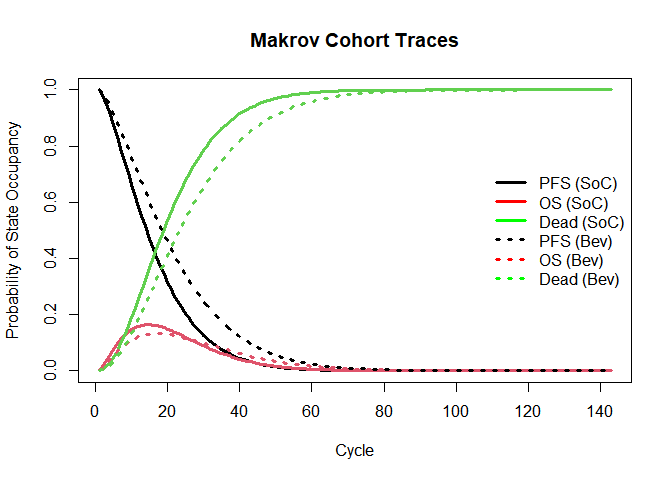<!-- -->

```r
#ggsave("Markov_Cohort_Traces.png", width = 4, height = 4, dpi=300)
#while (!is.null(dev.list()))  dev.off()
# png(paste("Markov_Cohort_Traces", ".png"))
# dev.off()

# plot a vertical line that helps identifying at which cycle the prevalence of OS is highest
#abline(v = which.max(m_M_SoC[, "OS"]), col = "gray")
#abline(v = which.max(m_M_Exp[, "OS"]), col = "black")
# The vertical line shows you when your progressed (OS) population is the greatest that it will ever be, but it can be changed from which.max to other things (so it is finding which cycle the proportion progressed is the highest and putting a vertical line there).
# (It's probably not necessary for my own analysis and I can comment these two lines out if I'm not going to use it).

# So, you can see in the graph everyone starts in the PFS state, but that this falls over time as people progress and leave this state, then you see OS start to peak up but then fall again as people leave this state to go into the dead state, which is an absorbing state and by the end will include everyone.
```


```r
#06.2 Overall Survival (OS)

# Although in the context of my analysis this would be PFS + OS because it is drawn from the DARTH model where healthy and sick make up OS, while dead means not OS (obviously).

# v_os <- 1 - m_M_SoC[, "Dead"]    # calculate the overall survival (OS) probability
# v_os <- rowSums(m_M_SoC[, 1:2])  # alternative way of calculating the OS probability

# I could do my own version of this and chose just to look at pfs, rather than column 1 and 2 to look at anyone not dead.

# i.e. v_os <- (m_M_SoC[, 1])

# best practice would be to rename v_os if I am looking at something that isnt os, i.e. v_pfs and to of course update the table legend, bearing in mind that yet again this is all for standard of care, and that if I wanted to know this for exp treatment I would need to replace the Markov model matrix above.


# plot(v_os, type = 'l', 
#     ylim = c(0, 1),
#     ylab = "Survival probability",
#     xlab = "Cycle",
#     main = "Overall Survival")  # create a simple plot showing the OS

# add grid 
# grid(nx = n_cycles, ny = 10, col = "lightgray", lty = "dotted", lwd = par("lwd"), 
#     equilogs = TRUE) 

# Calculating and plotting overal survival (OS)
v_OS_SoC <- 1 - m_M_SoC[, "Dead"]
v_OS_Exp <- 1 - m_M_Exp[, "Dead"]

plot(v_OS_SoC, 
     type = "l",
     ylim = c(0, 1),
     ylab = "Survival probability",
     xlab = "Cycle",
     main = "Overall Survival",
     lwd  = 3) # create a simple plot showing the OS
lines(v_OS_Exp,
      lty = 3,
      lwd = 3)
legend("right",
       legend = c("SoC", "Exp"),
       lty    = c(1, 3),
       lwd    = 3,
       bty    = "n")

# add grid - completely optional, see if it looks nicer to leave this code in or output:
grid(nx = n_cycle, ny = 10, col = "lightgray", lty = "dotted", lwd = par("lwd"), 
     equilogs = TRUE) 
```

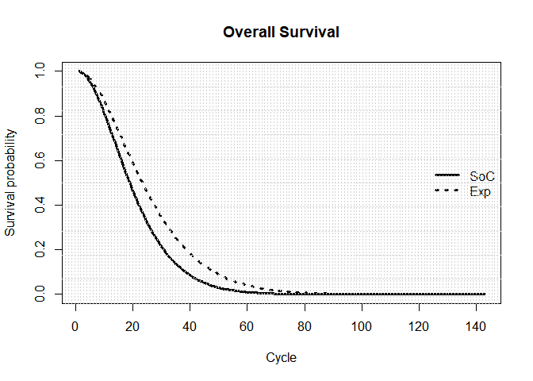<!-- -->

```r
# I don't end up using this, because I feel plotting the cohort trace is more descriptive, with PFS, OS and D included in it, but there still are some interesting things you could do with this in the future:

# Per C:\Users\Jonathan\OneDrive - Royal College of Surgeons in Ireland\COLOSSUS\Training Resources\Cost-Effectiveness and Decision Modeling using R Workshop \_ DARTH\August\_25\Live Session 

# Often you have a survival curve as input to your model [I guess from a published study], and having that survival curve you need to parameterise your model so that you match that survival curve, and that would be a process of, potentially of calibration, if you can't use the parameters directly in your model.

# So, you could produce your survival curve and compare it to curves from trials, etc., to calibrate your model.

# For calibration purposes, you want to make sure that your model is outputting something that's comparable to the publications out there on actual data on the same type of patients.

# Part of being comparable to the real world is that if there is a censoring process in actual patient data, then you could incorporate this process into the model to reflect that in your model and to ensure that your own model is comparable to the existing models which may be losing people due to censoring, etc., and which you'll then need to incorporate into your model to be comparable. 

# Another interesting thing you can do is, plot this to ask is that reasonable, does that make sense that this many people are alive after this amount of time? Is the OS what I would expect it to be?
```


```r
#06.2.1 Life Expectancy (LE)

v_le <- sum(v_OS_SoC)  # summing probability of OS over time  (i.e. life expectancy)

# Basically we are summing all the alive states over time through over all the cycles, so 

# v_os <- rowSums(m_M_SoC[, 1:2])

# Is basically the PFS and OS added together.

# Also bear in mind that this is life expectancy under standard of care, and not under the new treatments, per: # v_os <- rowSums(m_M_SoC[, 1:2]) above.

v_le
```

```
## [1] 20.70332
```

```r
v_le_exp <- sum(v_OS_Exp)  # summing probability of OS over time  (i.e. life expectancy)

v_le_exp
```

```
## [1] 25.94259
```

```r
# So, if this gives a value of [1] 20.70332, that is [1] 20.70332 cycles, where in the context of our model, cycles are fortnights, so the life expectancy for our population of patients is 20.70332 fortnights or 289.84648, in days:

daily_v_le <- v_le * 14
daily_v_le
```

```
## [1] 289.8465
```

```r
daily_v_le_exp <- v_le_exp * 14
daily_v_le_exp
```

```
## [1] 363.1962
```

```r
# When I calculate LE I calculate it in cycles. Note that my code gives a LE of 20.7 cycles for the SoC group which is approx. 290 days or 0.8 years.  Caculating the LE for the Exp group I calculated the corresponding figures as: 25.9 cycles = 363 days = 1 year (approx.). So a LE gain of about 0.2 life-years.


life_years_days_gained <- round(daily_v_le_exp - daily_v_le, digits=0)
# The number of days gained.

life_years_soc <- round(daily_v_le/365, digits=2)
# The proportion of a year you get under each treatment

life_years_exp <- round(daily_v_le_exp/365, digits=2)
# The proportion of a year you get under each treatment


# Discounted life expectancy:

# If you wanted discounted life expectancy, if you were using life years and you wanted them discounted for your health economic outcomes, you could apply the discount rates - the discount factors - to the vector for overall survival [v_os] and then take it's sum [add it up] as above to get life expectancy that is discounted.

# As per: C:\Users\Jonathan\OneDrive - Royal College of Surgeons in Ireland\COLOSSUS\Training Resources\Cost-Effectiveness and Decision Modeling using R Workshop _ DARTH\August_25\Live Session 
```


```r
#06.3 Disease prevalence
# Disease prevalence is the proportion who are sick divided by the proportion who are alive, so it's necessary to account for the fact that some of the cohort have died, so you only calculate prevalence among people who are alive,in the diagram you can see it plateauing over time, even though the number of people in the OS (or "progressed") state have gone up and come down over time and this is because this is prevalence as a proportion of those who are alive, and there are few people who are still alive by cycle 60.

# Probably looks a bit funny dividing OS by v_os below, but it's necessary to remember that v_os is PFS + OS, because it's anyone who is not dead.

# So, I guess in our context you can think of this as progression prevalence (i.e. being in second line treatment) over time.

# I ultimately dont end up using this in my analysis:

v_prev <- m_M_SoC[, "OS"]/v_OS_SoC
plot(v_prev,
     ylim = c(0, 1),
     ylab = "Prevalence",
     xlab = "Cycle",
     main = "Disease prevalence")
```

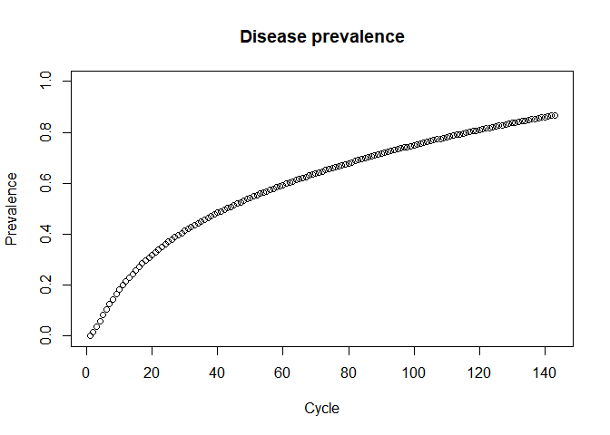<!-- -->


```r
#07 Compute Cost-Effectiveness Outcomes

#07.1 Including ADVERSE EVENTS in Mean Costs and QALYs for each strategy

# Calculate the costs and QALYs per cycle by multiplying m_M (the Markov trace) with the cost/utility vectors for the different states

# per cycle
# calculate expected costs by multiplying cohort trace with the cost vector for the different health states

# Basically, you take the cohort trace over time for each strategy [m_M_SoC] and multiply this by a vector of our costs for each state: [c(c_H, c_S, c_D)] -> So, basically the number of people in each state at each cycle multiplied by the cost of being in that state [cost of healthy, cost of sick and cost of dead] for each strategy that we look at (standard of care, experimental).

# Bear in mind we are doing matrix multiplication [%*%], because what this does is for each cycle [row in the matrix], take the vector of costs, and multiply it by the distribution in that cycle [breakdown of proportions in the states in that row] and add it all together, to get the total costs for that cycle [row]. This gives us a vector of the costs accrued in this cohort of individuals ending up in these different states for each cycle on a per person basis, because it's a cohort distribution (it always sums to 1).

# So, in cycle 1 everyone is in the PFS state, so they only incur the PFS cost, as more and more time passes and more and more people get sick, the costs increases due to more people being in the OS state, but over time this falls again as more and more people go into the dead state, which has no costs as we don't treat corpses.
  

# 1. Probability of adverse events 1,2 3 in the PFS state under standard of care and exp care:

# AE1:Leukopenia = 0.040 AE2:Diarrhea = 0.310 AE3:Vomiting = 0.31
# 
# p_FA1_STD     <- 0.040   # probability of 7 days of adverse event 1 in the 14 day treatment cycle period when progression-free under SOC 
# p_FNOTA1_STD <- 1 - p_FA1_STD # probability that patients will not have 7 days of adverse event 1 in the 14 day treatment cycle period when progression-free under SOC 
# 
# p_FA2_STD     <- 0.310   # probability of adverse event 2 when progression-free under SOC
# p_FA3_STD     <- 0.310   # probability of adverse event 3 when progression-free under SOC
# 
# p_FA1_EXPR     <- 0.070   # probability of adverse event 1 when progression-free under EXPR
# p_FA2_EXPR     <- 0.110   # probability of adverse event 2 when progression-free under EXPR
# p_FA3_EXPR     <- 0.070   # probability of adverse event 3 when progression-free under EXPR

p_FA1_STD     <- 0.040 # Probability of the adverse event 1 occuring when progression-free under SOC.
p_FA2_STD     <- 0.310 # Probability of the adverse event 2 occuring when progression-free under SOC.
p_FA3_STD     <- 0.310 # Probability of the adverse event 3 occuring when progression-free under SOC.

p_FA1_EXPR     <- 0.070   # probability of adverse event 1 when progression-free under EXPR
p_FA2_EXPR     <- 0.110   # probability of adverse event 2 when progression-free under EXPR
p_FA3_EXPR     <- 0.070   # probability of adverse event 3 when progression-free under EXPR


# 2. Cost of treating the AE conditional on it occurring
c_AE1 <- c_AE1
c_AE2 <- c_AE2
c_AE3 <- c_AE3 
#3. Disutiltiy of AE (negative qol impact x duration of event)

# AE1_DisUtil <-0.45
# AE2_DisUtil <-0.19
# AE3_DisUtil <-0.36


AE1_DisUtil <-0.45 # The percentage disutility of the adverse event.
AE2_DisUtil <-0.19 # The percentage disutility of the adverse event.
AE3_DisUtil <-0.36 # The percentage disutility of the adverse event.


# According to the original study these percentage reductions come from:
 
# "We also applied utility reductions for episodes of toxicity" Aballéa, Samuel, et al. "Cost‐effectiveness analysis of oxaliplatin compared with 5‐fluorouracil/leucovorin in adjuvant treatment of stage III colon cancer in the US." Cancer: Interdisciplinary International Journal of the American Cancer Society 109.6 (2007): 1082-1089.   https://acsjournals.onlinelibrary.wiley.com/doi/10.1002/cncr.22512

# In that study events were 5 days, so we can say that these are the decreases in utility for 5 days of these adverse events.

# THE BELOW WOULD WORK IF THE ORIGINAL STUDY REPORTED DECREASES FOR 14 DAYS AND WE WANTED TO APPLY THEM TO 7 DAYS, BUT THE ORIGINAL STUDY REPORTS THE DECREASE FOR 5 DAYS OF TOXICITY AND THUS THIS IS TOO FAR IN TERMS OF CALCULATIONS:


# 
# #daily_utility <- u_F/14
# 
# daily_discount_AE_1 <- AE1_DisUtil/14 # I break that disutility into a daily utility so I can apply it just for a portion of my cycle, as the adverse events only last for 7 days.
# daily_discount_AE_2  <- AE2_DisUtil/14 
# daily_discount_AE_3  <- AE3_DisUtil/14 
# 
# 
# AE1_discounted_daily_utility <- daily_discount_AE_1  * 5  # Creating 5 days of the disutility from 1 day because the adverse event lasts for 5 days each time they occur in a 14 day cycle.
# AE2_discounted_daily_utility <- daily_discount_AE_2  * 5
# AE3_discounted_daily_utility <- daily_discount_AE_3  * 5 
# 
# # # ignore this, I now take a different approach: By multiplying by (1-the percent), we are discounting by that percentage.
# # That is, say you wanted to take 10% of 10 -> 10*(1-0.10) = 10*(0.90) = 9, discounting 10 by 10% gives you 9, i.e., 10% of 10 euro is 9 euro.
# 
# # u_AE1 <- (AE1_discounted_daily_utility*7) + (daily_utility*7)
# # u_AE2 <- (AE2_discounted_daily_utility*7) + (daily_utility*7)
# # u_AE3 <- (AE3_discounted_daily_utility*7) + (daily_utility*7)
# 
# # Above I had also included 7 days of normal utility when generating the u_AE's - now I realise that was wrong and have consequently updated the below.
# 
# 
# u_AE1 <- AE1_discounted_daily_utility*u_F # I find the proportion of the baseline utility (that is, the utility without beofre an adverse event) that the adverse event would remove if it occured, that is, a 1o percentage disutility of an adverse event would decrease a utility of 0.85 by 0.085. 
# u_AE2 <- AE2_discounted_daily_utility*u_F
# u_AE3 <- AE3_discounted_daily_utility*u_F
# 
# u_AE1
# u_AE2
# u_AE3
# 
# # I then adjust my state costs and utilities:
# 
# # uState<-uState-pAE1*duAE1
# 
# 
# u_F_SoC<-u_F
# u_F_Exp<-u_F
# 
# u_F_SoC<-u_F-p_FA1_STD*u_AE1 - p_FA2_STD*u_AE2 - p_FA3_STD*u_AE3 # Then I take this decrement from baseline utility - dependent on the probability of this decrement occuring.
# 
# u_F_Exp<-u_F-p_FA1_EXPR*u_AE1 - p_FA2_EXPR*u_AE2 - p_FA3_EXPR*u_AE3


# To show how this works, 
# I set the probability of the adverse events occuring to 100% (that is, to 1) so that it definitely occurs:
#p_FA1_STD     <- 1 
#p_FA2_STD     <- 1 
#p_FA3_STD     <- 1 

# Then, I set the percentage that is taken away from utility by the adverse event to be 10%:
#AE1_DisUtil <-0.10 # 
#AE2_DisUtil <-0.10 # 
#AE3_DisUtil <-0.10 # 

# I do the below as usual:

#daily_discount_AE_1 <- AE1_DisUtil/14
#daily_discount_AE_2  <- AE2_DisUtil/14
#daily_discount_AE_3  <- AE3_DisUtil/14

#AE1_discounted_daily_utility <- daily_discount_AE_1  * 7 
#AE2_discounted_daily_utility <- daily_discount_AE_2  * 7
#AE3_discounted_daily_utility <- daily_discount_AE_3  * 7 

#u_AE1 <- AE1_discounted_daily_utility*u_F 
#u_AE2 <- AE2_discounted_daily_utility*u_F
#u_AE3 <- AE3_discounted_daily_utility*u_F

# You can see that each time it's 7 days of 10% out of the 14, so 5% of the 0.85 we started with, which is:

#u_AE1
#[1] 0.0425
#u_AE2
#[1] 0.0425
#u_AE3
#[1] 0.0425

#u_F
#[1] 0.85
#u_F_SoC<-u_F-p_FA1_STD*u_AE1 - p_FA2_STD*u_AE2 - p_FA3_STD*u_AE3 # Then I take this decrement from baseline utility - dependent on the probability of this decrement occuring.

#u_F_SoC
#[1] 0.7225

# This indicates that it's half of 10% taken off u_F 3 times to get 15% off, 15% off 0.85 = 0.7225.


# Instead it's as simple as the below:

u_AE1 <- AE1_DisUtil*u_F # I find the proportion of the baseline utility (that is, the utility without beofre an adverse event) that the adverse event would remove if it occured, that is, a 1o percentage disutility of an adverse event would decrease a utility of 0.85 by 0.085. 
u_AE2 <- AE2_DisUtil*u_F
u_AE3 <- AE3_DisUtil*u_F

u_AE1
```

```
## [1] 0.3825
```

```r
u_AE2
```

```
## [1] 0.1615
```

```r
u_AE3
```

```
## [1] 0.306
```

```r
# I then adjust my state utilities:

# uState<-uState-pAE1*duAE1


u_F_SoC<-u_F
u_F_Exp<-u_F

u_F_SoC<-u_F-p_FA1_STD*u_AE1 - p_FA2_STD*u_AE2 - p_FA3_STD*u_AE3 # Then I take this decrement from baseline utility, dependent on the probability of this decrement occuring.

u_F_Exp<-u_F-p_FA1_EXPR*u_AE1 - p_FA2_EXPR*u_AE2 - p_FA3_EXPR*u_AE3


c_F_SoC<-c_F_SoC +p_FA1_STD*c_AE1 +p_FA2_STD*c_AE2 +p_FA3_STD*c_AE3
c_F_Exp<-c_F_Exp +p_FA1_EXPR*c_AE1 +p_FA2_EXPR*c_AE2 +p_FA3_EXPR*c_AE3


# I get it, the cost is the cost of treatment (say c_F_SoC), and then we have some probability "p" of adding on to this cost with how much it might cost to have nausea, vomiting or diarrhoea, so we have the chance to increase this cost by the cost of these adverse events. 

# So for utility, the utility is the utility of the health state (say U_F_SoC), and then we have some probability "p" of taking away from this utility by how much it might decrease utility to have nausea, vomiting or diarrhoea, for the time that we have those things - so we have the chance to decrease this utility by the disutility of these adverse events.


# They have a probability of "X" of experiencing 7 days of decline in their utility, which will take their 14 days of utility "y" down by some value "z".


# So, their 14 days of utility are 0.85, they have a probabulity of p_FA1_STD of experiencing a decrease in this utility of 0.45.


v_tc_SoC <- m_M_SoC %*% c(c_F_SoC, c_P, c_D)
v_tc_Exp <- m_M_Exp %*% c(c_F_Exp, c_P, c_D)

v_tc_SoC
```

```
##                   [,1]
## Cycle 1   9.826589e+02
## Cycle 2   9.702276e+02
## Cycle 3   9.497062e+02
## Cycle 4   9.241828e+02
## Cycle 5   8.949222e+02
## Cycle 6   8.628159e+02
## Cycle 7   8.285810e+02
## Cycle 8   7.928233e+02
## Cycle 9   7.560635e+02
## Cycle 10  7.187518e+02
## Cycle 11  6.812766e+02
## Cycle 12  6.439708e+02
## Cycle 13  6.071178e+02
## Cycle 14  5.709557e+02
## Cycle 15  5.356821e+02
## Cycle 16  5.014580e+02
## Cycle 17  4.684117e+02
## Cycle 18  4.366421e+02
## Cycle 19  4.062226e+02
## Cycle 20  3.772035e+02
## Cycle 21  3.496156e+02
## Cycle 22  3.234721e+02
## Cycle 23  2.987720e+02
## Cycle 24  2.755011e+02
## Cycle 25  2.536353e+02
## Cycle 26  2.331415e+02
## Cycle 27  2.139794e+02
## Cycle 28  1.961035e+02
## Cycle 29  1.794636e+02
## Cycle 30  1.640065e+02
## Cycle 31  1.496767e+02
## Cycle 32  1.364176e+02
## Cycle 33  1.241717e+02
## Cycle 34  1.128818e+02
## Cycle 35  1.024910e+02
## Cycle 36  9.294376e+01
## Cycle 37  8.418558e+01
## Cycle 38  7.616381e+01
## Cycle 39  6.882766e+01
## Cycle 40  6.212838e+01
## Cycle 41  5.601945e+01
## Cycle 42  5.045660e+01
## Cycle 43  4.539790e+01
## Cycle 44  4.080375e+01
## Cycle 45  3.663689e+01
## Cycle 46  3.286235e+01
## Cycle 47  2.944742e+01
## Cycle 48  2.636156e+01
## Cycle 49  2.357636e+01
## Cycle 50  2.106545e+01
## Cycle 51  1.880438e+01
## Cycle 52  1.677055e+01
## Cycle 53  1.494313e+01
## Cycle 54  1.330293e+01
## Cycle 55  1.183231e+01
## Cycle 56  1.051512e+01
## Cycle 57  9.336531e+00
## Cycle 58  8.283024e+00
## Cycle 59  7.342245e+00
## Cycle 60  6.502946e+00
## Cycle 61  5.754892e+00
## Cycle 62  5.088788e+00
## Cycle 63  4.496204e+00
## Cycle 64  3.969504e+00
## Cycle 65  3.501782e+00
## Cycle 66  3.086801e+00
## Cycle 67  2.718933e+00
## Cycle 68  2.393110e+00
## Cycle 69  2.104771e+00
## Cycle 70  1.849816e+00
## Cycle 71  1.624565e+00
## Cycle 72  1.425721e+00
## Cycle 73  1.250327e+00
## Cycle 74  1.095741e+00
## Cycle 75  9.596012e-01
## Cycle 76  8.397989e-01
## Cycle 77  7.344539e-01
## Cycle 78  6.418915e-01
## Cycle 79  5.606213e-01
## Cycle 80  4.893182e-01
## Cycle 81  4.268053e-01
## Cycle 82  3.720385e-01
## Cycle 83  3.240919e-01
## Cycle 84  2.821459e-01
## Cycle 85  2.454749e-01
## Cycle 86  2.134376e-01
## Cycle 87  1.854676e-01
## Cycle 88  1.610649e-01
## Cycle 89  1.397886e-01
## Cycle 90  1.212506e-01
## Cycle 91  1.051088e-01
## Cycle 92  9.106258e-02
## Cycle 93  7.884770e-02
## Cycle 94  6.823210e-02
## Cycle 95  5.901213e-02
## Cycle 96  5.100927e-02
## Cycle 97  4.406709e-02
## Cycle 98  3.804868e-02
## Cycle 99  3.283422e-02
## Cycle 100 2.831902e-02
## Cycle 101 2.441159e-02
## Cycle 102 2.103210e-02
## Cycle 103 1.811090e-02
## Cycle 104 1.558727e-02
## Cycle 105 1.340835e-02
## Cycle 106 1.152810e-02
## Cycle 107 9.906476e-03
## Cycle 108 8.508674e-03
## Cycle 109 7.304455e-03
## Cycle 110 6.267568e-03
## Cycle 111 5.375236e-03
## Cycle 112 4.607710e-03
## Cycle 113 3.947881e-03
## Cycle 114 3.380929e-03
## Cycle 115 2.894031e-03
## Cycle 116 2.476095e-03
## Cycle 117 2.117533e-03
## Cycle 118 1.810064e-03
## Cycle 119 1.546537e-03
## Cycle 120 1.320783e-03
## Cycle 121 1.127480e-03
## Cycle 122 9.620430e-04
## Cycle 123 8.205219e-04
## Cycle 124 6.995163e-04
## Cycle 125 5.961001e-04
## Cycle 126 5.077573e-04
## Cycle 127 4.323250e-04
## Cycle 128 3.679457e-04
## Cycle 129 3.130243e-04
## Cycle 130 2.661920e-04
## Cycle 131 2.262749e-04
## Cycle 132 1.922667e-04
## Cycle 133 1.633050e-04
## Cycle 134 1.386516e-04
## Cycle 135 1.176742e-04
## Cycle 136 9.983233e-05
## Cycle 137 8.466344e-05
## Cycle 138 7.177236e-05
## Cycle 139 6.082146e-05
## Cycle 140 5.152245e-05
## Cycle 141 4.362926e-05
## Cycle 142 3.693198e-05
## Cycle 143 3.125162e-05
```

```r
v_tc_Exp
```

```
##                   [,1]
## Cycle 1   2.330828e+03
## Cycle 2   2.304758e+03
## Cycle 3   2.262846e+03
## Cycle 4   2.211992e+03
## Cycle 5   2.154741e+03
## Cycle 6   2.092703e+03
## Cycle 7   2.027071e+03
## Cycle 8   1.958792e+03
## Cycle 9   1.888653e+03
## Cycle 10  1.817314e+03
## Cycle 11  1.745343e+03
## Cycle 12  1.673226e+03
## Cycle 13  1.601380e+03
## Cycle 14  1.530165e+03
## Cycle 15  1.459890e+03
## Cycle 16  1.390817e+03
## Cycle 17  1.323167e+03
## Cycle 18  1.257125e+03
## Cycle 19  1.192845e+03
## Cycle 20  1.130449e+03
## Cycle 21  1.070036e+03
## Cycle 22  1.011680e+03
## Cycle 23  9.554348e+02
## Cycle 24  9.013359e+02
## Cycle 25  8.494025e+02
## Cycle 26  7.996398e+02
## Cycle 27  7.520401e+02
## Cycle 28  7.065850e+02
## Cycle 29  6.632465e+02
## Cycle 30  6.219888e+02
## Cycle 31  5.827687e+02
## Cycle 32  5.455376e+02
## Cycle 33  5.102419e+02
## Cycle 34  4.768242e+02
## Cycle 35  4.452241e+02
## Cycle 36  4.153786e+02
## Cycle 37  3.872232e+02
## Cycle 38  3.606922e+02
## Cycle 39  3.357193e+02
## Cycle 40  3.122380e+02
## Cycle 41  2.901822e+02
## Cycle 42  2.694863e+02
## Cycle 43  2.500854e+02
## Cycle 44  2.319160e+02
## Cycle 45  2.149159e+02
## Cycle 46  1.990243e+02
## Cycle 47  1.841824e+02
## Cycle 48  1.703329e+02
## Cycle 49  1.574205e+02
## Cycle 50  1.453919e+02
## Cycle 51  1.341960e+02
## Cycle 52  1.237833e+02
## Cycle 53  1.141069e+02
## Cycle 54  1.051217e+02
## Cycle 55  9.678471e+01
## Cycle 56  8.905494e+01
## Cycle 57  8.189347e+01
## Cycle 58  7.526336e+01
## Cycle 59  6.912958e+01
## Cycle 60  6.345895e+01
## Cycle 61  5.822016e+01
## Cycle 62  5.338363e+01
## Cycle 63  4.892146e+01
## Cycle 64  4.480743e+01
## Cycle 65  4.101686e+01
## Cycle 66  3.752656e+01
## Cycle 67  3.431481e+01
## Cycle 68  3.136122e+01
## Cycle 69  2.864675e+01
## Cycle 70  2.615355e+01
## Cycle 71  2.386498e+01
## Cycle 72  2.176551e+01
## Cycle 73  1.984064e+01
## Cycle 74  1.807689e+01
## Cycle 75  1.646170e+01
## Cycle 76  1.498341e+01
## Cycle 77  1.363118e+01
## Cycle 78  1.239495e+01
## Cycle 79  1.126540e+01
## Cycle 80  1.023388e+01
## Cycle 81  9.292394e+00
## Cycle 82  8.433549e+00
## Cycle 83  7.650505e+00
## Cycle 84  6.936948e+00
## Cycle 85  6.287049e+00
## Cycle 86  5.695434e+00
## Cycle 87  5.157153e+00
## Cycle 88  4.667644e+00
## Cycle 89  4.222712e+00
## Cycle 90  3.818498e+00
## Cycle 91  3.451458e+00
## Cycle 92  3.118334e+00
## Cycle 93  2.816140e+00
## Cycle 94  2.542135e+00
## Cycle 95  2.293809e+00
## Cycle 96  2.068860e+00
## Cycle 97  1.865183e+00
## Cycle 98  1.680853e+00
## Cycle 99  1.514109e+00
## Cycle 100 1.363341e+00
## Cycle 101 1.227082e+00
## Cycle 102 1.103989e+00
## Cycle 103 9.928413e-01
## Cycle 104 8.925233e-01
## Cycle 105 8.020199e-01
## Cycle 106 7.204065e-01
## Cycle 107 6.468418e-01
## Cycle 108 5.805606e-01
## Cycle 109 5.208672e-01
## Cycle 110 4.671297e-01
## Cycle 111 4.187743e-01
## Cycle 112 3.752802e-01
## Cycle 113 3.361748e-01
## Cycle 114 3.010299e-01
## Cycle 115 2.694573e-01
## Cycle 116 2.411055e-01
## Cycle 117 2.156562e-01
## Cycle 118 1.928215e-01
## Cycle 119 1.723409e-01
## Cycle 120 1.539791e-01
## Cycle 121 1.375233e-01
## Cycle 122 1.227815e-01
## Cycle 123 1.095803e-01
## Cycle 124 9.776333e-02
## Cycle 125 8.718945e-02
## Cycle 126 7.773155e-02
## Cycle 127 6.927505e-02
## Cycle 128 6.171680e-02
## Cycle 129 5.496392e-02
## Cycle 130 4.893285e-02
## Cycle 131 4.354845e-02
## Cycle 132 3.874314e-02
## Cycle 133 3.445623e-02
## Cycle 134 3.063320e-02
## Cycle 135 2.722507e-02
## Cycle 136 2.418793e-02
## Cycle 137 2.148237e-02
## Cycle 138 1.907304e-02
## Cycle 139 1.692827e-02
## Cycle 140 1.501970e-02
## Cycle 141 1.332190e-02
## Cycle 142 1.181213e-02
## Cycle 143 1.047004e-02
```

```r
# The below is how I would probably add a once off treatment cost in if I had to:

# v_tc_SoC  <- m_M_SoC  %*% c(c_H, c_S, c_D)  
# v_tc_trtA <- m_M_trtA %*% c(c_H + c_trtA, c_S, c_D)  
# v_tc_trtB <- m_M_trtB %*% c(c_H + c_trtB, c_S, c_D)


# calculate expected QALYs by multiplying cohort trace with the utilities for the different health states 

# The vector of utilities is basically built in the exact same way as the vector of costs above:

# v_tu_SoC  <- m_M_SoC  %*% c(u_H, u_S, u_D)  


# The file I am mirroring has the following qoute:

# "

# - note that to obtain QALYs, the utility needs to be mutiplied by the cycle length as well


# v_tu_SoC <- m_M_SoC %*% c(u_F, u_P, u_D) * t_cycle
# v_tu_Exp <- m_M_Exp %*% c(u_F, u_P, u_D) * t_cycle

# To get the QALY's we not only need to multiply the state occupancy with the utilities, but also with the duration of the time cycle, because QALY's are 2-dimensional in that they combine the duration of time and the health utility.

# "

# Maybe that's because the utility originally came from a year in the disease state, and we want it to reflect the proportion of a year that is our cycle length?

# So in the example t_cycle <- 1/4 # cycle length of 3 months (in years) - so maybe their utility originally came from a years utility and they wanted to decrease it to 3 months, aka the cycle lengths, utility.

# If that was the case it would be:

# A year of utility in this state is 0.75, so 3 months should be a quarter of this, should be 0.25 of this. So, t_cycle (0.25) * u_F (0.75) = 0.1875 i.e. your utility for 3 months if u_F is your utility for 12 months.

# v_tu_SoC <- m_M_SoC %*% c(u_F, u_P, u_D) * t_cycle

# I did the maths on his approach, and without *t_cycle the first cycle of each utility value is 0.8, but after *t_cycle it is 0.2, i.e. a quarter of what it was before. Which is why I think again that he is just making the yearly utility lower to match the 3 monthly cycles, i.e. quartering a yearly utility. A quarter of utility for a quarter of a year.

# So, I think he's just trying to generate the QALYs per cycle in both states.

# And slide 25 of C:\Users\Jonathan\OneDrive - Royal College of Surgeons in Ireland\COLOSSUS\Training Resources\Health Economic Modeling in R A Hands-on Introduction\Health-Eco\Markov models kind of proves that.

# In it they say: cycles are 6 months.

# Their R code in: 

# C:\Users\Jonathan\OneDrive - Royal College of Surgeons in Ireland\COLOSSUS\Training Resources\Health Economic Modeling in R A Hands-on Introduction\Health-Eco\Markov models\markov_smoking_deterministic.R

# Says:

# Now define the QALYS associated with the states per cycle

# QALY associated with 1 - year in the smoking state is Normal(mean = 0.95,  SD = 0.01)
# Divide by 2 as cycle length is 6 months
# state_qalys["Smoking"] <-  0.95 / 2 [I know they divide by 2 but we could have also multiplied by a half, i.e. *0.05].

# QALY associated with 1 - year in the not smoking state is 1 (no uncertainty)
# So all PSA samples have the same value
# Again divide by 2 as cycle length is 6 months
# state_qalys["Not smoking"] <-  1.0 / 2

# I like their approach, they define utility at the start, then they can do the following:

		# Now use the cohort vectors to calculate the 
		# total QALYs for each cycle
		# cycle_qalys[i_treatment, ] <-  cohort_vectors[i_treatment, , ] %*% state_qalys[]

# i.e., take the cohort (or Markov trace) for each of the treatment options and multiply it by the state qalys.

# So, I could take where he says: "QALY's are 2-dimensional in that they combine the duration of time and the health utility." as saying "we need to give the patient a utility for this health state that matches how long they were in this health state, i.e., if the utility of one year in this state is x and we know the patient was in this health state for 2 weeks, then we need to give them 2 weeks of x as their utility."

# I asked new Bing:

# Can you explain this piece of health economic R code for me: total_qalys[i_treatment] <- cycle_qalys[i_treatment, ] %*% (1 / 1.035)^rep(c(0:(n_cycles / 2 - 1)), each = 2)

# Sure, I’ll try to explain the code as best as I can. The code is part of a health economic R package that is used to perform cost-effectiveness analysis or other types of health economic evaluation123. The code is calculating the total quality-adjusted life years (QALYs) for a treatment group over a number of cycles. Here is a breakdown of the code:
 
# total_qalys[i_treatment] is a vector that stores the total QALYs for each treatment group. i_treatment is an index that indicates which treatment group is being calculated.

# <- is an assignment operator that assigns the value on the right to the variable on the left.

# cycle_qalys[i_treatment, ] is a matrix that stores the QALYs for each treatment group and each cycle. The first dimension is the treatment group and the second dimension is the cycle. The code is selecting the row that corresponds to the treatment group indicated by i_treatment.

# %*% is a matrix multiplication operator that multiplies two matrices or vectors together. The code is multiplying the vector of QALYs for each cycle by another vector that represents the discount factor.

# (1 / 1.035)^rep(c(0:(n_cycles / 2 - 1)), each = 2) is a vector that represents the discount factor for each cycle. The discount factor is calculated as (1 / 1.035) raised to the power of the cycle number. The code is using rep() to repeat a sequence of numbers twice, because each cycle consists of two half-cycles. The sequence of numbers is generated by c(0:(n_cycles / 2 - 1)), which creates a vector from 0 to one less than half of the total number of cycles.

# The result of this code is a vector of total QALYs for each treatment group, discounted by 3.5% per year.

# Which support the notion of adjusting the utility to be for a year rather than for a cycle.


# Andrew calculated QALYs as: 
#
# QALYs.SP0 <- trace.SP0%*%state.utilities
# QALYs.SP0
# 
# undisc.QALYs.SP0 <- colSums(QALYs.SP0)
# undisc.QALYs.SP0

# However, he described the values that he started off with as:

# The quality of life utilities of a year spent in each of the model health states has been
# estimated to be 0.85, 0.3 and 0.75 for the Successful primary, Revision, and Successful revision health states respectively.

# and said the cycle length is one year, so maybe that's why he doesnt need to multiply by the time passed, because his utilities are for a year spent in this state, whereas when we start our utilies may not necessarily match.

# So, what I think this means is that provided utilities are for the period of the cycle we can do the below, and if they are not for the period of the cycle then we can just convert them like in the smoking file above and then apply them as though they are for the period of the cycle:


v_tu_SoC <- m_M_SoC %*% c(u_F_SoC, u_P, u_D)
v_tu_Exp <- m_M_Exp %*% c(u_F_Exp, u_P, u_D)

v_tu_SoC
```

```
##                   [,1]
## Cycle 1   6.897750e-01
## Cycle 2   6.859395e-01
## Cycle 3   6.784338e-01
## Cycle 4   6.676509e-01
## Cycle 5   6.539006e-01
## Cycle 6   6.375346e-01
## Cycle 7   6.189256e-01
## Cycle 8   5.984482e-01
## Cycle 9   5.764657e-01
## Cycle 10  5.533210e-01
## Cycle 11  5.293322e-01
## Cycle 12  5.047889e-01
## Cycle 13  4.799516e-01
## Cycle 14  4.550513e-01
## Cycle 15  4.302901e-01
## Cycle 16  4.058430e-01
## Cycle 17  3.818586e-01
## Cycle 18  3.584619e-01
## Cycle 19  3.357555e-01
## Cycle 20  3.138217e-01
## Cycle 21  2.927250e-01
## Cycle 22  2.725131e-01
## Cycle 23  2.532195e-01
## Cycle 24  2.348650e-01
## Cycle 25  2.174591e-01
## Cycle 26  2.010019e-01
## Cycle 27  1.854851e-01
## Cycle 28  1.708938e-01
## Cycle 29  1.572069e-01
## Cycle 30  1.443992e-01
## Cycle 31  1.324411e-01
## Cycle 32  1.213005e-01
## Cycle 33  1.109431e-01
## Cycle 34  1.013329e-01
## Cycle 35  9.243298e-02
## Cycle 36  8.420603e-02
## Cycle 37  7.661463e-02
## Cycle 38  6.962167e-02
## Cycle 39  6.319062e-02
## Cycle 40  5.728581e-02
## Cycle 41  5.187260e-02
## Cycle 42  4.691755e-02
## Cycle 43  4.238851e-02
## Cycle 44  3.825477e-02
## Cycle 45  3.448706e-02
## Cycle 46  3.105761e-02
## Cycle 47  2.794018e-02
## Cycle 48  2.511002e-02
## Cycle 49  2.254389e-02
## Cycle 50  2.022003e-02
## Cycle 51  1.811808e-02
## Cycle 52  1.621911e-02
## Cycle 53  1.450549e-02
## Cycle 54  1.296087e-02
## Cycle 55  1.157014e-02
## Cycle 56  1.031931e-02
## Cycle 57  9.195529e-03
## Cycle 58  8.186937e-03
## Cycle 59  7.282663e-03
## Cycle 60  6.472737e-03
## Cycle 61  5.748037e-03
## Cycle 62  5.100229e-03
## Cycle 63  4.521713e-03
## Cycle 64  4.005566e-03
## Cycle 65  3.545494e-03
## Cycle 66  3.135782e-03
## Cycle 67  2.771247e-03
## Cycle 68  2.447197e-03
## Cycle 69  2.159388e-03
## Cycle 70  1.903990e-03
## Cycle 71  1.677546e-03
## Cycle 72  1.476943e-03
## Cycle 73  1.299379e-03
## Cycle 74  1.142338e-03
## Cycle 75  1.003560e-03
## Cycle 76  8.810187e-04
## Cycle 77  7.729005e-04
## Cycle 78  6.775819e-04
## Cycle 79  5.936124e-04
## Cycle 80  5.196968e-04
## Cycle 81  4.546804e-04
## Cycle 82  3.975340e-04
## Cycle 83  3.473420e-04
## Cycle 84  3.032900e-04
## Cycle 85  2.646547e-04
## Cycle 86  2.307939e-04
## Cycle 87  2.011385e-04
## Cycle 88  1.751841e-04
## Cycle 89  1.524845e-04
## Cycle 90  1.326450e-04
## Cycle 91  1.153167e-04
## Cycle 92  1.001920e-04
## Cycle 93  8.699917e-05
## Cycle 94  7.549901e-05
## Cycle 95  6.548078e-05
## Cycle 96  5.675906e-05
## Cycle 97  4.917085e-05
## Cycle 98  4.257294e-05
## Cycle 99  3.683964e-05
## Cycle 100 3.186068e-05
## Cycle 101 2.753943e-05
## Cycle 102 2.379125e-05
## Cycle 103 2.054207e-05
## Cycle 104 1.772711e-05
## Cycle 105 1.528975e-05
## Cycle 106 1.318057e-05
## Cycle 107 1.135640e-05
## Cycle 108 9.779637e-06
## Cycle 109 8.417474e-06
## Cycle 110 7.241359e-06
## Cycle 111 6.226438e-06
## Cycle 112 5.351092e-06
## Cycle 113 4.596533e-06
## Cycle 114 3.946439e-06
## Cycle 115 3.386645e-06
## Cycle 116 2.904857e-06
## Cycle 117 2.490422e-06
## Cycle 118 2.134105e-06
## Cycle 119 1.827912e-06
## Cycle 120 1.564924e-06
## Cycle 121 1.339158e-06
## Cycle 122 1.145440e-06
## Cycle 123 9.793031e-07
## Cycle 124 8.368887e-07
## Cycle 125 7.148681e-07
## Cycle 126 6.103705e-07
## Cycle 127 5.209217e-07
## Cycle 128 4.443900e-07
## Cycle 129 3.789404e-07
## Cycle 130 3.229936e-07
## Cycle 131 2.751917e-07
## Cycle 132 2.343671e-07
## Cycle 133 1.995168e-07
## Cycle 134 1.697798e-07
## Cycle 135 1.444167e-07
## Cycle 136 1.227936e-07
## Cycle 137 1.043668e-07
## Cycle 138 8.867058e-08
## Cycle 139 7.530579e-08
## Cycle 140 6.393090e-08
## Cycle 141 5.425358e-08
## Cycle 142 4.602385e-08
## Cycle 143 3.902796e-08
```

```r
v_tu_Exp
```

```
##                   [,1]
## Cycle 1   7.840400e-01
## Cycle 2   7.802861e-01
## Cycle 3   7.733337e-01
## Cycle 4   7.637257e-01
## Cycle 5   7.517443e-01
## Cycle 6   7.376563e-01
## Cycle 7   7.217253e-01
## Cycle 8   7.042086e-01
## Cycle 9   6.853531e-01
## Cycle 10  6.653925e-01
## Cycle 11  6.445449e-01
## Cycle 12  6.230118e-01
## Cycle 13  6.009778e-01
## Cycle 14  5.786106e-01
## Cycle 15  5.560615e-01
## Cycle 16  5.334659e-01
## Cycle 17  5.109441e-01
## Cycle 18  4.886024e-01
## Cycle 19  4.665338e-01
## Cycle 20  4.448188e-01
## Cycle 21  4.235266e-01
## Cycle 22  4.027162e-01
## Cycle 23  3.824367e-01
## Cycle 24  3.627285e-01
## Cycle 25  3.436243e-01
## Cycle 26  3.251493e-01
## Cycle 27  3.073225e-01
## Cycle 28  2.901570e-01
## Cycle 29  2.736609e-01
## Cycle 30  2.578374e-01
## Cycle 31  2.426859e-01
## Cycle 32  2.282023e-01
## Cycle 33  2.143792e-01
## Cycle 34  2.012067e-01
## Cycle 35  1.886726e-01
## Cycle 36  1.767626e-01
## Cycle 37  1.654609e-01
## Cycle 38  1.547505e-01
## Cycle 39  1.446132e-01
## Cycle 40  1.350298e-01
## Cycle 41  1.259807e-01
## Cycle 42  1.174459e-01
## Cycle 43  1.094050e-01
## Cycle 44  1.018375e-01
## Cycle 45  9.472294e-02
## Cycle 46  8.804096e-02
## Cycle 47  8.177146e-02
## Cycle 48  7.589461e-02
## Cycle 49  7.039100e-02
## Cycle 50  6.524163e-02
## Cycle 51  6.042802e-02
## Cycle 52  5.593221e-02
## Cycle 53  5.173682e-02
## Cycle 54  4.782505e-02
## Cycle 55  4.418073e-02
## Cycle 56  4.078832e-02
## Cycle 57  3.763289e-02
## Cycle 58  3.470017e-02
## Cycle 59  3.197653e-02
## Cycle 60  2.944894e-02
## Cycle 61  2.710503e-02
## Cycle 62  2.493303e-02
## Cycle 63  2.292175e-02
## Cycle 64  2.106062e-02
## Cycle 65  1.933961e-02
## Cycle 66  1.774926e-02
## Cycle 67  1.628064e-02
## Cycle 68  1.492531e-02
## Cycle 69  1.367536e-02
## Cycle 70  1.252334e-02
## Cycle 71  1.146225e-02
## Cycle 72  1.048552e-02
## Cycle 73  9.586992e-03
## Cycle 74  8.760921e-03
## Cycle 75  8.001916e-03
## Cycle 76  7.304948e-03
## Cycle 77  6.665324e-03
## Cycle 78  6.078665e-03
## Cycle 79  5.540896e-03
## Cycle 80  5.048221e-03
## Cycle 81  4.597114e-03
## Cycle 82  4.184296e-03
## Cycle 83  3.806726e-03
## Cycle 84  3.461581e-03
## Cycle 85  3.146246e-03
## Cycle 86  2.858302e-03
## Cycle 87  2.595506e-03
## Cycle 88  2.355788e-03
## Cycle 89  2.137234e-03
## Cycle 90  1.938078e-03
## Cycle 91  1.756691e-03
## Cycle 92  1.591569e-03
## Cycle 93  1.441329e-03
## Cycle 94  1.304698e-03
## Cycle 95  1.180504e-03
## Cycle 96  1.067669e-03
## Cycle 97  9.652029e-04
## Cycle 98  8.721981e-04
## Cycle 99  7.878207e-04
## Cycle 100 7.113062e-04
## Cycle 101 6.419541e-04
## Cycle 102 5.791229e-04
## Cycle 103 5.222255e-04
## Cycle 104 4.707249e-04
## Cycle 105 4.241303e-04
## Cycle 106 3.819930e-04
## Cycle 107 3.439036e-04
## Cycle 108 3.094883e-04
## Cycle 109 2.784064e-04
## Cycle 110 2.503472e-04
## Cycle 111 2.250275e-04
## Cycle 112 2.021897e-04
## Cycle 113 1.815992e-04
## Cycle 114 1.630428e-04
## Cycle 115 1.463264e-04
## Cycle 116 1.312739e-04
## Cycle 117 1.177252e-04
## Cycle 118 1.055351e-04
## Cycle 119 9.457187e-05
## Cycle 120 8.471596e-05
## Cycle 121 7.585910e-05
## Cycle 122 6.790320e-05
## Cycle 123 6.075944e-05
## Cycle 124 5.434745e-05
## Cycle 125 4.859451e-05
## Cycle 126 4.343491e-05
## Cycle 127 3.880923e-05
## Cycle 128 3.466382e-05
## Cycle 129 3.095022e-05
## Cycle 130 2.762473e-05
## Cycle 131 2.464790e-05
## Cycle 132 2.198418e-05
## Cycle 133 1.960153e-05
## Cycle 134 1.747107e-05
## Cycle 135 1.556681e-05
## Cycle 136 1.386537e-05
## Cycle 137 1.234570e-05
## Cycle 138 1.098886e-05
## Cycle 139 9.777850e-06
## Cycle 140 8.697381e-06
## Cycle 141 7.733725e-06
## Cycle 142 6.874558e-06
## Cycle 143 6.108820e-06
```

```r
# BUT, we need to remember that the above displays the amount of utilitie's gathered in each cycle.

sum(v_tu_SoC)
```

```
## [1] 14.09921
```

```r
sum(v_tu_Exp)
```

```
## [1] 19.71986
```

```r
# Particularly, these are quality adjusted cycles, these are quality adjusted life years where cycles are annual, so I need to consider what this means for utility where cycles are monthly, or fortnightly.

# When I calculate the QALYs above, I don’t convert these quality adjusted cycles to years. If I sum each of v_tu_SoC and v_tu_Exp I get 16.7 quality adjusted cycles in the SoC arm and 21.1 quality adjusted cycles in the Exp arm. I can convert these quality adjusted cycles to years for fortnights by working out how many fortnights there are in a year (26.0714) and then divide by this number. These correspond to 0.64 and 0.81 QALYs respectively so 0.17 QALYs gained.

v_tu_SoC <- v_tu_SoC/26.0714
v_tu_Exp <- v_tu_Exp/26.0714


#v_tc_SoC <- v_tc_SoC/26.0714
#v_tc_Exp <- v_tc_Exp/26.0714


# I'm just trying this to see what implications changing costs to a fortnight value has for ICERs. - I spoke to Eline and there is no need to do this.

# So, these are initially per-cycle utility values, but, our cycles aren't years, they are fortnights, so these are per fortnight values, if we want this value to reflect the per year value, so that we have a quality adjusted life year, or QALY, then we need to adjust this utility value by how many of these fortnights there are in a year (26.0714), that is divide by how many fortnights there are in a year to bring the per fortnight value to a per year value


# James, I'd like your thoughts on what I've done here and whether this seems reasonable.

#I've figured it out for utility, lets say my utility value is 10, in my code I've adjusted by dividing by 26.0714, so a utility of 10/26.0714 gives 0.3835621, however, when you ask New Bing What percentage of a year is 14 days it provides the following response: To calculate the percentage of a year that is 14 days, you can use the formula:

#= YEARFRAC ( DATE ( YEAR ( date),1,1), date)

#This formula returns the fractional years between two dates as a decimal value1. For example, if the date is January 15, 2021, the formula returns 0.0388888888888889, which is 4% when formatted as a percentage.

#To get the percentage of a year that is 14 days, you can use any date that is 14 days after the start of the year. For example, you can use January 15, 2021 as the date and get:

#= YEARFRAC ( DATE (2021,1,1), DATE (2021,1,15))

# This returns 0.0388888888888889, which is 4% when formatted as a percentage.

# Alternatively, you can use an online percentage calculator2 or a days to years converter3 to get the same result. That is, 0.3888889. When you instead MULTIPLY by this value, like he multiplies in the R code, you get 10*0.0388888888888889 = 0.3888889. So, the takeaway is that I was doing the same thing as Koen all along, where he was mulplying his utility values by the percentage of a year they were to scale by cycle length, I was dividing by how many fortnights in a year to scale cycle length. 

# The R code here also multiplies utility by cycle length as informed by the same utility as a proportion of time as described above: C:\Users\Jonathan\OneDrive - Royal College of Surgeons in Ireland\COLOSSUS\Training Resources\Intermediary R-HTA Modelling\September-Workshop-main\September-Workshop-main\analysis\cSTM_time_dep_simulation 

# State Rewards ----
## Scale by the cycle length ----
#* Vector of state utilities under strategy SoC
# v_u_SoC    <- c(H  = u_H, 
#                 S1 = u_S1, 
#                 S2 = u_S2, 
#                 D  = u_D) * cycle_length


# The question is, should I also be adjusting costs? As the R code here scales utility AND costs by cycle length: C:\Users\Jonathan\OneDrive - Royal College of Surgeons in Ireland\COLOSSUS\Training Resources\Intermediary R-HTA Modelling\September-Workshop-main\September-Workshop-main\analysis\cSTM_time_dep_simulation:

# State Rewards ----
## Scale by the cycle length ----
#* Vector of state costs under strategy SoC
# v_c_SoC    <- c(H  = c_H, 
#                S1 = c_S1,
#                S2 = c_S2, 
#                D  = c_D) * cycle_length

# Although the R code HERE doesnt, while it still adjusts utility, which may be due to the fact that utility is annual, whereas costs are in cycle values: C:\Users\Jonathan\OneDrive - Royal College of Surgeons in Ireland\COLOSSUS\R Code\GitHub\ISPOR_webinar_R-master\oncologySemiMarkov_illustration:

## 3.5 Health economic outcomes ----

# Calculate the costs and QALYs per cycle by multiplying m_M with the cost/utility vectors for the different states
# - note that to obtain QALYs, the utility needs to be mutiplied by the cycle length as well
# v_tc_SoC <- m_M_SoC %*% c(c_F_SoC, c_P, c_D)
# v_tc_Exp <- m_M_Exp %*% c(c_F_Exp, c_P, c_D)

# v_tu_SoC <- m_M_SoC %*% c(u_F, u_P, u_D) * t_cycle
# v_tu_Exp <- m_M_Exp %*% c(u_F, u_P, u_D) * t_cycle


# This may be due to the simple fact that the costs were a per cycle value when entered into the model:

# Costs  
# c_F_SoC   <- 400    # cost of one cycle in progression-free state, under the standard of care
# c_F_Exp   <- 800    # cost of one cycle in progression-free state, under the experimental treatment
# c_P       <- 1000   # cost of one cycle in progression state
# c_D       <- 0      # cost of one cycle in dead state

# Health utility values
# u_F       <- 0.8    # utility when healthy 
# u_P       <- 0.5    # utility when sick
# u_D       <- 0      # utility when dead

# Whereas utilities were a per year value that we needed to convert to a per cycle value, as seen by the fact that we multiply by the below:

# t_cycle <- 1/4      # cycle length of 3 months (in years)                        


# This R code multiplies utility and costs by cycle length as informed by the same utility as a proportion of time as described above: C:\Users\Jonathan\OneDrive - Royal College of Surgeons in Ireland\COLOSSUS\Training Resources\Intermediary R-HTA Modelling\September-Workshop-main\September-Workshop-main\analysis\cSTM_time_dep_simulation 

# State Rewards ----
## Scale by the cycle length ----
#* Vector of state utilities under strategy SoC
# v_u_SoC    <- c(H  = u_H, 
#                 S1 = u_S1, 
#                 S2 = u_S2, 
#                 D  = u_D) * cycle_length
#* Vector of state costs under strategy SoC
# v_c_SoC    <- c(H  = c_H, 
#                 S1 = c_S1,
#                 S2 = c_S2, 
#                 D  = c_D) * cycle_length


# BUT, their costs and utilities are annual values at the start, and their cycle_length is == 1, i.e., it's 1 year.

# cycle_length <- 1 # cycle length equal to one year (use 1/12 for monthly)

# There's a slightly different version of this here: https://rstudio-pubs-static.s3.amazonaws.com/999710_ad47c2b2756e4160bc7ad7a901d8aeb3.html and as a pdf here: C:\Users\Jonathan\OneDrive - Royal College of Surgeons in Ireland\COLOSSUS\Training Resources\Intermediary R-HTA Modelling\September-Workshop-main\September-Workshop-main\analysis\simplified from the web Markov Sick-Sicker model in R.pdf

# This is also supported by the Markov model on page 119 of Eline's thesis, which has cost and utility values for a year, and thus does not multiply by anything to make any conversions:

# C:\Users\Jonathan\OneDrive - Royal College of Surgeons in Ireland\COLOSSUS\Training Resources\Elie Krijkamp Thesis\thesis_eline_krijkamp_digital_version_with_embargo_6294cb948780f.pdf

# Probably if we just converted utilities at the start when we assigned them to different health states we could avoid all of these complications.


sum(v_tu_SoC)
```

```
## [1] 0.5407923
```

```r
sum(v_tu_Exp)
```

```
## [1] 0.7563792
```

```r
# QALYS Gained:

Qalys_gained <- v_tu_Exp - v_tu_SoC
sum(Qalys_gained)
```

```
## [1] 0.2155869
```

```r
# You can see above that there are no utility differences between the different treatments considered: c(u_H, u_S, u_D), it's just different utilities per the health states people are in.

# If we did want to do different utilities for the health state you are in per the treatment you are on, we could define this in the input parameters and then add this in above when creating the vector of utilities for that treatment.

sum(v_tc_SoC)
```

```
## [1] 17935.34
```

```r
sum(v_tc_Exp)
```

```
## [1] 51786.63
```

```r
# The question is, should I be making that similar conversion of cycles to years for costs? I could do this as below:

# v_tc_SoC <- v_tc_SoC/26.0714
# v_tc_Exp <- v_tc_Exp/26.0714
# 
# sum(v_tc_SoC)
# sum(v_tc_Exp)


# But, I assume my costs could be correct, if I correctly defined my costs per cycle.

# This is probably where I would like some feedback, is the manner in which I generate my costs (particularly) and QALYs above, correct?


# Reviewing the literature, the fact that: Goldstein, D. A., Chen, Q., Ayer, T., Howard, D. H., Lipscomb, J., El-Rayes, B. F., & Flowers, C. R. (2015). First-and second-line bevacizumab in addition to chemotherapy for metastatic colorectal cancer: a United States–based cost-effectiveness analysis. Journal of Clinical Oncology, 33(10), 1112. has similar costs, QALYS and Life Years gained and reports similar ICERs (the $352,734/QALY in the UK, which is similar to my own several hundred thousand per QALY without dividing costs by 26.0714 and dissimilar to my ~18,000 per QALY when I divide costs by 26.0714 makes me think I shouldnt be dividing costs by 26.0714).

# Also, I've now answered this for myself above.
```


```r
#07.2 Discounted Mean Costs and QALYs

# Finally, we'll aggregate these costs and utilities into overall discounted mean (average) costs and utilities.

# Obtain the discounted costs and QALYs by multiplying the vectors of total cost and total utility we created above by the discount rate for each cycle:

# Its important to remember what scale I'm on when I applied my discounting formula.
# If I set d_e<-0 then my code estimates 16.7 and 21.1 QALYs in each group which must be the quality adjusted cycles.

# Setting the discount rate back to 4% gives me 1.97 and 1.98 QALYs (which are really QA-cycles).

# Looking at the discounting vector I have defined below, I have converted cycles to days [I actually havent, but this is explained better at the bottom of the code chunk] but I need to convert the discount rate to a daily discount. If I don't, the result is that discounting reduces the cycles dramatically which reduces the difference which increases with time.

# I can adress this by defining the discount rate as divided by 365 (i.e. the number of days in a year) then the results become 16.4 and 20.6 QA-cycles which of course become 0.63 and 0.79 QALYs respectively, or 0.16 QALYs gained.

d_c <- d_c/365
d_e <- d_e/365

# - Then, the discount rate for each cycle needs to be defined accounting for the cycle length, as below:


v_dwc <- 1 / ((1 + d_c) ^ ((0:(n_cycle-1)) * t_cycle)) 
v_dwe <- 1 / ((1 + d_e) ^ ((0:(n_cycle-1)) * t_cycle))


# So, below we take the vector of costs, transposing it [the t() bit] to make it a 1 row matrix and using matrix multiplication [%*%] to multiply it by that discount factor vector, which is what you multiply by the outcome in each cycle to get the discounted value of the outcome for that cycle, and then it will all be summed all together across all cycles [across all cells of the 1 row matrix]. Giving you tc_d_SoC which is a scalar, or a single value, which is the lifetime expected cost for an average person under standard of care in this cohort. 

# Discount costs by multiplying the cost vector with discount weights (v_dwc) 
# tc_d_SoC  <-  t(v_tc_SoC)  %*% v_dwc
# tc_d_trtA <-  t(v_tc_trtA) %*% v_dwc
# tc_d_trtB <-  t(v_tc_trtB) %*% v_dwc

tc_d_SoC <-  t(v_tc_SoC) %*% v_dwc 
tc_d_Exp <-  t(v_tc_Exp) %*% v_dwc


# So, now we have the average cost per person for treatment with standard of care, and the experimental treatment. 


# Discount QALYS by multiplying the QALYs vector with discount weights (v_dwe) [probably utilities would have been a better term here, if I hadnt of updated it from fortnightly health state quality of life, to yearly health state quality of life]

tu_d_SoC <-  t(v_tu_SoC) %*% v_dwe
tu_d_Exp <-  t(v_tu_Exp) %*% v_dwe


# Store them into a vector -> So, we'll take the single values for cost for an average person under standard of care and the experimental treatment and store them in a vector v_tc_d:
v_tc_d <- c(tc_d_SoC, tc_d_Exp)
v_tu_d <- c(tu_d_SoC, tu_d_Exp)

v_tc_d
```

```
## [1] 17591.16 50539.94
```

```r
v_tu_d
```

```
## [1] 0.5296938 0.7368351
```

```r
# To make things a little easier to read we might name these values what they are costs for, so we can use the vector of strategy names [v_names_str] to name the values:

names (v_tc_d) <- v_names_strats
v_tc_d
```

```
##       Standard of Care Experimental Treatment 
##               17591.16               50539.94
```

```r
names (v_tu_d) <- v_names_strats
v_tu_d
```

```
##       Standard of Care Experimental Treatment 
##              0.5296938              0.7368351
```

```r
Discounted_Qalys_gained <- tu_d_Exp - tu_d_SoC
sum(Discounted_Qalys_gained)
```

```
## [1] 0.2071414
```

```r
# For utility, the utility values aren't different for the different states depending on the treatment strategy, i.e. SOC, Experimental Treatment, but the time spent in the states with the associated utility is different due to the treatment you're on, so your utility value will be higher if the treatment keeps you well for longer so that you stay in a higher utility state for longer than a lower utility state, i.e., progression.


# Dataframe with discounted costs and effectiveness

# So then we aggregate them into a dataframe with our discounted costs and utilities, and then we use this to calculate ICERs in: ## 07.3 Compute ICERs of the Markov model

# df_ce <- data.frame(Strategy = v_names_strats,
#                     Cost     = v_tc_d, 
#                     Effect   = v_tu_d)
# df_ce


# According to Bing:


# Explain this health economics R code: v_dwc <- 1 / ((1 + d_c) ^ ((0:(n_cycle-1)) * t_cycle))


# This R code is used to calculate the discount weights for costs in a health economics model. The discount weights are factors that are applied to future costs to reflect their present value. The discount weights depend on the discount rate for costs (d_c), the number of cycles in the model (n_cycle), and the length of each cycle in years (t_cycle).


# But my cycles arent in years, but actually in fortnights: t_cycle <- 14      # cycle length of 2 weeks (in [[days]] - this is assuming the survival curves I am digitising will be in [[days]] if they are in another period I will have to represent my cycle length in that period instead).                                 


# When t_cycle is a percentage of a year, then multiplying the yearly discount rate we start with (i.e., d_c or d_e) by this percentage of a year brings the discount rate to the right time period for the cycle, i.e., if cycles we study are 3 months, then multipling a years discount of 4% by 0.25 (t_cycle is a quarter of a year) gives a 3 month discount rate of 1%, so a per cycle discount rate calculated from the per year discount rate.


# Andy helped me convert my discount rate for costs and my discount rate for effects to days from years, so then I have a cycle length discount rate that matches the cycle length in my study by virtue of my cycle length being 14 days and multiplying a 1 day discount rate by these 14 days to get a 14 day discount rate.


# [the above kind of cements that I really should have created my fortnight as a percentage of a year rather than as 14, but we are where we are now, just have to bear that in mind to simplify the next model. Worth realising as well that it may not have been possible to do this given that I made use of transition data in days from ANGIOPREDICT].


# The code can be explained as follows:

# v_dwc <- assigns the result of the calculation to a variable named v_dwc, which stands for vector of discount weights for costs.

# 1 / divides 1 by the expression in the parentheses, which is the formula for the discount factor for costs.

# (1 + d_c) ^ raises 1 plus the discount rate for costs (d_c) to the power of the expression in the parentheses, which is the formula for the time horizon in years.

# ((0:(n_cycle-1)) * t_cycle) creates a sequence of numbers from 0 to n_cycle-1 and multiplies each number by t_cycle. This gives the time horizon in years for each cycle in the model.

# For example, if d_c = 0.03, n_cycle = 10, and t_cycle = 0.25, then the code will produce a vector of discount weights for costs as follows:

# v_dwc <- 1 / ((1 + 0.03) ^ ((0:9) * 0.25)) v_dwc [1] 1.0000000 0.9925568 0.9851855 0.9778852 0.9706546 [6] 0.9634925 0.9563977 0.9493693 0.9424062 0.9355074
 
# This means that the costs in cycle 1 are not discounted, the costs in cycle 2 are discounted by 0.74%, the costs in cycle 3 are discounted by 1.48%, and so on.
```


```r
#07.3 Compute ICERs of the Markov model

# The discounted costs and QALYs can be summarized and visualized using functions from the 'dampack' package
(df_cea <- calculate_icers(cost       = c(tc_d_SoC, tc_d_Exp),
                           effect     = c(tu_d_SoC, tu_d_Exp),
                           strategies = v_names_strats))
```

```
##                 Strategy     Cost    Effect Inc_Cost Inc_Effect     ICER Status
## 1       Standard of Care 17591.16 0.5296938       NA         NA       NA     ND
## 2 Experimental Treatment 50539.94 0.7368351 32948.78  0.2071414 159064.2     ND
```

```r
df_cea
```

```
##                 Strategy     Cost    Effect Inc_Cost Inc_Effect     ICER Status
## 1       Standard of Care 17591.16 0.5296938       NA         NA       NA     ND
## 2 Experimental Treatment 50539.94 0.7368351 32948.78  0.2071414 159064.2     ND
```

```r
# df_cea <- calculate_icers(cost       = df_ce$Cost,
#                           effect     = df_ce$Effect,
#                           strategies = df_ce$Strategy
#                           )
# df_cea

# The above uses the DARTHtools package to calculate our ICERS, incremental cost and incremental effectiveness, and also describes dominance status:

# This uses the "calculate_icers function", which does all the sorting, all the prioritization, and then computes the dominance, and not dominance, etc., and there's a publication on the methods behind this, based on a method from colleagues in Stanford.

# The default view is ordered by dominance status (ND = non-dominated, ED = extended/weak dominance, or D= strong dominance), and then ascending by cost per: https://cran.r-project.org/web/packages/dampack/vignettes/basic_cea.html


# The icer object can be easily formatted into a publication quality table using the kableExtra package, as below, but there's probably a better way to do this per Dampack just under:

# library(kableExtra)
# library(dplyr)
# df_cea %>%
#  kable() %>%
#  kable_styling()


## CEA table in proper format ---- per: C:\Users\Jonathan\OneDrive - Royal College of Surgeons in Ireland\COLOSSUS\Training Resources\R-HTA in LMICs Intermediate R-HTA Modelling Tutorial\September-Workshop-main\September-Workshop-main\analysis\cSTM_time_dep_simulation.r
table_cea <- format_table_cea(df_cea) # Function included in "R/Functions.R"; depends on the `scales` package
table_cea
```

```
##                 Strategy Costs ($) QALYs Incremental Costs ($)
## 1       Standard of Care    17,591  0.53                  <NA>
## 2 Experimental Treatment    50,540  0.74                32,949
##   Incremental QALYs ICER ($/QALY) Status
## 1                NA          <NA>     ND
## 2              0.21       159,064     ND
```

```r
# I create a parameter "ICER" to pull the ICER value straight out of the table, I select ($) ICER from df_cea and then pick the 2nd entry in this ICER parameter, so that I'm getting the number rather than the NA, i.e.:

# > df_cea$ICER
# [1]       NA 173845.8

# Below I create Incremental_Cost, Incremental_Effect and ICER to include in the leauge table in the paper. I take the incremental cost and ICER from the table_cea because that applies a nice format with a comma for the thousands, etc., I also use "noqoute" to take the qoute marks away when this is made. I use df_cea because I want to round Incremental_Effect and then do round to 3 digits.

Incremental_Cost<- noquote(table_cea$"Incremental Costs"[2])
Incremental_Effect<- round(df_cea$Inc_Effect[2], digits=3)
ICER<- noquote(table_cea$"ICER"[2])
```


```r
#07.4 Plot frontier of the Markov model

plot(df_cea, effect_units = "QALYs", label = "all")
```

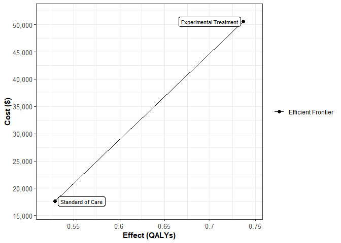<!-- -->

```r
ggsave(paste("Frontier_Markov_Model_", country_name[1], ".png", sep = ""), width = 8, height = 4, dpi=300)


while (!is.null(dev.list()))  dev.off()
# png(paste("Markov_Cohort_Traces", ".png"))
# dev.off()

# plot(df_cea, effect_units = "QALYs")


# When we plot it we have 2 strategies it is possible that something would be off the frontier, would be weakly dominated or strongly dominated, with just a few strategies it's not necessarily that impressive, but with lots of strategies then dampack can be helpful.
```


```r
#08.1 Load Markov model function

#08.3 One-way sensitivity analysis (OWSA)

# A brief note on how parameters are varied one at a time:

# A simple one-way DSA starts with choosing a model parameter to be investigated. Next, the modeler specifies a range for this parameter and the number of evenly spaced points along this range at which to evaluate model outcomes. The model is then run for each element of the vector of parameter values by setting the parameter of interest to the value, holding all other model parameters at their default base case values.

# To conduct the one-way DSA, we then call the function run_owsa_det with my_owsa_params_range, specifying the parameters to be varied and over which ranges, and my_params_basecase as the fixed parameter values to be used in the model when a parameter is not being explicitly varied in the one-way sensitivity analysis.


options(digits=4)

## Initialization ----

# Load the model as a function that is defined in the supporting script
# source("Functions_markov_3state.R")
# Test function
# calculate_ce_out(l_params_all)

source(file = "oncologySemiMarkov_function.R")
# If I change any code in this main model code file, I will also need to update the function that I call.


# Create list l_params_all with all input probabilities, costs, utilities, etc.,

# Test whether the function works (and generates the same results)
# - to do so, first a list of parameter values needs to be generated

# Now I update this list with the variables I have:

# If I updated utility for AE above, then I'll have to take that into account for u_F below:

l_params_all <- list(
  HR_FP_Exp = HR_FP_Exp,
  HR_FP_SoC = HR_FP_SoC,
  HR_PD_Exp = HR_PD_Exp,
  HR_PD_SoC = HR_PD_SoC,
  P_OSD_SoC = P_OSD_SoC,      
  P_OSD_Exp = P_OSD_Exp,
  p_FA1_STD = p_FA1_STD,
  p_FA2_STD = p_FA2_STD,
  p_FA3_STD = p_FA3_STD,
  p_FA1_EXPR = p_FA1_EXPR,
  p_FA2_EXPR = p_FA2_EXPR,
  p_FA3_EXPR = p_FA3_EXPR,
  administration_cost = administration_cost,
    #ITS FINE TO INCLUDE THE INGRIDENIENTS THAT MAKE UP c_F_SoC, c_F_Exp, c_P, but don't include c_F_SoC, c_F_Exp, c_P themsleves, BECAUSE WE ARE CHANGING WHAT BUILDS THESE COSTS WITH THE INGRIEDIENTS, SO WE DON'T WANT TO CHANGE IT AGAIN HERE ONCE WE'VE CHANGED WHAT BUILDS IT
  c_PFS_Folfox = c_PFS_Folfox,
  c_PFS_Bevacizumab = c_PFS_Bevacizumab,
  c_OS_Folfiri = c_OS_Folfiri,
  c_D       = c_D,    
  c_AE1 = c_AE1,
  c_AE2 = c_AE2,
  c_AE3 = c_AE3,
  u_F = u_F,   
  #ITS FINE TO INCLUDE U_F BUT DON'T INCLUDE U_F_SoC, BECAUSE WE ARE CHANGING WHAT BUILDS U_F_SoC WTH U_F AND AE1_DisUtil SO WE DON'T WANT TO CHANGE IT AGAIN HERE ONCE WE'VE CHANGED WHAT BUILDS IT
  u_P = u_P,   
  u_D = u_D,  
  AE1_DisUtil = AE1_DisUtil,
  AE2_DisUtil = AE2_DisUtil,
  AE3_DisUtil = AE3_DisUtil,
  d_e       = d_e,  
  d_c       = d_c,
  n_cycle   = n_cycle,
  t_cycle   = t_cycle
)

 
# Test function

# Test whether the function works (and generates the same results)

oncologySemiMarkov(l_params_all = l_params_all, n_wtp = n_wtp)
```

```
##                 Strategy  Cost Effect DSAICER
## 1       Standard of Care 17591 0.3346  105767
## 2 Experimental Treatment 50540 0.6462  105767
```

```r
# Entering parameter values:


UpperCI <- 0.87
LowerCI <- 0.53

HR_FP_Exp
```

```
## [1] 0.68
```

```r
Minimum_HR_FP_Exp <- LowerCI
Maximum_HR_FP_Exp <- UpperCI


HR_FP_SoC
```

```
## [1] 1
```

```r
Minimum_HR_FP_SoC <- HR_FP_SoC - 0.20*HR_FP_SoC
Maximum_HR_FP_SoC <- HR_FP_SoC + 0.20*HR_FP_SoC


# Now that we're using the OS curves, I add hazard ratios for PFS to dead that reflect the hazard ratio of the experimental strategy changing the probability of going from PFS to Death, and the hazard ratio of 1 that I apply in standard of care so that I can vary transition probabilities under standard of care in this one-way sensitivity analysis:

HR_PD_SoC
```

```
## [1] 1
```

```r
Minimum_HR_PD_SoC <- HR_PD_SoC - 0.20*HR_PD_SoC
Maximum_HR_PD_SoC <- HR_PD_SoC + 0.20*HR_PD_SoC


OS_UpperCI <- 0.86
OS_LowerCI <- 0.49
  
  
HR_PD_Exp
```

```
## [1] 0.65
```

```r
Minimum_HR_PD_Exp <- OS_LowerCI
Maximum_HR_PD_Exp <- OS_UpperCI


# Probability of progressive disease to death:

# Under the assumption that everyone will get the same second line therapy, I give them all the same probability of going from progessed (i.e., OS) to dead, and thus only need to include p_PD here once - because it is applied in oncologySemiMarkov_function.R for both SoC and Exp. ACTUALLY I THINK IT SHOULD BE P_OSD_SoC P_OSD_Exp BOTH INCLUDED.

P_OSD_SoC
```

```
## [1] 0.17
```

```r
Minimum_P_OSD_SoC <- 0.12
Maximum_P_OSD_SoC <- 0.22

P_OSD_Exp
```

```
## [1] 0.17
```

```r
Minimum_P_OSD_Exp <- 0.12
Maximum_P_OSD_Exp <- 0.22


# Probability of going from PFS to Death states under the standard of care treatment and the experimental treatment:

# # HR_PD_SoC and HR_PD_Exp address this as above:

# p_FD_SoC
# 
# Minimum_p_FD_SoC <- p_FD_SoC - 0.20*p_FD_SoC
# Maximum_p_FD_SoC <- p_FD_SoC + 0.20*p_FD_SoC
# 
# p_FD_Exp
# 
# Minimum_p_FD_Exp<- p_FD_Exp - 0.20*p_FD_Exp
# Maximum_p_FD_Exp <- p_FD_Exp + 0.20*p_FD_Exp


# Probability of Adverse Events:

p_FA1_STD
```

```
## [1] 0.04
```

```r
Minimum_p_FA1_STD <- p_FA1_STD - 0.20*p_FA1_STD
Maximum_p_FA1_STD <- p_FA1_STD + 0.20*p_FA1_STD

p_FA2_STD
```

```
## [1] 0.31
```

```r
Minimum_p_FA2_STD <- p_FA2_STD - 0.20*p_FA2_STD
Maximum_p_FA2_STD <- p_FA2_STD + 0.20*p_FA2_STD

p_FA3_STD
```

```
## [1] 0.31
```

```r
Minimum_p_FA3_STD <- p_FA3_STD - 0.20*p_FA3_STD
Maximum_p_FA3_STD <- p_FA3_STD + 0.20*p_FA3_STD


p_FA1_EXPR
```

```
## [1] 0.07
```

```r
Minimum_p_FA1_EXPR <- p_FA1_EXPR - 0.20*p_FA1_EXPR
Maximum_p_FA1_EXPR <- p_FA1_EXPR + 0.20*p_FA1_EXPR

p_FA2_EXPR
```

```
## [1] 0.11
```

```r
Minimum_p_FA2_EXPR <- p_FA2_EXPR - 0.20*p_FA2_EXPR
Maximum_p_FA2_EXPR <- p_FA2_EXPR + 0.20*p_FA2_EXPR

p_FA3_EXPR
```

```
## [1] 0.07
```

```r
Minimum_p_FA3_EXPR <- p_FA3_EXPR - 0.20*p_FA3_EXPR
Maximum_p_FA3_EXPR <- p_FA3_EXPR + 0.20*p_FA3_EXPR


# Cost:

# If I decide to include the cost of the test for patients I will also need to include this in the sensitivity analysis here:

administration_cost
```

```
## [1] 314.9
```

```r
Minimum_administration_cost <- administration_cost - 0.20*administration_cost
Maximum_administration_cost <- administration_cost + 0.20*administration_cost

c_PFS_Folfox
```

```
## [1] 285.5
```

```r
Minimum_c_PFS_Folfox  <- c_PFS_Folfox - 0.20*c_PFS_Folfox
Maximum_c_PFS_Folfox  <- c_PFS_Folfox + 0.20*c_PFS_Folfox

c_PFS_Bevacizumab 
```

```
## [1] 1326
```

```r
Minimum_c_PFS_Bevacizumab  <- c_PFS_Bevacizumab - 0.20*c_PFS_Bevacizumab
Maximum_c_PFS_Bevacizumab  <- c_PFS_Bevacizumab + 0.20*c_PFS_Bevacizumab

c_OS_Folfiri 
```

```
## [1] 139.6
```

```r
Minimum_c_OS_Folfiri  <- c_OS_Folfiri - 0.20*c_OS_Folfiri
Maximum_c_OS_Folfiri  <- c_OS_Folfiri + 0.20*c_OS_Folfiri

c_D  
```

```
## [1] 0
```

```r
Minimum_c_D  <- c_D - 0.20*c_D
Maximum_c_D  <- c_D + 0.20*c_D

c_AE1
```

```
## [1] 4886
```

```r
Minimum_c_AE1  <- c_AE1 - 0.20*c_AE1
Maximum_c_AE1  <- c_AE1 + 0.20*c_AE1

c_AE2
```

```
## [1] 507.4
```

```r
Minimum_c_AE2  <- c_AE2 - 0.20*c_AE2
Maximum_c_AE2  <- c_AE2 + 0.20*c_AE2

c_AE3
```

```
## [1] 95.03
```

```r
Minimum_c_AE3  <- c_AE3 - 0.20*c_AE3
Maximum_c_AE3  <- c_AE3 + 0.20*c_AE3


# Utilities:

u_F
```

```
## [1] 0.85
```

```r
Minimum_u_F <- 0.68
Maximum_u_F <- 1.00


u_P
```

```
## [1] 0.65
```

```r
Minimum_u_P <- 0.52
Maximum_u_P <- 0.78 


u_D
```

```
## [1] 0
```

```r
Minimum_u_D <- u_D - 0.20*u_D
Maximum_u_D <- u_D + 0.20*u_D 


AE1_DisUtil
```

```
## [1] 0.45
```

```r
Minimum_AE1_DisUtil <- AE1_DisUtil - 0.20*AE1_DisUtil
Maximum_AE1_DisUtil <- AE1_DisUtil + 0.20*AE1_DisUtil 


AE2_DisUtil
```

```
## [1] 0.19
```

```r
Minimum_AE2_DisUtil <- AE2_DisUtil - 0.20*AE2_DisUtil
Maximum_AE2_DisUtil <- AE2_DisUtil + 0.20*AE2_DisUtil 


AE3_DisUtil
```

```
## [1] 0.36
```

```r
Minimum_AE3_DisUtil <- AE3_DisUtil - 0.20*AE3_DisUtil
Maximum_AE3_DisUtil <- AE3_DisUtil + 0.20*AE3_DisUtil 


 
 
# Discount factor
# Cost Discount Factor
# Utility Discount Factor
# I divided these by 365 earlier in the R markdown document, so no need to do that again here:

d_e
```

```
## [1] 0.0001096
```

```r
Minimum_d_e <- 0
Maximum_d_e <- 0.08/365


d_c
```

```
## [1] 0.0001096
```

```r
Minimum_d_c <- 0
Maximum_d_c <- 0.08/365


# I am concerned that the min or max may go above 1 or below 0 in cases where parameter values should be bounded at 1 or 0, therefore, in such cases I say, replace the minimum I created with 0 or the maximum I created with 1, if the minimum is below 0 or the maximum is above 1:


HR_FP_Exp
```

```
## [1] 0.68
```

```r
Minimum_HR_FP_Exp<- replace(Minimum_HR_FP_Exp, Minimum_HR_FP_Exp<0, 0)
Maximum_HR_FP_Exp<- replace(Maximum_HR_FP_Exp, Maximum_HR_FP_Exp>1, 1)

HR_FP_SoC
```

```
## [1] 1
```

```r
Minimum_HR_FP_SoC<- replace(Minimum_HR_FP_SoC, Minimum_HR_FP_SoC<0, 0)
Maximum_HR_FP_SoC<- replace(Maximum_HR_FP_SoC, Maximum_HR_FP_SoC>1, 1)

HR_PD_SoC
```

```
## [1] 1
```

```r
Minimum_HR_PD_SoC<- replace(Minimum_HR_PD_SoC, Minimum_HR_PD_SoC<0, 0)
Maximum_HR_PD_SoC<- replace(Maximum_HR_PD_SoC, Maximum_HR_PD_SoC>1, 1)

HR_PD_Exp
```

```
## [1] 0.65
```

```r
Minimum_HR_PD_Exp<- replace(Minimum_HR_PD_Exp, Minimum_HR_PD_Exp<0, 0)
Maximum_HR_PD_Exp<- replace(Maximum_HR_PD_Exp, Maximum_HR_PD_Exp>1, 1)

P_OSD_SoC
```

```
## [1] 0.17
```

```r
Minimum_P_OSD_SoC<- replace(Minimum_P_OSD_SoC, Minimum_P_OSD_SoC<0, 0)
Maximum_P_OSD_SoC<- replace(Maximum_P_OSD_SoC, Maximum_P_OSD_SoC>1, 1)

P_OSD_Exp
```

```
## [1] 0.17
```

```r
Minimum_P_OSD_Exp<- replace(Minimum_P_OSD_Exp, Minimum_P_OSD_Exp<0, 0)
Maximum_P_OSD_Exp<- replace(Maximum_P_OSD_Exp, Maximum_P_OSD_Exp>1, 1)

p_FA1_STD
```

```
## [1] 0.04
```

```r
Minimum_p_FA1_STD<- replace(Minimum_p_FA1_STD, Minimum_p_FA1_STD<0, 0)
Maximum_p_FA1_STD<- replace(Maximum_p_FA1_STD, Maximum_p_FA1_STD>1, 1)

p_FA2_STD
```

```
## [1] 0.31
```

```r
Minimum_p_FA2_STD<- replace(Minimum_p_FA2_STD, Minimum_p_FA2_STD<0, 0)
Maximum_p_FA2_STD<- replace(Maximum_p_FA2_STD, Maximum_p_FA2_STD>1, 1)

p_FA3_STD
```

```
## [1] 0.31
```

```r
Minimum_p_FA3_STD<- replace(Minimum_p_FA3_STD, Minimum_p_FA3_STD<0, 0)
Maximum_p_FA3_STD<- replace(Maximum_p_FA3_STD, Maximum_p_FA3_STD>1, 1)

p_FA1_EXPR
```

```
## [1] 0.07
```

```r
Minimum_p_FA1_EXPR<- replace(Minimum_p_FA1_EXPR, Minimum_p_FA1_EXPR<0, 0)
Maximum_p_FA1_EXPR<- replace(Maximum_p_FA1_EXPR, Maximum_p_FA1_EXPR>1, 1)

p_FA2_EXPR
```

```
## [1] 0.11
```

```r
Minimum_p_FA2_EXPR<- replace(Minimum_p_FA2_EXPR, Minimum_p_FA2_EXPR<0, 0)
Maximum_p_FA2_EXPR<- replace(Maximum_p_FA2_EXPR, Maximum_p_FA2_EXPR>1, 1)

p_FA3_EXPR
```

```
## [1] 0.07
```

```r
Minimum_p_FA3_EXPR<- replace(Minimum_p_FA3_EXPR, Minimum_p_FA3_EXPR<0, 0)
Maximum_p_FA3_EXPR<- replace(Maximum_p_FA3_EXPR, Maximum_p_FA3_EXPR>1, 1)

u_F
```

```
## [1] 0.85
```

```r
Minimum_u_F<- replace(Minimum_u_F, Minimum_u_F<0, 0)
Maximum_u_F<- replace(Maximum_u_F, Maximum_u_F>1, 1)

u_P
```

```
## [1] 0.65
```

```r
Minimum_u_P<- replace(Minimum_u_P, Minimum_u_P<0, 0)
Maximum_u_P<- replace(Maximum_u_P, Maximum_u_P>1, 1)

AE1_DisUtil
```

```
## [1] 0.45
```

```r
Minimum_AE1_DisUtil<- replace(Minimum_AE1_DisUtil, Minimum_AE1_DisUtil<0, 0)
Maximum_AE1_DisUtil<- replace(Maximum_AE1_DisUtil, Maximum_AE1_DisUtil>1, 1)

AE2_DisUtil
```

```
## [1] 0.19
```

```r
Minimum_AE2_DisUtil<- replace(Minimum_AE2_DisUtil, Minimum_AE2_DisUtil<0, 0)
Maximum_AE2_DisUtil<- replace(Maximum_AE2_DisUtil, Maximum_AE2_DisUtil>1, 1)

AE3_DisUtil
```

```
## [1] 0.36
```

```r
Minimum_AE3_DisUtil<- replace(Minimum_AE3_DisUtil, Minimum_AE3_DisUtil<0, 0)
Maximum_AE3_DisUtil<- replace(Maximum_AE3_DisUtil, Maximum_AE3_DisUtil>1, 1)


# A one-way sensitivity analysis (OWSA) can be defined by specifying the names of the parameters that are to be incuded and their minimum and maximum values.


# We create a dataframe containing all parameters we want to do the sensitivity analysis on, and the min and max values of the parameters of interest 
# "min" and "max" are the mininum and maximum values of the parameters of interest.


# options(scipen = 999) # disabling scientific notation in R

df_params_OWSA <- data.frame(
  pars = c("HR_FP_Exp", "HR_FP_SoC", "HR_PD_SoC", "HR_PD_Exp", "P_OSD_SoC", "P_OSD_Exp", "p_FA1_STD", "p_FA2_STD", "p_FA3_STD", "p_FA1_EXPR", "p_FA2_EXPR", "p_FA3_EXPR", "administration_cost", "c_PFS_Folfox", "c_PFS_Bevacizumab", "c_OS_Folfiri", "c_AE1", "c_AE2", "c_AE3", "d_e", "d_c", "u_F", "u_P", "AE1_DisUtil", "AE2_DisUtil", "AE3_DisUtil"),   # names of the parameters to be changed
  min  = c(Minimum_HR_FP_Exp, Minimum_HR_FP_SoC, Minimum_HR_PD_SoC, Minimum_HR_PD_Exp, Minimum_P_OSD_SoC, Minimum_P_OSD_Exp, Minimum_p_FA1_STD, Minimum_p_FA2_STD, Minimum_p_FA3_STD, Minimum_p_FA1_EXPR, Minimum_p_FA2_EXPR, Minimum_p_FA3_EXPR, Minimum_administration_cost, Minimum_c_PFS_Folfox, Minimum_c_PFS_Bevacizumab, Minimum_c_OS_Folfiri, Minimum_c_AE1, Minimum_c_AE2, Minimum_c_AE3, Minimum_d_e, Minimum_d_c, Minimum_u_F, Minimum_u_P, Minimum_AE1_DisUtil, Minimum_AE2_DisUtil, Minimum_AE3_DisUtil),         # min parameter values
  max  = c(Maximum_HR_FP_Exp, Maximum_HR_FP_SoC, Maximum_HR_PD_SoC, Maximum_HR_PD_Exp, Maximum_P_OSD_SoC, Maximum_P_OSD_Exp, Maximum_p_FA1_STD, Maximum_p_FA2_STD, Maximum_p_FA3_STD, Maximum_p_FA1_EXPR, Maximum_p_FA2_EXPR, Maximum_p_FA3_EXPR, Maximum_administration_cost, Maximum_c_PFS_Folfox, Maximum_c_PFS_Bevacizumab, Maximum_c_OS_Folfiri, Maximum_c_AE1,  Maximum_c_AE2, Maximum_c_AE3, Maximum_d_e, Maximum_d_c, Maximum_u_F, Maximum_u_P, Maximum_AE1_DisUtil, Maximum_AE2_DisUtil, Maximum_AE3_DisUtil)          # max parameter values
)


# I made sure the names of the parameters to be varied and their mins and maxs are in the same order in all the brackets above in order to make sure that the min and max being applied are the min and the max of the parameter I want to consider a min and a max for.


# The OWSA is performed using the run_owsa_det function


# This function runs a deterministic one-way sensitivity analysis (OWSA) on a given function that produces outcomes. rdrr.io/github/DARTH-git/dampack/src/R/run_dsa.R

DSAICER  <- run_owsa_det(

# run_owsa_det: https://rdrr.io/github/DARTH-git/dampack/man/run_owsa_det.html

  # We need to make sure we consistently use "DSAICER" throughout, or else the function will present with an error saying "DSAICER" not found.  
   
# Arguments:
  
  params_range     = df_params_OWSA,     # dataframe with parameters for OWSA

# params_range	
# data.frame with 3 columns of parameters for OWSA in the following order: "pars", "min", and "max".
# The number of samples from this range is determined by nsamp. 
# "pars" are the parameters of interest and must be a subset of the parameters from params_basecase.


# Details
# params_range
 
# "pars" are the names of the input parameters of interest. These are the parameters that will be varied in the deterministic sensitivity analysis. variables in "pars" column must be a subset of variables in params_basecase
 

  
  params_basecase  = l_params_all,       # list with all parameters

# params_basecase	

# a named list of basecase values for input parameters needed by FUN, the user-defined function. So, I guess it takes the values that the parameters are equal to in l_params_all as the base case, so if cost is generated equal to 1,000 it'll take that as the base case, and then take the min and the max around this from the data.frame we created above.

# To conduct the one-way DSA, we then call the function run_owsa_det with my_owsa_params_range, specifying the parameters to be varied and over which ranges, and my_params_basecase as the fixed parameter values to be used in the model when a parameter is not being explicitly varied in the one-way sensitivity analysis. https://cran.r-project.org/web/packages/dampack/vignettes/dsa_generation.html

  nsamp            = 100,                # number of parameter values

# nsamp	

# number of sets of parameter values to be generated. If NULL, 100 parameter values are used -> I think Eva Enns said these are automatically evenly spaced out values of the parameters.

# Additional inputs are the number of equally-spaced samples (nsamp) to be used between the specified minimum and maximum of each range, the user-defined function (FUN) to be called to generate model outcomes for each strategy, the vector of outcomes to be stored (must be outcomes generated by the data frame output of the function passed in FUN), and the vector of strategy names to be evaluated.

# cran.r-project.org/web/packages/dampack/vignettes/dsa_generation.html

  FUN              = oncologySemiMarkov, # function to compute outputs

# FUN	
# function that takes the basecase in params_basecase and runs the analysis in the function... to produce the outcome of interest. The FUN must return a dataframe where the first column are the strategy names and the rest of the columns must be outcomes.
#  

 outcomes         = c("DSAICER"),           # output to do the OWSA on

# string vector with the outcomes of interest from FUN produced by nsamp
# This basically tells run_owsa_det what the name of the outcome of interest from the function we fed it is. Here our function previously had NMB, i.e., the net monetary benefit.

#  outcomes         = c("NMB"),           # output to do the OWSA on

# outcomes	

  strategies       = v_names_strats,       # names of the strategies

# strategies
# Set it equal to a vector of strategy names. The default NULL will use strategy names in FUN (  strategies = NULL,)
# Here that's "Standard of Care" and "Experimental Treatment".

  progress = TRUE,

# progress	
# TRUE or FALSE for whether or not function progress should be displayed in console, i.e., like 75% complete, 100%, etc.,

# The input progress = TRUE allows the user to see a progress bar as the DSA is conducted. When many parameters are being varied, nsamp is large, and/or the user-defined function is computationally burdensome, the DSA may take a noticeable amount of time to compute and the progress display is recommended.
# cran.r-project.org/web/packages/dampack/vignettes/dsa_generation.html


  n_wtp            = n_wtp               # extra argument to pass to FUN to specify the willingness to pay
)
```

```
## 
  |                                                                            
  |                                                                      |   0%
  |                                                                            
  |                                                                      |   1%
  |                                                                            
  |=                                                                     |   1%
  |                                                                            
  |=                                                                     |   2%
  |                                                                            
  |==                                                                    |   2%
  |                                                                            
  |==                                                                    |   3%
  |                                                                            
  |==                                                                    |   4%
  |                                                                            
  |===                                                                   |   4%
  |                                                                            
  |                                                                      |   0%
  |                                                                            
  |===                                                                   |   4%
  |                                                                            
  |===                                                                   |   5%
  |                                                                            
  |====                                                                  |   5%
  |                                                                            
  |====                                                                  |   6%
  |                                                                            
  |=====                                                                 |   6%
  |                                                                            
  |=====                                                                 |   7%
  |                                                                            
  |=====                                                                 |   8%
  |                                                                            
  |                                                                      |   0%
  |                                                                            
  |=====                                                                 |   8%
  |                                                                            
  |======                                                                |   8%
  |                                                                            
  |======                                                                |   9%
  |                                                                            
  |=======                                                               |   9%
  |                                                                            
  |=======                                                               |  10%
  |                                                                            
  |=======                                                               |  11%
  |                                                                            
  |========                                                              |  11%
  |                                                                            
  |========                                                              |  12%
  |                                                                            
  |                                                                      |   0%
  |                                                                            
  |========                                                              |  12%
  |                                                                            
  |=========                                                             |  12%
  |                                                                            
  |=========                                                             |  13%
  |                                                                            
  |=========                                                             |  14%
  |                                                                            
  |==========                                                            |  14%
  |                                                                            
  |==========                                                            |  15%
  |                                                                            
  |===========                                                           |  15%
  |                                                                            
  |                                                                      |   0%
  |                                                                            
  |===========                                                           |  15%
  |                                                                            
  |===========                                                           |  16%
  |                                                                            
  |============                                                          |  16%
  |                                                                            
  |============                                                          |  17%
  |                                                                            
  |============                                                          |  18%
  |                                                                            
  |=============                                                         |  18%
  |                                                                            
  |=============                                                         |  19%
  |                                                                            
  |                                                                      |   0%
  |                                                                            
  |=============                                                         |  19%
  |                                                                            
  |==============                                                        |  19%
  |                                                                            
  |==============                                                        |  20%
  |                                                                            
  |==============                                                        |  21%
  |                                                                            
  |===============                                                       |  21%
  |                                                                            
  |===============                                                       |  22%
  |                                                                            
  |================                                                      |  22%
  |                                                                            
  |================                                                      |  23%
  |                                                                            
  |                                                                      |   0%
  |                                                                            
  |================                                                      |  23%
  |                                                                            
  |================                                                      |  24%
  |                                                                            
  |=================                                                     |  24%
  |                                                                            
  |=================                                                     |  25%
  |                                                                            
  |==================                                                    |  25%
  |                                                                            
  |==================                                                    |  26%
  |                                                                            
  |===================                                                   |  26%
  |                                                                            
  |===================                                                   |  27%
  |                                                                            
  |                                                                      |   0%
  |                                                                            
  |===================                                                   |  27%
  |                                                                            
  |===================                                                   |  28%
  |                                                                            
  |====================                                                  |  28%
  |                                                                            
  |====================                                                  |  29%
  |                                                                            
  |=====================                                                 |  29%
  |                                                                            
  |=====================                                                 |  30%
  |                                                                            
  |=====================                                                 |  31%
  |                                                                            
  |======================                                                |  31%
  |                                                                            
  |                                                                      |   0%
  |                                                                            
  |======================                                                |  31%
  |                                                                            
  |======================                                                |  32%
  |                                                                            
  |=======================                                               |  32%
  |                                                                            
  |=======================                                               |  33%
  |                                                                            
  |=======================                                               |  34%
  |                                                                            
  |========================                                              |  34%
  |                                                                            
  |========================                                              |  35%
  |                                                                            
  |                                                                      |   0%
  |                                                                            
  |========================                                              |  35%
  |                                                                            
  |=========================                                             |  35%
  |                                                                            
  |=========================                                             |  36%
  |                                                                            
  |==========================                                            |  36%
  |                                                                            
  |==========================                                            |  37%
  |                                                                            
  |==========================                                            |  38%
  |                                                                            
  |===========================                                           |  38%
  |                                                                            
  |                                                                      |   0%
  |                                                                            
  |===========================                                           |  38%
  |                                                                            
  |===========================                                           |  39%
  |                                                                            
  |============================                                          |  39%
  |                                                                            
  |============================                                          |  40%
  |                                                                            
  |============================                                          |  41%
  |                                                                            
  |=============================                                         |  41%
  |                                                                            
  |=============================                                         |  42%
  |                                                                            
  |==============================                                        |  42%
  |                                                                            
  |                                                                      |   0%
  |                                                                            
  |==============================                                        |  42%
  |                                                                            
  |==============================                                        |  43%
  |                                                                            
  |==============================                                        |  44%
  |                                                                            
  |===============================                                       |  44%
  |                                                                            
  |===============================                                       |  45%
  |                                                                            
  |================================                                      |  45%
  |                                                                            
  |================================                                      |  46%
  |                                                                            
  |                                                                      |   0%
  |                                                                            
  |================================                                      |  46%
  |                                                                            
  |=================================                                     |  46%
  |                                                                            
  |=================================                                     |  47%
  |                                                                            
  |=================================                                     |  48%
  |                                                                            
  |==================================                                    |  48%
  |                                                                            
  |==================================                                    |  49%
  |                                                                            
  |===================================                                   |  49%
  |                                                                            
  |===================================                                   |  50%
  |                                                                            
  |                                                                      |   0%
  |                                                                            
  |===================================                                   |  50%
  |                                                                            
  |===================================                                   |  51%
  |                                                                            
  |====================================                                  |  51%
  |                                                                            
  |====================================                                  |  52%
  |                                                                            
  |=====================================                                 |  52%
  |                                                                            
  |=====================================                                 |  53%
  |                                                                            
  |=====================================                                 |  54%
  |                                                                            
  |======================================                                |  54%
  |                                                                            
  |                                                                      |   0%
  |                                                                            
  |======================================                                |  54%
  |                                                                            
  |======================================                                |  55%
  |                                                                            
  |=======================================                               |  55%
  |                                                                            
  |=======================================                               |  56%
  |                                                                            
  |========================================                              |  56%
  |                                                                            
  |========================================                              |  57%
  |                                                                            
  |========================================                              |  58%
  |                                                                            
  |                                                                      |   0%
  |                                                                            
  |========================================                              |  58%
  |                                                                            
  |=========================================                             |  58%
  |                                                                            
  |=========================================                             |  59%
  |                                                                            
  |==========================================                            |  59%
  |                                                                            
  |==========================================                            |  60%
  |                                                                            
  |==========================================                            |  61%
  |                                                                            
  |===========================================                           |  61%
  |                                                                            
  |===========================================                           |  62%
  |                                                                            
  |                                                                      |   0%
  |                                                                            
  |===========================================                           |  62%
  |                                                                            
  |============================================                          |  62%
  |                                                                            
  |============================================                          |  63%
  |                                                                            
  |============================================                          |  64%
  |                                                                            
  |=============================================                         |  64%
  |                                                                            
  |=============================================                         |  65%
  |                                                                            
  |==============================================                        |  65%
  |                                                                            
  |                                                                      |   0%
  |                                                                            
  |==============================================                        |  65%
  |                                                                            
  |==============================================                        |  66%
  |                                                                            
  |===============================================                       |  66%
  |                                                                            
  |===============================================                       |  67%
  |                                                                            
  |===============================================                       |  68%
  |                                                                            
  |================================================                      |  68%
  |                                                                            
  |================================================                      |  69%
  |                                                                            
  |                                                                      |   0%
  |                                                                            
  |================================================                      |  69%
  |                                                                            
  |=================================================                     |  69%
  |                                                                            
  |=================================================                     |  70%
  |                                                                            
  |=================================================                     |  71%
  |                                                                            
  |==================================================                    |  71%
  |                                                                            
  |==================================================                    |  72%
  |                                                                            
  |===================================================                   |  72%
  |                                                                            
  |===================================================                   |  73%
  |                                                                            
  |                                                                      |   0%
  |                                                                            
  |===================================================                   |  73%
  |                                                                            
  |===================================================                   |  74%
  |                                                                            
  |====================================================                  |  74%
  |                                                                            
  |====================================================                  |  75%
  |                                                                            
  |=====================================================                 |  75%
  |                                                                            
  |=====================================================                 |  76%
  |                                                                            
  |======================================================                |  76%
  |                                                                            
  |======================================================                |  77%
  |                                                                            
  |                                                                      |   0%
  |                                                                            
  |======================================================                |  77%
  |                                                                            
  |======================================================                |  78%
  |                                                                            
  |=======================================================               |  78%
  |                                                                            
  |=======================================================               |  79%
  |                                                                            
  |========================================================              |  79%
  |                                                                            
  |========================================================              |  80%
  |                                                                            
  |========================================================              |  81%
  |                                                                            
  |=========================================================             |  81%
  |                                                                            
  |                                                                      |   0%
  |                                                                            
  |=========================================================             |  81%
  |                                                                            
  |=========================================================             |  82%
  |                                                                            
  |==========================================================            |  82%
  |                                                                            
  |==========================================================            |  83%
  |                                                                            
  |==========================================================            |  84%
  |                                                                            
  |===========================================================           |  84%
  |                                                                            
  |===========================================================           |  85%
  |                                                                            
  |                                                                      |   0%
  |                                                                            
  |===========================================================           |  85%
  |                                                                            
  |============================================================          |  85%
  |                                                                            
  |============================================================          |  86%
  |                                                                            
  |=============================================================         |  86%
  |                                                                            
  |=============================================================         |  87%
  |                                                                            
  |=============================================================         |  88%
  |                                                                            
  |==============================================================        |  88%
  |                                                                            
  |                                                                      |   0%
  |                                                                            
  |==============================================================        |  88%
  |                                                                            
  |==============================================================        |  89%
  |                                                                            
  |===============================================================       |  89%
  |                                                                            
  |===============================================================       |  90%
  |                                                                            
  |===============================================================       |  91%
  |                                                                            
  |================================================================      |  91%
  |                                                                            
  |================================================================      |  92%
  |                                                                            
  |=================================================================     |  92%
  |                                                                            
  |                                                                      |   0%
  |                                                                            
  |=================================================================     |  92%
  |                                                                            
  |=================================================================     |  93%
  |                                                                            
  |=================================================================     |  94%
  |                                                                            
  |==================================================================    |  94%
  |                                                                            
  |==================================================================    |  95%
  |                                                                            
  |===================================================================   |  95%
  |                                                                            
  |===================================================================   |  96%
  |                                                                            
  |                                                                      |   0%
  |                                                                            
  |===================================================================   |  96%
  |                                                                            
  |====================================================================  |  96%
  |                                                                            
  |====================================================================  |  97%
  |                                                                            
  |====================================================================  |  98%
  |                                                                            
  |===================================================================== |  98%
  |                                                                            
  |===================================================================== |  99%
  |                                                                            
  |======================================================================|  99%
  |                                                                            
  |======================================================================| 100%
```

```r
# Value
# A list containing dataframes with the results of the sensitivity analyses. The list will contain a dataframe for each outcome specified. List elements can be visualized with plot.owsa, owsa_opt_strat and owsa_tornado from dampack

# Basically, run_owsa_det creates the above.

# Also, each owsa object returned by run_owsa_det is a data frame with four columns: parameter, strategy, param_val, and outcome_val. For each row, param_val is the value used for the parameter listed in parameter and outcome_val is the value of the specified outcome for the strategy listed in strategy. 

# So, OWSA_NMB shows a row is created for each sampling of the parameter value from min to max, so 100 rows per parameter (because nsamp = 100,), and the outcome value associated with a parameter value of this size is displayed under outcome_val.

# You can see how this works by putting the below into the console.

# OWSA_NMB

# Or just DSAICER for DSAICER.

# Resources on this available here:


# https://rdrr.io/github/DARTH-git/dampack/man/run_owsa_det.html (also saved here: C:\Users\Jonathan\OneDrive - Royal College of Surgeons in Ireland\COLOSSUS\Training Resources\sensitivity analysis help files\rdrr-io-github-DARTH-git-dampack-man-run_owsa_det-html.pdf)


# This link is pretty good for showing that the OWSA can be run across a variety of outcomes outcomes = c("Cost", "QALY", "LY", "NMB"), and then you can pick which of the OWSA outcomes you'd like to focus on and build tornado diagrams, etc., from that:

# "Because we have defined multiple parameters in my_owsa_params_range, we have instructed run_owsa_det to execute a series of separate one-way sensitivity analyses and compile the results into a single owsa object for each requested outcome. When only one outcome is specified run_owsa_det returns a owsa data frame. When more than one outcome is specified, run_owsa_det returns a list containing one owsa data frame for each outcome. To access the owsa object corresponding to a given outcome, one can select the list item with the name “owsa_”. For example, the owsa object associated with the NMB outcome can be accessed as l_owsa_det$owsa_NMB."

# https://cran.r-project.org/web/packages/dampack/vignettes/dsa_generation.html 

owsa_tornado(owsa = DSAICER, txtsize = 11)
```

<!-- -->

```r
ggsave(paste("Tornado_Diagram_", country_name[1], ".png", sep = ""), width = 8, height = 4, dpi=300)
while (!is.null(dev.list()))  dev.off()
#png(paste("Tornado_Diagram_", country_name[1], ".png", sep = ""))
#dev.off()

# Plotting the outcomes of the OWSA in a tornado plot
# - note that other plots can also be generated using the plot() and owsa_opt_strat() functions


# owsa_tornado(DSAICER,
# 
# min_rel_diff = 0.05)

# For owsa objects that contain many parameters that have minimal effect on the parameter of interest, you may want to consider producing a plot that highlights only the most influential parameters. Using the min_rel_diff argument, you can instruct owsa_tornado to exclude all parameters that fail to produce a relative change in the outcome below a specific fraction.


# Maybe use the below to change the formatting of the above:
# TornadoPlot(main_title = "Tornado Plot", Parms = paramNames, Outcomes = m.tor, 
#             outcomeName = "Incremental Cost-Effectiveness Ratio (ICER)", 
#             xlab = "ICER", 
#             ylab = "Parameters", 
#             col1="#3182bd", col2="#6baed6")
```

## 08.3.1 Plot OWSA


```r
# plot(DSAICER, txtsize = 10, n_x_ticks = 4, 
#      facet_scales = "free") +
#   theme(legend.position = "bottom") 
# The above was the code, but I've temporarily commented it out.

# I can add the following to the above: 

# + ggtitle("Expected Value of Perfect Information")

# To include a title on this plot, per: https://mran.microsoft.com/snapshot/2021-03-21/web/packages/dampack/dampack.pdf

#txtsize - base text size

# n_y_ticks - number of axis ticks
# n_x_ticks	- number of axis ticks

# Function for determining number of ticks on axis of ggplot2 plots. https://www.quantargo.com/help/r/latest/packages/dampack/1.0.1/number_ticks


# [SO, IN THE DIAGRAM THE PARAMETER WE ARE CONSIDERING IS AT THE TOP OF THE DIAGRAM, THE NET MONETARY BENEFIT IS ON THE LEFT OF THE DIAGRAM AND YOU'LL SEE THAT THE LEFT EDGE OF THE LINE IS THE MINIMUM VALUE FOR THE PARAMETER WE ARE INTERESTED IN, THE RIGHT EDGE OF THE LINE IS THE MAXIMUM VALUE FOR THE PARAMETER WE ARE INTERESTED IN, AND SOMEWHERE IN THE MIDDLE IS THE BASECASE WE ASSIGNED THIS PARAMETER. A GOOD EXAMPLE OF THIS IS c_P, COST OF PROGRESSION, say THE BASECASE WAS 1,000 EURO, WHICH WE'D SEE IN THE MIDDLE, THE MINIMUM WAS 800 EURO WHICH WE'D SEE ON THE FAR LEFT OF THE LINE, AND THE MAXIMUM IS 1,200 WHICH WE'D SEE ON THE FAR RIGHT OF THE LINE, AND WE'D SEE THAT AS WE MOVE FROM THE MINUMUM, THE 800 EURO ON THE FAR LEFT OF THE LINE, TO THE MAXIMUM, THE 1200 EURO ON THE FAR RIGHT OF THE LINE (I.E., AS THE COST OF BEING IN THE PROGRESSED STATE INCREASES) THE NET MONETARY BENEFIT OF BOTH TREATMENT OPTIONS FALL, WITH THE NMB OF THE EXPERIMENTAL TREATMENT OPTION FALLING FROM 235,000 TO 230,000].


# Explained here: https://cran.r-project.org/web/packages/dampack/vignettes/dsa_generation.html


# and here: https://cran.r-project.org/web/packages/dampack/vignettes/psa_analysis.html


# Because I'm using ICERs, there's only one value, whereas for NMB, there's a value under each treatment strategy, but ICERs are ratios comparing the costs of one treatment strategy to another, and the outcomes of one treatment strategy to another. So, where when I was using NMB as my outcome I would have a curve for "SoC" and "Experimental Treatment", because each would get an NMB, now I only have the one curve, to show how the ICER value changes. So, before I could have how the net monetary benefit changed under each treatment strategy as the cost of treatment A went up, or the rate of changing from healthy to dead went up, per the "# Plot outcome of each strategy over each parameter range" on: https://cran.r-project.org/web/packages/dampack/vignettes/dsa_generation.html, now I only have the ICER, so I see how the ICER changes as the cost of parameters, etc., change.

# Because only one ICER value is created, but it's created for both SoC and Exp, I imagine that the exp line and SoC line are created, but sit on top of eachother in the diagram below, so I don't include this in my paper:
```

## 08.3.2 Optimal strategy with OWSA


```r
# There are too many parameters to make things legible, so instead you should create a tornado plot that highlights only the most influential parameters. Using the min_rel_diff argument, you can instruct owsa_tornado to exclude all parameters that fail to produce a relative change in the outcome below a specific fraction.

# owsa_tornado(OWSA_NMB,
# 
# min_rel_diff = 0.05)

# Following this, create a vector of the parameters that appear in this tornado plot below and then create the optimal strategy with OWSA per these parameters.

# v_owsa_opt_strat <- c("HR_FP_Exp", "HR_FP_SoC", "p_PD", "p_FD_SoC", "p_FD_Exp", "p_FA1_SoC", "p_A1F_SoC", "p_A1D_SoC", "p_FA2_SoC", "p_A2F_SoC", "p_A2D_SoC", "p_FA3_SoC", "p_A3F_SoC", "p_A3D_SoC", "c_F_SoC", "c_F_Exp", "c_P","c_AE1", "c_AE2", "c_AE3", "d_e", "d_c", "u_F", "u_P", "u_AE1", "u_AE2", "u_AE3")

# Then include params = v_owsa_opt_strat, in the below and get rid of plot_const = FALSE

#owsa_opt_strat(owsa = DSAICER, txtsize = 10, plot_const = FALSE)
# The above was the code, but I've temporarily commented it out.


# plot_const = FALSE
# plot_const	
# whether to plot parameters that don't lead to changes in optimal strategy as they vary.

# params	
# params = v_owsa_opt_strat,
# vector of parameters to plot

# return	
# either return a ggplot object plot or a data frame with ranges of parameters for which each strategy is optimal. return = c("plot", "data"),

# Basically, the data frame will show you the ranges for each parameter that each strategy is optimal.You can see below that for p_FD_Exp the experimental treatment is the optimal strategy from 0.04 (the minimum) through to 0.055 (0.05575757575757575), while standard of care is the optimal strategy from 0.059 (0.05595959595959596) through to 0.06 (the maximum). 

# p_FD_Exp	Experimental.Treatment	4.0000000000000001e-02	5.5757575757575756e-02	
# p_FD_Exp	Standard.of.Care	5.5959595959595959e-02   6.0000000000000005e-02	

# Whereas for p_FA3_SoC the experimental treatment strategy is optimal from it's min 0.016 all the way through every value in the range to it's max: 0.024 

# p_FA3_SoC	Experimental.Treatment	1.6000000000000000e-02	2.4000000000000000e-02	

# The data frame is a bit of a pain though because it returns things in scientific notation, but according to the below:

 
# Scientific Notation
# E+01 means moving the decimal point one digit to the right, E+00 means leaving the decimal point where it is, and E–01 means moving the decimal point one digit to the left. Example: 1.00E+01 is 10, 1.33E+00 stays at 1.33, and 1.33E–01 becomes 0.133.
# https://neo.ne.gov/programs/stats/inf/79.htm#:~:text=Scientific%20Notation,-The%20scientific%20notation&text=E%2B01%20means%20moving%20the,1.33E%E2%80%9301%20becomes%200.133.

# There's also a good calculator to do this for you here: https://www.free-online-calculator-use.com/scientific-notation-converter.html#

# https://rdrr.io/github/DARTH-git/dampack/man/owsa_opt_strat.html


# Like owsa_tornado(), the return argument in owsa_opt_strat() allows the user to access a tidy data.frame that contains the exact values used to produce the plot.

# owsa_opt_strat(o, 
#                return = "data")

# https://cran.r-project.org/web/packages/dampack/vignettes/psa_analysis.html


# If return == "plot", a ggplot2 optimal strategy plot derived from the owsa object, or if return == "data", a data.frame containing all data contained in the plot. The plot allows us to see how the strategy that maximizes the expectation of the outcome of interest changes as a function of each parameter of interest.

# Visualize optimal strategy (max NMB) over each parameter range
# owsa_opt_strat(my_owsa_NMB)

# facet_ncol	
# Number of columns in plot facet.

# facet_nrow	
# number of rows in plot facet.

# txtsize
# base text size

# facet_lab_txtsize	
# text size for plot facet labels (I think this allows me change the size of the text on the plots and the size of the numbers, ledgend, etc., independently).

# Explained here: 

# https://cran.r-project.org/web/packages/dampack/vignettes/dsa_generation.html

# https://cran.r-project.org/web/packages/dampack/vignettes/psa_analysis.html

# https://rdrr.io/github/DARTH-git/dampack/man/owsa_opt_strat.html

# https://www.quantargo.com/help/r/latest/packages/dampack/1.0.1/owsa_opt_strat

# Again, this is something that doesnt work too well with ICERs, with a NMB it is easy to see what the optimal strategy is, with am ICER it's not so easy unless you are telling your code what the willingness to pay threshold is, and it's doing the ICER calculation and then comparing this to the WTP threshold to see which approach is most cost-effective. But I think this code is really set up for NMB and telling you what parameter values give you higher NMB values and which treatment strategies these NMB's belong to. 
```

## 08.4 Two-way sensitivity analysis (TWSA)


```r
# To conduct the two-way DSA, we call the function run_twsa_det with my_twsa_params_range. The general format of the function arguments for run_twsa_det are the same as those for run_owsa_det. In run_twsa_det, equally spaced sequences of length nsamp are created for the two parameters based on the inputs provided in the params_range argument. These two sequences of parameter values define an nsamp by nsamp grid over which FUN is applied to produce outcomes for every combination of the two parameters. https://cran.r-project.org/web/packages/dampack/vignettes/dsa_generation.html


## 4.2 Defining and performing a two-way sensitivity analysis ----

# I can also preform a TWSA on a a probabilistic sensitivity analysis (make_psa_obj) or a deterministic sensitivity analysis object (run_owsa_det) per: https://rdrr.io/github/DARTH-git/dampack/man/twsa.html

# A lot of this code should be reflective of the earlier code of the one-way sensitivity analysis, so if I'm confused as to what one thing is doing or another I can look at the piece of code that is confusing me here, and scroll back up to my explanation of that code in OWSA.

# Run deterministic two-way sensitivity analysis (TWSA) https://rdrr.io/github/DARTH-git/dampack/src/R/run_dsa.R

# To perform a two-way sensitivity analysis (TWSA), a similar data.frame with model parameters is required

# dataframe containing all parameters, their basecase values, and the min and 
# max values of the parameters of interest

df_params_TWSA <- data.frame(pars = c("HR_FP_SoC", "HR_FP_Exp"),
                             min  = c(Minimum_HR_FP_SoC, Minimum_HR_FP_Exp),  # min parameter values
                             max  = c(Maximum_HR_FP_SoC, Maximum_HR_FP_Exp) # max parameter values
)


# We could have chosen any of the below from our OWSA data.frame to use as our parameters:
# df_params_OWSA <- data.frame(
#   pars = c("HR_FP_Exp", "HR_FP_SoC", "p_PD", "p_FD_SoC", "p_FD_Exp", "p_FA1_SoC", "p_A1F_SoC", "p_A1D_SoC", "p_FA2_SoC", "p_A2F_SoC", "p_A2D_SoC", "p_FA3_SoC", "p_A3F_SoC", "p_A3D_SoC", "c_F_SoC", "c_F_Exp", "c_P","c_AE1", "c_AE2", "c_AE3", "d_e", "d_c", "u_F", "u_P", "u_AE1", "u_AE2", "u_AE3"),   # names of the parameters to be changed
#   min  = c(Minimum_HR_FP_Exp, Minimum_HR_FP_SoC, Minimum_p_PD, Minimum_p_FD_SoC, Minimum_p_FD_Exp, Minimum_p_FA1_SoC, Minimum_p_A1F_SoC, Minimum_p_A1D_SoC, Minimum_p_FA2_SoC, Minimum_p_A2F_SoC, Minimum_p_A2D_SoC, Minimum_p_FA3_SoC, Minimum_p_A3F_SoC, Minimum_p_A3D_SoC, Minimum_c_F_SoC, Minimum_c_F_Exp, Minimum_c_P, Minimum_c_AE1, Minimum_c_AE2, Minimum_c_AE3, Minimum_d_e, Minimum_d_c, Minimum_u_F, Minimum_u_P, Minimum_u_AE1, Minimum_u_AE2, Minimum_u_AE3),         # min parameter values
#   max  = c(Maximum_HR_FP_Exp, Maximum_HR_FP_SoC, Maximum_p_PD, Maximum_p_FD_SoC, Maximum_p_FD_Exp, Maximum_p_FA1_SoC, Maximum_p_A1F_SoC, Maximum_p_A1D_SoC, Maximum_p_FA2_SoC, Maximum_p_A2F_SoC, Maximum_p_A2D_SoC, Maximum_p_FA3_SoC, Maximum_p_A3F_SoC, Maximum_p_A3D_SoC, Maximum_c_F_SoC, Maximum_c_F_Exp, Maximum_c_P, Maximum_c_AE1,  Maximum_c_AE2, Maximum_c_AE3, Maximum_d_e, Maximum_d_c, Maximum_u_F, Maximum_u_P, Maximum_u_AE1, Maximum_u_AE2, Maximum_u_AE3)          # max parameter values
# )
# 

# It's a pain, but we have to only enter 2 parameters of interest at a time into our model per the error built into the source code for run_twsa_det:

# "two-way sensitivity analysis only allows for and requires 2 different paramters of interest at a time" https://rdrr.io/github/DARTH-git/dampack/src/R/run_dsa.R

# And:

# The structure of the function is very similar to run_owsa_det(). The primary difference is the function can only take two parameters at a time in the params_range. https://syzoekao.github.io/CEAutil/


# The TWSA is performed using the run_twsa_det function


TWSA_DSAICER <- run_twsa_det(params_range    = df_params_TWSA,    # dataframe with parameters for TWSA
                         params_basecase = l_params_all,      # list with all parameters, the "pars" chosen in the data.frame to be analysed here must be a subset of these.
                         
                         nsamp           = 40,                # number of parameter values. If NULL, 40 parameter values are used

 # number of parameter values

# nsamp	

# number of sets of parameter values to be generated. If NULL, 40 parameter values are used -> I think Eva Enns said these are automatically evenly spaced out values of the parameters.

# Additional inputs are the number of equally-spaced samples (nsamp) to be used between the specified minimum and maximum of each range, the user-defined function (FUN) to be called to generate model outcomes for each strategy, the vector of outcomes to be stored (must be outcomes generated by the data frame output of the function passed in FUN), and the vector of strategy names to be evaluated.

# cran.r-project.org/web/packages/dampack/vignettes/dsa_generation.html
                         
                         
                         FUN             = oncologySemiMarkov,  # function to compute outputs

# Function that takes the basecase in params_all and produces the outcome of interest. The FUN must return a dataframe where the first column is the strategy names and the rest of the columns must be outcomes. Which df_ce in the function does.

# Described here:

# https://rdrr.io/cran/dampack/man/run_twsa_det.html

                         outcomes        = c("DSAICER"),             # output to do the TWSA on
                         strategies      = v_names_strats,       # names of the strategies.The default (NULL) will use strategy names in FUN
                         progress        = TRUE, #Progress bar like before

                         n_wtp           = n_wtp               # extra argument to pass to FUN to specify the willingness to pay
)
```

```
## 
  |                                                                            
  |                                                                      |   0%
  |                                                                            
  |                                                                      |   1%
  |                                                                            
  |=                                                                     |   1%
  |                                                                            
  |=                                                                     |   2%
  |                                                                            
  |==                                                                    |   2%
  |                                                                            
  |==                                                                    |   3%
  |                                                                            
  |==                                                                    |   4%
  |                                                                            
  |===                                                                   |   4%
  |                                                                            
  |===                                                                   |   5%
  |                                                                            
  |====                                                                  |   5%
  |                                                                            
  |====                                                                  |   6%
  |                                                                            
  |=====                                                                 |   6%
  |                                                                            
  |=====                                                                 |   7%
  |                                                                            
  |=====                                                                 |   8%
  |                                                                            
  |======                                                                |   8%
  |                                                                            
  |======                                                                |   9%
  |                                                                            
  |=======                                                               |   9%
  |                                                                            
  |=======                                                               |  10%
  |                                                                            
  |=======                                                               |  11%
  |                                                                            
  |========                                                              |  11%
  |                                                                            
  |========                                                              |  12%
  |                                                                            
  |=========                                                             |  12%
  |                                                                            
  |=========                                                             |  13%
  |                                                                            
  |=========                                                             |  14%
  |                                                                            
  |==========                                                            |  14%
  |                                                                            
  |==========                                                            |  15%
  |                                                                            
  |===========                                                           |  15%
  |                                                                            
  |===========                                                           |  16%
  |                                                                            
  |============                                                          |  16%
  |                                                                            
  |============                                                          |  17%
  |                                                                            
  |============                                                          |  18%
  |                                                                            
  |=============                                                         |  18%
  |                                                                            
  |=============                                                         |  19%
  |                                                                            
  |==============                                                        |  19%
  |                                                                            
  |==============                                                        |  20%
  |                                                                            
  |==============                                                        |  21%
  |                                                                            
  |===============                                                       |  21%
  |                                                                            
  |===============                                                       |  22%
  |                                                                            
  |================                                                      |  22%
  |                                                                            
  |================                                                      |  23%
  |                                                                            
  |================                                                      |  24%
  |                                                                            
  |=================                                                     |  24%
  |                                                                            
  |=================                                                     |  25%
  |                                                                            
  |==================                                                    |  25%
  |                                                                            
  |==================                                                    |  26%
  |                                                                            
  |===================                                                   |  26%
  |                                                                            
  |===================                                                   |  27%
  |                                                                            
  |===================                                                   |  28%
  |                                                                            
  |====================                                                  |  28%
  |                                                                            
  |====================                                                  |  29%
  |                                                                            
  |=====================                                                 |  29%
  |                                                                            
  |=====================                                                 |  30%
  |                                                                            
  |=====================                                                 |  31%
  |                                                                            
  |======================                                                |  31%
  |                                                                            
  |======================                                                |  32%
  |                                                                            
  |=======================                                               |  32%
  |                                                                            
  |=======================                                               |  33%
  |                                                                            
  |=======================                                               |  34%
  |                                                                            
  |========================                                              |  34%
  |                                                                            
  |========================                                              |  35%
  |                                                                            
  |=========================                                             |  35%
  |                                                                            
  |=========================                                             |  36%
  |                                                                            
  |==========================                                            |  36%
  |                                                                            
  |==========================                                            |  37%
  |                                                                            
  |==========================                                            |  38%
  |                                                                            
  |===========================                                           |  38%
  |                                                                            
  |===========================                                           |  39%
  |                                                                            
  |============================                                          |  39%
  |                                                                            
  |============================                                          |  40%
  |                                                                            
  |============================                                          |  41%
  |                                                                            
  |=============================                                         |  41%
  |                                                                            
  |=============================                                         |  42%
  |                                                                            
  |==============================                                        |  42%
  |                                                                            
  |==============================                                        |  43%
  |                                                                            
  |==============================                                        |  44%
  |                                                                            
  |===============================                                       |  44%
  |                                                                            
  |===============================                                       |  45%
  |                                                                            
  |================================                                      |  45%
  |                                                                            
  |================================                                      |  46%
  |                                                                            
  |=================================                                     |  46%
  |                                                                            
  |=================================                                     |  47%
  |                                                                            
  |=================================                                     |  48%
  |                                                                            
  |==================================                                    |  48%
  |                                                                            
  |==================================                                    |  49%
  |                                                                            
  |===================================                                   |  49%
  |                                                                            
  |===================================                                   |  50%
  |                                                                            
  |===================================                                   |  51%
  |                                                                            
  |====================================                                  |  51%
  |                                                                            
  |====================================                                  |  52%
  |                                                                            
  |=====================================                                 |  52%
  |                                                                            
  |=====================================                                 |  53%
  |                                                                            
  |=====================================                                 |  54%
  |                                                                            
  |======================================                                |  54%
  |                                                                            
  |======================================                                |  55%
  |                                                                            
  |=======================================                               |  55%
  |                                                                            
  |=======================================                               |  56%
  |                                                                            
  |========================================                              |  56%
  |                                                                            
  |========================================                              |  57%
  |                                                                            
  |========================================                              |  58%
  |                                                                            
  |=========================================                             |  58%
  |                                                                            
  |=========================================                             |  59%
  |                                                                            
  |==========================================                            |  59%
  |                                                                            
  |==========================================                            |  60%
  |                                                                            
  |==========================================                            |  61%
  |                                                                            
  |===========================================                           |  61%
  |                                                                            
  |===========================================                           |  62%
  |                                                                            
  |============================================                          |  62%
  |                                                                            
  |============================================                          |  63%
  |                                                                            
  |============================================                          |  64%
  |                                                                            
  |=============================================                         |  64%
  |                                                                            
  |=============================================                         |  65%
  |                                                                            
  |==============================================                        |  65%
  |                                                                            
  |==============================================                        |  66%
  |                                                                            
  |===============================================                       |  66%
  |                                                                            
  |===============================================                       |  67%
  |                                                                            
  |===============================================                       |  68%
  |                                                                            
  |================================================                      |  68%
  |                                                                            
  |================================================                      |  69%
  |                                                                            
  |=================================================                     |  69%
  |                                                                            
  |=================================================                     |  70%
  |                                                                            
  |=================================================                     |  71%
  |                                                                            
  |==================================================                    |  71%
  |                                                                            
  |==================================================                    |  72%
  |                                                                            
  |===================================================                   |  72%
  |                                                                            
  |===================================================                   |  73%
  |                                                                            
  |===================================================                   |  74%
  |                                                                            
  |====================================================                  |  74%
  |                                                                            
  |====================================================                  |  75%
  |                                                                            
  |=====================================================                 |  75%
  |                                                                            
  |=====================================================                 |  76%
  |                                                                            
  |======================================================                |  76%
  |                                                                            
  |======================================================                |  77%
  |                                                                            
  |======================================================                |  78%
  |                                                                            
  |=======================================================               |  78%
  |                                                                            
  |=======================================================               |  79%
  |                                                                            
  |========================================================              |  79%
  |                                                                            
  |========================================================              |  80%
  |                                                                            
  |========================================================              |  81%
  |                                                                            
  |=========================================================             |  81%
  |                                                                            
  |=========================================================             |  82%
  |                                                                            
  |==========================================================            |  82%
  |                                                                            
  |==========================================================            |  83%
  |                                                                            
  |==========================================================            |  84%
  |                                                                            
  |===========================================================           |  84%
  |                                                                            
  |===========================================================           |  85%
  |                                                                            
  |============================================================          |  85%
  |                                                                            
  |============================================================          |  86%
  |                                                                            
  |=============================================================         |  86%
  |                                                                            
  |=============================================================         |  87%
  |                                                                            
  |=============================================================         |  88%
  |                                                                            
  |==============================================================        |  88%
  |                                                                            
  |==============================================================        |  89%
  |                                                                            
  |===============================================================       |  89%
  |                                                                            
  |===============================================================       |  90%
  |                                                                            
  |===============================================================       |  91%
  |                                                                            
  |================================================================      |  91%
  |                                                                            
  |================================================================      |  92%
  |                                                                            
  |=================================================================     |  92%
  |                                                                            
  |=================================================================     |  93%
  |                                                                            
  |=================================================================     |  94%
  |                                                                            
  |==================================================================    |  94%
  |                                                                            
  |==================================================================    |  95%
  |                                                                            
  |===================================================================   |  95%
  |                                                                            
  |===================================================================   |  96%
  |                                                                            
  |====================================================================  |  96%
  |                                                                            
  |====================================================================  |  97%
  |                                                                            
  |====================================================================  |  98%
  |                                                                            
  |===================================================================== |  98%
  |                                                                            
  |===================================================================== |  99%
  |                                                                            
  |======================================================================|  99%
  |                                                                            
  |======================================================================| 100%
```

```r
# plot(TWSA_DSAICER)

# The plot above was the code, but I've commented it out for now.

# Sometimes you see "maximise" written in people's TWSA code, why is that:

# maximize	
# If TRUE, plot of strategy with maximum expected outcome (default); if FALSE, plot of strategy with minimum expected outcome

# per: https://www.quantargo.com/help/r/latest/packages/dampack/1.0.1/plot.twsa


# [[A 2-way uncertainty analysis will be more useful if informed by the covariance between the 2 parameters of interest or on the logical relationship between them (e.g., a 2-way uncertainty analysis might be represented by the control intervention event rate and the hazard ratio with the new treatment). <file:///C:/Users/Jonathan/OneDrive%20-%20Royal%20College%20of%20Surgeons%20in%20Ireland/COLOSSUS/Briggs%20et%20al%202012%20model%20parameter%20estimation%20and%20uncertainty.pdf>]]

# The Briggs 2012 paper said to include 2 parameters in the TWSA that have a logical relationship,(e.g., a 2-way uncertainty analysis might be represented by the control intervention event rate and the hazard ratio with the new treatment), which are expected to have a relationship because the hazard ratio for the experimental strategy is multiplied by the rate of events under soc, that's how hazard ratios for experimental interventions work, they are just a multiplier for the number of events under SoC in order to give number of events under Exp care, so more events under SoC means more events under the experimental strategy when it's hazard ratio is applied to the number of events under SoC. In the model, the function is called in the sensitivity analysis and applies a hazard ratio

# I also describe applying the Exp HR to the post changes SoC in my function where this is done.

# I can't use Free to Progressed probabilities, because now those probabilities are time-sensitive, so if I try to change these here and include them in the TWSA I'll be including too many things, just like in the tornado diagram, as I explain in my description on hazard ratios.

# Minimum_p_FP_SoC <- p_FP_SoC - 0.20*p_FP_SoC

# Maximum_p_FP_SoC <- p_FP_SoC + 0.20*p_FP_SoC

# Minimum_p_FP_Exp <- p_FP_Exp - 0.20*p_FP_Exp

# Maximum_p_FP_Exp <- p_FP_Exp + 0.20*p_FP_Exp

# To address this, I can apply this mean, max and min to the hazard ratios instead, knowing that when run_owsa_det is run in the sensitivity analysis it calls the oncology_semi_markov_function to run and in this function the hazard ratios generate the survivor function, and then these survivor functions are used to generate the probabilities (which will be cycle dependent), so I am varying the transition probabilities by 20% using a static value.


# Alterantive modelling approach I could try here if so inclined:


# "When the base-case result of an analysis strongly favors one alternative, a threshold analysis may be presented as a worst-case or ''even if'' analysis (e.g., ''Even if the risk reduction is as low as X, the ICER remains below Y,'' or ''Even if the relative risk reduction with alternative A is as low as X and the cost of treatment is as high as Y, alternative A dominates B''). Threshold values can easily be combined with the tornado presentation by marking them on the horizontal bars."

# <file:///C:/Users/Jonathan/OneDrive%20-%20Royal%20College%20of%20Surgeons%20in%20Ireland/COLOSSUS/Briggs%20et%20al%202012%20model%20parameter%20estimation%20and%20uncertainty.pdf>


# If for some reason I wanted a three-way sensitivity analysis per Andrew Brigg's discussion on page 8 above, there may be some code to describe doing this here: https://rdrr.io/github/syzoekao/CEAutil/src/inst/rmd/Rcode.R (github here: https://github.com/syzoekao/CEAutil/) and here: https://syzoekao.github.io/CEAutil/#44_two-way_sensitivity_analysis also saved here: C:\Users\Jonathan\OneDrive - Royal College of Surgeons in Ireland\COLOSSUS\Training Resources\introduction to R for cost-effectiveness analysis.pdf

# Again, I think this is best suited to a NMB, where you will have 2 NMB values, one for EXP and one for SOC, for ICERAs, because it's a ratio between SoC and EXP you will only have one ICER value, and in  the code, both SOC and EXP are assigned it, so in the diagram both colours will sit on top of eachother for SOC and EXP and also, even if changing one thing changes the ICER value, it is changing it for both SOC and EXP, because they both have the same ICER, so there won't be sections of one colour and not another. 
```


```r
### PROBABILISTIC ANALYSIS ----

# We conduct a probabilistic analysis (PSA) of the model to estimate the uncertainty in the model outcomes.

# To do this, we generate samples for each model parameter from parametric distributions and evaluate the model for each set of parameter samples.


## Sampling the parameter values ----

# In order for the results reported in the PSA to be reproducible we need to set the random number seed. We also defining the number of runs, i.e., how many times we will re-sample for the parameter distributions, typically the number chosen is 10,000 in published studies, so we do that too:
n_runs <- 10000
set.seed(123)

# In the PSA, first we sample the parameter values from their distributions and store them in a data.frame.
# If a model parameter has no uncertainty and, hence, is fixed, we can set it equal to itself.


# To take random draws for the Weibull parametric survival distribution that we fitted at the start of the document using the 'flexsurv' package, we use the following piece of code.

# This applies mvrnorm (i.e., takes samples from the specified multivariate normal distribution) to the mean (mu) of 

# l_TTP_SoC_weibull$coefficients
#     shape     scale 
# 0.7700246 1.7425343 

# i.e., to the mean of the shape and the scale variables from the Weibull parametric survival distribution that we fitted.

# And gives a sigma (a positive-definite symmetric matrix specifying the covariance matrix of the variables) that is equal to the covariance between the shape and the scale variables:

# > l_TTP_SoC_weibull$cov
#             shape       scale
# shape 0.001983267 0.000291494
# scale 0.000291494 0.000782051

# You'll see that it's covariance between the two variables because you can match shape with scale twice, and each time it's the same value, so the same covariance between the two variables.

# n is just the number of samples.

# Described here:
# rdocumentation.org/packages/MASS/versions/7.3-58.1/topics/mvrnorm

# So, correlated sets (a "set" here is like one random draw from the distribution, because the draw is for shape and scale at the same time) of coefficients for the survival distribution (i.e., correlated sets of shape and scale values for the survival distribution, which are the coefficients as above) are generated using the variance-covariance matrix that was obtained from fitting the weibull distribution (the cov in l_TTP_SoC_weibull is equal to the covariance between the shape and the scale variables and is printed as a 2 by 2 matrix above) and a multivariate normal distribution (this is just saying we are applying mvrnorm to take samples from the multivariate normal distribution for the mean (mu) values of shape and scale).

# Multivariate normal distribution described here too: https://devinincerti.com/2018/02/10/psa.html'


m_coef_weibull_SoC <- mvrnorm(
  n     = n_runs, 
  mu    = l_TTP_SoC_weibull$coefficients, 
  Sigma = l_TTP_SoC_weibull$cov
)

head(m_coef_weibull_SoC)
```

```
##       shape scale
## [1,] 0.4295 5.606
## [2,] 0.3354 5.674
## [3,] 0.2912 5.562
## [4,] 0.3096 5.674
## [5,] 0.3319 5.646
## [6,] 0.2907 5.549
```

```r
m_coef_weibull_OS_SoC <- mvrnorm(
  n     = n_runs, 
  mu    = l_TTD_SoC_weibull$coefficients, 
  Sigma = l_TTD_SoC_weibull$cov
)

head(m_coef_weibull_OS_SoC)
```

```
##       shape scale
## [1,] 0.3453 6.633
## [2,] 0.3215 6.592
## [3,] 0.4090 6.688
## [4,] 0.3678 6.705
## [5,] 0.3881 6.589
## [6,] 0.3973 6.650
```

```r
# Now that we have applied mvrnorm to get a random shape and a random scale we don't need to include HR_FP_SoC in our data.frame to create random probability draws for SoC, because we can just select the shape and scale from m_coef_weibull_SoC so that in our function the updated coef_weibull_shape_SoC and coef_weibull_scale_SoC are used to generate S_FP_SoC with a random value, which will in turn generate transition probabilities under standard of care with a random value.


 # According to:
#
# C:\Users\Jonathan\OneDrive - Royal College of Surgeons in Ireland\COLOSSUS\Training Resources\Health Economic Modeling in R A Hands-on Introduction\Health-Eco\Markov models\markov_smoking_probabilistic.R
# 
# 
# It is OK to do the following:
# 
# # QALY associated with 1-year in the smoking state is Normal(mean = 0_95, SD = 0_01)
# # Divide by 2 as cycle length is 6 months
# state_qalys[, "Smoking"] <- rnorm(n_samples, mean = 0.95, sd = 0.01) / 2
#   
# So, when doing probabilistic sensitivity analysis and I need my mean and sd for the method of moments this may be useful information when drawing these from population norms.
# This will also be useful for utility and PSA in the adverse event setting.


# I create the SD to include in the sensitivity analysis applied to the hazard ratio below, as I need to create it outside the data.frame for the PSA:

UpperCI <- 0.87
LowerCI <- 0.53
SD <- (log(UpperCI) - log(LowerCI)) / 3.92

MEAN_HR_FP_Exp <- HR_FP_Exp
# I copy the hazard ratio above in case the below would start building HR_FP_Exp from the updated HR_FP_Exp made from random draws, i.e., in case it started including the HR_FP_Exp updated from the random draws from HR_FP_Exp in meanlog = (HR_FP_Exp), when we really need to be drawing the variability from the hazard ratio we started out with, and not a hazard ratio that we started out with, but that has since already been varied and will be varied from again if we take a random draw from this pre-varied hazard ratio.

# HR_FP_Exp = rlnorm(n_runs, meanlog = log(HR_FP_Exp), sdlog = SD)

# !!! I MAY NEED TO REPEAT THIS FOR: HR_PD_Exp

# I create the SD to include in the sensitivity analysis applied to the hazard ratio below, as I need to create it outside the data.frame for the PSA:

OS_UpperCI <- 0.86
OS_LowerCI <- 0.49
OS_SD <- (log(OS_UpperCI) - log(OS_LowerCI)) / 3.92

MEAN_HR_PD_Exp <- HR_PD_Exp
# I copy the hazard ratio above in case the below would start building HR_FP_Exp from the updated HR_FP_Exp made from random draws, i.e., in case it started including the HR_FP_Exp updated from the random draws from HR_FP_Exp in meanlog = (HR_FP_Exp), when we really need to be drawing the variability from the hazard ratio we started out with, and not a hazard ratio that we started out with, but that has since already been varied and will be varied from again if we take a random draw from this pre-varied hazard ratio.


# Below I create the data.frame that I will use in the PSA.
# So, this is the PSA input dataset.

df_PA_input <- data.frame(
  coef_weibull_shape_SoC = m_coef_weibull_SoC[ , "shape"],
  coef_weibull_scale_SoC = m_coef_weibull_SoC[ , "scale"],
  coef_TTD_weibull_shape_SoC = m_coef_weibull_OS_SoC[ , "shape"],
  coef_TTD_weibull_scale_SoC = m_coef_weibull_OS_SoC[ , "scale"],
             

  
### Hazard Ratios  
  
# People use exp for rnorm (i.e., to make random draws from a normal distribution) but I to use want rlnorm.

#  HR_FP_Exp = exp(rnorm(n_runs, log(0.6), 0.08))

# The rlnorm() function in R is used for generating random draws from a log-normal distribution.
 
# To make draws from the log-normal distribution you need to enter a hazard ratio and standard deviation.

# If you find a hazard ratio and confidence interval in the literature, rather than a hazard ratio and a standard deviation, you can make conversions to a standard deviation.

# To generate random draws for the hazard ratio, I need a mean for the hazard ratio(just the hazard ratio value itself), and a standard deviation built from the 95% confidence interval of the hazard ratio (the SD is built from log(Upper CI) - log(Lower CI)/2*SE, so sd is already built from logs for inclusion in rlnorm and doesnt need to be set as sdlog = log() unlike meanlog = log() where you need to take the log of the hazard ratio value). 


# SD: (natural log(Upper confidence interval) -  natural log(lower confidence interval) / 2*Standard error (i.e. 1.95*2 = 3.92 for a 95% confidence interval)


# So, it looks like I take the natural log of the upper limit minus the natural log of the lower limit (in confidence intervals the lower limit is reported on the left and the upper limit is reported on the right, so it would be 95% CI (30.0 [LOWER LIMIT], 34.2[UPPER LIMIT]), and I would rearrange these to have [ln(UPPER LIMIT) - ln(LOWER LIMIT)], i.e., [ln(34.2)-ln(30.0)]) and divide by 2 times the standard error. Provided the sample size is large, then for the 95% confidence interval this would be 2 x 1.96 = 3.92 For 90% confidence intervals 3.92 should be replaced by 3.29, and for 99% confidence intervals it should be replaced by 5.15. 

# I often come across hazard ratios and their confidence intervals in the published literature on clinical trials, but rarely do I see standard deviations. 
 
# A typical example from the literature is the following: "HR, 0.69; 95% CI, 0.54 to 0.89 in mCRC for cetuximab plus FOLFOX-4 vs FOLFOX-4 alone" -  https://www.ncbi.nlm.nih.gov/pmc/articles/PMC7044820/pdf/bmjopen-2019-030738.pdf:
# 
# To compute the standard deviation for hazard ratios from the above typical reports in the literature, so that I can then generate random draws from a log-normal distribution for a hazard ratio I would do the following:
# 
# (natural log(Upper confidence interval) -  natural log(lower confidence interval) / 2*Standard error (i.e. 1.95*2 = 3.92 for a 95% confidence interval)
# 
# or in R: (log(0.89) - log(0.54)) / 3.92 = 0.1274623
# 
# 
# UpperCI <- 0.89
# LowerCI <- 0.54
# SD <- (log(UpperCI) - log(LowerCI)) / 3.92
# SD = 0.1274623
# 

# If I need to provide a citation for this formula I can use the below which, although this does not provide the formula I use, it provides enough information that is similar to the above, and which I could say ultimately informed the formula:
# Higgins, J. P. T., & Deeks, J. J. (2011). Chapter 7.7. 3.3: Obtaining standard deviations from standard errors, confidence intervals, t values and P values for differences in means. Cochrane handbook for systematic reviews of interventions, Version, 5(0).
# 
# 
# This approach is also supported by the following post, which provides good clarity on all of the above:
# 
# https://stats.stackexchange.com/questions/546192/calculate-the-standard-deviation-from-a-hazard-ratios-confidence-interval


# random draws from a log-normal distribution

# hr_draws <- rlnorm(nsims, meanlog = log(mean), sdlog = SD). 

# 
# We take random draws from the log-normal distribution for ratios, because if we were to take random draws from the ratio as it stands, because the hazard ratio can't go any lower than 0 but can go to plus infinity, our random draws would be skewed in the values we take from the distribution, on the other hand, if we were to put things on the natural log scale we would be taking our random draws from a more normalised distribution. So, you'll see that in:
# 
# rlnorm(n_sim, meanlog = log(mean),  sdlog = SD)
# 
# it's the log of the mean (the ratio value, so the hazard ratio) and the log of the standard deviation (which we put on the log scale when we calculate it so we don't need to put in as sdlog = log() here, just sdlog = ) in order to be taking random draws from a log-normal distribution (i.e. a log normally distributed HAZARD RATIO).

HR_FP_Exp = rlnorm(n_runs, meanlog = log(MEAN_HR_FP_Exp), sdlog = SD),
HR_PD_Exp = rlnorm(n_runs, meanlog = log(MEAN_HR_PD_Exp), sdlog = OS_SD),


# Per [SLIDE 16] onwards in C:\Users\Jonathan\OneDrive - Royal College of Surgeons in Ireland\COLOSSUS\Training Resources\Decision Modelling - Advanced Course\A2_Making Models Probabilistic\A2.1.2 Distributions for parameters\notes.txt I don't think we need to worry about the duration of time a hazard ratio refers to. In my model I definitely don't, as the hazard ratio and underlying rate survival curves that make up SoC transition probabilities come from the same paper, and thus the same time period. 


#### To generate random draws for the probabilities:

# IMPORTANT, THIS VALUE IS BOUNDED BY 1 OR 0:
# When calculating se from point estimates, remember that utility and probability values cannot be less than 0 or greater than 1, so don't calculate a min or max that is less than 0 or greater than 1. If you do, then change it to be 0 or 1, as appropriate, i.e., rather than 1.02, make it 1.

# When, as in slide 12 of C:\Users\Jonathan\OneDrive - Royal College of Surgeons in Ireland\COLOSSUS\Training Resources\Decision Modelling - Advanced Course\A2_Making Models Probabilistic\A2.1.2 Distributions for parameters\a212ProbabilisticDistributions-210604-154.pdf you can have many transitions from one state into others [i.e. in A you can stay in State A or you can go into State B, State C or State D rather than just going from state C into State D] it's not clear how you can do this in the beta code.

# i.e., when alpha values are all the times things happened, while  beta values are all the times they didnt, how do you apply 

# transistion_probabiliy <- rbeta(n_runs,alpha,beta)
# when there are so many things that can happen?

# FOR NON-MULTI STATE, I.E. FOR THE SICK TO DEAD STATE IN THE MARKOV MODEL YOU CAN APPLY THE BETA DISTRIBUTION, BECAUSE YOU CAN ONLY LEAVE (ALPHA) OR STAY (BETA).

# Sometimes a Dirichlet is suggested, a Dirichlet distribution is the multidimensional generalization of the beta distribution, so it's the same as applying the beta distribution, - as per: https://www.rdocumentation.org/packages/rBeta2009/versions/1.0/topics/rdirichlet but I would need to have all the counts included I think, which works when you are drawing all your transition data from one larger dataset, like in a clinical trial, but my data necessarily comes from several sources, so I if I just build everything as conditional probabilities, per my notes in this Notepad [search 19/08/22: in C:\Users\Jonathan\OneDrive - Royal College of Surgeons in Ireland\COLOSSUS\Training Resources\Decision Modelling - Advanced Course\A2_Making Models Probabilistic\A2.1.2 Distributions for parameters\notes.txt] in combination with the slides [C:\Users\Jonathan\OneDrive - Royal College of Surgeons in Ireland\COLOSSUS\Training Resources\Decision Modelling - Advanced Course\A2_Making Models Probabilistic\A2.1.2 Distributions for parameters\a212ProbabilisticDistributions-210604-154.pdf] these are notes on, that is 1-Probabilities like I've done in R already, then I should be able to apply a Beta distribution to each probability and not have to worry about applying a Dirichlet.

# Here's a quote explaining how best to do that from my notes above:

# "In the above you would have a beta distribution with parameters 731, 527 [the 512+15] to look at whether you stayed in State B and then, conditional on leaving State B, we could assign another beta distribution with parameters 512 and 15 to whether you, conditional on having left State B then transited to State C. And, of course, death is then the third category. Death is the residual probability. [i.e., conditional on having left state B is 1-the probability of staying in State B, so you could apply a Beta distribution to the probability of going into State C multiplied by 1-the probability of staying in State B. Death would be 1-the probability you create of moving into State C, because if you're not going into State C then you're going into Death as there's nowhere else for you to go, I think if you wanted to apply a Beta distribution to Death you could apply a Beta distribution to the probability of going into Death and then multiply that by 1-the probability of staying in the B state]."

# Conditional probabilities are built from the below p_'s in the function, so you basically create the beta distribution probabilities below as p_'s, and then in the function you multiply them by 1-whatever probability as necessary such that they become conditional probabilities.

##1

# Fitting Beta distributions to (constant) probability parameters [I guess the "constant" here is to clarify that this isnt how you do it for time varying transition probabilities, like the transition probabilities I create from Weibull].

# There are two main ways to do this, per: C:\Users\Jonathan\OneDrive - Royal College of Surgeons in Ireland\COLOSSUS\Training Resources\Decision Modelling - Advanced Course\A2_Making Models Probabilistic\A2.3 Practical exercise R\A231_Making_Models_Proba.pdf say you had something like the following printed in a study:

# ‘The hospital records of a sample of 100 patients receiving a primary THR were examined retrospectively. Of these patients, two patients died either during or immediately following the procedure. The operative mortality for the procedure is therefore estimated to be 2%.’

# You could use this information directly to specify the parameters (alpha and beta) of a beta distribution for the probability of operative mortality during primary surgery. These are noted by “a.” and “b.” respectively. Your alpha values are all the times things happened, while your beta values are all the times they didnt, so 2 and 98.

# alpha <- 2 ## alpha value for operative mortality from primary surgery
# beta <- 100- alpha ## beta value for operative mortality from primary surgery

# tp.PTHR2dead <- rbeta(n_runs,alpha,beta) ## Operative mortality rate  (OMR) following primary THR

# (as coded in C:\Users\Jonathan\OneDrive - Royal College of Surgeons in Ireland\COLOSSUS\Training Resources\Decision Modelling - Advanced Course\A2_Making Models Probabilistic\A2.3 Practical exercise R\A233_Making_Models_Probabilistic_Solutions-210604 (1))

# The question is, does this give the transition probability for the time period that the quote describes? Well in the same pdf and r code as above you have the following:

# "The following information has been provided to you concerning revision procedures among patients already having had a revision operation (i.e. the re-revision risk). ‘The hospital records of a sample of 100 patients having experienced a revision procedure to replace a failed primary THR were reviewed at one year. During this time, four patients had undergone a further revision procedure.’iv) Use this information to fit a constant transition probability for the annual re-revision rate parameter (tp.rrr), using the same approach as for operative mortality above. Your beta value for re-revision risk should be equivalent to 96."


# a.rrr <- 4   ## alpha value for re-revision risk
# b.rrr <- 100-a.rrr  ## beta value for re-revision risk
# tp.rrr <-rbeta(1,a.rrr,b.rrr) ## Re-revision risk transition probability

# tp.PTHR2dead
# tp.RTHR2dead
# tp.rrr


# Because the cycle length in the model is one year according to page 3 of C:\Users\Jonathan\OneDrive - Royal College of Surgeons in Ireland\COLOSSUS\Training Resources\Decision Modelling - Advanced Course\A1_Advanced Markov Modelling\A1.3 Practical exercise R\A131_Advanced_Markov_Modelling_Instructions-210528-18 this indicates that it does.


##2
                          # METHOD OF MOMENTS:


# In cases where you don't have this information, but you do have a mean and a standard error, you can do the following (per: C:\Users\Jonathan\OneDrive - Royal College of Surgeons in Ireland\COLOSSUS\Training Resources\Decision Modelling - Advanced Course\A2_Making Models Probabilistic\A2.1.2 Distributions for parameters\notes.txt):

# My initial reading for probabilistic analysis with probabilities suggested that the method of moments can be applied to a mean and standard error for a transition probability sourced from the literature to create an appropriate alpha and beta to use in a probabilistic sensitivity analysis:

# So, I built the following code to translate the formula for the methods of moments into R, to allow us to take our transition probabilities from the literature:
# 
# 
#  ## Methods of moments
# 
# 
# #Assume the below mean and std error come from the reported literature
# 
# mean <- 0.75 ## mean from the literature
# std.error <- 0.04 ## standard error from the literature
# 
# # The method of moments can be coded up as below to get the alpha and beta from the sample using the mean and standard error from the sample:
# 
# alpha.plus.beta <- mean*(1-mean)/(std.error^2)-1 ## alpha + beta (ab)
# alpha <- mean*alpha.plus.beta ## alpha (a)
# beta <- alpha*(1-mean)/mean ## beta(b)
# 
# # Following this, you can randomly draw from the beta distribution using the below, I only have one random draw, but you could change that 1 to 10,000 (the standard number of draws) and save these as a matrix of draws to use in your probabilistic sensitivity analysis:
# 
# probabilistic.beta.dist.draw <- rbeta(1,alpha,beta) ## drawing from the Beta distribution based on a and b

# Per the above pdf:

# "Note that the rbeta function takes 3 arguments, first the number of draws or samples, the alpha parameter (named shape1) and the beta parameter (named shape2)." 
# "rbeta(n = 5, shape1 = 50, shape2 = 100)"

# while in their R code they use the below, as included above, so I don't think it matters if you include shape1= or just include the alpha and beta directly, but I'll keep it as below, as that's how DARTH do it. 

# tp.rrr <-rbeta(1,a.rrr,b.rrr) ## Re-revision risk transition probability

# The below gives the same results either way:

# set.seed(100)
# n = 1
# b4 <- rbeta(n, shape1 = 2, shape2 = 8)
# b4
# [1] 0.1329533
# 
# set.seed(100)
# n = 1
# b4 <- rbeta(n, 2, 8)
# b4
# [1] 0.1329533

## 3

# RANGE:

# I don't describe generating random draws when the probabilities don't have an SE above, however, I can do this in the same way that I figured out how to do this for the utility beta distributions below. If they are reported with a range, he section on utility below also advises how to handle this.


# Brigs code to generate the SE for a parameter with a range perfectly centered around the mean (briggsse), and then repeated but for the situations where the range isnt PERFECTLY centered around the mean (altbriggsse), i.e., the min is further away from the mean than the max, or vice versa (even a little):

max <- 0.22,
min <- 0.12,  
mean <- P_OSD_SoC,

briggsse <- ((max)-(mean))/1.96,
# altbriggsse <- (max-min)/(2*1.96),

## Generating the alpha and beta:

std.error <- briggsse, ## briggsse OR altbriggsse - as appropriate
alpha.plus.beta <- mean*(1-mean)/(std.error^2)-1, ## alpha + beta (ab)
alpha.plus.beta,
alpha <- mean*alpha.plus.beta, ## alpha (a)
beta <- alpha*(1-mean)/mean, ## beta(b)
alpha,
beta,
 
P_OSD_SoC       = rbeta(n_runs, shape1 =  alpha, shape2 = beta),
mean(P_OSD_SoC),
P_OSD_SoC_alpha <- alpha,
P_OSD_SoC_beta <- beta,


max <- 0.22,
min <- 0.12,  
mean <- P_OSD_Exp,

briggsse <- ((max)-(mean))/1.96,
# altbriggsse <- (max-min)/(2*1.96),

## Generating the alpha and beta:

std.error <- briggsse, ## briggsse OR altbriggsse - as appropriate
alpha.plus.beta <- mean*(1-mean)/(std.error^2)-1, ## alpha + beta (ab)
alpha.plus.beta,
alpha <- mean*alpha.plus.beta, ## alpha (a)
beta <- alpha*(1-mean)/mean, ## beta(b)
alpha,
beta,

P_OSD_Exp       = rbeta(n_runs, shape1 =  alpha, shape2 = beta),
mean(P_OSD_Exp),
P_OSD_Exp_alpha <- alpha,
P_OSD_Exp_beta <- beta,


mean<-   p_FA1_STD,
Maximum <- Maximum_p_FA1_STD,
Maximum,
se <- ((Maximum) - (mean)) / 2,
se,  
std.error <- se,
alpha.plus.beta <- mean*(1-mean)/(std.error^2)-1, ## alpha + beta (ab)
alpha <- mean*alpha.plus.beta, ## alpha (a)
beta <- alpha*(1-mean)/mean, ## beta(b)
alpha,
beta,

p_FA1_STD        = rbeta(n_runs, shape1 =  alpha, shape2 = beta), 

alpha_p_FA1_STD <- alpha,
beta_p_FA1_STD <- beta,


mean<-   p_FA2_STD,
Maximum <- Maximum_p_FA2_STD,
Maximum,
se <- ((Maximum) - (mean)) / 2,
se,  
std.error <- se,
alpha.plus.beta <- mean*(1-mean)/(std.error^2)-1, ## alpha + beta (ab)
alpha <- mean*alpha.plus.beta, ## alpha (a)
beta <- alpha*(1-mean)/mean, ## beta(b)
alpha,
beta,

p_FA2_STD        = rbeta(n_runs, shape1 =  alpha, shape2 = beta), 

alpha_p_FA2_STD <- alpha,
beta_p_FA2_STD <- beta,


mean<-   p_FA3_STD,
Maximum <- Maximum_p_FA3_STD,
Maximum,
se <- ((Maximum) - (mean)) / 2,
se,  
std.error <- se,
alpha.plus.beta <- mean*(1-mean)/(std.error^2)-1, ## alpha + beta (ab)
alpha <- mean*alpha.plus.beta, ## alpha (a)
beta <- alpha*(1-mean)/mean, ## beta(b)
alpha,
beta,

p_FA3_STD        = rbeta(n_runs, shape1 =  alpha, shape2 = beta), 

alpha_p_FA3_STD <- alpha,
beta_p_FA3_STD <- beta,


mean<-   p_FA1_EXPR,
Maximum <- Maximum_p_FA1_EXPR,
Maximum,
se <- ((Maximum) - (mean)) / 2,
se,  
std.error <- se,
alpha.plus.beta <- mean*(1-mean)/(std.error^2)-1, ## alpha + beta (ab)
alpha <- mean*alpha.plus.beta, ## alpha (a)
beta <- alpha*(1-mean)/mean, ## beta(b)
alpha,
beta,

p_FA1_EXPR        = rbeta(n_runs, shape1 =  alpha, shape2 = beta), 

alpha_p_FA1_EXPR <- alpha,
beta_p_FA1_EXPR <- beta,


mean<-   p_FA2_EXPR,
Maximum <- Maximum_p_FA2_EXPR,
Maximum,
se <- ((Maximum) - (mean)) / 2,
se,  
std.error <- se,
alpha.plus.beta <- mean*(1-mean)/(std.error^2)-1, ## alpha + beta (ab)
alpha <- mean*alpha.plus.beta, ## alpha (a)
beta <- alpha*(1-mean)/mean, ## beta(b)
alpha,
beta,

p_FA2_EXPR        = rbeta(n_runs, shape1 =  alpha, shape2 = beta), 

alpha_p_FA2_EXPR <- alpha,
beta_p_FA2_EXPR <- beta,


mean<-   p_FA3_EXPR,
Maximum <- Maximum_p_FA3_EXPR,
Maximum,
se <- ((Maximum) - (mean)) / 2,
se,  
std.error <- se,
alpha.plus.beta <- mean*(1-mean)/(std.error^2)-1, ## alpha + beta (ab)
alpha <- mean*alpha.plus.beta, ## alpha (a)
beta <- alpha*(1-mean)/mean, ## beta(b)
alpha,
beta,

p_FA3_EXPR        = rbeta(n_runs, shape1 =  alpha, shape2 = beta), 

alpha_p_FA3_EXPR <- alpha,
beta_p_FA3_EXPR <- beta,


  


# Calculate the mean, maximum and variance of the Beta and Gamma here: https://www.pluralsight.com/guides/beta-and-gamma-function-implementation-in-r also saved here: C:\Users\Jonathan\OneDrive - Royal College of Surgeons in Ireland\COLOSSUS\Training Resources\Decision Modelling - Advanced Course\A2_Making Models Probabilistic\A2.1.2 Distributions for parameters\R Guide_ Beta and Gamma Function Implementation _ Pluralsight.pdf


  # Cost vectors with length n_runs


##  Costs


# 1) COSTS WITH A RANGE:


# Maximum <- SOMEVALUEHERE
# Mean <- SOMEVALUEHERE

# se <- ((Maximum) - (Mean)) / 2
# se                                  
 
# mean <-Mean
# mean
 
# mn.cIntervention <- mean ## mean cost of intervention
# se.cIntervention <- se ## standard error of cost of intervention
 
# a.cIntervention <- (mn.cIntervention/se.cIntervention)^2 ## alpha value for cost of intervention (shape)
# b.cIntervention <- (se.cIntervention^2)/mn.cIntervention ## beta value for cost of intervention (scale)
 
# a.cIntervention
# b.cIntervention
 
 
# c_H   = rgamma(n_sim, shape = a.cIntervention, scale = b.cIntervention),  # cost of intervention
 
# If costs are reported with a 95% confidence interval the maximum is the upper confidence interval. If the interval is not centered on the mean, use the maximum or minimum in place of the upper confidence interval, depending on which one is further away from the mean SE = (m-CIlower)/t, here the bit in the brackets is rearranged when dealing with lower limits to have the MEAN minus the lower confidence interval so that things don't become negative (because the lower value will of course always be lower than the mean, as it's supposed to be below the mean, so a smaller number minus a larger number will be negative), but when the interval is centered on the mean the formula of SE = (CIupper-m)/t and SE = (m-CIlower)/t are inherently doing the same thing, that is getting the difference between the mean and the confidence interval and dividing this by t. So both formulas are options to use in getting the SE, and an author may choose to use the one which incorporates the interval that is farthest from the mean in order to incorporate as much variability in doing this SE calculation as possible, i.e. to reflect the variability in their SE calculation.

# 
# As per: https://stats.stackexchange.com/questions/550293/how-to-calculate-standard-error-given-mean-and-confidence-interval-for-a-gamma-d/550892#550892
 
 
# "I would like to note that, while those values in the table happen to correspond with ±2σ, the minimum and maximum values do not generally follow such simple formula with mean plus-minus some standard deviation.
 
# In this case, the minimum and maximum values only correspond to the interval μ±2σ because the distribution seems to have been truncated at those values."
 
 
# i.e., my formula will only work if the minimum and maximum values reported in a study are ±2 SE from the mean, i.e. + 2 SE from the mean for the maximum value, and -2 SE from the mean for the minimum value.
 
# And that will be the case any time there is a 95% Confidence Interval:
 

# [ "Since 95% of values fall within two standard deviations of the mean according to the 68-95-99.7 Rule, simply add and subtract two standard deviations from the mean in order to obtain the 95% confidence interval. Notice that with higher confidence levels the confidence interval gets large so there is less precision." https://www.westga.edu/academics/research/vrc/assets/docs/confidence_intervals_notes.pdf also saved here: C:\Users\Jonathan\OneDrive - Royal College of Surgeons in Ireland\COLOSSUS\Training Resources\Decision Modelling - Advanced Course\A2_Making Models Probabilistic\A2.1.2 Distributions for parameters\gammadist\confidence_intervals_notes.pdf

# A good image can be found as per: https://www.quora.com/What-is-meant-by-one-standard-deviation-away-from-the-mean also saved here: C:\Users\Jonathan\OneDrive - Royal College of Surgeons in Ireland\COLOSSUS\Training Resources\Decision Modelling - Advanced Course\A2_Making Models Probabilistic\A2.1.2 Distributions for parameters\gammadist\www-quora-com-What-is-meant-by-.pdf]

# So, if I'm taking my costs and a range about these costs from the literature, I just need to make sure the range is a 95% Confidence Interval, like that reported here: Tilson, L., Sharp, L., Usher, C., Walsh, C., Whyte, S., O’Ceilleachair, A., ... & Barry, M. (2012). Cost of care for colorectal cancer in Ireland: a health care payer perspective. The European journal of health economics, 13(4), 511-524. (https://www.researchgate.net/publication/51188456_Cost_of_care_for_colorectal_cancer_in_Ireland_A_health_care_payer_perspective) reports a cost in Table 3 for Colorectal cancer with a 95% CI: € 48,835 (€40,548–€62,582)..

# For "PK test cost MEAN: 400.00 MIN: 300.00 MAX: 500.00" from Table 4, row 3 page 222 in Goldstein, D. A., Chen, Q., Ayer, T., Howard, D. H., Lipscomb, J., Harvey, R. D., ... & Flowers, C. R. (2014). Cost effectiveness analysis of pharmacokinetically-guided 5-fluorouracil in FOLFOX chemotherapy for metastatic colorectal cancer. Clinical colorectal cancer, 13(4), 219-225 plugged into the formula above to find the SE, I get an SE of 50, so plugging the 50 and mean into the CI = m ± t*SE from Jochen above I get:
 
# 400 + 2*50 = 500
 
# 400 - 2*50 = 300
 
# Which is the same confidence interval as I got in the Table 4 row 3, i.e. 300 and 500.
 
# So, this might be a good way to check if my standard error is correct. Although this will only work if my confidence interval is centred on the mean, i.e. if I am the same distance from the mean to the max and to the min. If my confidence interval is NOT centred on the mean, I can calculate 2 standard errors, one between the lower interval and the mean, and one between the upper interval and the mean, and then apply these in CI = m ± t*SE, knowing that:

# CIupper = m + t*SE

# CIlower = m - t*SE

# I've figured out a simple test for whether the max/min reported is ±2σ:
# se <- ((Max) - (Mean)) / 2
# MaxMatch <- Mean + 2*se 
# MinMatch <- Mean - 2*se
 
# I can then check if the max/min reported in a Table match the above, and if so I know that the max/min reported is ±2σ.
 
# If not, it may be that they used the se off the minimum as it's further away, so try the below:
 
# se <- ((Mean) - (Min)) / 2
# MaxMatch <- Mean + 2*se 
# MinMatch <- Mean - 2*se
 
 
# I can then check if the max/min reported in a Table match the above, and if so I know that the max/min reported is ±2σ.
 
 
 
 
# Even if it's not symmetric, this may still be a 95% confidence interval if the mean is at 2 of one of the standard errors from the min or the max, we can see this in action below:
 
 
# > Maximum <- 27655.84
# > Mean <- 11565.60
# > 
# > se <- ((Maximum) - (Mean)) / 2
# > se                                  
# [1] 8045.12
# > 
# > MaxMatch <- Mean + 2*se 
# > MinMatch <- Mean - 2*se
# > MaxMatch
# [1] 27655.84
# > MinMatch
# [1] -4524.64
 
# But still, for these values
 
# FN: Value: 11,565.60 Minimum: 7092.16 Maximum: 27,655.84  Distribution: γ: (2.067, 5596.247)
 
# that are not centered on the mean, this still came out the same as the Table using this se <- ((Maximum) - (Mean)) / 2 method. Because looking at the below, the upper interval (the maximum) is further from the mean at a difference of 16090.24, than the lower interval (the minimum) at a difference between it and the mean of 4473.44 (i.e. the maximum is nearly four times further away from the mean that the minimum).
 
 
# > Maximum <- 27655.84
# > Minimum <- 7092.16
# > Mean <-  11565.60
  
# > Maximum - Mean
# [1] 16090.24
  
# > Mean - Minimum
# [1] 4473.44
 
 
# And when we plug the se in for the further away max we get:
 
 
# > a.cIntervention
# [1] 2.066671
# > b.cIntervention
# [1] 5596.247
 
# Just the same as the values for FN above.
# 

# So, this kind of applies to situations where an interval is reported, when you might want to check if it's a 95% confidence interval, and if not, which interval is furthest from the mean, in cases of a point estimate only, you do the following:


# 2) POINT ESTIMATE ONLY:

# If they arent reported with a 95% confidence interval, the Goldstein paper says: "Drug costs were varied within +/-20% of their baseline values as previously done by Goulart and Ramsey".
 
# I checked this for FOLFOX drug cost Min: 443.91 Value: 355.13 Max: 532.69  gamma(100, 4.439)
 
# Mean<-   443.91
# Maximum <- Mean + 0.20*Mean
# Minimum <- Mean - 0.20*Mean
 
# Taking 20% plus the mean and 20% minus the mean, I get the same maximum and minimum as above, exactly:
 
# > Maximum
# [1] 532.692
# > Minimum
# [1] 355.128
 
# They still applied the SE = (CIupper-m)/t or SE = (m-CIlower)/t to this interval which they generated from 20% plus the mean and 20% minus the mean.

# In the Goldstein 2014 paper, where the ranges are more than 20% away from the mean, i.e., 25%, etc., they use the same formula for ranges that are symmetrically far from the mean, i.e., 25% bigger or smaller than the mean, and they use the same formula but incoporating the range that's furthest from the mean when generating the se when the ranges arent symmetric about the mean.


# OK, so the question is, can we apply any percentage we like to the point estimate we find for costs to generate the max or min and then just apply the formula above to generate the SE? I reviewed Koen's study below:

# Degeling, K., Franken, M. D., May, A. M., van Oijen, M. G., Koopman, M., Punt, C. J., ... & Koffijberg, H. (2018). Matching the model with the evidence: comparing discrete event simulation and state-transition modeling for time-to-event predictions in a cost-effectiveness analysis of treatment in metastatic colorectal cancer patients. Cancer epidemiology, 57, 60-67.

# C:\Users\Jonathan\OneDrive - Royal College of Surgeons in Ireland\COLOSSUS\Training Resources\Decision Modelling - Advanced Course\A2_Making Models Probabilistic\A2.1.2 Distributions for parameters\Matching the model with the evidence Koen

# In the excel file, on the second sheet there is a row called parameter 1. For cost this parameter is the alpha value, and when you click on 16.000 it shows the formula that created this alpha value, which is the same as for my alpha value formula above. This formula includes the mean and the SE. When I take the mean (which is just the baseline value) and plug this into the R code to generate the SE:

# I get the same se as in the excel file when making the max and min 50% larger or smaller than the mean in the code below. 
# Mean<-   2062.35
# Maximum <- Mean + 0.50*Mean
# Minimum <- Mean - 0.50*Mean
# se <- ((Maximum) - (Mean)) / 2
# se
# 515.5875

# Even more important, they apply the same code as I have for creating the alpha value above using this mean and SE generated just from taking 50% either side of the mean. 

# The implication of this is that you can generate the SE of a point estimate by taking any percentage either side of the mean and that you can also apply the code as above to generate the alpha and beta. Unfortunately in the excel file they don't create the beta in parameter 2, but the lambda, which is something else again. 


# This may solve the riddle of lambda in Koen's code, I noticed that here they use 1/Beta: https://www.pluralsight.com/guides/beta-and-gamma-function-implementation-in-r so I took that approach with the Lambda in Koen's code, plugging it in for beta, and got the same value of the mean as I started out with.

# Mean<-   2062.35
# Maximum <- Mean + 0.50*Mean
# Minimum <- Mean - 0.50*Mean
# se <- ((Maximum) - (Mean)) / 2

# se
# Maximum
# Minimum
# mean <-Mean

# mn.cIntervention <- mean ## mean cost of intervention
# se.cIntervention <- se ## standard error of cost of intervention
# a.cIntervention <- (mn.cIntervention/se.cIntervention)^2 ## alpha value for cost of intervention (shape)
# b.cIntervention <- (mn.cIntervention)/((se.cIntervention)^2) ## beta value for cost of intervention (scale) using Koen's backwards version of Andy's (se.cIntervention^2)/mn.cIntervention to generate the Lambda code.

# a.cIntervention
# b.cIntervention
# se

# c_H   = rgamma(10000, shape = a.cIntervention, scale = 1/b.cIntervention) # cost of intervention
# mean(c_H)
 

# Likewise, if I do the following:

# 1/ b.cIntervention
# I get the exact same value for b.cIntervention as when I use the original code to generate b.cIntervention from Andy, as below.

# b.cIntervention <- (se.cIntervention^2)/mn.cIntervention ## beta value for cost of intervention (scale)
# b.cIntervention

# So, it looks like the whole Lambda thing is just a different way of getting b.cIntervention, but Koen's way of doing it requires the addition of 1/ for the scale part of rgamma, while Andy's method doesnt.

# So, in this it looks like Andy is generating the scale for the beta, while Koen is generating the rate: 

# This is supported by this: 

# "Density, distribution function, quantile function and random generation for the Gamma distribution with parameters alpha (or shape) and beta (or scale or 1/rate)." https://search.r-project.org/CRAN/refmans/Rlab/html/Gamma.html 


# "There is a R function for simulating this random variable. Here in addition to the number of values to simulate, we just need two parameters, one for the shape and one for either the rate or the scale. The rate is the inverse of the scale. The general formula is: rgamma(n, shape, rate = 1, scale = 1/rate)." https://pubs.wsb.wisc.edu/academics/analytics-using-r-2019/gamma-variables-optional.html also saved here: C:\Users\Jonathan\OneDrive - Royal College of Surgeons in Ireland\COLOSSUS\Training Resources\Decision Modelling - Advanced Course\A2_Making Models Probabilistic\A2.1.2 Distributions for parameters\13.7 Gamma Variables (Optional) _ Analytics Using R.pdf

# I think the code above also implies that if you were to include it as a "rate" instead of calling it scale in the rcode for Koen's rate, then you wouldnt need to do the 1/ bit over scale. So, he may have taken this approach as well.This is supported by: "rate:	a numeric vector in the range [0, Inf) that specifies the inverse of the scale parameter." https://docs.tibco.com/pub/enterprise-runtime-for-R/4.1.1/doc/html/Language_Reference/stats/GammaDist.html

# This is supported by the below:

# > set.seed(1)
# > x <- rgamma(n = 1000, shape = 5, scale = 3)
# > mean(x)
# [1] 14.61593
# Knowing that the rate is the inverse of the scale, we can get the rate as 1/3 below:
# > 1/3
# [1] 0.3333333
# > set.seed(1)
# > x <- rgamma(n = 1000, shape = 5, rate = 0.3333333)
# > mean(x)
# [1] 14.61593
# > set.seed(1)
# > x <- rgamma(n = 1000, shape = 5, scale = 1/0.3333333)
# > mean(x)
# [1] 14.61593

# Thus, Koen generated the rate and used that in rgamma, while Andy showed me how to use scale and use that in rgamma. 


# This 20% approach is also taken by Lesley tilson and cited in her study and other studies here: https://trello.com/c/m653JBWV/48-20-cost-sensitivity

# administration_cost
Maximum <- Maximum_administration_cost,
Mean <- administration_cost,

se <- ((Maximum) - (Mean)) / 2,
se,                                  

mean <-Mean,
mean,

mn.cIntervention <- mean, ## mean cost of intervention
se.cIntervention <- se, ## standard error of cost of intervention

a.cIntervention <- (mn.cIntervention/se.cIntervention)^2, ## alpha value for cost of intervention (shape)
b.cIntervention <- (se.cIntervention^2)/mn.cIntervention, ## beta value for cost of intervention (scale)

a.cIntervention,
b.cIntervention,

administration_cost   = rgamma(n_runs, shape = a.cIntervention, scale = b.cIntervention), 

a.cIntervention_administration_cost <-a.cIntervention,
b.cIntervention_administration_cost <-b.cIntervention, 


# c_PFS_Folfox

Maximum <- Maximum_c_PFS_Folfox,
Mean <- c_PFS_Folfox,

se <- ((Maximum) - (Mean)) / 2,
se,                                  

mean <-Mean,
mean,

mn.cIntervention <- mean, ## mean cost of intervention
se.cIntervention <- se, ## standard error of cost of intervention

a.cIntervention <- (mn.cIntervention/se.cIntervention)^2, ## alpha value for cost of intervention (shape)
b.cIntervention <- (se.cIntervention^2)/mn.cIntervention, ## beta value for cost of intervention (scale)

a.cIntervention,
b.cIntervention,

c_PFS_Folfox   = rgamma(n_runs, shape = a.cIntervention, scale = b.cIntervention), 

a.cIntervention_c_PFS_Folfox <-a.cIntervention,
b.cIntervention_c_PFS_Folfox <-b.cIntervention, 

# c_PFS_Bevacizumab

Maximum <- Maximum_c_PFS_Bevacizumab,
Mean <- c_PFS_Bevacizumab,

se <- ((Maximum) - (Mean)) / 2,
se,                                  

mean <-Mean,
mean,

mn.cIntervention <- mean, ## mean cost of intervention
se.cIntervention <- se, ## standard error of cost of intervention

a.cIntervention <- (mn.cIntervention/se.cIntervention)^2, ## alpha value for cost of intervention (shape)
b.cIntervention <- (se.cIntervention^2)/mn.cIntervention, ## beta value for cost of intervention (scale)

a.cIntervention,
b.cIntervention,

c_PFS_Bevacizumab   = rgamma(n_runs, shape = a.cIntervention, scale = b.cIntervention), 

a.cIntervention_c_PFS_Bevacizumab <-a.cIntervention,
b.cIntervention_c_PFS_Bevacizumab <-b.cIntervention, 


#  c_OS_Folfiri

Maximum <- Maximum_c_OS_Folfiri,
Mean <- c_OS_Folfiri,

se <- ((Maximum) - (Mean)) / 2,
se,                                  

mean <-Mean,
mean,

mn.cIntervention <- mean, ## mean cost of intervention
se.cIntervention <- se, ## standard error of cost of intervention

a.cIntervention <- (mn.cIntervention/se.cIntervention)^2, ## alpha value for cost of intervention (shape)
b.cIntervention <- (se.cIntervention^2)/mn.cIntervention, ## beta value for cost of intervention (scale)

a.cIntervention,
b.cIntervention,

c_OS_Folfiri   = rgamma(n_runs, shape = a.cIntervention, scale = b.cIntervention), 

a.cIntervention_c_OS_Folfiri <-a.cIntervention,
b.cIntervention_c_OS_Folfiri <-b.cIntervention, 

# The cost of being dead doesnt vary, it always costs the same to treat a dead person, which is 0 because we don't give any of our chemo, etc., to a dead body.
  c_D = 0,

#  c_AE1

Maximum <- Maximum_c_AE1,
Mean <- c_AE1,

se <- ((Maximum) - (Mean)) / 2,
se,                                  

mean <-Mean,
mean,

mn.cIntervention <- mean, ## mean cost of intervention
se.cIntervention <- se, ## standard error of cost of intervention

a.cIntervention <- (mn.cIntervention/se.cIntervention)^2, ## alpha value for cost of intervention (shape)
b.cIntervention <- (se.cIntervention^2)/mn.cIntervention, ## beta value for cost of intervention (scale)

a.cIntervention,
b.cIntervention,

c_AE1   = rgamma(n_runs, shape = a.cIntervention, scale = b.cIntervention), 

a.cIntervention_c_AE1 <-a.cIntervention,
b.cIntervention_c_AE1 <-b.cIntervention, 


#  c_AE2

Maximum <- Maximum_c_AE2,
Mean <- c_AE2,

se <- ((Maximum) - (Mean)) / 2,
se,                                  

mean <-Mean,
mean,

mn.cIntervention <- mean, ## mean cost of intervention
se.cIntervention <- se, ## standard error of cost of intervention

a.cIntervention <- (mn.cIntervention/se.cIntervention)^2, ## alpha value for cost of intervention (shape)
b.cIntervention <- (se.cIntervention^2)/mn.cIntervention, ## beta value for cost of intervention (scale)

a.cIntervention,
b.cIntervention,

c_AE2   = rgamma(n_runs, shape = a.cIntervention, scale = b.cIntervention), 

a.cIntervention_c_AE2 <-a.cIntervention,
b.cIntervention_c_AE2 <-b.cIntervention, 


#  c_AE3

Maximum <- Maximum_c_AE3,
Mean <- c_AE3,

se <- ((Maximum) - (Mean)) / 2,
se,                                  

mean <-Mean,
mean,

mn.cIntervention <- mean, ## mean cost of intervention
se.cIntervention <- se, ## standard error of cost of intervention

a.cIntervention <- (mn.cIntervention/se.cIntervention)^2, ## alpha value for cost of intervention (shape)
b.cIntervention <- (se.cIntervention^2)/mn.cIntervention, ## beta value for cost of intervention (scale)

a.cIntervention,
b.cIntervention,

c_AE3   = rgamma(n_runs, shape = a.cIntervention, scale = b.cIntervention), 

a.cIntervention_c_AE3 <-a.cIntervention,
b.cIntervention_c_AE3 <-b.cIntervention, 


  # Utility vectors with length n_runs 

# There may be helpful books here: C:\Users\Jonathan\Dropbox\PhD\HTA\Markov Modelling\books


##### POINT ESTIMATES ONLY:


# IMPORTANT, THIS VALUE IS BOUNDED BY 1 OR 0:
# When calculating se from point estimates, remember that utility and probability values cannot be less than 0 or greater than 1, so don't calculate a min or max that is less than 0 or greater than 1. If you do, just round it to 0 or 1.


# If you have a point estimate, then you can generate the standard error/standard deviation using the method of moments again.

#Per Table 4 in the Goldstein paper:
# > mean<-   0.850
# > Maximum <- mean + 0.20*mean
# > Maximum
# [1] 1.02
# > Minimum <- mean - 0.20*mean
# > Minimum
# [1] 0.68
# > se <- ((Maximum) - (mean)) / 2
# > se  
# [1] 0.085
# > std.error <- se
# > alpha.plus.beta <- mean*(1-mean)/(std.error^2)-1 ## alpha + beta (ab)
# > alpha <- mean*alpha.plus.beta ## alpha (a)
# > beta <- alpha*(1-mean)/mean ## beta(b)
# > alpha
# [1] 14.15
# > beta
# [1] 2.497059
# So, a perfect match to the Goldstein paper.
# Because this approach to point estimates ends up making the same range around this point estimate as reported in Table 4, the implication is that when a point estimate is reported with a range, you can generate the SE the exact same way as above, that is, se <- ((Maximum) - (mean)) / 2, because we are applying the same manner of generating the SE to the range that was reported in the paper, as to the point estimate.


# I double check the manner in which I calculate the SE with the excel file from Koen's paper: C:\Users\Jonathan\OneDrive - Royal College of Surgeons in Ireland\COLOSSUS\Training Resources\Decision Modelling - Advanced Course\A2_Making Models Probabilistic\A2.1.2 Distributions for parameters\Matching the model with the evidence Koen both are saved here, but the filepath may be too long to access them without moving them to downloads or desktop.

# For his paper, I update the Maximum/Minimum part by taking the max as 50% bigger than the mean. When I do this, I get the exact same SE as he reports in the excel file, I know this because in his cells creating the alpha and beta values for utility or probability on sheet 2 of his excel file, he includes 2 numbers, one is the mean reported on sheet 1 for the parameter whose utility or probability he is taking random draws from, and then the other number is an EXACT match for the SE number I calculate, and must therefore be the SE number he calculates. Especially because he then applies a formula to this mean and SE to generate the alpha and the beta. You can see this in my model code below, where the mean and SE I report in my own analysis turn up in his alpha and beta formulas.

# Although he uses a different method to calculate the alpha and the beta, these typically work out as very close to the values calculated for the alpha and beta using my method, which Briggs told me to use once I had the SE and mean, so I think Koen just has a deeper understanding of mathematics and is using this to apply a different formula for the generation of alpha and beta from the SE and mean.

# The takeaway here is that my method for calculating SE is correct, as proven by Koen's excel file, and once I have the SE and the mean (mean is just the point estimate value I started with for this parameter) Andrew Briggs told me what to do to calculate the alpha and the beta, so I now can be confident in the manner in which I take the PSA for utility or probability when it comes to beta distributions. 
 
# mean<-   0.042178846
# Maximum <- mean + 0.50*mean
# Maximum
# Minimum <- mean - 0.40*mean
# Minimum
# 
# se <- ((Maximum) - (mean)) / 2
# se  
# 
# std.error <- se
# alpha.plus.beta <- mean*(1-mean)/(std.error^2)-1 ## alpha + beta (ab)
# alpha.plus.beta
# alpha <- mean*alpha.plus.beta ## alpha (a)
# beta <- alpha*(1-mean)/mean ## beta(b)
# alpha
# beta
# 
# 
# 
# 
# mean: 0.042178846
# se: 0.01054471
# 
# alpha =(((0.042178846)^2)*(1-(0.042178846))/((0.01)^2)-(0.042178846))
# beta =((1-(0.042178846))*(((1-(0.042178846))*(0.042178846))/((0.01)^2)-1))
#
# My alpha and beta:
#
# > alpha
# [1] 15.28296
# > beta
# [1] 347.0541
#
# Koen's alpha and beta:
# alpha = 14.961
# beta = 363.614

# mean<-   0.042178846

# u_ME       = rbeta(10000, shape1 =  15.28296, shape2 = 347.0541)
# mean(u_ME)
# [1] 0.04208022
# u_KOEN       = rbeta(10000, shape1 =  14.961, shape2 = 363.614)
# mean(u_KOEN)
# [1] 0.03940224
# Which will both come to 0.04 if rounding to 2 decimal points

# 
# mean= 0.042178846
# se= 0.01
#  
# newalpha =(((mean)^2)*(1-(mean))/((se)^2)-(mean))
# newbeta =((1-(mean))*(((1-(mean))*(mean))/((se)^2)-1))
# > newalpha
# [1] 16.99799
# > newbeta
# [1] 385.9999
# 
# 
# manualalpha =(((0.042178846)^2)*(1-(0.042178846))/((0.01)^2)-(0.042178846))
# manualbeta =((1-(0.042178846))*(((1-(0.042178846))*(0.042178846))/((0.01)^2)-1))
# > manualalpha
# [1] 16.99799
# > manualbeta
# [1] 385.9999

## RANGE:

##### Calculating Beta values when you have a range around your point estimate in the literature (THIS CAN BE APPLIED TO PROBABILITY OR UTILITY): 


# Here are my formulas, and if you read further below you can see how I got to these formulas.

# Here's the bottomline takeaway on the Beta formuala. My SE's are typically very close to the SE's that I recover from the published studies. I've seen first hand, that you need big changes to the SE to affect the mean you draw in the PSA. So, what I'll do is apply the briggse or altbriggse as appropriate, and then when I do the PSA I'll check the mean on the parameter drawn from the PSA draws to make sure the parameter is on average the same as the one we started with, I can do this by doing mean() whatever the parameter is, and that will show me the average value.

# Briggs code to generate the SE for a parameter with a range perfectly centered around the mean (briggsse), and then repeated but for the situations where the range isnt PERFECTLY centered around the mean (altbriggsse), i.e., the min is further away from the mean than the max, or vice versa (even a little):

# briggsse <- ((max)-(mean))/1.96
# altbriggsse <- (max-min)/(2*1.96)

## Generating the alpha and beta:

# mean <- Somevaluehere

# std.error <- briggsse OR altbriggsse - as appropriate
# alpha.plus.beta <- mean*(1-mean)/(std.error^2)-1 ## alpha + beta (ab)
# alpha.plus.beta
# alpha <- mean*alpha.plus.beta ## alpha (a)
# beta <- alpha*(1-mean)/mean ## beta(b)
# alpha
# beta
# 
# u_ME       = rbeta(10000, shape1 =  a, shape2 = b)
# mean(u_ME)

# I could also create alpha and beta using Koen's code, which is a different way of calculating these vales than what Briggs showed me, but typically gives the same alpha and beta, so can be ignored:

# newalpha =(((mean)^2)*(1-(mean))/((se)^2)-(mean))
# newbeta =((1-(mean))*(((1-(mean))*(mean))/((se)^2)-1))
# newalpha
# newbeta


# Calculating a Beta distribution when you have a range around this in the literature you are reviewing:

# All of the below applies to probabilities as well as utilities, as both are for beta distributions.

# To determine the best way to do this, I open all the sources I mention just above which include a range, se, alpha, beta, etc., and then I apply all the methods I have and see which is best. I'll also be heavily guided by the suggestions Andy made, as he has being doing this work for 2 decades, if he says that a certain way is correct, I'll take him at his word. Lesley also made some suggestions.

# Once you have an alpha and a beta, you can work your way back to a SE:


# per: https://stackoverflow.com/questions/41189633/how-to-get-the-standard-deviation-from-the-fitted-distribution-in-scipy
# As supported by this: https://www.real-statistics.com/binomial-and-related-distributions/beta-distribution/
# and using this here: Jenks, Michelle, et al. "Tegaderm CHG IV securement dressing for central venous and arterial catheter insertion sites: a NICE medical technology guidance." Applied Health Economics and Health Policy 14.2 (2016): 135-149. https://link.springer.com/content/pdf/10.1007/s40258-015-0202-5.pdf I get 0.002096431 or 0.0021, so it looks like they used the mean as their se.


# I demonstrate this in Table 1, row 22,  of: Sharp, Linda, et al. "Cost-effectiveness of population-based screening for colorectal cancer: a comparison of guaiac-based faecal occult blood testing, faecal immunochemical testing and flexible sigmoidoscopy." British journal of cancer 106.5 (2012): 805-816. https://www.nature.com/articles/bjc2011580.pdf also saved here: C:\Users\Jonathan\OneDrive - Royal College of Surgeons in Ireland\COLOSSUS\Training Resources\Decision Modelling - Advanced Course\A2_Making Models Probabilistic\A2.1.2 Distributions for parameters\Betadist utility\bjc2011580.pdf

# CTC sensitivity for CRC Basecase(85%) range(75 – 95%) Beta (Alpha = 50.00, Beta = 8.82)

# a<- 50.00
# b<- 8.82
# Var <-  a * b / ( (a + b)^2 * (a + b + 1) )
# se <- sqrt(Var)
# se
# 0.04616056

# Here's a way to get alpha and beta with just the variance and mean: https://devinincerti.com/2018/02/10/psa.html

# If I wanted to turn my own SE into the variance, I can multiply it by itself, i.e. se*se per: https://r-lang.com/how-to-calculate-square-of-all-values-in-r-vector/#:~:text=To%20calculate%20square%20in%20R,square%20of%20the%20input%20value.

# mean <- 0.85

# std.error <- se
# alpha.plus.beta <- mean*(1-mean)/(std.error^2)-1 ## alpha + beta (ab)
# alpha.plus.beta
# alpha <- mean*alpha.plus.beta ## alpha (a)
# beta <- alpha*(1-mean)/mean ## beta(b)
# alpha
# 50.01124
# beta
# 8.825513


# myse <- ((0.95) - (0.85)) / 2
# myse
# 0.05


# Briggs code to generate the SE for a parameter with a range perfectly centered around the mean (briggsse), and then repeated but for the situations where the range isnt PERFECTLY centered around the mean (altbriggsse), i.e., the min is further away from the mean than the max, or vice versa (even a little):

max <- 1.00,
min <- 0.68,  
mean <- u_F,

# briggsse <- ((max)-(mean))/1.96,
altbriggsse <- (max-min)/(2*1.96),

## Generating the alpha and beta:

std.error <- altbriggsse, ## briggsse OR altbriggsse - as appropriate
alpha.plus.beta <- mean*(1-mean)/(std.error^2)-1, ## alpha + beta (ab)
alpha.plus.beta,
alpha <- mean*alpha.plus.beta, ## alpha (a)
beta <- alpha*(1-mean)/mean, ## beta(b)
alpha,
beta,

u_F       = rbeta(n_runs, shape1 =  alpha, shape2 = beta),
mean(u_F),
u_F_alpha <- alpha,
u_F_beta <- beta,

# Briggs code to generate the SE for a parameter with a range perfectly centered around the mean (briggsse), and then repeated but for the situations where the range isnt PERFECTLY centered around the mean (altbriggsse), i.e., the min is further away from the mean than the max, or vice versa (even a little):

max <- 0.78,
min <- 0.52,  
mean <- u_P,

briggsse <- ((max)-(mean))/1.96,
# altbriggsse <- (max-min)/(2*1.96),

## Generating the alpha and beta:

std.error <- briggsse, ## briggsse OR altbriggsse - as appropriate
alpha.plus.beta <- mean*(1-mean)/(std.error^2)-1, ## alpha + beta (ab)
alpha.plus.beta,
alpha <- mean*alpha.plus.beta, ## alpha (a)
beta <- alpha*(1-mean)/mean, ## beta(b)
alpha,
beta,

u_P       = rbeta(n_runs, shape1 =  alpha, shape2 = beta),
mean(u_P),
u_P_alpha <- alpha,
u_P_beta <- beta,


  u_D       = 0,
# The utility of being dead doesnt vary, it always is the same utility to be a dead person, which is 0 because we don't have any quality of life, as we are no longer alive. I could have also just set u_D       = u_D, because when you set something equal to itself in here, that also means it's constant.

mean<-   AE1_DisUtil,
Maximum <- Maximum_AE1_DisUtil,
Maximum,
se <- ((Maximum) - (mean)) / 2,
se,  
std.error <- se,
alpha.plus.beta <- mean*(1-mean)/(std.error^2)-1, ## alpha + beta (ab)
alpha <- mean*alpha.plus.beta, ## alpha (a)
beta <- alpha*(1-mean)/mean, ## beta(b)
alpha,
beta,

AE1_DisUtil        = rbeta(n_runs, shape1 =  alpha, shape2 = beta), 

alpha_u_AE1 <- alpha,
beta_u_AE1 <- beta,


mean<-   AE2_DisUtil,
Maximum <- Maximum_AE2_DisUtil,
Maximum,
se <- ((Maximum) - (mean)) / 2,
se,  
std.error <- se,
alpha.plus.beta <- mean*(1-mean)/(std.error^2)-1, ## alpha + beta (ab)
alpha <- mean*alpha.plus.beta, ## alpha (a)
beta <- alpha*(1-mean)/mean, ## beta(b)
alpha,
beta,

AE2_DisUtil        = rbeta(n_runs, shape1 =  alpha, shape2 = beta), 

alpha_u_AE2 <- alpha,
beta_u_AE2 <- beta,


mean<-   AE3_DisUtil,
Maximum <- Maximum_AE3_DisUtil,
Maximum,
se <- ((Maximum) - (mean)) / 2,
se,  
std.error <- se,
alpha.plus.beta <- mean*(1-mean)/(std.error^2)-1, ## alpha + beta (ab)
alpha <- mean*alpha.plus.beta, ## alpha (a)
beta <- alpha*(1-mean)/mean, ## beta(b)
alpha,
beta,

AE3_DisUtil        = rbeta(n_runs, shape1 =  alpha, shape2 = beta), 

alpha_u_AE3 <- alpha,
beta_u_AE3 <- beta,


# Discounting:
  
# A uniform distribution is a probability distribution in which every value between an interval from a to b is equally likely to be chosen. https://www.statology.org/uniform-distribution-r/
  
# "Generates random values that are evenly spread between min and max bounds" - https://docs.oracle.com/cd/E57185_01/CYBUG/apcs03s03s01.html 

# Devin Incerti talks about the Uniform distribution here: "The uniform distribution is useful when there is little data available to estimate a parameter and determine its distribution. It is always preferable to place uncertainty on a parameter even when there is little evidence for it than to assume a fixed value (which gives a false sense of precision). Sampling from the uniform distribution is straightforward." https://devinincerti.com/2018/02/10/psa.html  
  
#Reading the literature, it seems like studies pick a lower bound and upper bound for the discount rate, such that the average (mean of the discount rate) will reach the point estimate they started with: 
  
  # A Trial-Based Assessment of the Cost-Utility of Bevacizumab and Chemotherapy versus Chemotherapy Alone for Advanced Non-Small Cell Lung Cancer https://sci-hub.ru/10.1016/j.jval.2011.04.004 
  
# file:///C:/Users/Jonathan/OneDrive%20-%20Royal%20College%20of%20Surgeons%20in%20Ireland/COLOSSUS/Evidence%20Synthesis/Paper%20Materials%20and%20Methods/Hamdy%20Elsisi%20et%20al_2019_Cost-effectiveness%20of%20sorafenib%20versus%20best%20supportive%20care%20in%20advanced.pdf  
    
# Koen's excel file does this too: C:\Users\Jonathan\OneDrive - Royal College of Surgeons in Ireland\COLOSSUS\Training Resources\Decision Modelling - Advanced Course\A2_Making Models Probabilistic\A2.1.2 Distributions for parameters\Matching the model with the evidence Koen
  
# as informed by: https://pubs.wsb.wisc.edu/academics/analytics-using-r-2019/uniform-continuous-version.html also saved here: C:\Users\Jonathan\OneDrive - Royal College of Surgeons in Ireland\COLOSSUS\Training Resources\Decision Modelling - Advanced Course\A2_Making Models Probabilistic\A2.1.2 Distributions for parameters\3.5 Uniform (Continuous Version) _ Analytics Using R.pdf


#  d_c       = 0.04/365,
#  d_e       = 0.04/365,
# If I wanted constant values for the discount rates I would have set them as above.
# Earlier I divided 0.04 by 365, so now I divide the upper value by 365 also.

  d_c    = runif(n_runs,  min = 0, max = 0.08/365),
  d_e    = runif(n_runs,  min = 0, max = 0.08/365),

  n_cycle   = n_cycle,
  t_cycle   = t_cycle
)

# Inspect the data.frame to see what it looks like (we'll see the first 6 observations):
head(df_PA_input)
```

```
##   coef_weibull_shape_SoC coef_weibull_scale_SoC coef_TTD_weibull_shape_SoC
## 1                 0.4295                  5.606                     0.3453
## 2                 0.3354                  5.674                     0.3215
## 3                 0.2912                  5.562                     0.4090
## 4                 0.3096                  5.674                     0.3678
## 5                 0.3319                  5.646                     0.3881
## 6                 0.2907                  5.549                     0.3973
##   coef_TTD_weibull_scale_SoC HR_FP_Exp HR_PD_Exp max....0.22 min....0.12
## 1                      6.633    0.7228    0.6747        0.22        0.12
## 2                      6.592    0.7449    0.7415        0.22        0.12
## 3                      6.688    0.6377    0.5860        0.22        0.12
## 4                      6.705    0.6745    0.5788        0.22        0.12
## 5                      6.589    0.8017    0.6369        0.22        0.12
## 6                      6.650    0.6615    0.8986        0.22        0.12
##   mean....P_OSD_SoC briggsse......max.....mean...1.96 std.error....briggsse
## 1              0.17                           0.02551               0.02551
## 2              0.17                           0.02551               0.02551
## 3              0.17                           0.02551               0.02551
## 4              0.17                           0.02551               0.02551
## 5              0.17                           0.02551               0.02551
## 6              0.17                           0.02551               0.02551
##   alpha.plus.beta....mean....1...mean...std.error.2....1 alpha.plus.beta
## 1                                                  215.8           215.8
## 2                                                  215.8           215.8
## 3                                                  215.8           215.8
## 4                                                  215.8           215.8
## 5                                                  215.8           215.8
## 6                                                  215.8           215.8
##   alpha....mean...alpha.plus.beta beta....alpha....1...mean..mean alpha  beta
## 1                           36.69                           179.1 36.69 179.1
## 2                           36.69                           179.1 36.69 179.1
## 3                           36.69                           179.1 36.69 179.1
## 4                           36.69                           179.1 36.69 179.1
## 5                           36.69                           179.1 36.69 179.1
## 6                           36.69                           179.1 36.69 179.1
##   P_OSD_SoC mean.P_OSD_SoC. P_OSD_SoC_alpha....alpha P_OSD_SoC_beta....beta
## 1    0.1590            0.17                    36.69                  179.1
## 2    0.1708            0.17                    36.69                  179.1
## 3    0.1621            0.17                    36.69                  179.1
## 4    0.1675            0.17                    36.69                  179.1
## 5    0.1472            0.17                    36.69                  179.1
## 6    0.1411            0.17                    36.69                  179.1
##   max....0.22.1 min....0.12.1 mean....P_OSD_Exp
## 1          0.22          0.12              0.17
## 2          0.22          0.12              0.17
## 3          0.22          0.12              0.17
## 4          0.22          0.12              0.17
## 5          0.22          0.12              0.17
## 6          0.22          0.12              0.17
##   briggsse......max.....mean...1.96.1 std.error....briggsse.1
## 1                             0.02551                 0.02551
## 2                             0.02551                 0.02551
## 3                             0.02551                 0.02551
## 4                             0.02551                 0.02551
## 5                             0.02551                 0.02551
## 6                             0.02551                 0.02551
##   alpha.plus.beta....mean....1...mean...std.error.2....1.1 alpha.plus.beta.1
## 1                                                    215.8             215.8
## 2                                                    215.8             215.8
## 3                                                    215.8             215.8
## 4                                                    215.8             215.8
## 5                                                    215.8             215.8
## 6                                                    215.8             215.8
##   alpha....mean...alpha.plus.beta.1 beta....alpha....1...mean..mean.1 alpha.1
## 1                             36.69                             179.1   36.69
## 2                             36.69                             179.1   36.69
## 3                             36.69                             179.1   36.69
## 4                             36.69                             179.1   36.69
## 5                             36.69                             179.1   36.69
## 6                             36.69                             179.1   36.69
##   beta.1 P_OSD_Exp mean.P_OSD_Exp. P_OSD_Exp_alpha....alpha
## 1  179.1    0.1426            0.17                    36.69
## 2  179.1    0.1942            0.17                    36.69
## 3  179.1    0.1759            0.17                    36.69
## 4  179.1    0.1746            0.17                    36.69
## 5  179.1    0.1632            0.17                    36.69
## 6  179.1    0.1905            0.17                    36.69
##   P_OSD_Exp_beta....beta mean....p_FA1_STD Maximum....Maximum_p_FA1_STD Maximum
## 1                  179.1              0.04                        0.048   0.048
## 2                  179.1              0.04                        0.048   0.048
## 3                  179.1              0.04                        0.048   0.048
## 4                  179.1              0.04                        0.048   0.048
## 5                  179.1              0.04                        0.048   0.048
## 6                  179.1              0.04                        0.048   0.048
##   se......Maximum.....mean...2    se std.error....se
## 1                        0.004 0.004           0.004
## 2                        0.004 0.004           0.004
## 3                        0.004 0.004           0.004
## 4                        0.004 0.004           0.004
## 5                        0.004 0.004           0.004
## 6                        0.004 0.004           0.004
##   alpha.plus.beta....mean....1...mean...std.error.2....1.2
## 1                                                     2399
## 2                                                     2399
## 3                                                     2399
## 4                                                     2399
## 5                                                     2399
## 6                                                     2399
##   alpha....mean...alpha.plus.beta.2 beta....alpha....1...mean..mean.2 alpha.2
## 1                             95.96                              2303   95.96
## 2                             95.96                              2303   95.96
## 3                             95.96                              2303   95.96
## 4                             95.96                              2303   95.96
## 5                             95.96                              2303   95.96
## 6                             95.96                              2303   95.96
##   beta.2 p_FA1_STD alpha_p_FA1_STD....alpha beta_p_FA1_STD....beta
## 1   2303   0.03730                    95.96                   2303
## 2   2303   0.03743                    95.96                   2303
## 3   2303   0.04603                    95.96                   2303
## 4   2303   0.03599                    95.96                   2303
## 5   2303   0.04560                    95.96                   2303
## 6   2303   0.04747                    95.96                   2303
##   mean....p_FA2_STD Maximum....Maximum_p_FA2_STD Maximum.1
## 1              0.31                        0.372     0.372
## 2              0.31                        0.372     0.372
## 3              0.31                        0.372     0.372
## 4              0.31                        0.372     0.372
## 5              0.31                        0.372     0.372
## 6              0.31                        0.372     0.372
##   se......Maximum.....mean...2.1  se.1 std.error....se.1
## 1                          0.031 0.031             0.031
## 2                          0.031 0.031             0.031
## 3                          0.031 0.031             0.031
## 4                          0.031 0.031             0.031
## 5                          0.031 0.031             0.031
## 6                          0.031 0.031             0.031
##   alpha.plus.beta....mean....1...mean...std.error.2....1.3
## 1                                                    221.6
## 2                                                    221.6
## 3                                                    221.6
## 4                                                    221.6
## 5                                                    221.6
## 6                                                    221.6
##   alpha....mean...alpha.plus.beta.3 beta....alpha....1...mean..mean.3 alpha.3
## 1                             68.69                             152.9   68.69
## 2                             68.69                             152.9   68.69
## 3                             68.69                             152.9   68.69
## 4                             68.69                             152.9   68.69
## 5                             68.69                             152.9   68.69
## 6                             68.69                             152.9   68.69
##   beta.3 p_FA2_STD alpha_p_FA2_STD....alpha beta_p_FA2_STD....beta
## 1  152.9    0.3273                    68.69                  152.9
## 2  152.9    0.3542                    68.69                  152.9
## 3  152.9    0.3877                    68.69                  152.9
## 4  152.9    0.3460                    68.69                  152.9
## 5  152.9    0.2884                    68.69                  152.9
## 6  152.9    0.3610                    68.69                  152.9
##   mean....p_FA3_STD Maximum....Maximum_p_FA3_STD Maximum.2
## 1              0.31                        0.372     0.372
## 2              0.31                        0.372     0.372
## 3              0.31                        0.372     0.372
## 4              0.31                        0.372     0.372
## 5              0.31                        0.372     0.372
## 6              0.31                        0.372     0.372
##   se......Maximum.....mean...2.2  se.2 std.error....se.2
## 1                          0.031 0.031             0.031
## 2                          0.031 0.031             0.031
## 3                          0.031 0.031             0.031
## 4                          0.031 0.031             0.031
## 5                          0.031 0.031             0.031
## 6                          0.031 0.031             0.031
##   alpha.plus.beta....mean....1...mean...std.error.2....1.4
## 1                                                    221.6
## 2                                                    221.6
## 3                                                    221.6
## 4                                                    221.6
## 5                                                    221.6
## 6                                                    221.6
##   alpha....mean...alpha.plus.beta.4 beta....alpha....1...mean..mean.4 alpha.4
## 1                             68.69                             152.9   68.69
## 2                             68.69                             152.9   68.69
## 3                             68.69                             152.9   68.69
## 4                             68.69                             152.9   68.69
## 5                             68.69                             152.9   68.69
## 6                             68.69                             152.9   68.69
##   beta.4 p_FA3_STD alpha_p_FA3_STD....alpha beta_p_FA3_STD....beta
## 1  152.9    0.2878                    68.69                  152.9
## 2  152.9    0.3633                    68.69                  152.9
## 3  152.9    0.3070                    68.69                  152.9
## 4  152.9    0.3490                    68.69                  152.9
## 5  152.9    0.2790                    68.69                  152.9
## 6  152.9    0.3080                    68.69                  152.9
##   mean....p_FA1_EXPR Maximum....Maximum_p_FA1_EXPR Maximum.3
## 1               0.07                         0.084     0.084
## 2               0.07                         0.084     0.084
## 3               0.07                         0.084     0.084
## 4               0.07                         0.084     0.084
## 5               0.07                         0.084     0.084
## 6               0.07                         0.084     0.084
##   se......Maximum.....mean...2.3  se.3 std.error....se.3
## 1                          0.007 0.007             0.007
## 2                          0.007 0.007             0.007
## 3                          0.007 0.007             0.007
## 4                          0.007 0.007             0.007
## 5                          0.007 0.007             0.007
## 6                          0.007 0.007             0.007
##   alpha.plus.beta....mean....1...mean...std.error.2....1.5
## 1                                                     1328
## 2                                                     1328
## 3                                                     1328
## 4                                                     1328
## 5                                                     1328
## 6                                                     1328
##   alpha....mean...alpha.plus.beta.5 beta....alpha....1...mean..mean.5 alpha.5
## 1                             92.93                              1235   92.93
## 2                             92.93                              1235   92.93
## 3                             92.93                              1235   92.93
## 4                             92.93                              1235   92.93
## 5                             92.93                              1235   92.93
## 6                             92.93                              1235   92.93
##   beta.5 p_FA1_EXPR alpha_p_FA1_EXPR....alpha beta_p_FA1_EXPR....beta
## 1   1235    0.07407                     92.93                    1235
## 2   1235    0.06746                     92.93                    1235
## 3   1235    0.07592                     92.93                    1235
## 4   1235    0.06956                     92.93                    1235
## 5   1235    0.06741                     92.93                    1235
## 6   1235    0.05318                     92.93                    1235
##   mean....p_FA2_EXPR Maximum....Maximum_p_FA2_EXPR Maximum.4
## 1               0.11                         0.132     0.132
## 2               0.11                         0.132     0.132
## 3               0.11                         0.132     0.132
## 4               0.11                         0.132     0.132
## 5               0.11                         0.132     0.132
## 6               0.11                         0.132     0.132
##   se......Maximum.....mean...2.4  se.4 std.error....se.4
## 1                          0.011 0.011             0.011
## 2                          0.011 0.011             0.011
## 3                          0.011 0.011             0.011
## 4                          0.011 0.011             0.011
## 5                          0.011 0.011             0.011
## 6                          0.011 0.011             0.011
##   alpha.plus.beta....mean....1...mean...std.error.2....1.6
## 1                                                    808.1
## 2                                                    808.1
## 3                                                    808.1
## 4                                                    808.1
## 5                                                    808.1
## 6                                                    808.1
##   alpha....mean...alpha.plus.beta.6 beta....alpha....1...mean..mean.6 alpha.6
## 1                             88.89                             719.2   88.89
## 2                             88.89                             719.2   88.89
## 3                             88.89                             719.2   88.89
## 4                             88.89                             719.2   88.89
## 5                             88.89                             719.2   88.89
## 6                             88.89                             719.2   88.89
##   beta.6 p_FA2_EXPR alpha_p_FA2_EXPR....alpha beta_p_FA2_EXPR....beta
## 1  719.2    0.11395                     88.89                   719.2
## 2  719.2    0.11087                     88.89                   719.2
## 3  719.2    0.09936                     88.89                   719.2
## 4  719.2    0.11393                     88.89                   719.2
## 5  719.2    0.10623                     88.89                   719.2
## 6  719.2    0.10671                     88.89                   719.2
##   mean....p_FA3_EXPR Maximum....Maximum_p_FA3_EXPR Maximum.5
## 1               0.07                         0.084     0.084
## 2               0.07                         0.084     0.084
## 3               0.07                         0.084     0.084
## 4               0.07                         0.084     0.084
## 5               0.07                         0.084     0.084
## 6               0.07                         0.084     0.084
##   se......Maximum.....mean...2.5  se.5 std.error....se.5
## 1                          0.007 0.007             0.007
## 2                          0.007 0.007             0.007
## 3                          0.007 0.007             0.007
## 4                          0.007 0.007             0.007
## 5                          0.007 0.007             0.007
## 6                          0.007 0.007             0.007
##   alpha.plus.beta....mean....1...mean...std.error.2....1.7
## 1                                                     1328
## 2                                                     1328
## 3                                                     1328
## 4                                                     1328
## 5                                                     1328
## 6                                                     1328
##   alpha....mean...alpha.plus.beta.7 beta....alpha....1...mean..mean.7 alpha.7
## 1                             92.93                              1235   92.93
## 2                             92.93                              1235   92.93
## 3                             92.93                              1235   92.93
## 4                             92.93                              1235   92.93
## 5                             92.93                              1235   92.93
## 6                             92.93                              1235   92.93
##   beta.7 p_FA3_EXPR alpha_p_FA3_EXPR....alpha beta_p_FA3_EXPR....beta
## 1   1235    0.07432                     92.93                    1235
## 2   1235    0.07070                     92.93                    1235
## 3   1235    0.06528                     92.93                    1235
## 4   1235    0.06713                     92.93                    1235
## 5   1235    0.05440                     92.93                    1235
## 6   1235    0.07169                     92.93                    1235
##   Maximum....Maximum_administration_cost Mean....administration_cost
## 1                                  377.9                       314.9
## 2                                  377.9                       314.9
## 3                                  377.9                       314.9
## 4                                  377.9                       314.9
## 5                                  377.9                       314.9
## 6                                  377.9                       314.9
##   se......Maximum.....Mean...2  se.6 mean....Mean  mean
## 1                        31.49 31.49        314.9 314.9
## 2                        31.49 31.49        314.9 314.9
## 3                        31.49 31.49        314.9 314.9
## 4                        31.49 31.49        314.9 314.9
## 5                        31.49 31.49        314.9 314.9
## 6                        31.49 31.49        314.9 314.9
##   mn.cIntervention....mean se.cIntervention....se
## 1                    314.9                  31.49
## 2                    314.9                  31.49
## 3                    314.9                  31.49
## 4                    314.9                  31.49
## 5                    314.9                  31.49
## 6                    314.9                  31.49
##   a.cIntervention.....mn.cIntervention.se.cIntervention..2
## 1                                                      100
## 2                                                      100
## 3                                                      100
## 4                                                      100
## 5                                                      100
## 6                                                      100
##   b.cIntervention.....se.cIntervention.2..mn.cIntervention a.cIntervention
## 1                                                    3.149             100
## 2                                                    3.149             100
## 3                                                    3.149             100
## 4                                                    3.149             100
## 5                                                    3.149             100
## 6                                                    3.149             100
##   b.cIntervention administration_cost
## 1           3.149               279.3
## 2           3.149               345.7
## 3           3.149               299.2
## 4           3.149               319.5
## 5           3.149               310.9
## 6           3.149               278.6
##   a.cIntervention_administration_cost....a.cIntervention
## 1                                                    100
## 2                                                    100
## 3                                                    100
## 4                                                    100
## 5                                                    100
## 6                                                    100
##   b.cIntervention_administration_cost....b.cIntervention
## 1                                                  3.149
## 2                                                  3.149
## 3                                                  3.149
## 4                                                  3.149
## 5                                                  3.149
## 6                                                  3.149
##   Maximum....Maximum_c_PFS_Folfox Mean....c_PFS_Folfox
## 1                           342.6                285.5
## 2                           342.6                285.5
## 3                           342.6                285.5
## 4                           342.6                285.5
## 5                           342.6                285.5
## 6                           342.6                285.5
##   se......Maximum.....Mean...2.1  se.7 mean....Mean.1 mean.1
## 1                          28.55 28.55          285.5  285.5
## 2                          28.55 28.55          285.5  285.5
## 3                          28.55 28.55          285.5  285.5
## 4                          28.55 28.55          285.5  285.5
## 5                          28.55 28.55          285.5  285.5
## 6                          28.55 28.55          285.5  285.5
##   mn.cIntervention....mean.1 se.cIntervention....se.1
## 1                      285.5                    28.55
## 2                      285.5                    28.55
## 3                      285.5                    28.55
## 4                      285.5                    28.55
## 5                      285.5                    28.55
## 6                      285.5                    28.55
##   a.cIntervention.....mn.cIntervention.se.cIntervention..2.1
## 1                                                        100
## 2                                                        100
## 3                                                        100
## 4                                                        100
## 5                                                        100
## 6                                                        100
##   b.cIntervention.....se.cIntervention.2..mn.cIntervention.1 a.cIntervention.1
## 1                                                      2.855               100
## 2                                                      2.855               100
## 3                                                      2.855               100
## 4                                                      2.855               100
## 5                                                      2.855               100
## 6                                                      2.855               100
##   b.cIntervention.1 c_PFS_Folfox
## 1             2.855        320.8
## 2             2.855        313.7
## 3             2.855        253.5
## 4             2.855        269.8
## 5             2.855        286.4
## 6             2.855        218.9
##   a.cIntervention_c_PFS_Folfox....a.cIntervention
## 1                                             100
## 2                                             100
## 3                                             100
## 4                                             100
## 5                                             100
## 6                                             100
##   b.cIntervention_c_PFS_Folfox....b.cIntervention
## 1                                           2.855
## 2                                           2.855
## 3                                           2.855
## 4                                           2.855
## 5                                           2.855
## 6                                           2.855
##   Maximum....Maximum_c_PFS_Bevacizumab Mean....c_PFS_Bevacizumab
## 1                                 1591                      1326
## 2                                 1591                      1326
## 3                                 1591                      1326
## 4                                 1591                      1326
## 5                                 1591                      1326
## 6                                 1591                      1326
##   se......Maximum.....Mean...2.2  se.8 mean....Mean.2 mean.2
## 1                          132.6 132.6           1326   1326
## 2                          132.6 132.6           1326   1326
## 3                          132.6 132.6           1326   1326
## 4                          132.6 132.6           1326   1326
## 5                          132.6 132.6           1326   1326
## 6                          132.6 132.6           1326   1326
##   mn.cIntervention....mean.2 se.cIntervention....se.2
## 1                       1326                    132.6
## 2                       1326                    132.6
## 3                       1326                    132.6
## 4                       1326                    132.6
## 5                       1326                    132.6
## 6                       1326                    132.6
##   a.cIntervention.....mn.cIntervention.se.cIntervention..2.2
## 1                                                        100
## 2                                                        100
## 3                                                        100
## 4                                                        100
## 5                                                        100
## 6                                                        100
##   b.cIntervention.....se.cIntervention.2..mn.cIntervention.2 a.cIntervention.2
## 1                                                      13.26               100
## 2                                                      13.26               100
## 3                                                      13.26               100
## 4                                                      13.26               100
## 5                                                      13.26               100
## 6                                                      13.26               100
##   b.cIntervention.2 c_PFS_Bevacizumab
## 1             13.26              1321
## 2             13.26              1113
## 3             13.26              1302
## 4             13.26              1325
## 5             13.26              1393
## 6             13.26              1380
##   a.cIntervention_c_PFS_Bevacizumab....a.cIntervention
## 1                                                  100
## 2                                                  100
## 3                                                  100
## 4                                                  100
## 5                                                  100
## 6                                                  100
##   b.cIntervention_c_PFS_Bevacizumab....b.cIntervention
## 1                                                13.26
## 2                                                13.26
## 3                                                13.26
## 4                                                13.26
## 5                                                13.26
## 6                                                13.26
##   Maximum....Maximum_c_OS_Folfiri Mean....c_OS_Folfiri
## 1                           167.5                139.6
## 2                           167.5                139.6
## 3                           167.5                139.6
## 4                           167.5                139.6
## 5                           167.5                139.6
## 6                           167.5                139.6
##   se......Maximum.....Mean...2.3  se.9 mean....Mean.3 mean.3
## 1                          13.96 13.96          139.6  139.6
## 2                          13.96 13.96          139.6  139.6
## 3                          13.96 13.96          139.6  139.6
## 4                          13.96 13.96          139.6  139.6
## 5                          13.96 13.96          139.6  139.6
## 6                          13.96 13.96          139.6  139.6
##   mn.cIntervention....mean.3 se.cIntervention....se.3
## 1                      139.6                    13.96
## 2                      139.6                    13.96
## 3                      139.6                    13.96
## 4                      139.6                    13.96
## 5                      139.6                    13.96
## 6                      139.6                    13.96
##   a.cIntervention.....mn.cIntervention.se.cIntervention..2.3
## 1                                                        100
## 2                                                        100
## 3                                                        100
## 4                                                        100
## 5                                                        100
## 6                                                        100
##   b.cIntervention.....se.cIntervention.2..mn.cIntervention.3 a.cIntervention.3
## 1                                                      1.396               100
## 2                                                      1.396               100
## 3                                                      1.396               100
## 4                                                      1.396               100
## 5                                                      1.396               100
## 6                                                      1.396               100
##   b.cIntervention.3 c_OS_Folfiri
## 1             1.396        131.4
## 2             1.396        111.7
## 3             1.396        154.8
## 4             1.396        156.4
## 5             1.396        136.8
## 6             1.396        113.2
##   a.cIntervention_c_OS_Folfiri....a.cIntervention
## 1                                             100
## 2                                             100
## 3                                             100
## 4                                             100
## 5                                             100
## 6                                             100
##   b.cIntervention_c_OS_Folfiri....b.cIntervention c_D Maximum....Maximum_c_AE1
## 1                                           1.396   0                     5863
## 2                                           1.396   0                     5863
## 3                                           1.396   0                     5863
## 4                                           1.396   0                     5863
## 5                                           1.396   0                     5863
## 6                                           1.396   0                     5863
##   Mean....c_AE1 se......Maximum.....Mean...2.4 se.10 mean....Mean.4 mean.4
## 1          4886                          488.6 488.6           4886   4886
## 2          4886                          488.6 488.6           4886   4886
## 3          4886                          488.6 488.6           4886   4886
## 4          4886                          488.6 488.6           4886   4886
## 5          4886                          488.6 488.6           4886   4886
## 6          4886                          488.6 488.6           4886   4886
##   mn.cIntervention....mean.4 se.cIntervention....se.4
## 1                       4886                    488.6
## 2                       4886                    488.6
## 3                       4886                    488.6
## 4                       4886                    488.6
## 5                       4886                    488.6
## 6                       4886                    488.6
##   a.cIntervention.....mn.cIntervention.se.cIntervention..2.4
## 1                                                        100
## 2                                                        100
## 3                                                        100
## 4                                                        100
## 5                                                        100
## 6                                                        100
##   b.cIntervention.....se.cIntervention.2..mn.cIntervention.4 a.cIntervention.4
## 1                                                      48.86               100
## 2                                                      48.86               100
## 3                                                      48.86               100
## 4                                                      48.86               100
## 5                                                      48.86               100
## 6                                                      48.86               100
##   b.cIntervention.4 c_AE1 a.cIntervention_c_AE1....a.cIntervention
## 1             48.86  4799                                      100
## 2             48.86  5590                                      100
## 3             48.86  4872                                      100
## 4             48.86  4293                                      100
## 5             48.86  4085                                      100
## 6             48.86  4727                                      100
##   b.cIntervention_c_AE1....b.cIntervention Maximum....Maximum_c_AE2
## 1                                    48.86                    608.8
## 2                                    48.86                    608.8
## 3                                    48.86                    608.8
## 4                                    48.86                    608.8
## 5                                    48.86                    608.8
## 6                                    48.86                    608.8
##   Mean....c_AE2 se......Maximum.....Mean...2.5 se.11 mean....Mean.5 mean.5
## 1         507.4                          50.74 50.74          507.4  507.4
## 2         507.4                          50.74 50.74          507.4  507.4
## 3         507.4                          50.74 50.74          507.4  507.4
## 4         507.4                          50.74 50.74          507.4  507.4
## 5         507.4                          50.74 50.74          507.4  507.4
## 6         507.4                          50.74 50.74          507.4  507.4
##   mn.cIntervention....mean.5 se.cIntervention....se.5
## 1                      507.4                    50.74
## 2                      507.4                    50.74
## 3                      507.4                    50.74
## 4                      507.4                    50.74
## 5                      507.4                    50.74
## 6                      507.4                    50.74
##   a.cIntervention.....mn.cIntervention.se.cIntervention..2.5
## 1                                                        100
## 2                                                        100
## 3                                                        100
## 4                                                        100
## 5                                                        100
## 6                                                        100
##   b.cIntervention.....se.cIntervention.2..mn.cIntervention.5 a.cIntervention.5
## 1                                                      5.074               100
## 2                                                      5.074               100
## 3                                                      5.074               100
## 4                                                      5.074               100
## 5                                                      5.074               100
## 6                                                      5.074               100
##   b.cIntervention.5 c_AE2 a.cIntervention_c_AE2....a.cIntervention
## 1             5.074 506.2                                      100
## 2             5.074 596.6                                      100
## 3             5.074 559.7                                      100
## 4             5.074 448.1                                      100
## 5             5.074 579.2                                      100
## 6             5.074 515.6                                      100
##   b.cIntervention_c_AE2....b.cIntervention Maximum....Maximum_c_AE3
## 1                                    5.074                      114
## 2                                    5.074                      114
## 3                                    5.074                      114
## 4                                    5.074                      114
## 5                                    5.074                      114
## 6                                    5.074                      114
##   Mean....c_AE3 se......Maximum.....Mean...2.6 se.12 mean....Mean.6 mean.6
## 1         95.03                          9.503 9.503          95.03  95.03
## 2         95.03                          9.503 9.503          95.03  95.03
## 3         95.03                          9.503 9.503          95.03  95.03
## 4         95.03                          9.503 9.503          95.03  95.03
## 5         95.03                          9.503 9.503          95.03  95.03
## 6         95.03                          9.503 9.503          95.03  95.03
##   mn.cIntervention....mean.6 se.cIntervention....se.6
## 1                      95.03                    9.503
## 2                      95.03                    9.503
## 3                      95.03                    9.503
## 4                      95.03                    9.503
## 5                      95.03                    9.503
## 6                      95.03                    9.503
##   a.cIntervention.....mn.cIntervention.se.cIntervention..2.6
## 1                                                        100
## 2                                                        100
## 3                                                        100
## 4                                                        100
## 5                                                        100
## 6                                                        100
##   b.cIntervention.....se.cIntervention.2..mn.cIntervention.6 a.cIntervention.6
## 1                                                     0.9503               100
## 2                                                     0.9503               100
## 3                                                     0.9503               100
## 4                                                     0.9503               100
## 5                                                     0.9503               100
## 6                                                     0.9503               100
##   b.cIntervention.6  c_AE3 a.cIntervention_c_AE3....a.cIntervention
## 1            0.9503  87.34                                      100
## 2            0.9503 100.36                                      100
## 3            0.9503  76.43                                      100
## 4            0.9503  99.79                                      100
## 5            0.9503  88.33                                      100
## 6            0.9503  88.64                                      100
##   b.cIntervention_c_AE3....b.cIntervention max....1 min....0.68 mean....u_F
## 1                                   0.9503        1        0.68        0.85
## 2                                   0.9503        1        0.68        0.85
## 3                                   0.9503        1        0.68        0.85
## 4                                   0.9503        1        0.68        0.85
## 5                                   0.9503        1        0.68        0.85
## 6                                   0.9503        1        0.68        0.85
##   altbriggsse.....max...min...2...1.96. std.error....altbriggsse
## 1                               0.08163                  0.08163
## 2                               0.08163                  0.08163
## 3                               0.08163                  0.08163
## 4                               0.08163                  0.08163
## 5                               0.08163                  0.08163
## 6                               0.08163                  0.08163
##   alpha.plus.beta....mean....1...mean...std.error.2....1.8 alpha.plus.beta.2
## 1                                                    18.13             18.13
## 2                                                    18.13             18.13
## 3                                                    18.13             18.13
## 4                                                    18.13             18.13
## 5                                                    18.13             18.13
## 6                                                    18.13             18.13
##   alpha....mean...alpha.plus.beta.8 beta....alpha....1...mean..mean.8 alpha.8
## 1                             15.41                              2.72   15.41
## 2                             15.41                              2.72   15.41
## 3                             15.41                              2.72   15.41
## 4                             15.41                              2.72   15.41
## 5                             15.41                              2.72   15.41
## 6                             15.41                              2.72   15.41
##   beta.8    u_F mean.u_F. u_F_alpha....alpha u_F_beta....beta max....0.78
## 1   2.72 0.8669      0.85              15.41             2.72        0.78
## 2   2.72 0.9104      0.85              15.41             2.72        0.78
## 3   2.72 0.7911      0.85              15.41             2.72        0.78
## 4   2.72 0.7779      0.85              15.41             2.72        0.78
## 5   2.72 0.9294      0.85              15.41             2.72        0.78
## 6   2.72 0.8624      0.85              15.41             2.72        0.78
##   min....0.52 mean....u_P briggsse......max.....mean...1.96.2
## 1        0.52        0.65                             0.06633
## 2        0.52        0.65                             0.06633
## 3        0.52        0.65                             0.06633
## 4        0.52        0.65                             0.06633
## 5        0.52        0.65                             0.06633
## 6        0.52        0.65                             0.06633
##   std.error....briggsse.2
## 1                 0.06633
## 2                 0.06633
## 3                 0.06633
## 4                 0.06633
## 5                 0.06633
## 6                 0.06633
##   alpha.plus.beta....mean....1...mean...std.error.2....1.9 alpha.plus.beta.3
## 1                                                    50.71             50.71
## 2                                                    50.71             50.71
## 3                                                    50.71             50.71
## 4                                                    50.71             50.71
## 5                                                    50.71             50.71
## 6                                                    50.71             50.71
##   alpha....mean...alpha.plus.beta.9 beta....alpha....1...mean..mean.9 alpha.9
## 1                             32.96                             17.75   32.96
## 2                             32.96                             17.75   32.96
## 3                             32.96                             17.75   32.96
## 4                             32.96                             17.75   32.96
## 5                             32.96                             17.75   32.96
## 6                             32.96                             17.75   32.96
##   beta.9    u_P mean.u_P. u_P_alpha....alpha u_P_beta....beta u_D
## 1  17.75 0.6770      0.65              32.96            17.75   0
## 2  17.75 0.7057      0.65              32.96            17.75   0
## 3  17.75 0.6445      0.65              32.96            17.75   0
## 4  17.75 0.7649      0.65              32.96            17.75   0
## 5  17.75 0.7018      0.65              32.96            17.75   0
## 6  17.75 0.6397      0.65              32.96            17.75   0
##   mean....AE1_DisUtil Maximum....Maximum_AE1_DisUtil Maximum.6
## 1                0.45                           0.54      0.54
## 2                0.45                           0.54      0.54
## 3                0.45                           0.54      0.54
## 4                0.45                           0.54      0.54
## 5                0.45                           0.54      0.54
## 6                0.45                           0.54      0.54
##   se......Maximum.....mean...2.6 se.13 std.error....se.6
## 1                          0.045 0.045             0.045
## 2                          0.045 0.045             0.045
## 3                          0.045 0.045             0.045
## 4                          0.045 0.045             0.045
## 5                          0.045 0.045             0.045
## 6                          0.045 0.045             0.045
##   alpha.plus.beta....mean....1...mean...std.error.2....1.10
## 1                                                     121.2
## 2                                                     121.2
## 3                                                     121.2
## 4                                                     121.2
## 5                                                     121.2
## 6                                                     121.2
##   alpha....mean...alpha.plus.beta.10 beta....alpha....1...mean..mean.10
## 1                              54.55                              66.67
## 2                              54.55                              66.67
## 3                              54.55                              66.67
## 4                              54.55                              66.67
## 5                              54.55                              66.67
## 6                              54.55                              66.67
##   alpha.10 beta.10 AE1_DisUtil alpha_u_AE1....alpha beta_u_AE1....beta
## 1    54.55   66.67      0.3976                54.55              66.67
## 2    54.55   66.67      0.4539                54.55              66.67
## 3    54.55   66.67      0.4483                54.55              66.67
## 4    54.55   66.67      0.4742                54.55              66.67
## 5    54.55   66.67      0.3977                54.55              66.67
## 6    54.55   66.67      0.5031                54.55              66.67
##   mean....AE2_DisUtil Maximum....Maximum_AE2_DisUtil Maximum.7
## 1                0.19                          0.228     0.228
## 2                0.19                          0.228     0.228
## 3                0.19                          0.228     0.228
## 4                0.19                          0.228     0.228
## 5                0.19                          0.228     0.228
## 6                0.19                          0.228     0.228
##   se......Maximum.....mean...2.7 se.14 std.error....se.7
## 1                          0.019 0.019             0.019
## 2                          0.019 0.019             0.019
## 3                          0.019 0.019             0.019
## 4                          0.019 0.019             0.019
## 5                          0.019 0.019             0.019
## 6                          0.019 0.019             0.019
##   alpha.plus.beta....mean....1...mean...std.error.2....1.11
## 1                                                     425.3
## 2                                                     425.3
## 3                                                     425.3
## 4                                                     425.3
## 5                                                     425.3
## 6                                                     425.3
##   alpha....mean...alpha.plus.beta.11 beta....alpha....1...mean..mean.11
## 1                              80.81                              344.5
## 2                              80.81                              344.5
## 3                              80.81                              344.5
## 4                              80.81                              344.5
## 5                              80.81                              344.5
## 6                              80.81                              344.5
##   alpha.11 beta.11 AE2_DisUtil alpha_u_AE2....alpha beta_u_AE2....beta
## 1    80.81   344.5      0.2194                80.81              344.5
## 2    80.81   344.5      0.2090                80.81              344.5
## 3    80.81   344.5      0.1865                80.81              344.5
## 4    80.81   344.5      0.1809                80.81              344.5
## 5    80.81   344.5      0.1911                80.81              344.5
## 6    80.81   344.5      0.2070                80.81              344.5
##   mean....AE3_DisUtil Maximum....Maximum_AE3_DisUtil Maximum.8
## 1                0.36                          0.432     0.432
## 2                0.36                          0.432     0.432
## 3                0.36                          0.432     0.432
## 4                0.36                          0.432     0.432
## 5                0.36                          0.432     0.432
## 6                0.36                          0.432     0.432
##   se......Maximum.....mean...2.8 se.15 std.error....se.8
## 1                          0.036 0.036             0.036
## 2                          0.036 0.036             0.036
## 3                          0.036 0.036             0.036
## 4                          0.036 0.036             0.036
## 5                          0.036 0.036             0.036
## 6                          0.036 0.036             0.036
##   alpha.plus.beta....mean....1...mean...std.error.2....1.12
## 1                                                     176.8
## 2                                                     176.8
## 3                                                     176.8
## 4                                                     176.8
## 5                                                     176.8
## 6                                                     176.8
##   alpha....mean...alpha.plus.beta.12 beta....alpha....1...mean..mean.12
## 1                              63.64                              113.1
## 2                              63.64                              113.1
## 3                              63.64                              113.1
## 4                              63.64                              113.1
## 5                              63.64                              113.1
## 6                              63.64                              113.1
##   alpha.12 beta.12 AE3_DisUtil alpha_u_AE3....alpha beta_u_AE3....beta
## 1    63.64   113.1      0.4002                63.64              113.1
## 2    63.64   113.1      0.3636                63.64              113.1
## 3    63.64   113.1      0.3401                63.64              113.1
## 4    63.64   113.1      0.3618                63.64              113.1
## 5    63.64   113.1      0.3304                63.64              113.1
## 6    63.64   113.1      0.4056                63.64              113.1
##         d_c       d_e n_cycle t_cycle
## 1 2.098e-04 8.106e-05     143      14
## 2 8.086e-05 1.228e-04     143      14
## 3 1.562e-04 5.348e-05     143      14
## 4 9.401e-05 1.453e-04     143      14
## 5 5.925e-05 1.024e-04     143      14
## 6 8.537e-05 2.045e-05     143      14
```

```r
# It's a dataframe made up of the 10,000 values I asked be made at the start of this code chunk.

# If I wanted to save the dataframe, I would do this as follows:

#save(df_PA_input, file = "df_PA_input.rda")
```


```r
# 09.1 Conduct probabilistic sensitivity analysis

# Running the probabilistic analysis :

# First we need to create data.frames to store the output from the PSA:

df_c <- df_e <- data.frame(
  SoC = rep(NA, n_runs),
  Exp = rep(NA, n_runs)
)

# As you'll see, first we make blank (repeat NA for the number of runs of the simulationn_runs) data.frames for costs (df_c) and effectiveness (df_e) for SoC and the experimental treatment:

head(df_c)
```

```
##   SoC Exp
## 1  NA  NA
## 2  NA  NA
## 3  NA  NA
## 4  NA  NA
## 5  NA  NA
## 6  NA  NA
```

```r
# > head(df_c)
#   SoC Exp
# 1  NA  NA
# 2  NA  NA
# 3  NA  NA
# 4  NA  NA
# 5  NA  NA
# 6  NA  NA

head(df_e)
```

```
##   SoC Exp
## 1  NA  NA
## 2  NA  NA
## 3  NA  NA
## 4  NA  NA
## 5  NA  NA
## 6  NA  NA
```

```r
# > head(df_e)
#   SoC Exp
# 1  NA  NA
# 2  NA  NA
# 3  NA  NA
# 4  NA  NA
# 5  NA  NA
# 6  NA  NA

# We run the Markov model for each set of parameter values from the PSA input dataset (a set of parameters here is the row of parameter values in the PSA data.frame from whatever run number of the nruns in the PSA dataset we are on, i.e. if we were doing this for run number 10 out of 10,000, we would be on row 10 in the data.frame (as each row refers to a run) and we would use all the values for costs and effect that appear in this row when running the Markov model. So, we would be using all the random draws for that PSA run in the Markov model).

# - I read a note indicating that this loop can be run in parallel to decrease the runtime, something to consider in the future if it takes a very long time...

for(i_run in 1:n_runs){

    # Evaluate the model and store the outcomes
  l_out_temp    <- oncologySemiMarkov(l_params_all = df_PA_input[i_run, ], n_wtp = n_wtp)
# The above is basically saying, apply the oncologySemiMarkov_function, where l_params_all in the function (i.e. the list of parameters the function is to be applied to) is equal to the parameters from the PSA data.frame for the run we are in, and the willingness to pay threshold is n_wtp.
  df_c[i_run, ] <- l_out_temp$Cost
  df_e[i_run, ] <- l_out_temp$Effect
# The above says, for the costs and effectiveness data.frames, store the value of costs and effects for each run that we are on in a row that reflects that run (remembering that [ROW,COLUMN], we are putting each cost and effect in a row that relates to the number of the run we are on, so if we are on run 1, i_run = 1 and we store the costs and effects for that run 1 in row 1. Remembering that our oncologySemiMarkov makes the "Cost" and "Effect" parameters at the end of the function, after applying the Markov cost-effectiveness model to all our input data for the cost-effectiveness model (so, things like, cost, utility and probability), so we are just pulling the ouputted Cost and Effect values calculated from a Markov cost-effectiveness model applied to our input data after the input data has been randomly drawn from a PSA (per the PSA input dataframe)).  

  
  # While we're doing this, we might like to display the progress of the simulation:
  if(i_run/(n_runs/10) == round(i_run/(n_runs/10), 0)) { # We've chosen to display progress every 10%
    cat('\r', paste(i_run/n_runs * 100, "% done", sep = " "))
  }
}
```

```
## 
 10 % done
 20 % done
 30 % done
 40 % done
 50 % done
 60 % done
 70 % done
 80 % done
 90 % done
 100 % done
```


```r
#09.2 Create PSA object for dampack

# Dampack has a number of functions to summarise and visualise the results of a probabilistic sensitivity analysis. However, the data needs to be in a specific structure before we can use those functions. 

# The 'dampack' package contains multiple useful functions that summarize and visualize the results of a
# probabilitic analysis. To use those functions, the data has to be in a particular structure.
l_PA <- make_psa_obj(cost          = df_c, 
                     effectiveness = df_e, 
                     parameters    = df_PA_input, 
                     strategies    = c("SoC", "Exp"))

# So, basically we make a psa object for Dampack where df_c is the dataframe of costs from the Markov model being applied to the PSA data, and df_e is the data.frame of effectiveness from the Markov model being applied to the PSA dataset, the parameters that are included are those from the PSA analysis, which we fed into df_PA_input above (df_PA_input<-) and the two strategies are SoC and Exp.
```


```r
#09.2.1 Save PSA objects

# If we wanted to save the PSA objects once they have been created above, we could do this as follows (v_names_strats is just another way of including the strategies part from above):
# save(df_PA_input, df_c, df_e, v_names_strats, n_str, l_PA,
#     file = "markov_3state_PSA_dataset.RData")
```


```r
#09.3.1 Conduct CEA with probabilistic output

# First we take the mean outcome estimates, that is, we summarise the expected costs and effects for each strategy from the PSA:
(df_out_ce_PA <- summary(l_PA))
```

```
##   Strategy meanCost meanEffect
## 1      SoC    17638     0.3372
## 2      Exp    50615     0.6493
```

```r
# Calculate incremental cost-effectiveness ratios (ICERs)

# Then we calculate the ICERs from this df_out_ce_PA (summary must be a dampack function doing things under the hood to create a selectable ($) meanCost, meanEffect and Strategy parameter in df_out_ce_PA):
(df_cea_PA <- calculate_icers(cost       = df_out_ce_PA$meanCost, 
                              effect     = df_out_ce_PA$meanEffect,
                              strategies = df_out_ce_PA$Strategy))
```

```
##   Strategy  Cost Effect Inc_Cost Inc_Effect   ICER Status
## 1      SoC 17638 0.3372       NA         NA     NA     ND
## 2      Exp 50615 0.6493    32977     0.3121 105663     ND
```

```r
# We can view the ICER results from the PSA here:
df_cea_PA
```

```
##   Strategy  Cost Effect Inc_Cost Inc_Effect   ICER Status
## 1      SoC 17638 0.3372       NA         NA     NA     ND
## 2      Exp 50615 0.6493    32977     0.3121 105663     ND
```

```r
# If we wanted to save the CEA (or leauge) table with ICERs, we would do this as follows:
# As .RData
# save(df_cea_pa, 
#     file = "markov_3state_probabilistic_CEA_results.RData")
# As .csv
# write.csv(df_cea_pa, 
#          file = "markov_3state_probabilistic_CEA_results.csv")


## CEA table in proper format ---- per: C:\Users\Jonathan\OneDrive - Royal College of Surgeons in Ireland\COLOSSUS\Training Resources\R-HTA in LMICs Intermediate R-HTA Modelling Tutorial\September-Workshop-main\September-Workshop-main\analysis\cSTM_time_dep_simulation.r
table_cea_PA <- format_table_cea(df_cea_PA) # Function included in "R/Functions.R"; depends on the `scales` package
table_cea_PA
```

```
##   Strategy Costs ($) QALYs Incremental Costs ($) Incremental QALYs
## 1      SoC    17,638  0.34                  <NA>                NA
## 2      Exp    50,615  0.65                32,977              0.31
##   ICER ($/QALY) Status
## 1          <NA>     ND
## 2       105,663     ND
```


```r
#09.3.2 Cost-Effectiveness Scatter plot

# Incremental cost-effectiveness plane
plot(l_PA)
```

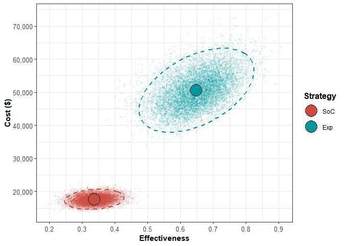<!-- -->

```r
ggsave(paste("CE_Scatter_Plot_", country_name[1], ".png", sep = ""), width = 8, height = 4, dpi=300)
while (!is.null(dev.list()))  dev.off()

#png(paste("CE_Scatter_Plot_", country_name[1], ".png", sep = ""))
#dev.off()

#plot(l_PA, xlim = c(9.5, 22.5))
# In the DARTH package R code they use the additional bits above, I can see how they look in my own model, and if I'd like to use them.
```


```r
#09.4.2 Cost-effectiveness acceptability curves (CEACs) and frontier (CEAF)

# Cost-effectiveness acceptability curve (CEAC):

# We first generate a vector of willingness to pay values (thresholds) to define for which values the CEAC is made:
v_wtp <- seq(0, 500000, by = 10000)
# This basically gives you a sequence of willingness to pay thresholds from 0 all the way up to 500,000 euro, increasing by 10,000 euro each time, so start with 0 euro, go to 10,000 euro, go to 20,000 euro, and so on until you hit 500,000. You can chose any max value you like and any increment value you like, for example, in the DARTH material they use the following: v_wtp <- seq(0, 45000, by = 1000)
CEAC_obj <- ceac(wtp = v_wtp, psa = l_PA)


# The below provides details on the regions of highest probability of cost-effectiveness for each strategy
summary(CEAC_obj)
```

```
##   range_min range_max cost_eff_strat
## 1         0    110000            SoC
## 2    110000    500000            Exp
```

```r
# CEAC and cost-effectiveness acceptability frontier (CEAF) plot
plot(CEAC_obj)
```

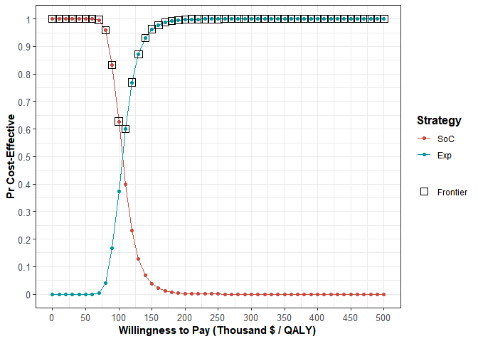<!-- -->

```r
ggsave(paste("CEAC_", country_name[1], ".png", sep = ""), width = 8, height = 4, dpi=300)
while (!is.null(dev.list()))  dev.off()
#png(paste("CEAC_", country_name[1], ".png", sep = ""))
#dev.off()
```


```r
#09.4.3 Plot cost-effectiveness frontier
# plot(df_cea_PA)
# I don't use this plot in my paper anymore
```


```r
#09.4.4 Expected Loss Curves (ELCs)
#The expected loss is the the quantification of the foregone benefits when choosing a suboptimal strategy given current evidence.
elc_obj <- calc_exp_loss(wtp = v_wtp, psa = l_PA)
elc_obj
```

```
##        WTP Strategy Expected_Loss On_Frontier
## 1        0      SoC     0.000e+00        TRUE
## 2        0      Exp     3.298e+04       FALSE
## 3    10000      SoC     0.000e+00        TRUE
## 4    10000      Exp     2.986e+04       FALSE
## 5    20000      SoC     0.000e+00        TRUE
## 6    20000      Exp     2.674e+04       FALSE
## 7    30000      SoC     0.000e+00        TRUE
## 8    30000      Exp     2.361e+04       FALSE
## 9    40000      SoC     0.000e+00        TRUE
## 10   40000      Exp     2.049e+04       FALSE
## 11   50000      SoC     0.000e+00        TRUE
## 12   50000      Exp     1.737e+04       FALSE
## 13   60000      SoC     0.000e+00        TRUE
## 14   60000      Exp     1.425e+04       FALSE
## 15   70000      SoC     4.611e+00        TRUE
## 16   70000      Exp     1.114e+04       FALSE
## 17   80000      SoC     7.174e+01        TRUE
## 18   80000      Exp     8.081e+03       FALSE
## 19   90000      SoC     4.262e+02        TRUE
## 20   90000      Exp     5.315e+03       FALSE
## 21  100000      SoC     1.378e+03        TRUE
## 22  100000      Exp     3.145e+03       FALSE
## 23  110000      SoC     3.064e+03       FALSE
## 24  110000      Exp     1.710e+03        TRUE
## 25  120000      SoC     5.360e+03       FALSE
## 26  120000      Exp     8.856e+02        TRUE
## 27  130000      SoC     8.050e+03       FALSE
## 28  130000      Exp     4.550e+02        TRUE
## 29  140000      SoC     1.095e+04       FALSE
## 30  140000      Exp     2.345e+02        TRUE
## 31  150000      SoC     1.396e+04       FALSE
## 32  150000      Exp     1.264e+02        TRUE
## 33  160000      SoC     1.703e+04       FALSE
## 34  160000      Exp     6.978e+01        TRUE
## 35  170000      SoC     2.012e+04       FALSE
## 36  170000      Exp     3.839e+01        TRUE
## 37  180000      SoC     2.322e+04       FALSE
## 38  180000      Exp     2.133e+01        TRUE
## 39  190000      SoC     2.633e+04       FALSE
## 40  190000      Exp     1.179e+01        TRUE
## 41  200000      SoC     2.945e+04       FALSE
## 42  200000      Exp     6.216e+00        TRUE
## 43  210000      SoC     3.257e+04       FALSE
## 44  210000      Exp     3.589e+00        TRUE
## 45  220000      SoC     3.569e+04       FALSE
## 46  220000      Exp     2.008e+00        TRUE
## 47  230000      SoC     3.881e+04       FALSE
## 48  230000      Exp     1.243e+00        TRUE
## 49  240000      SoC     4.193e+04       FALSE
## 50  240000      Exp     7.661e-01        TRUE
## 51  250000      SoC     4.505e+04       FALSE
## 52  250000      Exp     3.957e-01        TRUE
## 53  260000      SoC     4.817e+04       FALSE
## 54  260000      Exp     1.165e-01        TRUE
## 55  270000      SoC     5.129e+04       FALSE
## 56  270000      Exp     1.012e-02        TRUE
## 57  280000      SoC     5.441e+04       FALSE
## 58  280000      Exp     0.000e+00        TRUE
## 59  290000      SoC     5.753e+04       FALSE
## 60  290000      Exp     0.000e+00        TRUE
## 61  300000      SoC     6.065e+04       FALSE
## 62  300000      Exp     0.000e+00        TRUE
## 63  310000      SoC     6.377e+04       FALSE
## 64  310000      Exp     0.000e+00        TRUE
## 65  320000      SoC     6.689e+04       FALSE
## 66  320000      Exp     0.000e+00        TRUE
## 67  330000      SoC     7.002e+04       FALSE
## 68  330000      Exp     0.000e+00        TRUE
## 69  340000      SoC     7.314e+04       FALSE
## 70  340000      Exp     0.000e+00        TRUE
## 71  350000      SoC     7.626e+04       FALSE
## 72  350000      Exp     0.000e+00        TRUE
## 73  360000      SoC     7.938e+04       FALSE
## 74  360000      Exp     0.000e+00        TRUE
## 75  370000      SoC     8.250e+04       FALSE
## 76  370000      Exp     0.000e+00        TRUE
## 77  380000      SoC     8.562e+04       FALSE
## 78  380000      Exp     0.000e+00        TRUE
## 79  390000      SoC     8.874e+04       FALSE
## 80  390000      Exp     0.000e+00        TRUE
## 81  400000      SoC     9.186e+04       FALSE
## 82  400000      Exp     0.000e+00        TRUE
## 83  410000      SoC     9.498e+04       FALSE
## 84  410000      Exp     0.000e+00        TRUE
## 85  420000      SoC     9.810e+04       FALSE
## 86  420000      Exp     0.000e+00        TRUE
## 87  430000      SoC     1.012e+05       FALSE
## 88  430000      Exp     0.000e+00        TRUE
## 89  440000      SoC     1.043e+05       FALSE
## 90  440000      Exp     0.000e+00        TRUE
## 91  450000      SoC     1.075e+05       FALSE
## 92  450000      Exp     0.000e+00        TRUE
## 93  460000      SoC     1.106e+05       FALSE
## 94  460000      Exp     0.000e+00        TRUE
## 95  470000      SoC     1.137e+05       FALSE
## 96  470000      Exp     0.000e+00        TRUE
## 97  480000      SoC     1.168e+05       FALSE
## 98  480000      Exp     0.000e+00        TRUE
## 99  490000      SoC     1.200e+05       FALSE
## 100 490000      Exp     0.000e+00        TRUE
## 101 500000      SoC     1.231e+05       FALSE
## 102 500000      Exp     0.000e+00        TRUE
```

```r
# ELC plot
#plot(elc_obj, log_y = FALSE)
# I don't use this plot anymore
```


```r
#09.4.4 Expected value of perfect information (EVPI)
# Expected value of perfect information (EVPI)

#A value-of-information analysis estimates the expected value of perfect information (EVPI), that is,

#Value of information is discussed in the York course and below:

#C:\Users\Jonathan\OneDrive - Royal College of Surgeons in Ireland\COLOSSUS\Training Resources\CDC_Exclusive_Decision Modeling for Public Health_DARTH

#https://cran.r-project.org/web/packages/dampack/vignettes/voi.html

#There's also a paper on this here: C:\Users\Jonathan\OneDrive - Royal College of Surgeons in Ireland\COLOSSUS\Training Resources\Decision Modelling - Advanced Course\A2_Making Models Probabilistic\A2.1.2 Distributions for parameters\Betadist utility\EVSI.doc

EVPI_obj <- calc_evpi(wtp = v_wtp, psa = l_PA)
# EVPI plot
#plot(EVPI_obj, effect_units = "QALY")
# I don't plot this anymore.
```


```r
# For building the Table in the paper, and for referring to parameter values in the paper, I save the parameters I created in an RDA file named after the country I am studying:

#save to rda file
#save(c_PFS_Folfox, c_PFS_Bevacizumab, c_OS_Folfiri, administration_cost, c_AE1, c_AE2, c_AE3, Minimum_c_PFS_Folfox, Maximum_c_PFS_Folfox, Minimum_c_OS_Folfiri, Maximum_c_OS_Folfiri, Minimum_c_PFS_Bevacizumab, Maximum_c_PFS_Bevacizumab, Minimum_administration_cost, Maximum_administration_cost, Minimum_c_AE1, Maximum_c_AE1, Minimum_c_AE2, Maximum_c_AE2, Minimum_c_AE3, Maximum_c_AE3, n_wtp, Incremental_Cost, Incremental_Effect, ICER, tc_d_Exp, tc_d_SoC, country_name, file=paste("my_data_", country_name[1], ".rda", sep = ""))

# This creates an RDA file with all the parameters I created in this file in it.

# Next, in my Markdown file that calls this file, I will read in these parameters and name each of them after the country I am studying, to give me country specific values in my analysis.
```

## 08.3.3 Table Describing Parameters

To build a Table describing parameters, you click on the Table button at the top, and design it in there.
Then to include the parameter values automatically as they are updated you fill in the parameter name you want, highlight it in the cell and click \</\> from above to put it in a code block.
You do the same for gamma, etc., put this in code blocks also.
<https://rpruim.github.io/s341/S19/from-class/MathinRmd.html#:~:text=Math%20inside%20RMarkdown,10n%3D1n2.>

Per: [Putting the value of a variable into a table in R Markdown, rather than it's name - Stack Overflow](https://stackoverflow.com/questions/72902548/putting-the-value-of-a-variable-into-a-table-in-r-markdown-rather-than-its-nam)

Line 320 of this: <https://github.com/DARTH-git/cohort-modeling-tutorial-intro/blob/main/manuscript/cSTM_Tutorial_Intro.Rmd> is informative when viewing the final document on page 7 here: <https://arxiv.org/pdf/2001.07824.pdf>

Some helpful tips on using math notation in R Markdown.

<https://rpruim.github.io/s341/S19/from-class/MathinRmd.html>

This paper says in technical terms which distributions fit and why:

Model Parameter Estimation and Uncertainty Analysis: A Report of the ISPOR-SMDM Modeling Good Research Practices Task Force Working Group--6 <file:///C:/Users/Jonathan/OneDrive%20-%20Royal%20College%20of%20Surgeons%20in%20Ireland/COLOSSUS/Briggs%20et%20al%202012%20model%20parameter%20estimation%20and%20uncertainty.pdf>

| Parameter                                            | Base Case Value       | Minimum Value                 | Maximum Value                 | Source        | Distribution                                                                        |
|------------|------------|------------|------------|------------|------------|
| **Cost (Per Cycle)**                                 |                       |                               |                               |               |                                                                                     |
| FOLFOX                                               | `c_PFS_Folfox`        | `Minimum_c_PFS_Folfox`        | `Maximum_c_PFS_Folfox`        |               | GAMMA(`a.cIntervention_c_PFS_Folfox`, `b.cIntervention_c_PFS_Folfox`)               |
| FOLFIRI                                              | `c_OS_Folfiri`        | `Minimum_c_OS_Folfiri`        | `Maximum_c_OS_Folfiri`        |               | GAMMA(`a.cIntervention_c_OS_Folfiri`, `b.cIntervention_c_OS_Folfiri`)               |
| Bevacizumab                                          | `c_PFS_Bevacizumab`   | `Minimum_c_PFS_Bevacizumab`   | `Maximum_c_PFS_Bevacizumab`   |               | GAMMA( `a.cIntervention_c_PFS_Bevacizumab`, `b.cIntervention_c_PFS_Bevacizumab` )   |
| Administration Cost                                  | `administration_cost` | `Minimum_administration_cost` | `Maximum_administration_cost` |               | GAMMA(`a.cIntervention_administration_cost`, `b.cIntervention_administration_cost`) |
| **Adverse Event Cost**                               |                       |                               |                               |               |                                                                                     |
| Leukopenia                                           | `c_AE1`               | `Minimum_c_AE1`               | `Maximum_c_AE1`               |               | `GAMMA(a.cIntervention_c_AE1, b.cIntervention_c_AE1)`                               |
| Diarrhea                                             | `c_AE2`               | `Minimum_c_AE2`               | `Maximum_c_AE2`               |               | `GAMMA(a.cIntervention_c_AE2, b.cIntervention_c_AE2)`                               |
| Vomiting                                             | `c_AE3`               | `Minimum_c_AE3`               | `Maximum_c_AE3`               |               | `GAMMA(a.cIntervention_c_AE3, b.cIntervention_c_AE3)`                               |
|                                                      |                       |                               |                               |               |                                                                                     |
| **Adverse Event Incidence - With Bevacizumab**       |                       |                               |                               |               |                                                                                     |
| Leukopenia                                           | `p_FA1_Exp`           | `Minimum_p_FA1_EXPR`          | `Maximum_p_FA1_EXPR`          |               | BETA(`alpha_p_FA1_EXPR`, `beta_p_FA1_EXPR`)                                         |
| Diarrhea                                             | `p_FA2_Exp`           | `Minimum_p_FA2_EXPR`          | `Maximum_p_FA2_EXPR`          |               | BETA(`alpha_p_FA2_EXPR`, `beta_p_FA2_EXPR`)                                         |
| Vomiting                                             | `p_FA3_Exp`           | `Minimum_p_FA3_EXPR`          | `Maximum_p_FA3_EXPR`          |               | BETA(`alpha_p_FA3_EXPR`, `beta_p_FA3_EXPR`)                                         |
| **Adverse Event Incidence - Without Bevacizumab**    |                       |                               |                               |               |                                                                                     |
| Leukopenia                                           | `p_FA1_STD`           | `Minimum_p_FA1_STD`           | `Maximum_p_FA1_STD`           |               | BETA(`alpha_p_FA1_STD` , `beta_p_FA1_STD`)                                          |
| Diarrhea                                             | `p_FA2_STD`           | `Minimum_p_FA2_STD`           | `Maximum_p_FA2_STD`           |               | BETA(`alpha_p_FA2_STD` , `beta_p_FA2_STD`)                                          |
| Vomiting                                             | `p_FA3_STD`           | `Minimum_p_FA3_STD`           | `Maximum_p_FA3_STD`           |               | BETA(`alpha_p_FA3_STD` , `beta_p_FA3_STD`)                                          |
| **Utility (Per Cycle)**                              |                       |                               |                               |               |                                                                                     |
| Progression Free Survival                            | `u_F`                 | `Minimum_u_F`                 | `Maximum_u_F`                 |               | BETA(`u_F_alpha`, `u_F_beta`)                                                       |
| Overall Survival                                     | `u_P`                 | `Minimum_u_P`                 | `Maximum_u_P`                 |               | BETA(`u_P_alpha` , `u_P_beta`)                                                      |
| **Adverse Event Disutility**                         |                       |                               |                               |               |                                                                                     |
| Leukopenia                                           | `AE1_DisUtil`         | `Minimum_AE1_DisUtil`         | `Maximum_AE1_DisUtil`         | BRTYA         | `alpha_u_AE1, beta_u_AE1`                                                           |
| Diarrhea                                             | `AE2_DisUtil`         | `Minimum_AE2_DisUtil`         | `Maximum_AE2_DisUtil`         | BETA          | `alpha_u_AE2, beta_u_AE2`                                                           |
| Vomiting                                             | `AE3_DisUtil`         | `Minimum_AE3_DisUtil`         | `Maximum_AE3_DisUtil`         | BETA          | `alpha_u_AE3, beta_u_AE3`                                                           |
| **Hazard Ratios**                                    |                       |                               |                               |               |                                                                                     |
| PFS to OS under the Experimental Strategy            | `HR_FP_Exp`           | `Minimum_HR_FP_Exp`           | `Maximum_HR_FP_Exp`           | [@smeets2018] | rlnorm()                                                                            |
| OS to PFS under the Experimental Strategy            | `HR_PD_Exp`           | `Minimum_HR_PD_Exp`           | `Maximum_HR_PD_Exp`           | [@smeets2018] | rlnorm()                                                                            |
| **Probability of Dying under Second-Line Treatment** | `P_OSD_SoC`           | `Minimum_P_OSD_SoC`           | `Maximum_P_OSD_SoC`           |               | BETA(`P_OSD_SoC_alpha`, `P_OSD_SoC_beta`)                                           |
| **Discount Rate**                                    |                       |                               |                               |               |                                                                                     |
| Costs                                                | `d_c`                 | 0                             | 0.08                          |               |                                                                                     |
| Outcomes                                             | `d_e`                 | 0                             | 0.08                          |               |                                                                                     |

: Table X Model Parameters Values: Baseline, Ranges and Distributions for Sensitivity Analysis

## 
